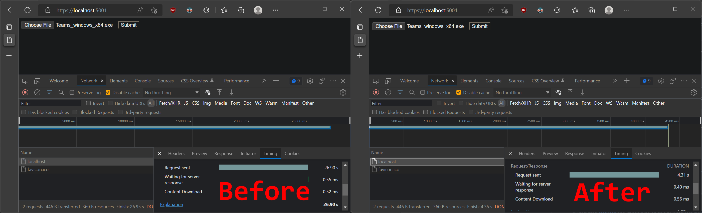
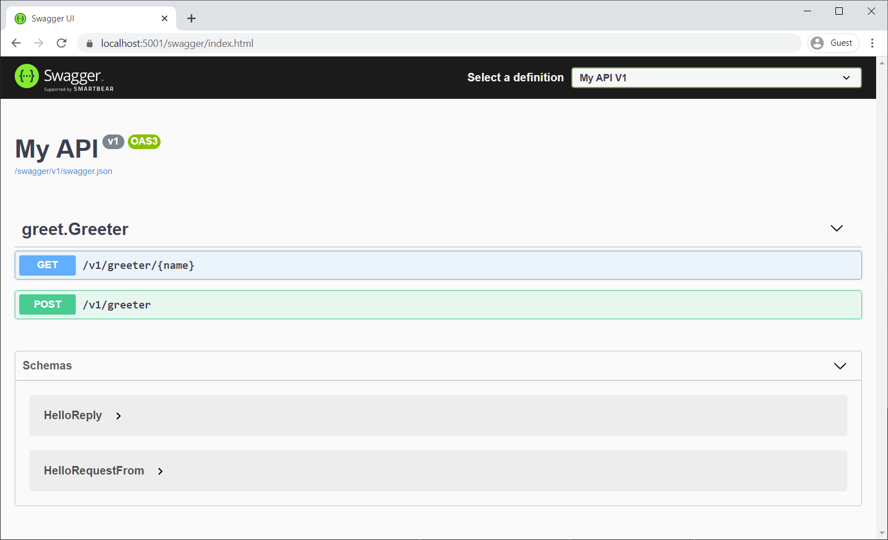

[.NET 7 Release Candidate 1 (RC1) is now available](https://devblogs.microsoft.com/dotnet/announcing-dotnet-7-rc-1) and includes many great new improvements to ASP.NET Core.

Here's a summary of what's new in this preview release:

- Dynamic authentication requests in Blazor WebAssembly
- Handle location changing events
- Blazor WebAssembly debugging improvements
- .NET WebAssembly build tools for .NET 6 projects
- .NET JavaScript interop on WebAssembly
- Kestrel full certificate chain improvements
- Faster HTTP/2 uploads
- HTTP/3 improvements
- Experimental Kestrel support for WebTransport over HTTP/3
- Experimental OpenAPI support for gRPC JSON transcoding
- Rate limiting middleware improvements
- macOS dev-certs improvements

For more details on the ASP.NET Core work planned for .NET 7 see the full [ASP.NET Core roadmap for .NET 7](https://aka.ms/aspnet/roadmap) on GitHub.

## Get started

To get started with ASP.NET Core in .NET 7 Release Candidate 1, [install the .NET 7 SDK](https://dotnet.microsoft.com/download/dotnet/7.0).

If you're on Windows using Visual Studio, we recommend installing the latest [Visual Studio 2022 preview](https://visualstudio.com/preview). If you're on macOS, we recommend installing the latest [Visual Studio 2022 for Mac preview](https://visualstudio.microsoft.com/vs/mac/preview/).

To install the latest .NET WebAssembly build tools, run the following command from an elevated command prompt:

```console
dotnet workload install wasm-tools
```

## Upgrade an existing project

To upgrade an existing ASP.NET Core app from .NET 7 Preview 7 to .NET 7 RC1:

- Update all Microsoft.AspNetCore.\* package references to `7.0.0-rc.1.*`.
- Update all Microsoft.Extensions.\* package references to `7.0.0-rc.1.*`.

See also the full list of [breaking changes](https://docs.microsoft.com/dotnet/core/compatibility/7.0#aspnet-core) in ASP.NET Core for .NET 7.

## Dynamic authentication requests in Blazor WebAssembly

Blazor provides out-of-the-box support for authentication using OpenID Connect and a variety of identity providers including Azure Active Directory (Azure AD) and Azure AD B2C. In .NET 7, Blazor now supports creating dynamic authentication requests at runtime with custom parameters to handle more advanced authentication scenarios in Blazor WebAssembly apps. To specify additional parameters, use the new `InteractiveRequestOptions` type and `NavigateToLogin` helper methods on `NavigationManager`.

For example, you can specify a login hint to the identity provider for who to authenticate like this:

```csharp
InteractiveRequestOptions requestOptions = new()
{
    Interaction = InteractionType.SignIn,
    ReturnUrl = NavigationManager.Uri,
};
requestOptions.TryAddAdditionalParameter("login_hint", "user@example.com");
NavigationManager.NavigateToLogin("authentication/login", requestOptions);
```

Similarly, you can specify the OpenID Connect `prompt` parameter, like when you want to force an interactive login:

```csharp
InteractiveRequestOptions requestOptions = new()
{
    Interaction = InteractionType.SignIn,
    ReturnUrl = NavigationManager.Uri,
};
requestOptions.TryAddAdditionalParameter("prompt", "login");
NavigationManager.NavigateToLogin("authentication/login", requestOptions);
```

You can specify these options when using `IAccessTokenProvider` directly to request tokens:

```csharp
var accessTokenResult = await AccessTokenProvider.RequestAccessToken(
    new AccessTokenRequestOptions
    {
        Scopes = new[] { "SecondAPI" }
    });

if (!accessTokenResult.TryGetToken(out var token))
{
    accessTokenResult.InteractiveOptions.AddAdditionalParameter("login_hint", "user@example.com");
    NavigationManager.NavigateToLogin(accessTokenResult.InteractiveRequestUrl, accessTokenResult.InteractionOptions);
}
```

You can also specify authentication request options when a token cannot be acquired by the `AuthorizationMessageHandler` without user interaction:

```csharp
try
{
    await httpclient.Get("/orders");

}
catch (AccessTokenNotAvailableException ex)
{
    ex.Redirect(requestOptions =>
    {
        requestOptions.AddAdditionalParameter("login_hint", "user@example.com");
    });
}
```

Any additional parameters specified for the authentication request will be passed through to the underlying authentication library, which then handles them.

> Note: Specifying additional parameters for *msal.js* is not yet fully implemented, but is expected to be completed soon for an upcoming release.

## Handle location changing events

Blazor in .NET 7 now has support for handling location changing events. This allows you to warn users about unsaved work or to perform related actions when the user performs a page navigation.

To handle location changing events, register a handler with the `NavigationManager` service using the `RegisterLocationChangingHandler` method. Your handler can then perform async work on a navigation or choose to cancel the navigation by calling `PreventNavigation` on the `LocationChangingContext`. `RegisterLocationChangingHandler` returns an `IDisposable` instance that when disposed removes the corresponding location changing handler.

For example, the following handler prevents navigation to the counter page:

```csharp
var registration = NavigationManager.RegisterLocationChangingHandler(async context =>
{
    if (context.TargetLocation.EndsWith("counter"))
    {
        context.PreventNavigation();
    }
});
```

Note that your handler will only be called for internal navigations within the app. External navigations can only be handled synchronously using the `beforeunload` event in JavaScript.

The new `NavigationLock` component makes common scenarios for handling location changing events easier. `NavigationLock` exposes an `OnBeforeInternalNavigation` callback that you can use to intercept and handle internal location changing events. If you want users to confirm external navigations too, you can use the `ConfirmExternalNavigations` property, which will hook the `beforeunload` event for you and trigger the browser specific prompt.

```razor
<EditForm EditContext="editContext" OnValidSubmit="Submit">
    ...
</EditForm>
<NavigationLock OnBeforeInternalNavigation="ConfirmNavigation" ConfirmExternalNavigation />

@code {
    private readonly EditContext editContext;

    ...

    // Called only for internal navigations
    // External navigations will trigger a browser specific prompt
    async Task ConfirmNavigation(LocationChangingContext context)
    {
        if (editContext.IsModified())
        {
            var isConfirmed = await JS.InvokeAsync<bool>("window.confirm", "Are you sure you want to leave this page?");

            if (!isConfirmed)
            {
                context.PreventNavigation();
            }
        }
    }
}
```

## Blazor WebAssembly debugging improvements

Blazor WebAssembly debugging in .NET 7 now has the following improvements:

- Support for the Just My Code setting to show or hide type members not from user code
- Support for inspecting multidimensional arrays
- Call Stack now shows the correct name for async methods
- Improved expression evaluation
- Correct handling of `new` keyword on derived members
- Support for debugger related attributes in `System.Diagnostics`

## .NET WebAssembly build tools for .NET 6 projects

You can now use the .NET WebAssembly build tools with a .NET 6 project when working with the .NET 7 SDK. The new `wasm-tools-net6` workload includes the .NET WebAssembly build tools for .NET 6 projects so that they can be used with the .NET 7 SDK. To install the new `wasm-tools-net6` workload run the following command from an elevated command prompt:

```console
dotnet workload install wasm-tools-net6
```

The existing `wasm-tools` workload installs the .NET WebAssembly build tools for .NET 7 projects. However, the .NET 7 version of the .NET WebAssembly build tools are incompatible with existing projects built with .NET 6. Projects using the .NET WebAssembly build tools that need to support both .NET 6 and .NET 7 will need to use multi-targeting.

## .NET JavaScript interop on WebAssembly

.NET 7 introduces a new low-level mechanism for using .NET in JavaScript-based apps. With this new JavaScript interop capability, you can invoke .NET code from JavaScript using the .NET WebAssembly runtime as well call into JavaScript functionality from .NET without any dependency on the Blazor UI component model.

The easiest way to see the new JavaScript interop functionality in action is using the new experimental templates in the `wasm-experimental` workload:

```console
dotnet workload install wasm-experimental
```

This workload contains two project templates: WebAssembly Browser App, and WebAssembly Console App.
These templates are experimental, which means the developer workflow for them hasn't been fully sorted out yet (for example, these templates don't run yet in Visual Studio). But the .NET and JavaScript APIs used in these templates are supported in .NET 7 and provide a foundation for using .NET on WebAssembly from JavaScript.

You can create a WebAssembly Browser App by running the following command:

```console
dotnet new wasmbrowser
```

This template creates a simple web app that demonstrates using .NET and JavaScript together in a browser. The WebAssembly Console App is similar, but runs as a Node.js console app instead of a browser-based web app.

The JavaScript module in *main.js* in the created project demonstrates how to run .NET code from JavaScript. The relevant APIs are imported from *dotnet.js*. These APIs enable you to setup named modules that can be imported into your C# code, as well as call into methods exposed by your .NET code including `Program.Main`:

```js
import { dotnet } from './dotnet.js'

const is_browser = typeof window != "undefined";
if (!is_browser) throw new Error(`Expected to be running in a browser`);

// Setup the .NET WebAssembly runtime
const { setModuleImports, getAssemblyExports, getConfig, runMainAndExit } = await dotnet
    .withDiagnosticTracing(false)
    .withApplicationArgumentsFromQuery()
    .create();

// Set module imports that can be called from .NET
setModuleImports("main.js", {
    window: {
        location: {
            href: () => globalThis.window.location.href
        }
    }
});

const config = getConfig();
const exports = await getAssemblyExports(config.mainAssemblyName);
const text = exports.MyClass.Greeting(); // Call into .NET from JavaScript
console.log(text);

document.getElementById("out").innerHTML = `${text}`;
await runMainAndExit(config.mainAssemblyName, ["dotnet", "is", "great!"]); // Run Program.Main
```

To import a JavaScript function so it can be called from C#, use the new `JSImportAttribute` on a matching method signature:

```csharp
[JSImport("window.location.href", "main.js")]
internal static partial string GetHRef();
```

The first parameter to the `JSImportAttribute` is the name of the JavaScript function to import and the second parameter is the name of the module, both of which were setup by the `setModuleImports` call in *main.js*.

In the imported method signature you can use .NET types for parameters and return values, which will be marshaled for you. Use the `JSMarshalAsAttribute<T>` to control how the imported method parameters are marshaled. For example, you might choose to marshal a `long` as `JSType.Number` or `JSType.BitInt`. You can pass `Action`/`Func` callbacks as parameters, which will be marshaled as callable JavaScript functions. You can pass both JavaScript and managed object references and they will be marshaled as proxy objects, keeping the object alive across the boundary until the proxy is garbage collected. You can also import and export asynchronous methods with `Task` result, which will be marshaled as JavaScript promises. Most of the marshaled types work in both directions, as parameters and as return values, on both imported and exported methods.

To export a .NET method so it can be called from JavaScript, use the `JSExportAttribute`:

```csharp
[JSExport]
internal static string Greeting()
{
    var text = $"Hello, World! Greetings from {GetHRef()}";
    Console.WriteLine(text);
    return text;
}
```

Blazor provides its own JavaScript interop mechanism based on the `IJSRuntime` interface, which is uniformly support across all Blazor hosting models. This common asynchronous abstraction enables library authors to build JavaScript interop libraries that can be shared across the Blazor ecosystem and is still the recommend way to do JavaScript interop in Blazor. However, in Blazor WebAssembly apps you also had the option to make synchronous JavaScript interop calls using the `IJSInProcessRuntime` or even unmarshalled calls using the `IJSUnmarshalledRuntime`. `IJSUnmarshalledRuntime` was tricky to use and only partially supported. In .NET 7 `IJSUnmarshalledRuntime` is now obsolete and should be replaced with the `[JSImport]`/`[JSExport]` mechanism. Blazor doesn't directly expose the `dotnet` runtime instance it uses from JavaScript, but it can still be accessed by calling `getDotnetRuntime(0)`. You can also import JavaScript modules from your C# code by calling `JSHost.ImportAsync` which makes module's exports visible to `[JSImport]`.

## Kestrel full certificate chain improvements

`HttpsConnectionAdapterOptions` has a new `ServerCertificateChain` property of type `X509Certificate2Collection`, which makes it easier to validate certificate chains by allowing a full chain including intermediate certificates to be specified. See [dotnet/aspnetcore#21513](https://github.com/dotnet/aspnetcore/issues/21513) for more details.


## Faster HTTP/2 uploads

We've increased Kestrel's default HTTP/2 upload connection window size from 128 KB to 1 MB which dramatically improves HTTP/2 upload speeds over high-latency connections using Kestrel's default configuration.

We tested the impact of increasing this limit by uploading a 108 MB file upload using a single stream on localhost after introducing only 10 ms of artificial latency and saw about a 6x improvement in upload speed.

The screenshot below compares the time taken for a 108 MB upload in Edge's dev tools network tab:



 * Before: 26.9 seconds
 * After: 4.3 seconds

## HTTP/3 improvements

.NET 7 RC1 continues to improve Kestrel's support for HTTP/3. The two main areas of improvement are feature parity with HTTP/1.1 and HTTP/2 and performance.

The biggest feature in this release is complete support for [`ListenOptions.UseHttps`](https://docs.microsoft.com/dotnet/api/microsoft.aspnetcore.hosting.listenoptionshttpsextensions.usehttps) with HTTP/3. Kestrel offers advanced options for configuring connection certificates, such as hooking into [Server Name Indication (SNI)](https://wikipedia.org/wiki/Server_Name_Indication).

The following example shows how to use an SNI callback to resolve TLS options:

```csharp
var builder = WebApplication.CreateBuilder(args);
builder.WebHost.ConfigureKestrel(options =>
{
    options.ListenAnyIP(8080, listenOptions =>
    {
        listenOptions.Protocols = HttpProtocols.Http1AndHttp2AndHttp3;
        listenOptions.UseHttps(new TlsHandshakeCallbackOptions
        {
            OnConnection = context =>
            {
                var options = new SslServerAuthenticationOptions
                {
                    ServerCertificate = ResolveCertForHost(context.ClientHelloInfo.ServerName)
                };
                return new ValueTask<SslServerAuthenticationOptions>(options);
            },
        });
    });
});
```

We've also done a lot of work to reduce HTTP/3 allocations in .NET 7 RC1. You can see some of those improvements here:

- [HTTP/3: Avoid per-request cancellation token allocations](https://github.com/dotnet/aspnetcore/pull/42685)
- [HTTP/3: Avoid ConnectionAbortedException allocations](https://github.com/dotnet/aspnetcore/pull/42708)
- [HTTP/3: ValueTask pooling](https://github.com/dotnet/aspnetcore/pull/42760)

## Experimental Kestrel support for WebTransport over HTTP/3

We're excited to announce built-in experimental support for WebTransport over HTTP/3 in Kestrel. This feature was written by our excellent intern Daniel! WebTransport is a new [draft specification](https://ietf-wg-webtrans.github.io/draft-ietf-webtrans-http3/draft-ietf-webtrans-http3.html#name-establishing-a-transport-ca) for a transport protocol similar to WebSockets that allows the usage of multiple streams per connection. This can be useful for splitting communication channels and thus avoiding head-of-line blocking. For example, consider an online web-based game where the game state is transmitted on one bidirectional stream, the players' voices for the game's voice chat feature on another bidirectional stream, and the player's controls are transmitted on a unidirectional stream. With WebSockets, this would all need to be put on separate connections or squashed into a single stream. With WebTransport, you can keep all the traffic on one connection but separate them into their own streams and, if one stream were to block, the others would continue uninterrupted.

Additional details will be available in a separate blog post.

## Experimental OpenAPI support for gRPC JSON transcoding

[gRPC JSON transcoding](https://devblogs.microsoft.com/dotnet/announcing-grpc-json-transcoding-for-dotnet/) is a new feature in .NET 7 for turning gRPC APIs into RESTful APIs.

.NET 7 RC1 adds *experimental* support for generating OpenAPI from gRPC transcoded RESTful APIs. OpenAPI with gRPC JSON transcoding is a highly requested feature, and we're pleased to offer a way to combine these great technologies. The NuGet package is experimental in .NET 7 to give us time to explore the best way to integrate these features.

To enable OpenAPI with gRPC JSON transcoding:

1. Add a package reference to [Microsoft.AspNetCore.Grpc.Swagger](https://www.nuget.org/packages/Microsoft.AspNetCore.Grpc.Swagger). The version must be 0.3.0-xxx or greater.
2. Configure Swashbuckle in startup. The `AddGrpcSwagger` method configures Swashbuckle to include gRPC endpoints.

```csharp
var builder = WebApplication.CreateBuilder(args);
builder.Services.AddGrpc().AddJsonTranscoding();
builder.Services.AddGrpcSwagger();
builder.Services.AddSwaggerGen(c =>
{
    c.SwaggerDoc("v1",
        new OpenApiInfo { Title = "gRPC transcoding", Version = "v1" });
});

var app = builder.Build();
app.UseSwagger();
app.UseSwaggerUI(c =>
{
    c.SwaggerEndpoint("/swagger/v1/swagger.json", "My API V1");
});
app.MapGrpcService<GreeterService>();

app.Run();
```

To confirm that Swashbuckle is generating Swagger for the RESTful gRPC services, start the app and navigate to the Swagger UI page:



## Rate limiting middleware improvements

We've added many features to the rate limiting middleware in .NET 7 RC1 that should make it both more functional, and easier to use.

We've added attributes which can be used to enable or disable rate limiting on a given endpoint. For example, here's how you could apply a policy named `MyControllerPolicy` to a controller:

```csharp
public class MyController : Controller
{
    [EnableRateLimitingAttribute("MyControllerPolicy")]
    public IActionResult Index()
    {
        return View();
    }
}
```

You can also disable rate limiting entirely on a given endpoint or group of endpoints. Let's say you had enabled rate limiting on a group of endpoints:

```csharp
app.MapGroup("/public/todos").RequireRateLimiting("MyGroupPolicy");
```

You could then disable rate limiting on a specific endpoint within that group as follows:

```csharp
app.MapGroup("/public/todos/donothing").DisableRateLimiting();
```

You can also now apply policies directly to endpoints. Unlike named policies, policies added in this way to not need to be configured on the `RateLimiterOptions`. Let's say you had defined a policy type:

```csharp
public class MyRateLimiterPolicy : IRateLimiterPolicy<string>
{
...
}
```

You could add an instance of it directly to an endpoint as follows:

```csharp
app.MapGet("/", () => "Hello World!").RequireRateLimiting(new MyRateLimiterPolicy());
```

Finally, we've updated the `RateLimiterOptions` convenience methods to take an `Action<Options>` rather than an `Options` instance and also added an `IServiceCollection` extension method for using rate limiting. So, to enable all of the preceding rate limiting policies in your app, you could do the following:

```csharp
builder.Services.AddRateLimiter(options =>
{
    options.AddTokenBucketLimiter("MyControllerPolicy", options =>
    {
        options.TokenLimit = 1;
        options.QueueProcessingOrder = QueueProcessingOrder.OldestFirst;
        options.QueueLimit = 1;
        options.ReplenishmentPeriod = TimeSpan.FromSeconds(10);
        options.TokensPerPeriod = 1;
    })
    .AddPolicy<string>("MyGroupPolicy", new MyRateLimiterPolicy());
});
```

This will apply a `TokenBucketLimiter` to your Controller, your custom `MyRateLimiterPolicy` to endpoints matching `/public/todos` (with the exception of `/public/todos/donothing`), and your custom `MyRateLimiterPolicy` to `/`.

## macOS dev-certs improvements

We've made some significant quality-of-life improvements to the experience of using HTTPS development certificates for macOS users in this release, greatly reducing the number of authentication prompts displayed when creating, trusting, reading, and deleting ASP.NET Core HTTPS development certificates. This had been a pain-point for ASP.NET Core developers on macOS when trying to use development certificates in their workflows.

With this release, the development certificates generated by the `dotnet dev-certs` tool on macOS have a narrower scope of trust, settings are now added in per-user trust settings instead of system-wide, and Kestrel will be able to bind to these new certificates without needing to access the system keychain. As part of this work, there were also some quality-of-life improvements made, such as reworking some user-facing messages for clarity and precision.

These changes combine to result in a much smoother experience and far fewer password prompts when using HTTPS during development on macOS.

## See the new Blazor updates in action!

For live demos of dynamic authentication requests in Blazor WebAssembly, Blazor WebAssembly debugging improvements, and .NET JavaScript interop on WebAssembly, see our recent [Blazor Community Standup](https://www.youtube.com/watch?v=-ZSscIhQaRk&list=PLdo4fOcmZ0oX-DBuRG4u58ZTAJgBAeQ-t&index=2):

<iframe style="aspect-ratio: 16/9;" src="https://www.youtube-nocookie.com/embed/-ZSscIhQaRk" width="100%" frameborder="0" allowfullscreen="allowfullscreen"></iframe>

## Give feedback

We hope you enjoy this preview release of ASP.NET Core in .NET 7. Let us know what you think about these new improvements by filing issues on [GitHub](https://github.com/dotnet/aspnetcore/issues/new).

Thanks for trying out ASP.NET Core!
