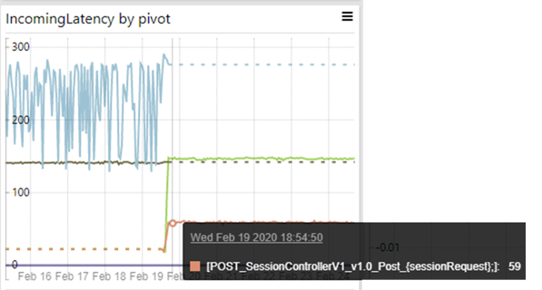
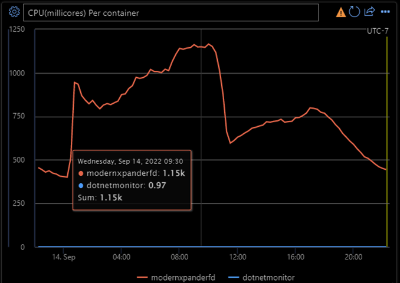
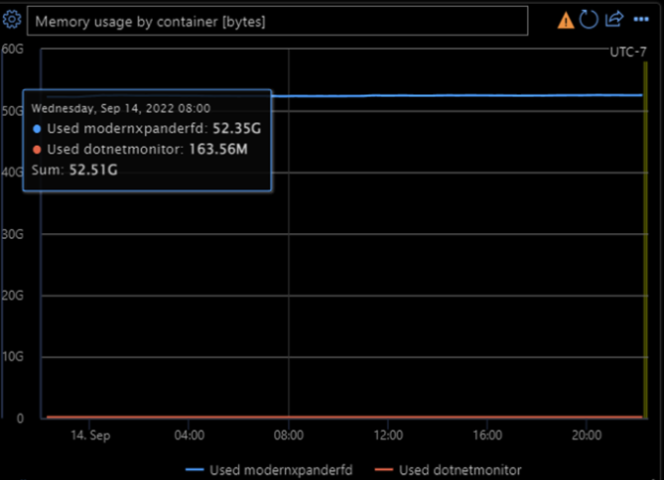

Microsoft Commerce is a diverse set of services (>700) which work to help transact Microsoft's revenue in various ways - whether via our large catalog of products and services, maintaining licensing information, calculating appropriate tax amounts for each locale in which we operate, or many more both in the Commercial and Consumer spaces. These services range from the small to the large but share many requirements around reliability, availability, scalability, compliance, and more, being involved in most transactions with Microsoft. To give a sense of overall scale, 2 of our largest services represent over 1.1M Requests per Second (RPS) and run on hundreds of thousands of cores.

In 2019, we embarked on a journey to take better advantage of Azure platforms, with many of our services moving from .NET Framework in the process – with a specific focus on moving to .NET / Linux.

While the learnings and insights come from all our migrated services over the past several years, we’ll focus some of our details on one service in particular - our Global Lookup Service (GLS) - who has had one of the furthest journeys. GLS provides partitioning as a service that maps a Microsoft user to the location of their data based on proximity. It is a critical infra service that powers consumer commerce scenarios such as Xbox and Microsoft store. GLS is a distributed high scale RESTful service that is deployed in 4 regions worldwide with over 100k requests per second globally. It was initially written in .NET Framework 4.6.2 and ran on Windows VMs, and as part of the Commerce migration to Azure the code base was upgraded to .NET Core 3.1, then 5, and currently running on .NET 6. It was also containerized to run on Azure Kubernetes Service (AKS) as a scalable compute platform.

## Migration Big Picture

As so many services were migrating, of all different shapes and sizes, we worked closely with platform teams across Azure to ensure we landed in the best platforms for each of our services. We quickly realized that our largest and most complex services fit best on containers and Kubernetes, but to take full advantage of Kubernetes and the open-source community this required a shift to Linux (and to .NET Core to enable this move). This means our migration included a lot more in these cases than just .NET:
- Windows to Linux
- .NET Framework to .NET Core (3.1, in some cases 5.0, and now 6.0)
- A platform shift to containers and Kubernetes (away from just VMs)
- A build and release system change to take advantage of the latest security and compliance improvements and support containerized applications.
- Many more as we took advantage of enhancements and improvements in our platforms and .NET as we migrated, and our partners did the same for dependencies.
While the benefits aren't all directly due to our .NET Core migration, they were enabled by the move, and we're thankful for all the help and support of the .NET team during our migration!

Often we are asked how long it took us to migrate - and the answer is complicated as it varied by service. Service size, complexity, and the number of other changes going on in parallel, all required additional work to coordinate, with early services taking much longer to migrate than later services as we got better at the migration process. Some teams migrated from .NET Framework to versions of .NET Core without taking advantage of new functionality like [spans](https://docs.microsoft.com/archive/msdn-magazine/2018/january/csharp-all-about-span-exploring-a-new-net-mainstay), while others spent additional time updating code to realize performance gains. Other changes teams made throughout this process (leaving the code better than when they started their migration) also impacted the amount of testing and validation required.

The moves from .NET Core 3.1 to 5.0 and then 5.0 to 6.0 were more straightforward, and several of our teams did direct migrations to take advantage of framework changes without much additional investment. Changing a few lines of code to make this move often took less than a day, followed by the services’ regular validation and service safe deployment rollout processes.

## Results

When we originally started measuring success, we looked primarily on the cost axis - where we saw a wide range of savings, with some services having cost savings of 80%+ and vCores reduction of 35%+! While these are certainly successful metrics, they wrap up a huge set of changes (everything listed above), and so we looked for examples that would help highlight the .NET portion of the migration.

One particularly significant example was a service which migrated to .NET Core 3.1 from .NET Framework while leaving as much else the same as possible (though this change did include dependency updates to .NET Core as well, and small improvements made while migrating their code). The chart below shows a ~78% improvement in service latency and significantly more stability after deploying it initially (running with the same load, environment, and hardware)!



Similar savings were also seen in GLS, which had 30% reduction on vCores and 20% improvement to latency compared with .NET Framework / Windows VMs.

### .NET 5 to 6 Migration Improvements

Moving past the initial .NET Framework to .NET Core version updates, we've found further migrations significantly easier (as mentioned above, sometimes just taking a few lines changed). In our GLS service, we’ve been seeing continuous improvements by updating .NET without having to pick up new features. In these updates improvements were primarily in .NET metrics other than service latency, as GLS was already operating at ~ 8ms response time at the 99th percentile after migrating to AKS / Linux).
Some specific improvements we saw below in this migration while maintaining our overall service quality metrics (again, the only change being .NET 5 -> 6):
- An improvement in thread management as the number of threads in thread pool dropped while we maintain the same RPS
  
  
- Improved connection management as the number of concurrent connections dropped
  
  
- A reduction in Runtime Exceptions. The reduction was not from GLS service code itself but in the .NET Runtime.
  
  

## Migration Learnings

Along the way we’ve learned a lot (both within our services and across the broader .NET ecosystem as we share these lessons). Given the length of our journey each stage has had some differences – as one example, our first services moved while many of their dependencies weren’t updated to be compatible yet, while our latest services haven’t had to worry much about dependencies – but as we’ve learned from the past, we hope we can help others here too.

### Dependencies

Early on most of the libraries and components our services took dependencies on weren’t migrated over, which required an extensive effort to map our dependencies, evaluate the migration path (replace with .NET functionality, replace with new dependency, work with the dependency to migrate, or write our own replacement), and execute on this plan.  Today this takes up only a small amount of time as many dependencies have migrated and are available, though we still take time up front to evaluate when dependencies might have better alternatives in .NET Core 3.1 and above.  Later versions of .NET also don’t require changes to dependencies to consume, significantly reducing the amount of time needed (as .NET Core 3.1 dependencies can be consumed from .NET 6 services).

There are several tools available to start you off ([for example built into Visual Studio](https://docs.microsoft.com/visualstudio/modeling/map-dependencies-across-your-solutions)), and the .NET release notes and migration guides are a great place to get started on exploring what’s new and available to take advantage of.

#### Evaluate .NET Platform Best Practices for Adoption

During our migration we picked up several .NET Platform improvements as best practices to replace custom solutions and avoid reinventing the wheel.  Two examples of this:
- Object Pooling
  
  GLS code heavily relies on object pooling to reuse objects and keep the memory size predictable. The old code in .NET framework implemented a custom solution by wrapping a ConcurrentStack<T> class which worked but required maintenance every time we upgraded the codebase. This was no longer needed when we migrated to .NET Core, which provides [ObjectPool<T>](https://learn.microsoft.com/dotnet/api/microsoft.extensions.objectpool.objectpool-1) class. Byte array was another type of object that was pooled a lot. We were able to simply the code by leveraging the [RecyclableMemoryStream](https://github.com/microsoft/Microsoft.IO.RecyclableMemoryStream) library with the IDisposable pattern. This class pools underlying buffers and incurs fewer GCs.
  
  At the end of the migration, we were able to remove hundreds of lines of custom code while maintaining our performance, freeing us from maintaining this custom implementation.
- APM to TAP
  
  The Asynchronous Programing Model (APM) was introduced in .NET 1.0 and implements asynchronous operations with IAsyncResult design pattern (where two methods named BeginOperationName and EndOperationName are pairing together). The entire GLS codebase was written in this paradigm which worked well with our HTTP.sys based pipeline but wasn’t a good fit for Kestrel, where Task-based Asynchronous Pattern is recommended (TAP). 
  
  Fortunately, APM code can interop with TAP code easily (documented in [Interop with Other Asynchronous Patterns and Types](https://docs.microsoft.com/dotnet/standard/asynchronous-programming-patterns/interop-with-other-asynchronous-patterns-and-types)), and the legacy begin/end methods worked perfectly with the new await/async code in ASP.NET Core without any performance bottleneck. More specifically, Begin/End methods can be chained with [TaskFactory.FromAsync](https://docs.microsoft.com/dotnet/api/system.threading.tasks.taskfactory.fromasync?view=net-6.0) overloaded methods and callback logic can be implemented in [Task.ContinueWith](https://docs.microsoft.com/dotnet/api/system.threading.tasks.task.continuewith?view=net-6.0) overloaded methods.

  ```csharp
  await await Task.Factory.FromAsync(this.AzureHelper.BeginGetMigrationInfo, this.GetMigrationInfoForUpdateCallback, migraitonId, CallContext);
  
  public void AddKeys(MigrationId migrationId, List<string> geoKeys, string transactionId, AddKeysResultHandler handler, object state)
  {
    Task<GeoMigrationResult> task = this.AddKeysAsync(migrationId, geoKeys, transactionId);
    task.ContinueWith(
        (t) =>
        {
            handler(new GeoMigrationResult(t.Status == TaskStatus.RanToCompletion && t.Result.Success, t.Result.Message, t.Result.Exception), state);
        }
    );
  }
  ```
  
### Windows Assumptions

As we moved services to .NET Core and then into Linux, we quickly found it important to remind teams that .NET Core and beyond does not  mean that everything will  "Work in Linux" out of the box. "Windows Assumptions" in your code can sneak in – or in your build, tooling, monitoring, troubleshooting, or other processes.

What are “Windows Assumptions”?  These can be as simple as assumptions around folder slash direction (if not using Path.Combine), more complex such as relying on COM components, or even using an API which is only available on Windows.  It also might be build process limitations, or tools that you use with your service that aren’t available.  In all cases work is needed to identify these and replace these with platform-agnostic code where available.  Testing your service end to end on multiple platforms early is key!

#### Removing Windows Dependencies

- Moving to Kestrel

  Many services relied on non-cross platform webservers (IIS or HTTP.sys for example), and while these remain an option for Windows based ASP.NET Core, in our journey to Linux and AKS we needed to rewrite to a cross platform option (Kestrel). While this is a substantial change, the resulting services had better performance in general and a much cleaner and more maintainable code structure.
  
  This also resulted in changes to our metrics, alerting, and reporting, and we’ve seen improvements here in every version of .NET since (see for example Dotnet Metrics Sidecar).
- Win32 File API

  In memory caching was a critical feature in GLS to help achieve the required response time at scale.  The GLS cache includes many objects as large as 2GB each. They were written to/loaded from file system periodically with the Win32 File API directly for the best performance on Windows. In Linux containers, this Windows specific API doesn’t exist, and needed to be replaced with UnmanagedMemoryStream class.  We found UnmanagedMemoryStream to be equally fast, and not requiring the unmanaged memory to be copied to the heap before writing to the underlying file system.

### Cross-Platform Tooling

Tooling was one area which surprised many teams, as familiar tools (from Windows debugging or investigations) didn’t always work (or work as expected) with .NET Core or Linux.  While support here is ever improving, the key learning was to build up your knowledge of the standard .NET tools (dotnet-counters, dotnet-dump, dotnet-trace, and so on) early, and use these on all platforms.

We also found teams hadn’t considered general debugging tool changes (given things like general OS performance monitoring commands, network tooling, or even command-line navigation change on Linux!).  Investing in a cross-platform toolset proved essential including the .NET tools as well as using cross-platform compatible PowerShell.

This knowledge is as important as the migration itself, as you’ll soon discover with your first LiveSite investigation!

#### Dotnet Metrics Sidecar

With this change we’ve also been able to take advantage of several new tools as they’ve become available, with one example of this being the dotnet metrics sidecar.

As Linux doesn’t (out of the box) provide a similar mechanism to Windows to track and diagnose the performance of .NET runtime through [well-known EventCounters](https://docs.microsoft.com/dotnet/core/diagnostics/available-counters), teams need to find other ways to expose and view this information to not be blind to service issues. Fortunately .NET Core provides a [series of tools](https://docs.microsoft.com/dotnet/core/diagnostics/dotnet-counters) for diagnostics and instrumentation (["Dotnet-counters"](https://docs.microsoft.com/dotnet/core/diagnostics/dotnet-counters) was a specific one that GLS needed), but previous to .NET 6 integrating these tools in a containerized Production environment was not easy.

Thanks to the [“dotnet monitor” in .NET 6](https://devblogs.microsoft.com/dotnet/announcing-dotnet-monitor-in-net-6/), all of these fantastic tools are packaged in a docker image that can be deployed as a [sidecar container](https://docs.microsoft.com/azure/architecture/patterns/sidecar) to run alongside your service container to report metrics, which can be further piped through Prometheus for visualization. The dotnet monitor sidecar can also be used for other investigative tasks such as taking process dumps, collect traces, and more – running very efficiently and requiring few resources to run (in GLS’ case, it uses less than 1 millicore and around 163MB memory all the time).



## Summary

Commerce has seen (and continues to see) numerous benefits from our services migrated to .NET Core, and we expect to continue to see improvements as new releases become available.  Each new service we migrate becomes easier as we learn and the ecosystem grows, and once initially migrated each release of .NET brings new features and performance improvements to these services with minimal effort from the team.

This change has also enabled a shift in many of our large services onto AKS and Linux, which have further enabled teams to leverage improvements and contribute back to the open-source community as we build large scalable services and continue to meet our high availability, reliability, and maintainability requirements.

As we look forward towards .NET 7.0 and beyond, we see our migration efforts continuing to pay off with new capabilities, performance improvements, and more!