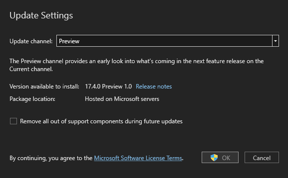
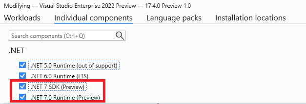
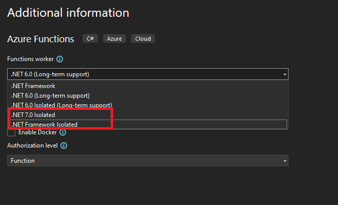
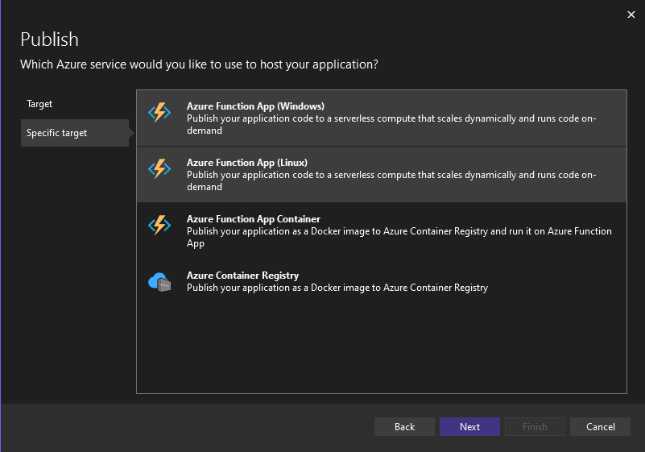

> **NOTE:** This blog was originally posted to the Apps on Azure blog for the [initial preview](https://techcommunity.microsoft.com/t5/apps-on-azure-blog/announcing-the-net-7-support-for-azure-functions-in-an-isolated/ba-p/3574316) and [Visual Studio 2022 support](https://techcommunity.microsoft.com/t5/apps-on-azure-blog/building-net-serverless-applications-with-isolated-model-in/ba-p/3598425).

We’re thrilled to announce that Azure Functions v4 now supports .NET 7 as runtime. Azure Functions joins [Azure Web Apps](https://go.microsoft.com/fwlink/?linkid=2201638) who also announced .NET 7 support.

For those developers who are looking into building serverless functions in Azure with the latest innovation from .NET runtime, this makes it possible for all developers on the planet to focus on coding with .NET 7 new features, ready-to-code while on a large scale without worrying about the underlying infrastructure.

 
## What’s new in .NET 7 with Azure Functions

You can now build your serverless applications with .NET 7 in Azure Functions using the [.NET Isolated Worker model](https://docs.microsoft.com/azure/azure-functions/dotnet-isolated-process-guide), which provides an isolation model that decouples your function process from the Azure Functions runtime, bringing the flexibility needed to target different versions of .NET, more efficiently manage dependencies and service registration.

The isolated worker model also allows you to use current .NET behaviors for dependency injection and incorporating middleware into your function app. Choose the isolated model if you’re upgrading from .NET 5 Azure functions v3.  This feature is available for preview in all Windows & Linux-based plans in addition to premium plans. 

## How to try it out?
 
There’s no difference as you’re used to create an Azure function in .NET 7 runtime in an isolated process. We have core tools available to create a new Azure function in .NET 7 and support in [Visual Studio 2022 17.4 Preview 1](https://docs.microsoft.com/visualstudio/releases/2022/release-notes-preview#17.4.0-pre.1.0).

## Azure Functions Core tools
To get started, we could leverage Azure Functions Core Tools to scaffold an isolated project folder structure as follows:

```cli
func init --worker-runtime dotnet-isolated --target-framework net7.0
 ``` 

Then use func new command to scaffold an HTTP trigger function. The following is an example command to create a function called `DotNet7function` using an HTTP trigger: 

```cli
func new --name DotNet7Function --template "HTTP trigger"
 ```

And then you can use the func start command to test out this function.

```cli
func start
 ```

 
 ## Visual Studio 2022


 Visual Studio makes it easier for all developers to build serverless applications with Azure functions by streamlining the function creation workflow, with rich local development and debugging experience, and quickly publishing your .NET applications to Microsoft Azure. 


### Update your Visual Studio 2022 to 17.4 Preview 1.0 

Follow the Visual Studio update process on the official documentation, and ensure you’re compliant with all the prerequisites before you update. Note that, you need to set your **update channel** to **Preview** in your **More -> Update settings** from Visual Studio Installer as the following:



Make sure you have set the **Modify -> Individual Component** to include .NET 7 SDK ( Preview ), and .NET 7.0 Runtime ( Preview ): 



### Create your Azure Functions

When you create a new Azure Function in Visual Studio where you’ll find a new option for .NET 7 Isolated:



## Deploy your Azure Functions 

Visual Studio provides a simple way to publish your application to Microsoft Azure. You can deploy your serverless application to Azure by simply right-clicking on your functions application in Visual Studio and then Publish.  Select your publish target and publish your functions to Azure:



## Next steps

We’re looking forward to hearing your feedback and your use cases, please feel free to share them on [announcement related discussions](https://github.com/Azure/azure-functions-dotnet-worker/discussions/). Also, if you discover potential issues, please record them on the [Azure Functions .NET language worker](https://github.com/Azure/azure-functions-dotnet-worker/projects/2) GitHub repository. 

Coming up, we’re also closely collaborating with the community and ensuring your voices are heard, check out our public-facing product roadmap from: http://aka.ms/af-dotnet-roadmap.

Start to build your serverless applications with .NET 7, check out the official documentation:

* [Getting started with Azure functions in an isolated process](https://docs.microsoft.com/azure/azure-functions/dotnet-isolated-process-guide)
* [Create your first .NET 7 functions with Azure Core tools](https://docs.microsoft.com/azure/azure-functions/create-first-function-cli-csharp?tabs=azure-cli%2Cisolated-process)
 

If you are interested in learning more about Azure Functions v4, be sure to watch the recent [On .NET episode](https://www.youtube.com/watch?v=SKhhNq8ghvM) with Matthew Henderson & Fabio Cavalcante from the Azure Function team.

<iframe width="560" height="315" src="https://www.youtube.com/embed/SKhhNq8ghvM" title="YouTube video player" frameborder="0" allow="accelerometer; autoplay; clipboard-write; encrypted-media; gyroscope; picture-in-picture" allowfullscreen></iframe>

We’re excited about the road ahead with the continued innovation from .NET on Azure functions.