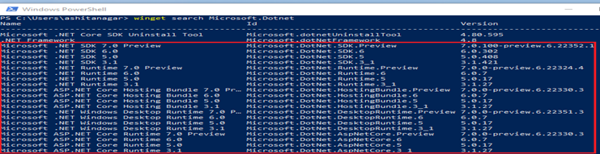

Windows users now have a convenient way of installing .NET: the Windows Package Manager (winget). Winget makes it simple to find, install, uninstall, and update .NET from a Command prompt or PowerShell session.

You can use winget to discover .NET offerings and install the SDK or one or more of the .NET Runtimes (.NET Runtime/.NET Desktop Runtime/ASP.NET Core Runtime) of your choice without worrying about dependencies and configurations. Maintain .NET effortlessly by checking for .NET updates using simple winget commands.

Here’s the list of .NET versions available on Windows Package Manager:

|**.NET Version** | **Support Phase**  |**SDK/Runtime** |**Winget Short-Name**|
|:--------------:|:----------------:|:--------------:|:----------------:|
|6.0|Full|SDK/.NET Runtime/.NET Desktop Runtime/ASP.NET Core Runtime|dotnet-sdk-6, dotnet-runtime-6, dotnet-desktop-6, aspnetcore-6|
|3.1|Maintenance|SDK/.NET Runtime/.NET Desktop Runtime/ASP.NET Core Runtime|dotnet-sdk-3_1, dotnet-runtime-3_1, dotnet-desktop-3_1, aspnetcore-3_1|
|5.0|Out-of-Support|SDK/.NET Runtime/.NET Desktop Runtime/ASP.NET Core Runtime|dotnet-sdk-5, dotnet-runtime-5, dotnet-desktop-5, aspnetcore-5|
|7.0 (Preview)|N/A|SDK/.NET Runtime/.NET Desktop Runtime/ASP.NET Core Runtime|dotnet-sdk-preview, dotnet-runtime-preview, dotnet-desktop-preview, aspnetcore-preview|


Please note that regular updates are available for supported .NET versions via winget. Out-of-Support versions do not get any updates.

To get started, see this page on [installing and using the winget tool](https://docs.microsoft.com/windows/package-manager/winget/).

## Search .NET using winget
To discover all .NET offerings on the Windows Package Manager run the following command:

```shell
winget search Microsoft.DotNet
```



## Install .NET using winget
You can install .NET SDK or Runtime (.NET Runtime/.NET Desktop Runtime/ASP.NET Core Runtime) using following winget command:
```shell
winget install <package-id>
```
For example, this is how you install the .NET 6 SDK:
```shell
winget install Microsoft.DotNet.SDK.6
```


Alternatively, you can also install the same package using it's short name as follows:
```shell
winget install dotnet-sdk-6 
```

You can install other versions of the SDK/Runtimes by substituting the version number, such as 6, with the other version number or word Preview. The following example installs the preview release of the .NET SDK:
```shell
winget install Microsoft.DotNet.SDK.Preview
```

To specify the architecture (x86, x64, and Arm64), use the following command:
```shell
winget install --architecture x64 Microsoft.DotNet.SDK.6
```

## Uninstall .NET using winget
```shell
winget uninstall Microsoft.DotNet.SDK.6
```


## Update .NET using winget

Use the following command to check if a .NET update is available for the installed version(s) of .NET.
```shell
winget upgrade
```

Update to new version of .NET using winget install command. Refer to section "Install .NET using winget" for more details. If both x86 and x64 .NET versions are installed on the machine and you only want to update one, you can use the "--architecture" option to update a specific one.

## Important Links

* [Winget Commands Guide](https://docs.microsoft.com/windows/package-manager/winget/#commands)
* [Install .NET on Windows](https://docs.microsoft.com/dotnet/core/install/windows?tabs=net60)
* [About Windows Package Manager](https://docs.microsoft.com/windows/package-manager/)
* [.NET Support Policy](https://dotnet.microsoft.com/platform/support/policy/dotnet-core)
