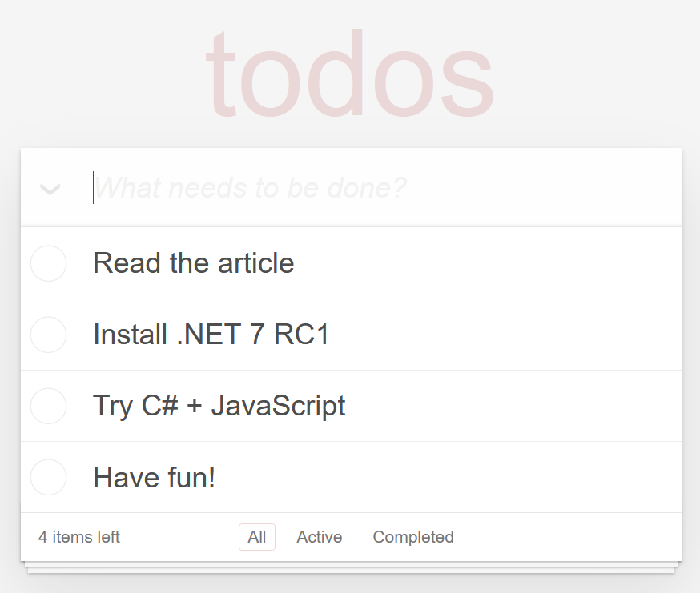

.NET 7 provides improved support for running .NET on WebAssembly in JavaScript-based apps, including a rich JavaScript interop mechanism. The WebAssembly support in .NET 7 is the basis for Blazor WebAssembly apps but can be used independently of Blazor too. Existing JavaScript apps can use the expanded WebAssembly support in .NET 7 to reuse .NET libraries from JavaScript or to build completely novel .NET-based apps and frameworks. Blazor WebAssembly apps can also use the new JavaScript interop mechanism to optimize interactions with JavaScript and the web platform. In this post, we'll take a look at the new JavaScript interop support in .NET 7 and use it to build the classic TodoMVC sample app. We'll also look at using the new JavaScript interop app from a Blazor WebAssembly app.

## TL;DR
Fork the samples at https://github.com/pavelsavara/dotnet-wasm-todo-mvc and https://github.com/pavelsavara/blazor-wasm-hands-pose.

The new JavaScript interop is controlled by attributes from the [System.Runtime.InteropServices.JavaScript](https://docs.microsoft.com/dotnet/api/system.runtime.interopservices.javascript?view=net-7.0) namespace.

### Live demo:

[https://pavelsavara.github.io/dotnet-wasm-todo-mvc](https://pavelsavara.github.io/dotnet-wasm-todo-mvc)
[](https://pavelsavara.github.io/dotnet-wasm-todo-mvc)


## TodoMVC
TodoMVC is great [community project](https://todomvc.com/) which helps JavaScript developers compare the features of various UI frameworks.

To show how the new JS interop support in .NET 7 works, let's create a C# port of TodoMVC based on the [vanilla-es6](https://github.com/tastejs/todomvc/tree/gh-pages/examples/vanilla-es6) version. We won't try to convert all the UI logic, just the app logic.

## How-to

**This post only shows interesting snippets, not the whole code.** 
To follow along, please copy & paste from the sample [repo on github](https://github.com/pavelsavara/dotnet-wasm-todo-mvc).

To get started, install the [.NET 7 RC1 SDK](https://dotnet.microsoft.com/download/dotnet/7.0) (or later) and run the following commands:
```.sh
dotnet workload install wasm-experimental
dotnet new wasmbrowser
```

The `wasm-experimental` workload contains experimental project templates for getting started with .NET on WebAssembly in a browser app (WebAssembly Browser App) or in a Node.js based console app (WebAssembly Console App). Here we're using the browser-based template. The developer experience for these project templates is still a work in progress, but the APIs used in them are fully supported in .NET 7.

Open the folder in your favorite code editor and change the **Program.cs** to match [Program.cs](https://github.com/pavelsavara/dotnet-wasm-todo-mvc/blob/main/Program.cs) from the sample.
```.cs
using System;
using System.Runtime.InteropServices.JavaScript;
using System.Threading.Tasks;

namespace TodoMVC
{
    public partial class MainJS
    {
        static Controller? controller;

        public static async Task Main()
        {
            if (!OperatingSystem.IsBrowser())
            {
                throw new PlatformNotSupportedException("This demo is expected to run on browser platform");
            }

            await JSHost.ImportAsync("todoMVC/store.js", "./store.js");
            await JSHost.ImportAsync("todoMVC/view.js", "./view.js");

            var store = new Store();
            var view = new View(new Template());
            controller = new Controller(store, view);
            Console.WriteLine("Ready!");
        }
    }
}
```

Add [Item.cs](https://github.com/pavelsavara/dotnet-wasm-todo-mvc/blob/main/Item.cs), [Controller.cs](https://github.com/pavelsavara/dotnet-wasm-todo-mvc/blob/main/Controller.cs), [Template.cs](https://github.com/pavelsavara/dotnet-wasm-todo-mvc/blob/main/Template.cs) which are C# ports of the ES6 sample code. Also add [helpers.js](https://github.com/pavelsavara/dotnet-wasm-todo-mvc/blob/main/helpers.js) as it is.

### Store

[Store.cs](https://github.com/pavelsavara/dotnet-wasm-todo-mvc/blob/main/Store.cs) is also almost the same as the ES6 version, except the [localStorage API](https://developer.mozilla.org/en-US/docs/Web/API/Window/localStorage) is wrapped by [store.js](https://github.com/pavelsavara/dotnet-wasm-todo-mvc/blob/main/store.js)
```.js
export function setLocalStorage(todosJson) {
  window.localStorage.setItem('dotnet-wasm-todomvc', todosJson);
}

export function getLocalStorage() {
  return window.localStorage.getItem('dotnet-wasm-todomvc') || '[]';
};
```

Bind these JavaScript functions to C# code using `JSImportAttribute` in `Store.cs`
```.cs
static partial class Interop
{
    [JSImport("setLocalStorage", "todoMVC/store.js")]
    internal static partial void _setLocalStorage(string json);

    [JSImport("getLocalStorage", "todoMVC/store.js")]
    internal static partial string _getLocalStorage();
}
```

The first parameter of the attribute `"setLocalStorage"` is a name of a JS function. 
The function is exported from the [ES6 module](https://developer.mozilla.org/en-US/docs/Web/JavaScript/Guide/Modules) named `"todoMVC/store.js"`. 
The module name needs to be unique for all libraries in the application. The prefix `todoMVC/` solves that. 
It also maps to the name used in `JSHost.ImportAsync` in the `Main.cs`.

### View

The last and most complex part is the View. Most of the real implementation is left in JavaScript in [view.js](https://github.com/pavelsavara/dotnet-wasm-todo-mvc/blob/main/view.js). 
Unlike with Blazor, the new `wasmbrowser` template doesn't include any UI framework, so we'll leave all the UI logic in JavaScript.

```.js
export function removeItem(id) {
  const elem = qs(`[data-id="${id}"]`);
  if (elem) {
    $todoList.removeChild(elem);
  }
}

export function bindAddItem(handler) {
  $on($newTodo, 'change', ({ target }) => {
    const title = target.value.trim();
    if (title) {
      handler(title);
    }
  });
}
```


[View.cs](https://github.com/pavelsavara/dotnet-wasm-todo-mvc/blob/main/View.cs) binds the JS functions and makes them callable from C#. A couple of these imported functions are shown below, but there are more in the full sample.
```.cs
public static partial class Interop
{
    [JSImport("removeItem", "todoMVC/view.js")]
    public static partial void removeItem([JSMarshalAs<JSType.Number>] long id);

    [JSImport("bindAddItem", "todoMVC/view.js")]
    public static partial void bindAddItem([JSMarshalAs<JSType.Function<JSType.String>>] Action<string> handler);
}
```

The `removeItem` is passing `Int64` as an argument. The marshaller is configured to translate it as [`JSType.Number`](https://developer.mozilla.org/en-US/docs/Web/JavaScript/Reference/Global_Objects/Number) which can only represent a 52-bit integer. 
The alternative would be to marshal it as [`JSType.BigInt`](https://developer.mozilla.org/en-US/docs/Web/JavaScript/Reference/Global_Objects/BigInt) which is bit more expensive. 
Since the runtime doesn't want to guess which conversion is preferred in the use case, the developer needs to annotate the method parameter with `[JSMarshalAs<T>]`.

In C# 11, it's now possible to [use generic instances as custom attributes](https://docs.microsoft.com/dotnet/csharp/whats-new/csharp-11#generic-attributes), such as `JSMarshalAsAttribute<T>` in the above code.  Enable the preview language version with `<LangVersion>preview</LangVersion>` in the project file.

The `bindAddItem` is even more interesting. It's passing a strongly typed callback delegate `handler`. 
An explicit definition for the marshaller also needs to be there. 
It's a [`Function`](https://developer.mozilla.org/en-US/docs/Web/JavaScript/Reference/Global_Objects/Function) with a first argument of type [`String`](https://developer.mozilla.org/en-US/docs/Web/JavaScript/Reference/Global_Objects/String). 
This callback is registered by `$on` helper with the DOM `change` event for the `<input class="new-todo"/>` when we call `bindAddItem` function.

### Main

Copy the contents of [index.html](https://github.com/pavelsavara/dotnet-wasm-todo-mvc/blob/main/index.html) from the sample. The interesting part is
```.html
<script type='module' src="./main.js"></script>
```
It's loading `main.js` which will import `./dotnet.js` and start the .NET runtime.

Copy the contents of [main.js](https://github.com/pavelsavara/dotnet-wasm-todo-mvc/blob/main/main.js). The interesting part is
```.js
import { dotnet } from './dotnet.js'

await dotnet.run();
```

Edit the project file and add
```.diff
<Project Sdk="Microsoft.NET.Sdk">
    <PropertyGroup>
        <TargetFramework>net7.0</TargetFramework>
        <WasmMainJSPath>main.js</WasmMainJSPath>
        <OutputType>Exe</OutputType>
        <Nullable>enable</Nullable>
        <AllowUnsafeBlocks>true</AllowUnsafeBlocks>
+        <LangVersion>preview</LangVersion>
+        <NoWarn>IL2026</NoWarn>
    </PropertyGroup>

    <ItemGroup>
        <WasmExtraFilesToDeploy Include="index.html" />
-        <WasmExtraFilesToDeploy Include="main.js" /> 
+        <WasmExtraFilesToDeploy Include="*.js" />
+        <WasmExtraFilesToDeploy Include="*.css" />
    </ItemGroup>
</Project>
```

Test it with 
```.sh
dotnet run
```

You should see output similar to this. You can click on one of the URLs and test the application in your browser.
```.sh
WasmAppHost --runtime-config C:\Dev\dotnet-wasm-todo-mvc\bin\Debug\net7.0\browser-wasm\AppBundle\TodoMVC.runtimeconfig.json
App url: http://127.0.0.1:9000/index.html
App url: https://127.0.0.1:58139/index.html
```

### JSExport

The code above demonstrates how to pass callback from C# to JavaScript so that events fired by the browser can be handled by managed code. There is also another possibility: static methods annotated with `JSExportAttribute` that are callable from JavaScript.

```.cs
namespace TodoMVC
{
    public partial class MainJS
    {
        [JSExport]
        public static void OnHashchange(string url)
        {
            controller?.SetView(url);
        }
    }
}
```

The [main.js](https://github.com/pavelsavara/dotnet-wasm-todo-mvc/blob/main/main.js) uses `getAssemblyExports` JavaScript API to get all the exports of the assembly. 

```.js
const exports = await getAssemblyExports(getConfig().mainAssemblyName);
exports.TodoMVC.MainJS.OnHashchange(document.location.hash);
```

The code uses `getConfig().mainAssemblyName` so that `"TodoMVC.dll"` doesn't have to be hard-coded. 
The `exports` object contains the same namespace `TodoMVC`, the same class `MainJS` and the same method `OnHashchange` as the C# code. 
The parameters of the call will be marshalled using the same rules as for `[JSImport]`. 
Marshaling in both directions is governed by the C# method signature and the `[JSMarshalAs<T>]` annotations on the parameters and return values.

### Performance

It's possible to preload the files `dotnet.js` and `mono-config.json` which are the early dependencies for the runtime to begin starting. 

It's also possible to prefetch the largest binary files. 
In a real production application you should measure the impact of these optimizations. 
Depending on the expected bandwidth and the latency of the target device's connectivity, strike a good balance of what to prefetch.
```.html
<head>
  <script type='module' src="./dotnet.js"></script>
  <link rel="preload" href="./mono-config.json" as="fetch" crossorigin="anonymous">
  <link rel="prefetch" href="./dotnet.wasm" as="fetch" crossorigin="anonymous">
  <link rel="prefetch" href="./icudt.dat" as="fetch" crossorigin="anonymous">
  <link rel="prefetch" href="./managed/System.Private.CoreLib.dll" as="fetch" crossorigin="anonymous">
</head>
```

In the project file enable ahead-of-time (AOT) compilation to improve speed.
Enable trimming of unused code to reduce download size.
```.diff
<Project Sdk="Microsoft.NET.Sdk">
  <PropertyGroup>
        <TargetFramework>net7.0</TargetFramework>
        <WasmMainJSPath>main.js</WasmMainJSPath>
        <OutputType>Exe</OutputType>
        <Nullable>enable</Nullable>
        <AllowUnsafeBlocks>true</AllowUnsafeBlocks>
+        <PublishTrimmed>true</PublishTrimmed>
+        <TrimMode>full</TrimMode>
+        <RunAOTCompilation>true</RunAOTCompilation>
    </PropertyGroup>
</Project>
```
Please note that while AOT code runs much faster than interpreted IL, it increases size of the binary download.

When trimming unused code, the components which are used dynamically (for example via reflection) need to be protected from trimming. 
The sample app uses `System.Text.Json` serializations which need to be protected in `Store.cs`.

```.cs
[DynamicDependency(DynamicallyAccessedMemberTypes.PublicMethods, typeof(JsonTypeInfo))]
[DynamicDependency(DynamicallyAccessedMemberTypes.PublicMethods, typeof(JsonSerializerContext))]
```

In order to publish with AOT compilation, install the `wasm-tools` workload and then publish the app.

```.sh
dotnet workload install wasm-tools
dotnet publish -c Release
```


We can use the `dotnet-serve` tool to host the published app locally. Using the correct MIME type for `.wasm` allows the browser to use streaming instantiation of the WebAssembly module. 

```.sh
dotnet tool install --global dotnet-serve
dotnet serve --mime .wasm=application/wasm --mime .js=text/javascript --mime .json=application/json --directory bin\Release\net7.0\browser-wasm\AppBundle\
```

Compressing the binary assets is also good idea but it's out of the scope of this article.

### Interop performance

We are running set of microbenchmarks regularly. 
For example, this graph shows 10000 calls to trivial JavaScript method with C# signature `[JSImport] int Echo(int value)`. 
Currently we measure various build configurations and browsers on small Raspbery PI 4B.
[](https://alinpahontu2912.github.io/testpages/)
[https://alinpahontu2912.github.io/testpages/](https://alinpahontu2912.github.io/testpages/)


Marshalling of the primitive numbers and `IntPtr` is fast.
Please note in the graph the difference AOT could make.
Marshalling `string` requires us to allocate memory and copy the bits, so it's slower.
Marshaling `Span<byte>` is cheap but the `MemoryView` on JavaScript side is valid only for duration of the call.
Marshalling proxy of `object` involves object allocation, `GCHandle` and two GCs.
Marshaling `Task`, `Exception` and also `ArraySegment<byte>` is similar as they also allocate `GCHandle`.


## Blazor WebAssembly

The new interop with `[JSImport]` and `[JSExport]` is also available in Blazor WebAssembly apps. 
It's useful when you need to integrate with the browser on the client side only. 
When you need to call your JavaScript also from the server side or in a native hybrid app, please use the existing [IJSRuntime](https://docs.microsoft.com/dotnet/api/microsoft.jsinterop.ijsruntime?view=aspnetcore-7.0) interface, which does JSON serialization and a remote dispatch.

For a simple sample, please have a look at the [hands demo](https://github.com/pavelsavara/blazor-wasm-hands-pose) of 3rd party JavaScript code integrated into  Blazor WASM.

Live at [https://pavelsavara.github.io/blazor-wasm-hands-pose](https://pavelsavara.github.io/blazor-wasm-hands-pose)
[](https://pavelsavara.github.io/blazor-wasm-hands-pose)


## Legacy interop

Prior to .NET 7, to perform low-level JavaScript interop in Blazor WebAssembly apps you may have used the undocumented APIs grouped in the `MONO` and `BINDING` JavaScript namespaces. 
Those APIs are still there in .NET 7 for backward compatibility reason, but please consider them deprecated. 
They expose the user to raw pointers to managed objects and are not protected from GC and WASM memory resize. 
In Blazor the `IJSUnmarshalledRuntime` interface has similar downsides and is now also deprecated.
The new interop with `[JSImport]` and `[JSExport]` should be a faster and safer replacement. 

If your use case can't be implemented by the new API or if you found a bug, please let us know by [creating a new issue](https://github.com/dotnet/runtime/issues/new/choose) on GitHub.

## Conclusion

We hope that these new features will allow developers to create better integration between the JavaScript ecosystem and .NET. With these new features .NET developers can now wrap and use existing JavaScript libraries within existing frameworks like Blazor or Uno, or use them directly, like in this demo.