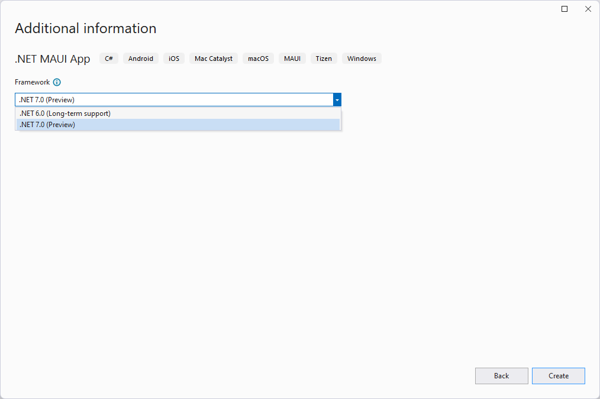
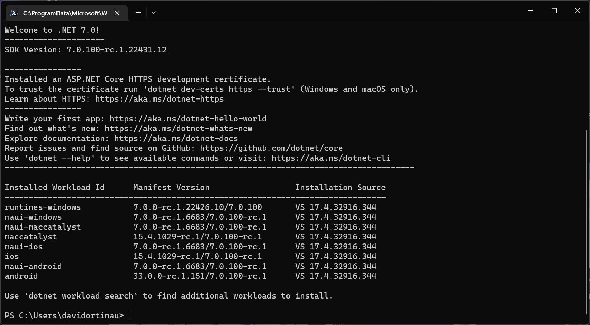
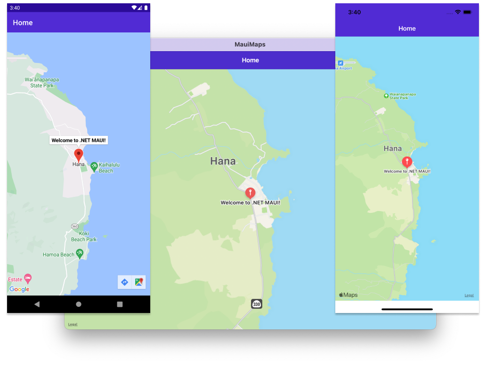
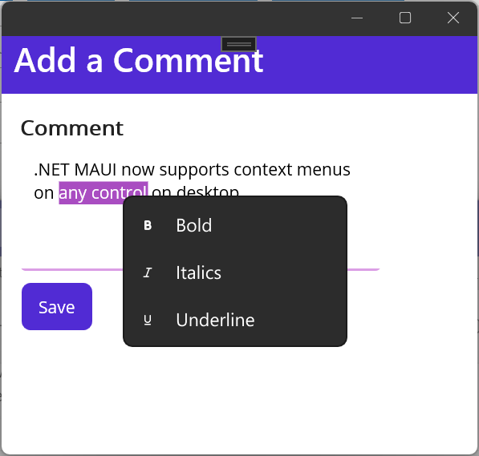
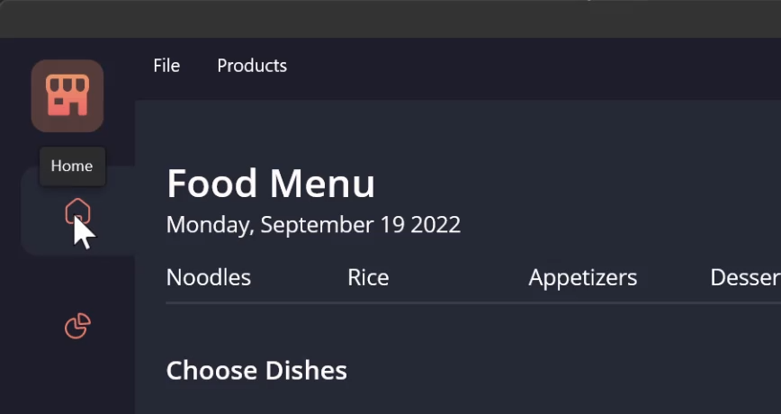

Today we are excited to announce the availability of .NET Multi-platform App UI (MAUI) in .NET 7 release candidate 1 (RC1) with the release of Visual Studio 17.4 Preview 2.1. This includes the foundational SDKs .NET for Android, iOS, Mac Catalyst, and macOS. With the Tizen workload installed, the same code also runs on numerous Samsung devices including phones, televisions, appliances, and wearables. 

Our top priority for this release of .NET MAUI is increasing the overall quality and reliability of the toolkit. .NET 7 RC1 includes the highest priority quality fixes based on your GitHub feedback. Maps and DualScreen join .NET MAUI in .NET 7 to fill two gaps for mobile developers upgrading from Xamarin. We have also added some fundamental desktop features for tooltips, right-click, hover, window size, and context menus.

> **Note about Xcode 14** for iOS, iPadOS, and macOS: .NET 7 is currently compatible with Xcode 13 and the related SDK versions. To get Xcode 14 support today for Xamarin SDKs, follow our [guidance on GitHub](https://github.com/xamarin/xamarin-macios/issues/15954). These SDKs will also come to Visual Studio, .NET 6, and .NET 7 in service releases soon.

## Get Started with .NET MAUI in .NET 7

To quickly get started with RC1, [download and install Visual Studio 17.4 Preview 2.1](https://visualstudio.microsoft.com/vs/preview/) on Windows or Mac. While on Windows you can install Visual Studio versions side by side, this is not the same for Mac and for installing .NET. To address this, we have worked hard in .NET 7 to make sure you can continue build .NET 6 projects with .NET 6 even after installing .NET 7. In fact, in the new project dialog you'll notice that .NET 6 and .NET 7 will both be presented for you to choose from when creating a new .NET MAUI project. You can adopt .NET MAUI versions at your own cadence.



From the command line you can now see version details about all of your workload dependencies by running `dotnet workload list`.



> **Upgrading projects from .NET 6** - in many cases after installing .NET 7 you only need to update `net6.0` references in the _csproj_ file to `net7.0`. We recommend closing the solution, deleting your bin and obj folders, and reopening the project to now restore .NET 7 dependencies from a clean starting point.

## Maps

.NET MAUI now ships with a `Map` control that you can add to your project with the `Microsoft.Maui.Controls.Maps` NuGet package. This control is ideal for displaying and annotating maps using the native maps from each mobile platform. You can draw shapes on the map, drop pins, add custom pins, and even geocode street addresses, latitude, and longitude. To use the map control, add the NuGet package and initialize the control in your MauiProgram.
  

To initialize the control, add `.UseMauiMaps()` in your `MauiProgram` builder and then add the `Map` control to your view.

```xaml
<Grid>
    <Map x:Name="map"/>
</Grid>
```

```csharp
protected override void OnNavigatedTo(NavigatedToEventArgs args)
{
    base.OnNavigatedTo(args);

    var hanaLoc = new Location(20.7557, -155.9880);

    MapSpan mapSpan = MapSpan.FromCenterAndRadius(hanaLoc, Distance.FromKilometers(3));
    map.MoveToRegion(mapSpan);
    map.Pins.Add(new Pin
    {
        Label = "Welcome to .NET MAUI!",
        Location = hanaLoc,
    });
}
```



As you can see in this image, the control also works on macOS. WinUI 3 does not currently have a native map control. To fill that gap, we have created a `WebView` implementation and [opened a proposal](https://github.com/CommunityToolkit/Maui/issues/605) on the .NET MAUI Community Toolkit.

## Desktop Improvements

We have seen many of you using .NET MAUI to target desktop platforms, and we've been working closing with quite a few customers who are also building cross-platform desktop applications with .NET MAUI. In response to your needs and feedback we have surfaced a few useful features targeted at creating better desktop experiences including context menus, tooltips, pointer gestures, right-click mapping on tap gesture, and more control over the window size. Below are some highlights for you to explore in RC1.



### Context Menu

You can now attach a context menu to any visual element on desktop using a MenuFlyout control. When the user right-clicks that view, the flyout will appear in that location.

```xaml
<Editor Text="This is my text and I want bold.">
    <FlyoutBase.ContextFlyout>
        <MenuFlyout>
            <MenuFlyoutItem Text="Bold" Clicked="OnBoldClicked"/>
            <MenuFlyoutItem Text="Italics" Clicked="OnItalicsClicked"/>
            <MenuFlyoutItem Text="Underline" Clicked="OnUnderlineClicked"/>
        </MenuFlyout>
    </FlyoutBase.ContextFlyout>
</Editor>
```



### Tooltips

Sometimes you want to provide some detail about what an element is onscreen when the user hovers the cursor over it. We have added a simple attached property for you to now set that text, and the display and disappearance of the tooltip with automatically be triggered. This is the same pattern used for adding accessibility descriptions via semantic properties.

```xaml
<RadioButton Value="home" 
    ToolTipProperties.Text="Home"
    SemanticProperties.DescriptionText="Home menu item">
    <RadioButton.Content>
        <Image Source="home.png"/>
    </RadioButton.Content>
</RadioButton>
```

### Gestures

Desktop apps need a few gestures that aren’t used on mobile, so in .NET 7 we are adding a pointer gesture for handling hover events and a button mask for secondary (commonly right-click) taps.

```xaml
<PointerGestureRecognizer PointerEntered="HoverBegan" PointerExited="HoverEnded" PointerMoved="HoverMoved" />
```

```csharp
var secondaryClick = new TapGestureRecognizer()
{
    Buttons = ButtonsMask.Secondary
};

secondaryClick.Tapped += SecondaryClick_Tapped;
```

### Window Size and Position

We've added properties and events to the Window so you have control at the cross-platform layer rather than writing platform code. These include:

* X/Y position*
* Width/Height*
* Minimum Width/Height
* Maximum Width/Height
* SizeChanged

/* not supported on macOS

Now to size and center your window on the current display you can do this:

```csharp
const int newWidth = 800;
const int newHeight = 600;

// get screen size
var disp = DeviceDisplay.Current.MainDisplayInfo;

// center the window
Window.X = (disp.Width / disp.Density - newWidth) / 2;
Window.Y = (disp.Height / disp.Density - newHeight) / 2;

// resize
Window.Width = newWidth;
Window.Height = newHeight;
```

## We need your feedback

We’d love to hear from you! As you encounter any issues, please file a report on GitHub at [dotnet/maui](https://github.com/dotnet/maui/issues/new/choose). For any issues related to Visual Studio 2022, please use the [Report a Problem](https://learn.microsoft.com/visualstudio/ide/how-to-report-a-problem-with-visual-studio?view=vs-2022) button.

## Resources

Install and Getting Started:

* [Visual Studio 17.4 Preview 2.1](https://visualstudio.microsoft.com/vs/preview/)
* [.NET MAUI Samples](https://github.com/dotnet/maui-samples)

Release notes:

* [.NET MAUI](https://github.com/dotnet/maui/releases/tag/7.0.0-rc.1.6683)
* [.NET for Android](https://github.com/xamarin/xamarin-android/releases)
* [.NET for iOS and macOS](https://github.com/xamarin/xamarin-macios/releases/tag/untagged-e43f0fe4c3cf3ff33a50)

Known issues:

* [.NET for Android](https://github.com/xamarin/xamarin-android/wiki/Known-issues-in-.NET)
* [.NET for iOS and macOS](https://github.com/xamarin/xamarin-macios/wiki/Known-issues-in-.NET7)