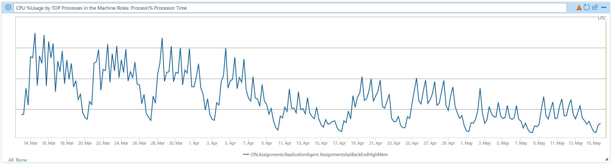

The Assignments and Grades features in Teams for Education allow educators to assign tasks, work, or quizzes to their students. Those with school aged children may know this Microsoft Teams feature well already, but you can learn more about it on the [Microsoft Education Blog](https://techcommunity.microsoft.com/t5/education-blog/what-s-new-in-microsoft-teams-for-education-august-2022/ba-p/3594433).

The Assignments backend service handles a variety of workloads (examples include: serving static content, providing REST APIs over heterogenous data sources, asynchronous worker process, and batch processors handling scheduled tasks). It was built on .NET (predominantly, ASP.NET WebAPI running on .NET 4.7.2). Over the past five years, classrooms around the world have been going through a technological transformation. Most recently, with the switch to remote and hybrid learning due to the COVID-19 pandemic, the Assignments service has seen a roughly 4000% increase in usage. Over the past couple years, we have attempted to deal with the exponential traffic increase in a variety of ways, including algorithmic optimizations, additional caching layers, and low-level serialization optimizations. We have also had to scale out our compute resources in Azure to handle the additional load (increasing our monthly costs). Last year, it seemed we had hit a wall in terms of any significant progress we could make in providing better quality of service and decreasing costs with the existing framework and libraries. This was the primary motivation for migrating our service to .NET 6.

## Our approach

We attempted to keep our initial migration effort simple with a “lift and shift” strategy. We first updated or ported any dependent libraries that were not compatible with .NET 6 (dealing with breaking changes along the way), then we migrated from [ASP.NET to ASP.NET Core](https://docs.microsoft.com/aspnet/core/migration/proper-to-2x). Despite trying to minimize the scope of these changes, it was no small amount of work (mostly due to the number of external libraries used in our service). Now that the initial migration is behind us, we're happy to report that even _without_ additional targeted optimizations, the performance benefits of .NET 6 are quite remarkable! We are also very excited about further improvements on the way in .NET 7.

## A note about the results

We did see some CPU and latency improvements following our migration, but the most consistent improvement was a reduction in memory consumption (Process\Private Bytes). As we continue to tune our code base, we are very excited about the more targeted optimizations that this migration unlocks! For example, we can leverage `Span<T>` to reduce allocations in many more code paths since most BCL APIs now support it as an alternative to `byte[]`. In addition, we now have access to the multitude of new config options in .NET 6 (https://docs.microsoft.com/en-us/dotnet/core/runtime-config/) and are looking forward to tweaking and tuning the runtime to better suit all our workloads.

## The results

The first four processes we migrated are ASP.NET apps that provide a REST APIs using WebAPI. In turn, they each call a REST API for a different upstream dependency (using and `HttpClient`).

### Process 1 (serves static content from Azure Blob Storage):

| **Percentile** | **Latency (.NET 4.7.2)** | **Latency (.NET 6)** | **+/-** |
|----------------|--------------------------|----------------------|---------|
| P50        | 1.8 ms               | 1.3 ms           | ⇩ 28% |
| P90        | 3.5 ms               | 1.6 ms           | ⇩ 54% |
| P99        | 6.5 ms               | 2.6 ms           | ⇩ 60% |

The API was already fast, but on .NET 6, it is much faster! We also saw a reduction in memory consumption:

| **Private Bytes (.NET 4.7.2)** | **Private Bytes (.NET 6)** | **+/-** |
|--------------------------------|----------------------------|---------|
| 725 MB                         | 385 MB                     | ⇩ 47% |

### Process 2 (calls the Teams notification service to create posts in Teams channels):

| **Private Bytes (.NET 4.7.2)** | **Private Bytes (.NET 6)** | **+/-** |
|--------------------------------|----------------------------|---------|
| 690 MB                         | 480 MB                     | ⇩ 30% |

### Process 3 (calls a NoSQL database to do basic CRUD operations):

| **Private Bytes (.NET 4.7.2)** | **Private Bytes (.NET 6)** | **+/-** |
|--------------------------------|----------------------------|---------|
| 610 MB                         | 205 MB                     | ⇩ 66% |

### Process 4 (our highest volume API, which calls a heterogeneous collection of databases):

| **Private Bytes (.NET 4.7.2)** | **Private Bytes (.NET 6)** | **+/-** |
|--------------------------------|----------------------------|---------|
| 2000 MB                        | 1360 MB                    | ⇩ 32% |

The final process I want to highlight is a background worker that receives commands from a message bus (representing updates to several separate data sources) and stores aggregate (denormalized) records in a NoSQL database. This worker handles more than twice as many operations per second as _all the other workers in our service backend combined_. Here is the CPU utilization chart:

While the variation in the chart makes it hard to state precise figures, it's pretty clear that CPU utilization dropped _at least_ 25% compared to pre-migration numbers from early April.

Following this migration, we have been able to scale in our compute resources (without affecting overall latency or throughput of the system) and have been able to reduce our monthly compute costs by nearly 37%.

We'll be making further improvements throughout the summer, but all in all, .NET 6 has us feeling pretty great about the number of students and teachers we'll be able to support this coming fall when the northern hemisphere heads back to school!

