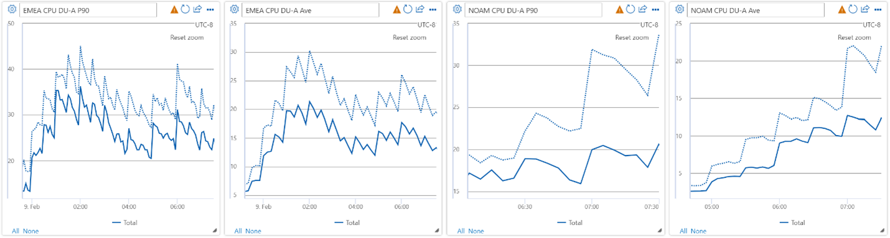
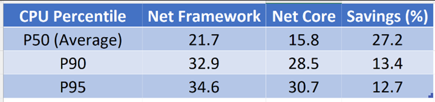
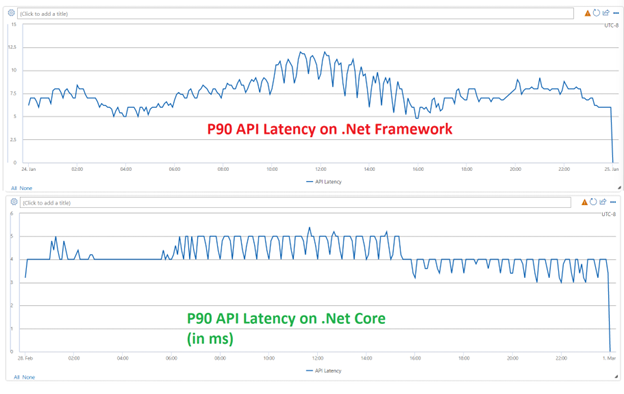
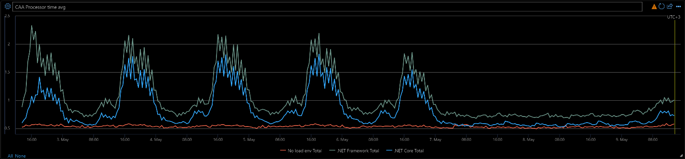

Microsoft Teams’ infrastructure team, or Intelligent Conversation and Communications Cloud (IC3), aspires to be the industry leading platform with reliable and high-quality audio and video calling, meetings, and chat experiences that work any time, from anywhere, on any device. We use our core capabilities to power Microsoft Teams and enable third-party partners to bring intelligent conversations to life in their own product using  Azure Communication Services. We learn from each conversation, every call, and meeting to make the next one better.

In that spirit, we continually evolve and modernize our engineering platform. A key element of our platform evolution is the migration from .NET Framework to the latest version of .NET LTS, currently .NET 6.

## Motivation to move to .NET 6

The migration to .NET Core is driven by multiple factors:

1. Cost Reduction: Average of 29% savings on Azure Compute cost.
2. Performance Improvement: 30-50% improvements in performance including P99 CPU utilization and P99 service latency.
3. Service and Network Modernization: Access to the latest features in the framework, such as a lightweight application memory footprint, support for Containers on Linux, better exception handling thus better reliability under strenuous conditions and latest security fixes.
4. Improved engineering satisfaction and productivity

## Our approach

IC3 consists of more than 200 different microservices working together in a sophisticated mesh. It is global and highly scalable. Each microservice is developed and managed independently. We started our .NET 6 migration journey by building the infrastructure to track and analyze our large-scale system.  For example, understanding the downstream library dependencies for each microservice was an important steps to unblock migration of individual microservices. Then experimented with two microservices to build and verify our approach, supporting infrastructure, and updated libraries. Once we verified our assumptions and validated our migration steps we scaled and planned the migration for the rest of our services in 3 waves. Currently more than a third of our microservices run on .NET 6.
Here is a list of notable tools and learnings from our initial planning:

- Our internal tools analyze over 5500 NuGet packages, over 17000 CSProj files, and over 600 microservices daily. These include microservices from various Microsoft products in addition to Microsoft Teams and Azure Communication Services. If you’re planning a large-scale migration such as this, it is worth taking time to analyze your dependencies using scalable tools. For smaller scale migrations we recommend using [.NET Upgrade Assistant](https://github.com/dotnet/upgrade-assistant).
- We tested bridging the existing WebAPI component to a .NET Core with a shim prior to them being migrated to ASP.NET to de-risk the migration. This was useful for microservices that were more complex and time consuming to upgrade to .NET 6.
- To measure the efficiency gains we implemented Q-Factor analysis that does short term side-by-side comparisons between .NET 6 and .NET Framework, as well as long term trends and comparisons between microservices.
- We started with the assumption that moving to .NET 6 will result in 30% cost reduction for our services. After our experimentation, we were able to confirm this assumption. After migration of 1/3 of our microservices, we continue to observe an average of 29% cost reduction per service.  

*Figure 1-Effect of .NET 6 on long-term performance trend of two different microservices in IC3*

### What is Q-Factor?

We needed a way to measure and compare service efficiency improvements regardless of each service’s specific nature. For example, comparing a Web API service’s improvements to one that pulls events from a queue and processes them can be difficult. Therefore, we defined the following simple model.

Q-Factor is defined as Q=(Total Amount of Work)/(Total Utilization)  , which means that effectively Q is the amount of work an instance can do in an unit of utilization in a period of time.  This metric can be measured at the instance level, cluster level or even region level.
To calculate the Q-Factor, a service needs to determine which metric will be used for each of the variables. Q-Factor is versatile enough to account for memory-bound services, and CPU-bound services, as well as others with  different bottlenecks. For all our services we used compute core utilization. By moving to .NET 6 less CPU cores are needed to process the same amount of work. An example of amount of work used was ‘number of requests’. In our system each service has a different metric to measure the amount of work. Our migration delivered lower CPU load, and up to 50% improvement in service latency (P99). We verified these results hold across various Azure Compute platforms  [Service Fabric, Azure Kubernetes, Azure Cloud Services].

*Figure 2. Example Q-Factor chart produced via load testing. This service utilization grows linearly with total work, primarily between utilization (25, 70)*

We categorize our microservices into domains corresponding to product functionalities. The examples below aren’t conclusive of our entire system, but they would serve as good examples to showcase our results while keeping this post brief.

## Messaging domain

At the heart of IC3’s real-time communication products a collection of microservices handling text messaging and asynchronous media communications. Messages sent in private chats, groups, meetings, as well as files sent are handled by these services. Below shows the result from moving the Messaging API service to .NET 6. This service is a front-end for messaging scenarios and APIs. It is the  gateway between the clients and backend services.

### Highlights

- Average CPU Utilization reduction by 40%
- Azure spend reduction by 50% (Monthly/Average)
- Monthly average Azure Compute cost reduction of 24%

### Instance reduction

After moving completely to .NET Core and deprecating .NET FW, we scaled down our Azure Compute instances. We landed delivering the same service performance with 24% less instances and 50% less cores.

### Azure spend

We were able to see Azure Compute cost reduction of up to 50% per month, on average we observed 24% monthly cost reduction after migrating to .NET 6. The reduction in cores reduced Azure spend by 24%.

### Next steps

We are now enabling Dynamic PGO (Profile Guided Optimization). This should enable further CPU (and cost) reductions. We encourage you to read more about [Dynamics PGO](https://devblogs.microsoft.com/dotnet/conversation-about-pgo/).

## Calling domain

The heart of our real-time communication products consists of  microservices managing signaling for voice & video calls. Every time a client makes or receives a call, starts or joins a meeting, and leaves a call or a meeting these services are hard at work behind the scenes. Below shows the result of moving our Broker service to .NET 6. This service is the message broker for IC3’s real time communication protocols, orchestrating calling and meeting scenarios.

### Highlights

- Monthly average CPU cores reduction by 67%
- Azure spend reduction of 38% (Monthly/Average)
- 55% reduction in API latency.
- 25% improvement in average CPU usage across all regions on both Azure Kubernetes and Azure VM clusters.

### CPU usage decrease

We ran into multiple performance challenges, and iterated mu to optimize performance (CPU usage). At our first benchmarking of Broker on .Net Core 3.1, CPU usage was significantly higher than .Net Framework. After 3 rounds of optimizations in various parts of the code, .Net Core proved more efficient than .Net Framework. The team quickly upgraded the service to .NET 6, designed and implemented additional performance tests to quickly iterate and identify bottlenecks, and finally saw significant improvements. Below charts show CPU usage in each region compared between .NET Framework 4.7.2 and .NET 6.

Below table shows CPU utilization on both NET Framework and NET 6 at different P-values.

### Latency decrease

The charts below show P90 latency (in ms) for a 24-hour period. The top chart is from Broker on .Net Framework 4.7.2 and the bottom one is from Broker on .Net 6. Our measurement is based on the metric logged by Broker service itself. And while Broker is a long-poll transport service, the latency charts below are for a specific API that does not have any I/O or publish event wait times. These charts show an average of 55% improvement in API latency. It also shows a reduction in latency variability, from an observed range of 7.5ms to 4ms.

### Next steps

We continue to migrate the rest of our microservices to .NET 6 . We are also investigating the latest technologies that .NET 6 enables such as QUIC, HTTP/3, etc.

## Conferencing domain

Our final example focuses on IC3’s conferencing services. These services manage scenarios related to business conferencing, such as joining a meeting, announcements, dialing into a conference etc. Two primary services, Conferencing Virtual Assistant and Conferencing Auto Attendant, were moved to .NET 6. Below shows the results for Conferencing Auto Attendant service.
Key highlights

- Monthly average CPU cores reduction by 98%
- Azure spend reduction of 69% (Monthly/Average)
- 55% reduction in CPU utilization.
- Up to 40% reduction in outgoing request latency.
- Up to 9% reduction in incoming request latency.
- 7 % reduction in memory usage

### CPU & memory usage decrease

Charts below show the comparison of CPU & Memory usage as well as the Q-Factor for Conferencing Auto Attendant service running on .NET 6 vs .NET Framework 4.7.2. Our side by side comparison showed 7% reduction in memory usage and 55% reduction in CPU usage. As a result we’ve been able to reduce our core utilization to half.

### Latency decrease

We have observed reduced latency for both incoming and outgoing requests after moving to .NET 6. The improvements depend on multiple factors, including the behavior of the service on the other side of the request. As for some notable examples of incoming requests, we’ve seen a range of 1% to 9% reduction in accepting Dial-In requests, 6% reduction in time to join a meeting. For outgoing requests we’ve seen a up to 40% reduction depending on the downstream services.

## Summary of why this matters

.NET Core has a substantial value proposition for our large-scale microservices, to name a few:

- New JIT compiler, new primitive data types, and optimized implementation of low-level classes that bring performance improvements
- Ability to develop and run services on Windows and Linux
- Architected for testability
- Open Source and community-focused
- A cloud ready, environment-based configuration system
- Built-in dependency injection
- A lightweight, high performance, and modular HTTP request pipeline
- Ability to host on the following: Kestrel, IIS, HTTP.sys, Nginx, Apache, Docker
- Side-by-side versioning
- Support for latest transport protocols like Http/3 QUIC
