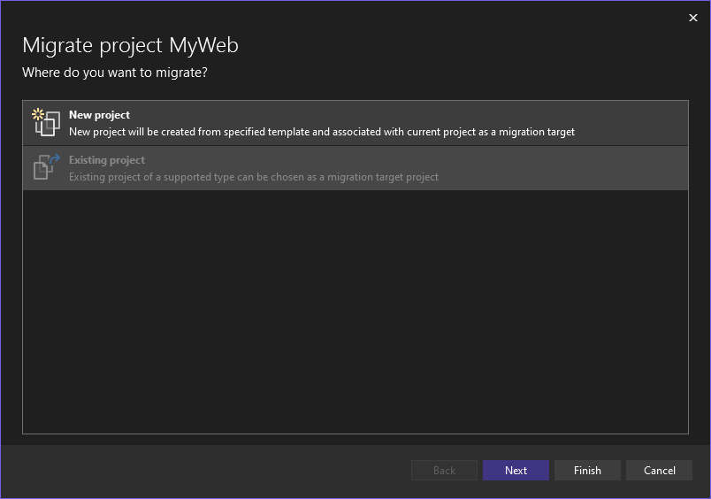
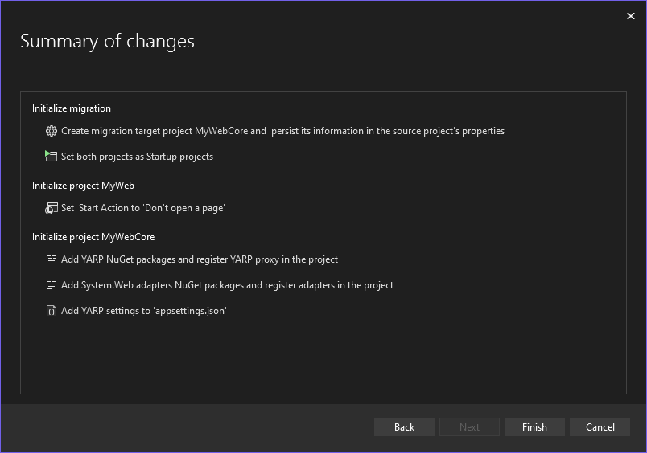

ASP.NET Core is a unified and modern web framework for .NET. Migrating existing ASP.NET apps to ASP.NET Core has many advantages, including better performance, cross-platform support (Windows, macOS, Linux), and access to all the latest improvements to the modern .NET web platform. But migrating from ASP.NET to ASP.NET Core can be very challenging and time consuming due to the many differences between the two frameworks. That's why we've been working to provide libraries and tooling for performing incremental migrations from ASP.NET to ASP.NET Core so that you can slowly migrate existing ASP.NET apps a piece at a time while still enabling ongoing app development. We've been working on tooling in Visual Studio to simplify the migration experience, and a new update to the incremental ASP.NET migration tooling is now available.

[Download and install the extension](https://marketplace.visualstudio.com/items?itemName=WebToolsTeam.aspnetprojectmigrations)

In this series we've previously posted the following posts related to project migrations:

- [Incremental ASP.NET to ASP.NET Core Migration](https://devblogs.microsoft.com/dotnet/incremental-asp-net-to-asp-net-core-migration/)
- [Incremental ASP.NET Migration Tooling Preview 2](https://devblogs.microsoft.com/dotnet/incremental-asp-net-migration-tooling-preview-2/)
- [Migrating from ASP.NET to ASP.NET Core in Visual Studio](https://devblogs.microsoft.com/dotnet/introducing-project-migrations-visual-studio-extension/)

In this blog post we'll cover the significant updates to the Project Migrations Extension as well as updates to the System.Web Adapters. 

## Updates to Visual Studio tooling

We've made the following improvements to the incremental migration tooling:

- Incrementally migrate class library projects, including both C# and VB.
- Incrementally migrate ASP.NET Framework projects with references to class library project(s).
- Incrementally migrate VB ASP.NET Framework projects, excluding VB view files.
- Various UX improvements across the extension.

We'll expand on each of these topics under the headings below.

### Support for Class Library projects

The extension now has support for incrementally migrating .NET Framework class library projects to .NET 6 or 7. This includes both C# and VB class library projects.

Migrating class library projects is typically much simpler than migrating ASP.NET projects. However, class library projects may contain lots of code that needs to be migrated. This may make it difficult to migrate the entire project at once. And while the class library is being migrated, projects that reference the class library still need to function.

Incrementally migrating class library projects enables you to migrate to the latest .NET versions in manageable steps. In addition, when you migrate items from an ASP.NET project that depends on code in a class library, the extension can determine those dependencies and migrate them as needed. With this approach the original .NET Framework project is not modified and can still be referenced by other projects. 

If you're planning to incrementally migrate an ASP.NET Framework project that depends on one or more class library projects, it's recommended to use the Migrate Project feature on all the class library projects first. When you migrate a .NET Framework class library project, a new class library project will be created targeting .NET 6/7. You'll be prompted to select the version of .NET to target. The class library projects do not need to be fully migrated before the web project. At that point, none of the content from the original project will be migrated. Items will be migrated as you migrate items in the ASP.NET Framework project. From here, you can start to incrementally migrate code directly from the original class library to the new .NET Core class library, or you can migrate code from the web project which will automatically migrate dependent code from the original class library to the new class library project. In the section below we'll describe how to migrate ASP.NET Framework projects that depend on class library projects.

### Incrementally migrate ASP.NET Framework projects with references to class library project(s)

Now that the extension can migrate class library projects, that has been integrated into the process of migrating content from ASP.NET Framework projects to ASP.NET Core projects. For example, if you migrate an MVC controller from your ASP.NET Framework project and the controller being migrated depends on code in a dependent class library project, the dependent code will be migrated as well as long as the code lives in a project with a corresponding migration project. Note that this means you must perform Migrate Project on each .NET Framework class library project that the ASP.NET Framework project depends on. Once this association has been made, the extension can automatically migrate items across projects as needed. This works best for C# ASP.NET Framework projects. Support for VB Framework project have some special considerations which we'll expand on in the next section.

If you've already migrated some items from the ASP.NET Framework project before migrating the class library project(s), you can migrate the class library project(s) and then re-run the migrations for the items which have already been migrated. On the next run, the dependencies in the class library project(s) will be detected and migrated.

### Incrementally migrate VB ASP.NET Framework projects

In previous releases we didn't have any support for VB ASP.NET Framework projects. In this release we added support for incrementally migrating VB projects. You can incrementally migrate VB class library projects to .NET 6 or 7.

When migrating a VB ASP.NET Framework project, a new C# ASP.NET Core project will be created. Razor (.cshtml, .razor) support in ASP.NET Core is based on C# and requires a C# project. ASP.NET Core doesn't support VB views (.vbhtml), so they need to be manually migrated.  The tool also cannot automatically migrate VB code to C#. If the amount of VB code in the ASP.NET project is large, it's recommended to move the code to a new VB class library targeting .NET Framework and then use the new class library incremental migration experience. The migrated VB class library can then be referenced from the ASP.NET Core project.

### User experience improvements

In this release we've made several user experience (UX) improvements to the incremental migration tooling. We'll briefly go over the significant updates here.

We improved the dialog for selecting whether to create a new migration project or use an existing one. You can see the improved dialog in the following image:



In previous releases the selection for a New Project or Existing Project was a radio button. We have also significantly updated the Summary page which appears after you migrate items. The updated dialog is shown next.



We feel that with the updates to this page, its much clearer what actions have taken place as well as being easier to read. We've also made several smaller UX improvements that you may notice as you use the new version of this extension.

### Known tooling issues

This extension is still in the early stages, so you may run into some issues. Here are the significant known issues that exist in the current version of the extension.

- Web content files (CSS/JS/etc.) are not migrated.
- Limited number of code updates currently. Migrated code may need manual updates.
- No migration support for ASP.NET Identity related files.
- No migration support for ASP.NET Web Forms (.aspx) files.
- Limited support for migrating Razor (.cshtml) views migration. No support for partial views currently.
- No migration support for MVC areas.

This is not a complete list of known issues, but these are the most important ones that we've identified.

Please give this new extension a try and please provide feedback so that we can improve this feature as we proceed.

## System.Web Adapters Updates

We've also released an updated version of the System.Web adapters for ASP.NET Core. This release of the System.Web adapters is mostly a stabilization of APIs and functionality that was available in previous previews. The main change for this release is that the NuGet package structure has been modified:

- `Microsoft.AspNetCore.SystemWebAdapters`: Subset of the APIs from `System.Web.dll` backed by `Microsoft.AspNetCore.Http` types. This is available for .NET 4.5+, .NET Standard 2.0, and .NET 6+ and is intended for libraries. This package contains the APIs from `System.Web`.
- `Microsoft.AspNetCore.SystemWebAdapters.CoreServices`: Support for adding services to ASP.NET Core applications to enable migration efforts. This is available for .NET 6+. This package contains services that can be added to your ASP.NET Core application to enable scenarios exposed by the `System.Web` APIs.
- `Microsoft.AspNetCore.SystemWebAdapters.FrameworkServices`: Support for adding services to ASP.NET Framework applications to enable migration efforts. This is available for .NET 4.7.2+. This package contains services that can be added to your ASP.NET Framework application to enable incremental migration.

### Update to latest version

To upgrade to the latest version:

1. Uninstall `Microsoft.AspNetCore.SystemWebAdapters.SessionState`. This is no longer necessary.
2. Upgrade `Microsoft.AspNetCore.SystemWebAdapters` to the latest version (1.0.0-rc.1.22477.1) in library projects.
3. Install `Microsoft.AspNetCore.SystemWebAdapters.FrameworkServices` to your ASP.NET Framework application
4. Install `Microsoft.AspNetCore.SystemWebAdapters.CoreServices` in your ASP.NET Core projects.

### Configuration Changes

This release adds adapters for a few more APIs from `HttpContext`, `HttpRuntime`, and others that should help with migrating code that relies on these types.

Beyond these changes, the main change to the APIs is that the builders used to construct the services have been separated for ASP.NET Core vs Framework. This results in changes to what packages you use where and how you register services.

For example, in ASP.NET Core you now register services for the System.Web adapters as follows:

```csharp
var builder = WebApplication.CreateBuilder();

// Add services to the container.
builder.Services.AddControllersWithViews();
builder.Services.AddSystemWebAdapters()
    .AddJsonSessionKeySerializer(options => 
    {
      options.RegisterKey<int>("key1");
    })
    .AddRemoteAppClient(options =>
    {
        options.RemoteAppUrl = new(builder.Configuration["ReverseProxy:Clusters:fallbackCluster:Destinations:fallbackApp:Address"]);
        options.ApiKey = builder.Configuration("RemoteAppApiKey");
    })
    .AddSessionClient();

var app = builder.Build();

// Configure the HTTP request pipeline.
if (!app.Environment.IsDevelopment())
{
    app.UseExceptionHandler("/Home/Error");
    app.UseHsts();
}

app.UseHttpsRedirection();
app.UseStaticFiles();
app.UseRouting();
app.UseAuthorization();
app.UseSystemWebAdapters();
app.MapDefaultControllerRoute()
    .BufferResponseStream()
    .PreBufferRequestStream()
    .RequireSystemWebAdapterSession();

app.Run();
```

The new ASP.NET Framework registration looks like this:

```csharp
protected void Application_Start()
{
    ...

    SystemWebAdapterConfiguration.AddSystemWebAdapters(this)
        .AddProxySupport(options => options.UseForwardedHeaders = true)
        .AddJsonSessionSerializer(options => 
        {
          options.RegisterKey<int>("key1");
        })
        .AddRemoteAppServer(options => options.ApiKey = ConfigurationManager.AppSettings["RemoteAppApiKey"])
        .AddSessionServer();
}
```

These registrations allow you to build up the services that you need for your migration process. This process is often a slow one that allows you to move functionality from your ASP.NET Framework application to the ASP.NET Core application. Please see the previous blog posts and the [documentation](https://github.com/dotnet/systemweb-adapters/tree/main/docs) for the project to see features that these libraries enable.

### New APIs

This release brings in a number of API changes. Some of them are:

- Implicit casting to `HttpContextBase`, `HttpRequestBase`, and `HttpResponseBase` in addition to the existing casts available for code that make use of these abstract base classes
- `HttpRequest.GetBufferedStream()` and `HttpRequest.GetBufferlessStream()` have been added
- Better logging and diagnostics have been added for session key/value serialization for cases where the type is not known
- `VirtualPathUtility` has been added

For the full changelog, please see the [release on GitHub](https://github.com/dotnet/systemweb-adapters/releases/tag/v1.0.0-rc.1).

## Give feedback

We want to hear from you how we can best improve the incremental ASP.NET migration experience. The best place to share your feedback with us is on GitHub in the [dotnet/systemweb-adapters](https://github.com/dotnet/systemweb-adapters) repo. Use the 👍 reaction to indicate features or improvements that are most important to you.

This is a brief overview of this new extension and the System.Web adapters for ASP.NET Core. For more details you can check out the additional related resources listed below. Please try it out on your existing ASP.NET projects and share feedback so that we can continue to improve the incremental ASP.NET migration experience.

Thanks, and happy coding!

## Resources

- [Microsoft Project Migrations (Experimental) – Visual Studio Marketplace](https://marketplace.visualstudio.com/items?itemName=WebToolsTeam.aspnetprojectmigrations)
- [dotnet/systemweb-adapters (github.com)](https://github.com/dotnet/systemweb-adapters)
- [YARP Documentation (microsoft.github.io)](https://microsoft.github.io/reverse-proxy/)
- [Incremental ASP.NET to ASP.NET Core Migration – .NET Blog (microsoft.com)](https://devblogs.microsoft.com/dotnet/incremental-asp-net-to-asp-net-core-migration/)
- [Incremental ASP.NET Migration Tooling Preview 2 – .NET Blog (microsoft.com)](https://devblogs.microsoft.com/dotnet/incremental-asp-net-migration-tooling-preview-2/)
- [Migrating from ASP.NET to ASP.NET Core in Visual Studio](https://devblogs.microsoft.com/dotnet/introducing-project-migrations-visual-studio-extension/)