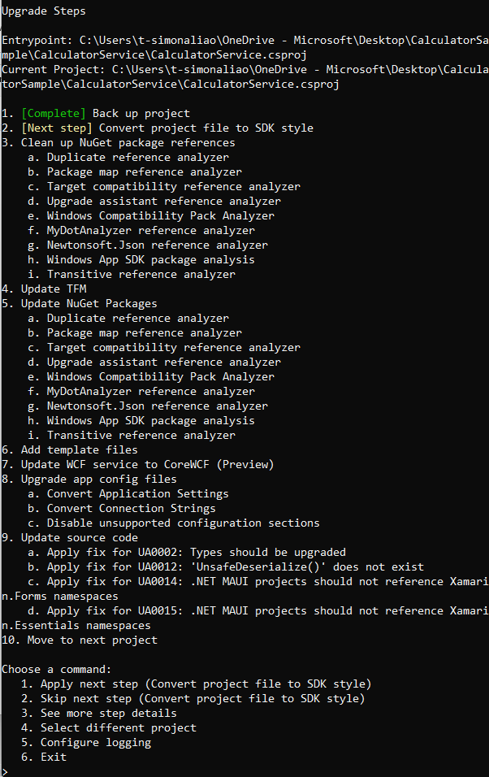
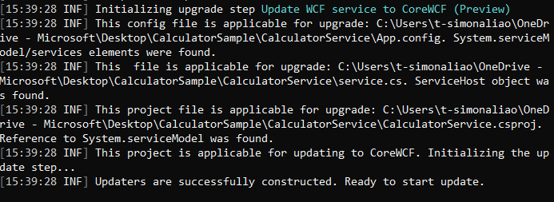
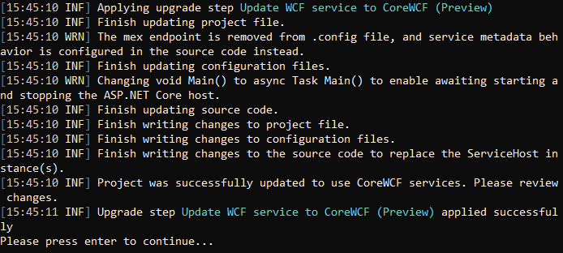

> Note: This post is on behalf of Simona Liao who recently finished her [summer internship at Microsoft](https://careers.microsoft.com/students/us/), during which she worked on adding this WCF support to the Upgrade Assistant.

Since CoreWCF 1.0 was released in April, we have received customer interest in tooling to assist the upgrade from WCF on .NET Framework to CoreWCF on .NET 6. We are happy to announce that the team has released the Preview version of CoreWCF extension for C# projects in Upgrade Assistant. This tool does most of the steps needed to be able to convert from WCF to using CoreWCF on .NET 6.

In this blog, we will walk through the migration experience using Upgrade Assistant on a simple WCF project.  

## Migration Demo 

The [Calculator sample](https://github.com/dotnet/docs/tree/main/docs/core/porting/snippets/upgrade-assistant-wcf-framework/CalculatorSample) is a very simple WCF sample that includes a client and service project. The service is a console application that provides the CalculatorService for clients. It has two endpoints, one is with netTcpBinding and the other one with mexHttpBinding to enable metadata services. Since there is not a project-to-project dependency between client and service, we can go ahead and update the service to CoreWCF on .NET 6 directly using Upgrade Assistant. 

The [.NET Upgrade Assistant](https://github.com/dotnet/upgrade-assistant) is a command line tool that automates the migration process from .NET Framework to .NET 6. To install Upgrade Assistant, type the following command: 

``` shell
dotnet tool install -g upgrade-assistant 
``` 

After successfully installed the tool, we can start the upgrade by running it on the Calculator sample solution file. Because WCF Updater is a default extension, we don’t need to add any extra commands to be able to load the extension. 

``` shell
upgrade-assistant upgrade CalculatorSample.sln 
```
 
After selecting `CalculatorService` as the entry point, the tool will generate a list of upgrade steps to go through.  

For each step, we can decide to apply it, skip it, see more details about this step, select a different project, configure the logging level, or exit the tool. After applying the step, the Upgrade Assistant console will output the changes made to the project, and also any manual updates need to complete after the automated update. 



### CoreWCF Migration

After step 6: Add template files is complete, the WCF update step will be initialized and the tool will check if the project is applicable for update. 



If the project does not meet the requirements or is not applicable, the WCF update step will be skipped and shown as Complete. Our CalculatorService project is applicable, and we will choose command "1" to apply the step. Here is the console output of applying the WCF update step.



Notice that project file, configuration files, and the source code files are updated, and there are two warnings specifying removal of outdated code. In most cases, outdated or unsupported code will be commented out or replaced with the updated code instead of removal. The first step of the upgrade is to create a backup we can return to if we need to get the original files.

After completing the remaining upgrade steps, we can examine the changes, complete any manual updates, and run the updated service.

### Outputs of the conversion process 

#### 1. Source Code file updates - [*service.cs*](https://github.com/dotnet/docs/blob/main/docs/core/porting/snippets/upgrade-assistant-wcf-framework/CalculatorSample/CalculatorService/service.cs)

  - System.ServiceModel related using directives are replaced with CoreWCF ones. We also add ASP.NET Core namespace because the updated code use ASP.NET Core as the service host. 

``` c#
using System;
using CoreWCF;
using CoreWCF.Configuration;
using CoreWCF.Description;
using CoreWCF.Security;
```
  - In the Main method, we are using ASP.NET Core host instead of ServiceHost objects.

``` c#
...

 // Host the service within console application.
public static async Task Main()
{
    var builder = WebApplication.CreateBuilder();

    // Set up port (previously this was done in configuration,
    // but CoreWCF requires it be done in code)
    builder.WebHost.UseNetTcp(8090);
    builder.WebHost.ConfigureKestrel(options =>
    {
        options.ListenAnyIP(8080);
        
    });

    // Add CoreWCF services to the ASP.NET Core app's DI container
    builder.Services.AddServiceModelServices()
                    .AddServiceModelConfigurationManagerFile("wcf.config")
                    .AddServiceModelMetadata()
                    .AddTransient<CalculatorSample.CalculatorService>();

    var app = builder.Build();
```
  - We also configured some supported service behaviors here instead of in the configuration file, such as the service metadata and service debug behavior. 

``` c#
    // Enable getting metadata/wsdl
    var serviceMetadataBehavior = app.Services.GetRequiredService<ServiceMetadataBehavior>();
    serviceMetadataBehavior.HttpGetEnabled = true;
    serviceMetadataBehavior.HttpGetUrl = new Uri("http://localhost:8080/CalculatorSample/metadata");
```

  - Note that the ConfigureServiceHostBase delegate is empty because CalculatorService is a simple example without too much configuration. In more complicated cases, service credentials properties or other customer code that configures the service host will be placed inside this delegate.

``` c#
    // Configure CoreWCF endpoints in the ASP.NET Core hosts
    app.UseServiceModel(serviceBuilder =>
    {
        serviceBuilder.AddService<CalculatorSample.CalculatorService>(serviceOptions => 
        {
            serviceOptions.DebugBehavior.IncludeExceptionDetailInFaults = true;
        });

        serviceBuilder.ConfigureServiceHostBase<CalculatorSample.CalculatorService>(serviceHost =>
        {

        });
    });

    await app.StartAsync();
    Console.WriteLine("The service is ready.");
    Console.WriteLine("Press <ENTER> to terminate service.");
    Console.WriteLine();
    Console.ReadLine();
    await app.StopAsync();
}
```

#### 2.	Configuration file updates
WCF related settings from [*App.config*](https://github.com/dotnet/docs/blob/main/docs/core/porting/snippets/upgrade-assistant-wcf-framework/CalculatorSample/CalculatorService/App.config) are copied over to a newly genereated *wcf.config* file:

  - The system.serviceModel section in the original App.config is moved to this newly generated wcf.config file. 

``` xml
<?xml version="1.0" encoding="utf-8"?>
<configuration>
  <system.serviceModel>
    <services>
      <service name="CalculatorSample.CalculatorService" behaviorConfiguration="CalculatorServiceBehavior">
```

- Inside wcf.config, sections such as `<behavior>` and `<host>` are commented out because they are configured in the source code instead.

``` xml
<!--The host element is not supported in configuration in CoreWCF. The port that endpoints listen on is instead configured in the source code.-->
<!--<host>
  <baseAddresses>
    <add baseAddress="net.tcp://localhost:8090/CalculatorSample/service" />
    <add baseAddress="http://localhost:8080/CalculatorSample/service" />
  </baseAddresses>
</host>-->
        <!-- this endpoint is exposed at the base address provided by host: net.tcp://localhost:8090/CalculatorSample/service  -->
        <endpoint address="/CalculatorSample/service" binding="netTcpBinding" contract="CalculatorSample.ICalculator" />
        <!-- the mex endpoint is exposed at http://localhost:8080/CalculatorSample/service/ -->
        <!--The mex endpoint is removed because it's not support in CoreWCF. Instead, the metadata service is enabled in the source code.-->
      </service>
    </services>
    <!--For debugging purposes set the includeExceptionDetailInFaults attribute to true-->
    <!--The behavior element is not supported in configuration in CoreWCF. Some service behaviors, such as metadata, are configured in the source code.-->
    <!--<behaviors>
  <serviceBehaviors>
    <behavior name="CalculatorServiceBehavior">
      <serviceMetadata httpGetEnabled="True" />
      <serviceDebug includeExceptionDetailInFaults="True" />
    </behavior>
  </serviceBehaviors>
</behaviors>-->
  </system.serviceModel>
</configuration>
```
#### 3.	Project file updates [*CalculatorService.csproj*](https://github.com/dotnet/docs/blob/main/docs/core/porting/snippets/upgrade-assistant-wcf-framework/CalculatorSample/CalculatorService/CalculatorService.csproj)

  - We update the SDK to Microsoft.NET.Sdk.Web to enable ASP.NET Core host.

``` xml
<?xml version="1.0" encoding="utf-8"?>
<Project Sdk="Microsoft.NET.Sdk.Web">
  <PropertyGroup>
    <TargetFramework>net6.0</TargetFramework>
    <OutputType>Exe</OutputType>
    <RootNamespace>service</RootNamespace>
    <AssemblyName>service</AssemblyName>
    <PublishUrl>publish\</PublishUrl>
    <Install>true</Install>
    <InstallFrom>Disk</InstallFrom>
    <UpdateEnabled>false</UpdateEnabled>
    <UpdateMode>Foreground</UpdateMode>
    <UpdateInterval>7</UpdateInterval>
    <UpdateIntervalUnits>Days</UpdateIntervalUnits>
    <UpdatePeriodically>false</UpdatePeriodically>
    <UpdateRequired>false</UpdateRequired>
    <MapFileExtensions>true</MapFileExtensions>
    <ApplicationRevision>0</ApplicationRevision>
    <ApplicationVersion>1.0.0.%2a</ApplicationVersion>
    <IsWebBootstrapper>false</IsWebBootstrapper>
    <UseApplicationTrust>false</UseApplicationTrust>
    <BootstrapperEnabled>true</BootstrapperEnabled>
    <GenerateAssemblyInfo>false</GenerateAssemblyInfo>
    <OutputPath>bin\</OutputPath>
  </PropertyGroup>
  <ItemGroup>
    <BootstrapperPackage Include="Microsoft.Net.Client.3.5">
      <Visible>False</Visible>
      <ProductName>.NET Framework 3.5 SP1 Client Profile</ProductName>
      <Install>false</Install>
    </BootstrapperPackage>
    <BootstrapperPackage Include="Microsoft.Net.Framework.3.5.SP1">
      <Visible>False</Visible>
      <ProductName>.NET Framework 3.5 SP1</ProductName>
      <Install>true</Install>
    </BootstrapperPackage>
    <BootstrapperPackage Include="Microsoft.Windows.Installer.3.1">
      <Visible>False</Visible>
      <ProductName>Windows Installer 3.1</ProductName>
      <Install>true</Install>
    </BootstrapperPackage>
  </ItemGroup>
```

- System.ServiceModel related package references are replaced with CoreWCF ones. 

``` xml
  <ItemGroup>
    <PackageReference Include="System.Configuration.ConfigurationManager" Version="5.0.0" />
    <PackageReference Include="Microsoft.DotNet.UpgradeAssistant.Extensions.Default.Analyzers" Version="0.4.336902">
      <PrivateAssets>all</PrivateAssets>
    </PackageReference>
    <PackageReference Include="CoreWCF.NetTcp" Version="1.1.0" />
    <PackageReference Include="CoreWCF.Primitives" Version="1.1.0" />
    <PackageReference Include="CoreWCF.ConfigurationManager" Version="1.1.0" />
    <PackageReference Include="CoreWCF.Http" Version="1.1.0" />
    <PackageReference Include="CoreWCF.WebHttp" Version="1.1.0" />
  </ItemGroup>
</Project>
```

## Upgrade Requirements

The Calculator sample demoed above is a very simple case and our CoreWCF extension now is only able to support certain types of WCF projects.
The CoreWCF Upgrade Assistant Preview currently supports:

  - ✅ Update WCF project with a single `ServiceHost` instance and replace it with ASP.NET Core hosting.
  - ✅ Update WCF project with multiple services and all `ServiceHost` are instantiated and configured in the same method.
  - ✅ Update the original configuration file in the project and generate a new configuration file for CoreWCF.
  - ✅ Replace `System.ServiceModel` namespace and references with CoreWCF ones in .cs and project files.

It does not support:
  - ❌ WCF server that are Web-hosted and use .svc file.
  - ❌ Behavior configuration via xml config files except `serviceDebug`, `serviceMetadata`, `serviceCredentials`(`clientCertificate`, `serviceCertificate`, `userNameAuthentication`, and `windowsAuthentication`)
  - ❌ Endpoints using bindings other than NetTcpBinding and HTTP-based bindings

For the WCF project to be applicable for this upgrade, it must meet the following requirements:
- Includes a .cs file that references `System.ServiceModel` and creates new `ServiceHost`.
- If the WCF project has multiple `ServiceHost`, all hosts need to be created in the same method.
- Includes a .config file that stores `System.ServiceModel` properties

## Summary  
We hope this migration assistant update will simplify some of our customers' WCF migration experiences. We are releasing this CoreWCF update functionality as a preview as we need more usage against real-world projects. If you have encountered any issues with the extension, please [open an issue](https://github.com/dotnet/upgrade-assistant/issues/new?assignees=&labels=area%3AWCF&template=20_bug_report.md) in the [Upgrade Assistant](https://github.com/dotnet/upgrade-assistant) GitHub repository with area:WCF tag.

