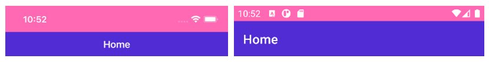

We are happy to announce the release of the [.NET MAUI Community Toolkit v1.3](https://github.com/CommunityToolkit/Maui/releases/tag/1.3.0), which is now live on NuGet! This release includes status bar styling functionality, Gravatar image support, prebuilt fade animations, SourceLink support, and numerous bug fixes.

The .NET MAUI Community Toolkit is a community-created library that contains .NET MAUI Extensions, Advanced UI/UX Controls, and Behaviors to help make your life as a .NET MAUI developer easier.

## Status Bar Styling

With this release of the .NET MAUI Community Toolkit you now get `StatusBarBehavior`, which allows you to easily customize the color and style of the status bar on iOS and Android either through code or in XAML. It is implemented as a `Behavior` meaning you can change it per page or even dynamically in response to user actions or application status.

There are two properties which you can use to control the look of the status bar:

- `StatusBarColor`: allows you to specify the color of the status bar background.
- `StatusBarStyle`: allows you to control if the content (text and icons) on the status bar are light, dark or the system default.

> **Note:** These two properties are Bindable, so you can also bind these values from your ViewModels.

Here is an example of how to use these properties in XAML:

```xaml
<Page.Behaviors>
    <toolkit:StatusBarBehavior StatusBarColor="HotPink" StatusBarStyle="LightContent"/>
</Page.Behaviors>
```

Or, if you prefer writing your UI's in C# code:

```csharp
var statusBehavior = new StatusBarBehavior()
{
    StatusBarColor = Colors.HotPink,
    StatusBarStyle = StatusBarStyle.LightContent
}
this.Behaviors.Add(statusBehavior);
```

And now, with just a couple of lines of code, you have a beautifully styled status bar that can match the theme of your application.



You can read more about the other features of `StatusBarBehavior` and see more examples [in our docs](https://learn.microsoft.com/dotnet/communitytoolkit/maui/behaviors/statusbar-behavior?tabs=ios). Gerald Versluis has also put together [a great video](https://www.youtube.com/watch?v=dWj0PdImH10) demonstrating how to get started.


## Gravatar Image Source

A Gravatar (globally recognized avatar) is an image that can be used as your avatar — that is, an image that represents you or your users, such as in a forum post or a blog comment. You can learn more about Gravatar or register your own at the [Gravatar website.](https://www.gravatar.com/)

With this release of the .NET MAUI Community Toolkit you can easily display Gravatar images next to people's names or email addresses via the `GravatarImageSource`.

You can use `GravatarImageSource` anywhere you would normally use an `ImageSource`, for example:

```xaml
<Image>
    <Image.Source>
        <toolkit:GravatarImageSource Email="youremail@here.com" />
    </Image.Source>
</Image>
```

The `Email` property specifies the Gravatar account email address. However, there are also properties to determine the default image if the `Email` is not found on Gravatar as well as inbuilt caching capabilities. All these properties are backed by `BindableProperty` which means they can be targets for data binding and styled.

Read more about the other features of `GravatarImageSource` and see more examples [in our docs](https://learn.microsoft.com/dotnet/communitytoolkit/maui/imagesources/gravatarimagesource).

## Animations

This release of the .NET MAUI Community Toolkit enhances the existing `AnimationBehavior` capabilities by introducing the `FadeAnimation` to provide the ability to animate the opacity of a `VisualElement` from its original opacity to a specified new opacity and then back to the original.

This allows you to specify animations in XAML that respond to user interactions.

```xaml
<Button Text="Click this Button">
    <Button.Behaviors>
        <toolkit:AnimationBehavior EventName="Clicked">
            <toolkit:AnimationBehavior.AnimationType>
                <toolkit:FadeAnimation Opacity="0.2"/>
            </toolkit:AnimationBehavior.AnimationType>
        </toolkit:AnimationBehavior>
    </Button.Behaviors>
</Button>

```

In future releases, we will be building on the animations to provide Flip, Rotate, Scale and Shake animations. Contributions are always welcome, so if you are keen to help, see the contributing section below to find out how.

## Source Link

Source Link is a technology that providing first-class source debugging experiences for binaries.  With this release we have configured our builds to use Source Link, which means if you have Source Link enabled in Visual Studio you can expect an even better debugging experience whilst using the .NET MAUI Community Toolkit. You can find more information about Source Link and how to enable it in [this blog post.](https://devblogs.microsoft.com/dotnet/improving-debug-time-productivity-with-source-link/)

## Other Fixes

This release also includes numerous bug fixes and code quality improvements. Check out the [release notes](https://github.com/CommunityToolkit/Maui/releases/tag/1.3.0) for a complete list of changes.

## Contributing

The .NET MAUI Community Toolkit really is a community effort powered by your contributions. If you would like to contribute, feel free to open issues or let us know about your experience! You can also check out our previous post about [Contributing to .NET MAUI Community Toolkit.](https://devblogs.microsoft.com/dotnet/contributing-to-net-maui-community-toolkit/)

## Summary

We hope you enjoy the latest release of .NET MAUI Community toolkit. You can find all source code and sample app in our [GitHub repo](https://github.com/CommunityToolkit/Maui) and browse the [official documentation](https://learn.microsoft.com/dotnet/communitytoolkit/maui/).

A massive thank you to all the contributors and don't forget you can join us live on the 1st Thursday of each month @ 1200 PT, where we live-stream our standups on the [.NET Foundation YouTube Channel](https://www.youtube.com/channel/UCiaZbznpWV1o-KLxj8zqR6A).
