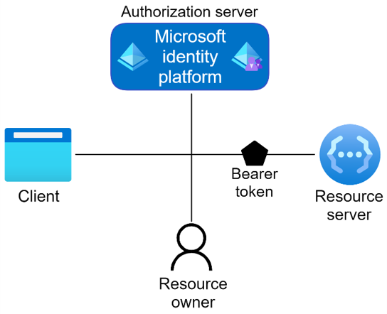

We are pleased to announce official .NET MAUI support in [Microsoft.Identity.Client 4.47.0](https://www.nuget.org/packages/Microsoft.Identity.Client/) to easily add authentication into your apps. In this blog we will take a look at how to perform authentication in .NET MAUI apps to acquire the desired token.  

Commonly authentication is done in three ways:
 - Basic - This is used when authentication is done for both personal and corporate accounts without using a broker (or Authenticator). For clarity, personal account mean Microsoft personal account such as Outlook, Hotmail etc.
 - With Broker - This is intended for corporate accounts where an extra layer of security is added by using Authenticator/Broker. This is useful for MFA and is required to comply with other security policies such as conditional access.
 - B2C - This is used when the end user is allowed to login using OAuth2 credentials such as Google, Facebook etc. This does not support broker.

 We provided one sample for each type [Samples](https://github.com/Azure-Samples/active-directory-xamarin-native-v2/tree/main/MAUI).  

 All the samples use the standard Acquire Token Silent (ATS) + Acquire Token Interactive (ATI) flow i.e. app attempts to acquire token silently and if that fails, it invokes UI to acquire it interactively. The token is then used to retrieve data from the backend.  
 
 
 The apps have a wrapper ```PCAWrapper(B2C)``` for MSAL client. The wrapper implements singleton pattern. When `PCAWrapper` is instantiated, it builds PublicClientApplication using the preconfigured values. It also provides logging support. It separates the UI code cleanly from UI by wrapping MSAL related error handling, constants, and other parameters.  
 
 
 Platform specific code and configuration is in the corresponding subfolders inside Platforms folder. These sample apps can run as they are on iOS, Android, and Windows platforms. When you create your own App, you need to configure it in the Azure portal and replace the values. The instructions to register your App are [How to register](https://learn.microsoft.com/azure/active-directory/develop/quickstart-register-app).



 ## Basic
The Basic App demonstrates the use of authentication for both personal and corporate accounts. This app shows the use of both embedded and system browsers. We strongly recommend using System browser as it stores the usernames and passwords for the user.  
You can run the app as it is or create your own app and register as mentioned above.
When user clicks the SignIn button, it will set the flag to use system or embedded browser in the `PCAWrapper` and call `AcquireTokenSilentAsync`.  
`PCAWrapper` will attempt to acquire token silently for the first account and return the result. If UI is required, MSAL.NET throws `MsalUiRequiredException`.  
If app gets the result, it is used to obtain information from MSGraph service.  
App catches the exception and invokes `AcquireTokenInteractiveAsync` method of PCAWrapper. PCAWrapper will use the embedded flag and the parent window set by platform specific code to display the Ux. User can securely enter the username and the password. These are transparent to the app and go directly to the backend. Upon completion, it will return the authentication result to the app.

## Broker
This app is very similar to the Basic app with the following changes:
- The interactive UI is invoked exclusively using broker
- It does not support embedded view functionality.

In case you are wondering why does `AcquireTokenInteractive` still calls `WithParentActivityOrWindow` if it is using broker, it is used as a backup mechanism if user has not installed the broker.

## B2C
B2C app needs to be registered in the Azure portal in a different way. Registration is explained in this [Tutorial](https://learn.microsoft.com/azure/active-directory-b2c/tutorial-register-applications?tabs=app-reg-ga).

The UI flow and the structure of the App is same as other apps with the following differences:
- The app retrieves the claims from the `ClaimsPrinciplal` instead of calling the backend API.
- The wrapper must pass the B2CAuthority during creation and while acquiring token silently.

## MSAL.NET in Action
Want to learn more about MSAL.NET and .NET MAUI? Checkout my session from the recent .NET Conf: Focus on MAUI  event:
<iframe width="560" height="315" src="https://www.youtube.com/embed/QO8XKsJ51Gc" title="YouTube video player" frameborder="0" allow="accelerometer; autoplay; clipboard-write; encrypted-media; gyroscope; picture-in-picture" allowfullscreen></iframe>


## Summary
Here are resources to get you started.  
* [NuGet](https://www.nuget.org/packages/Microsoft.Identity.Client/) package for MSAL.NET.
* [MSAL samples for .NET MAUI](https://github.com/Azure-Samples/active-directory-xamarin-native-v2/blob/main/MauiApps.md)
* MSAL.NET [GitHub repository](https://github.com/AzureAD/microsoft-authentication-library-for-dotnet).
* [App Types and Auth Flows](https://docs.microsoft.com/azure/active-directory/develop/authentication-flows-app-scenarios)
* [.NET Conference Video](https://www.youtube.com/watch?v=QO8XKsJ51Gc)

If you have any questions or concerns, please raise issues on the GitHub.
