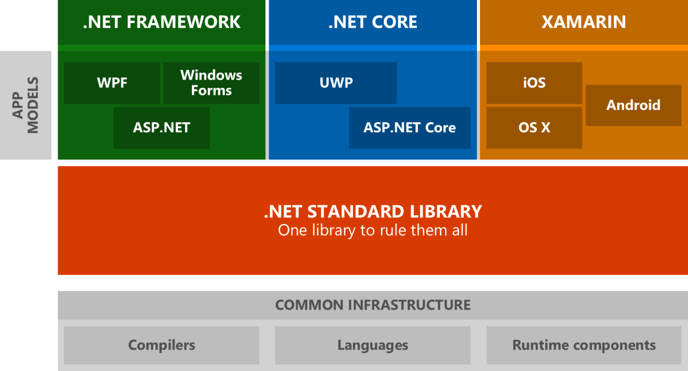
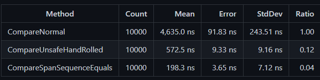

The campaign platform component of Microsoft’s [search advertising
platform](https://about.ads.microsoft.com/get-started/online-advertising-solutions)
is central to delivering a great experience to our advertising platform
users. It supports millions of advertisers, providing the engine under
the hood allowing them to create ad campaigns that reach customers with
maximum impact.

In a given second this platform will process thousands of web requests,
with a typical latency of under 100 milliseconds for a given request.


Behind the scenes, dozens of distributed services work in concert to
support all of the rich functionality provided by the platform.

Today, all of this is built on top of [NET
6](https://devblogs.microsoft.com/dotnet/announcing-net-6/), running on
Linux containers in [Azure Kubernetes
Service](https://learn.microsoft.com/azure/aks/) (AKS) clusters.

Getting here, however, was quite the journey!

In the rest of this blog post we will look at the multi-year journey we
undertook to move this codebase to .NET 6, along with the challenges
we faced and how we ultimately solved them.

Note: the re-branding from ".NET Core" to simply ".NET" sometimes leads to some confusion over whether we are discussing .NET Framework or what was previously known as .NET Core. In this post, ".NET" generally refers to the latter and if we are referring to .NET Framework that will be spelled out explicitly.

## Overview of the codebase

We have a fairly large amount of code. To give a bit of context, the git
repo that houses the middle tier code for our campaign platform contains
over 600 C# projects.

Breaking down the code:


So, more than 7 million lines of C# code and more than 8 million lines
total. Counting lines of code does not tell you everything about a
codebase, but it does give a rough idea of the relative size we are
dealing with.

Over those 600+ csproj instances, we reference more than 500 distinct
[NuGet](https://www.nuget.org/) packages. That many dependencies had an
impact on the process of migrating to .NET, as we will see.

## Our starting point

Our services have evolved a lot over the years and the underlying
technology used to host them has changed dramatically. Originally hosted
entirely on-premise with our own physical hardware sitting in racks in
data-centers that we had to maintain, our team followed much of the rest
of the industry by eventually embracing the cloud.

The migration to Azure is a story in itself, but the legacy of the
original hosting environment has an impact on where we were when we
started our .NET migration: traditionally we had run our code on Windows
servers, hosting our web services in [IIS](https://www.iis.net/).

In addition, a significant portion of our web services were built as
[SOAP](https://www.w3.org/TR/2000/NOTE-SOAP-20000508/) services using
[WCF](https://learn.microsoft.com/dotnet/framework/wcf/whats-wcf).
This complicated things, as we shall see.

While we had previously migrated to Azure, we had simply done a “lift
and shift” from running on our own hardware to running on Windows VMs in
the cloud.

All of our code was at the time targeting the original Windows-only .NET
Framework and when we started contemplating migrating to .NET we
were running on .NET Framework version 4.6.

## Why the new .NET?

Why did we choose to expend the engineering effort to migrate away from
.NET Framework and onto the open source .NET? After all, this was
not a small effort – it took more than two years to accomplish the bulk
of the work.

There were multiple reasons that our team specifically called out after
an initial investigation into .NET:

### Cross-Platform

Moving to a cross-platform solution had an obvious benefit: freeing us
from being inextricably tied to the Windows operating system would give
us the potential to explore if we would be better served running on
alternatives such as Linux.

Unlike some other teams at Microsoft, we did not always intend to move
to something like AKS running on Linux containers. We were, however,
very interested in exploring that as a possibility.

### Future of .NET Development

It was clear when we started our migration journey that .NET was
the future. All of the really exciting innovations in the runtime to
support high performance computing were happening there, not on .NET
Framework, and high performance is one of our main requirements.

We also considered it very important that we give the developers on our
team the best possible tools for the job. At the time, some features of
C# 8 were already only available on .NET and that situation would
become more common for future versions of the language.

It was also known that .NET Framework 4.8 was planned to be the last
version. Sticking with it was a technological dead-end.

### Less friction for innovation

.NET being developed as an independent open source project means
that it can iterate at a much faster cadence than the traditional .NET
Framework, improvements to which are burdened by the costs associated
with being part of Windows. That means we get improvements and new
features much more quickly.

### Open source

Microsoft’s embrace of open source has been inspiring and having your
underlying tech stack being developed out in the open has many benefits.
GitHub issues provide a simple and convenient mechanism to report
problems, request features or get feedback from the development team.

The ability to contribute back fixes and improvements is also highly
appealing.

### Much better tooling

The .NET team clearly took a hard look at some of the major pain points
for .NET developers. Not only did they throw out a variety of “seemed
like a good idea at the time” features that ultimately caused more
trouble than they solved (multiple app domains and .NET remoting come to
mind), they dramatically improved the tooling used for a developers
‘inner loop’.

The [dotnet CLI](https://learn.microsoft.com/dotnet/core/tools/)
tooling that allows you to easily accomplish many tasks without even
needing an IDE has improved productivity a lot, especially for
developers who enjoy working from the terminal.

The much-simplified project format where sensible defaults are used
everywhere and source code files are implicitly included was a huge
quality-of-life improvement. Refactoring source code files among
projects went from a huge chore to being nearly painless.

Additionally, .NET mercifully brought a solution to the nightmare
of [diamond
dependency](https://learn.microsoft.com/dotnet/standard/library-guidance/dependencies)
issues between projects. These often caused the need to add [binding
redirects](https://learn.microsoft.com/dotnet/framework/configure-apps/file-schema/runtime/bindingredirect-element)
that were hard to get right across all of our many projects and were
often only discovered at runtime. .NET solved the problem by simply
getting rid of binding redirects entirely.

## Our conversion process

Our eventual migration process can be summarized as:

For class libraries, we followed the following overall path:

.NET Framework 4.6 -\> .NET Framework 4.7 -\> .NET Standard 2.0

For our actual services and applications, the process looked like this:

.NET Framework 4.6 -\> .NET Framework 4.7 -\> .NET Core 3.1 -\> .NET 5
-\> .NET 6

### .NET Standard

There was absolutely no way we were going to be able to convert all of
our code to .NET in one shot. Our codebase churns constantly so the
idea of forking the repo and doing all of the conversion work there was
considered and quickly discarded.

We needed to be able to do the work iteratively, over time, and that’s
where [.NET
Standard](https://devblogs.microsoft.com/dotnet/introducing-net-standard/)
came in.



As the diagram shows, a library targeting the subset of APIs supported
by .NET Standard can be consumed by both .NET Framework projects and
.NET projects. The vast majority of our code consists of class
libraries – the hundreds of DLLs (assemblies) produced by most of our C#
projects. If those could easily be converted to .NET Standard we could
continue to consume them from our existing .NET Framework services, then
iteratively convert those to .NET for testing and eventual
deployment.

(Narrator: they were not easily converted to .NET Standard.)

Converting all of our projects first from .NET Framework 4.6 to 4.7 was
actually forced on us by the fact that .NET Framework 4.6 did not fully
support .NET Standard. We ended up trying for weeks to get .NET Standard
libraries to successfully be consumed by our existing 4.6 projects, but
ran into issue after issue. The truth is that .NET Standard, while
advertised to work with 4.6, really did not work correctly until 4.7.

Ultimately we were able to convert the majority of our code to .NET
Standard 2.0 but there were…challenges.

## Challenges

We hit many, many issues attempting to convert hundreds of projects to
.NET Standard. Remember those 500 NuGet package references? What happens
when you convert a project to .NET Standard that depends on a NuGet
package that in turn targets .NET 4.6? That won’t build – a .NET
Standard library can only depend on other .NET Standard libraries. So
you have to find a new version of the NuGet package that supports .NET
Standard 2.0.

Many times, those packages were much newer than the old ones our code
had been relying on for years.

They would have breaking changes. To use one example, we relied heavily
on an old Dependency Injection framework called
[Unity](https://github.com/unitycontainer/unity) (not to be confused
with the Unity game engine.) The available version that supported .NET
Standard had had its API completely rewritten and we had to update tens
of thousands of lines of code to be compatible with the changes.

Often, no such package even existed.

### Binding redirect hell

One particularly insidious problem that we encountered constantly and
which lead to countless hours of work attempting to wrestle into
submission was the problem of binding redirects. For a variety of
reasons, things like the AutoGenerateBindingRedirects property did not
always solve this problem in our codebase and we had to continually add
new binding redirects to the configuration files for our services.

Ultimately, we had to find ways to help solve the constant diamond
dependency conflicts so we could make progress.

### WCF

Another problem that was particularly painful for the campaign platform
conversion was our heavy reliance on WCF. We have over 45 services built
on top of WCF, constituting a significant portion of the code that would
benefit from the higher performance of using .NET.

For better or worse, in the .NET community SOAP-based services and,
somewhat by extension, WCF, had become persona non grata. The prevailing
sentiment is that REST-based services were the future and at first the
path forward for WCF in .NET was not clear – Microsoft was
considering leaving it as a deprecated, .NET Framework-only technology.

This was not going to work for our team, as we had countless existing
customers who had built heavily on top of these WCF services and used
our SDKs to call them directly. Telling our paying customers they were
going to have to rewrite all of their client code using something new
like [gRPC](https://grpc.io/) was not an acceptable answer.

## Solutions

Spoiler alert: we were, in the end, able to solve all of these problems
and successfully migrate to .NET 6. It was not always easy, however.

### Incompatible NuGet dependencies

Handling the problem of missing or incompatible NuGet packages took
time, but ultimately we were able to solve all such issues.

In a number of cases we had to get creative and essentially “repackage”
an existing NuGet package that was no longer supported, changing it to
claim it supported .NET Standard even when the actual assembly was some
old .NET 4.6 binary. We would publish these modified packages to our own
internal package feed to unblock our migration.

In a few cases we ended up decompiling old, no-longer-maintained
packages for which no source code existed, and updated them to be .NET
Standard compatible (for instance, removing use of features that only
exist on Windows.) We would patch up the decompiled code and then,
again, make a new version of the package.

### Binding redirect issues

Moving from the
[packages.config](https://github.com/NuGet/docs.microsoft.com-nuget/blob/main/docs/reference/packages-config.md)
mechanism used in .NET Framework to the new
[PackageReference](https://learn.microsoft.com/nuget/consume-packages/package-references-in-project-files)
mechanism used in the newer SDK tooling favored by .NET was a major
factor in finally getting the diamond dependency / binding redirect
problem under control.

We decided to convert *everything* in our tree to the new SDK style
format that supported PackageReference. When you have 600+ C# projects,
this is a non-trivial undertaking.

Luckily, there are tools to help with this. I have a [personal blog
post](https://treit.github.io/c%23,/programming/2019/02/18/ConvertingCsProjectsToNewSdkFormat.html)
showing how we did it.

Subsequently, the .NET team released the
[try-convert](https://github.com/dotnet/try-convert) tool to accomplish
much the same thing.

Once the large effort of converting all projects to the new SDK format
was accomplished, another technique that helped untangle the gnarled web
of package dependencies was to move to [centralized package
versioning](https://github.com/Microsoft/MSBuildSdks/tree/master/src/CentralPackageVersions).

This forced all projects to use the same version of any referenced NuGet
packages, with the version being specified in a single central location
instead of at the granularity of each individual project. This greatly
simplified moving to newer versions of NuGet packages that would allow
moving to .NET. The centralized package version can be overridden
if necessary, so there is no significant downside to setting this up.

### WCF

Ultimately, Microsoft decided to produce a limited subset of WCF that
targeted .NET. This subset, which primarily focuses on SOAP-based
web services, was then donated to the community as the open source
[CoreWCF](https://devblogs.microsoft.com/dotnet/corewcf-v1-released/)
project.

CoreWCF uses entirely new namespaces for the many existing types that
came from the System.ServiceModel namespace of traditional WCF, so
converting an existing service is not exactly trivial. Also, we had
common code used so extensively in our codebase that we needed to
support running that code in both CoreWCF services and .NET Framework
services while we were in the process of converting.

We ultimately used
[multi-targeting](https://learn.microsoft.com/dotnet/standard/library-guidance/cross-platform-targeting)
to accomplish this.

(Incidentally, a tricky problem resulting from multi-targeting caused by
a top-level exception handler led to perhaps the only time I have
resorted to using the dynamic keyword in C# without feeling guilty about
it.)

We worked extensively with the extremely helpful [Matt
Connew](https://github.com/mconnew) (a primary contributor to CoreWCF)
to get our services ported, and while it was not an entirely smooth
transition, ultimately CoreWCF worked great as an alternative to
rewriting our services to use something other than SOAP.

If you need to host a SOAP service and you want the high performance
that comes with running on .NET 6, CoreWCF is a great answer.

## Results

Was all of the effort put into migrating to .NET 6 ultimately worth it?
Absolutely!

The benefits we had outlined at the start of our journey all proved to
be true and then some.

This graph shows the improvement in latency for one of our services that
resulted simply from changing it to target .NET and recompiling.


You can tell where in the time axis we flipped to the new service
running as .NET.

That was without even attempting to optimize anything using the great
new features available in .NET. That was just recompiling and getting
the advantage of the many runtime improvements made by the .NET team.

Here is another example where we looked at the memory usage both before
and after moving to Core WCF for another service:


We achieved a 40 to 50 percent reduction in memory usage simply by
making the change to .NET.

### Modern cloud service infrastructure

In addition to these clear performance wins, getting onto .NET
opened up the opportunity for us to migrate off of IIS and Windows and
onto
[Kestrel](https://learn.microsoft.com/aspnet/core/fundamentals/servers/kestrel?view=aspnetcore-6.0)
servers running inside of containers on Linux, hosted in AKS.

All of the modern tooling and resources available to manage and
configure cloud services (such as Kubernetes) are now available to us.
Our engineers get to use well supported, industry standard tooling
instead of the proprietary, internal systems that had developed over
time inside Microsoft to manage our custom, non-standard hosting and
deployment infrastructure.

This ability to now use industry best practices technology to continue
to evolve our platform is a huge win for everyone.

## Performance anecdote – hackathon

While not directly related to the Campaign Platform service migration,
two devs from the Campaign Platform team (myself and a colleague)
participated in Microsoft’s annual hackathon and got a chance to
showcase how with good design and using high-performance techniques, you
can achieve impressive performance metrics.


The project involved optimizing the calculation of how similar two
64-byte buffers were to each other, based on how many two-bit pairs were
identical. (This has applications in anti-malware research.)

As you can see, the distributed cloud service we built on top of .NET 6
can check almost a billion 64-byte buffers totaling close to 60 GiB of
data in 40 to 60 milliseconds.

Not too shabby!

## Summary

Migrating to .NET 6 was a large and at times painful engineering effort.
It was worth it in the end and going forward our team is looking forward
to the continued improvements to .NET as it evolves.

For others planning to migrate a large existing .NET Framework codebase
to .NET 6 and beyond, lessons learned from our experience can be
applied:

1.  Get all existing code onto .NET 4.7 or 4.8 first

2.  Migrate all projects to the new SDK format so they are using
    PackageReference before doing anything else.

3.  Use .NET Standard as a bridge to allow sharing library code between
    both .NET Framework and .NET projects while migration is in
    progress.

4.  Use centralized package references to greatly ease the transition to
    newer NuGet packages.

Moving forward post-migration, we are looking forward to really drilling
into some of the new features in .NET that will allow us to take our
code to the next level.

Here is just one instance of such a feature: finding places we can use
[Span\<T\>](https://learn.microsoft.com/dotnet/standard/memory-and-spans/memory-t-usage-guidelines)
to reduce heap allocations and improve performance. For example, our
code has places where we check if two byte buffers are identical.
Instead of looping over each byte and testing for equality we can make
use of the highly optimized
[SequenceEqual](https://learn.microsoft.com/dotnet/api/system.memoryextensions.sequenceequal?view=net-7.0)
method:

```C#
return bufferA.AsSpan().SequenceEqual(bufferB);
```

As [this
benchmark](https://github.com/Treit/MiscBenchmarks/tree/main/ComparingByteArrays)
shows, this is close to 25 times faster than the naïve approach!



Rewriting some of our code to specifically take advantage of new
language and runtime features like this is going to continue to be a fun
and highly rewarding exercise as we move forward.
