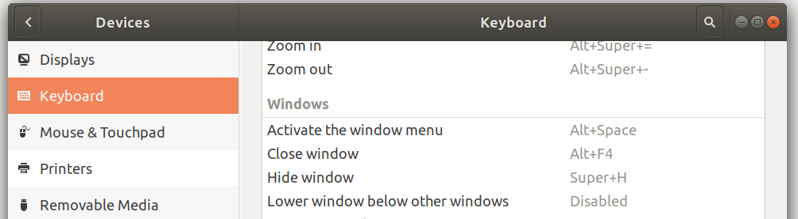
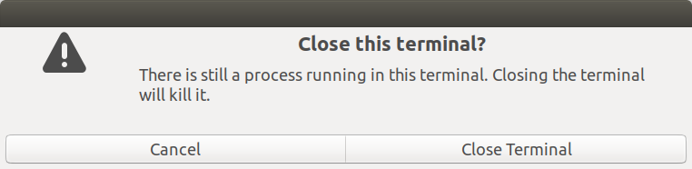
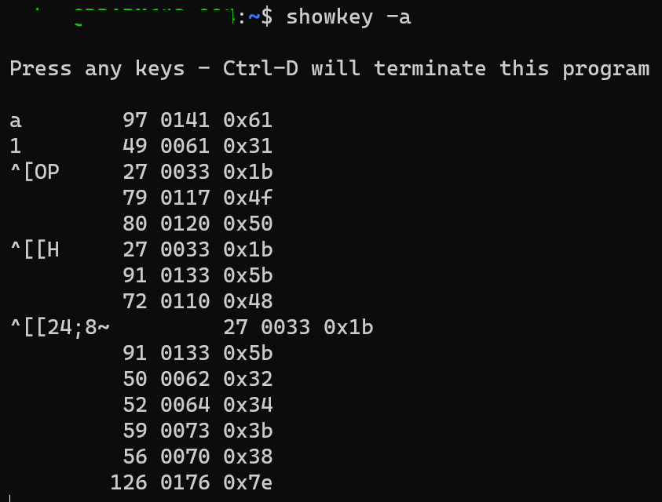
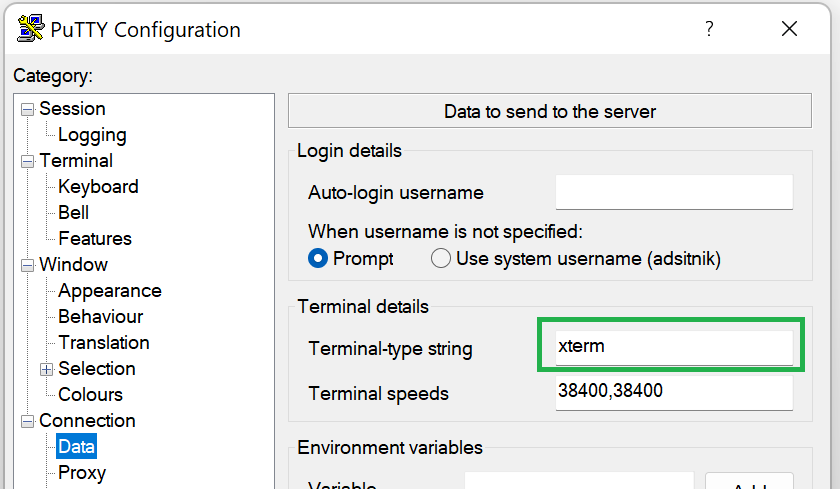
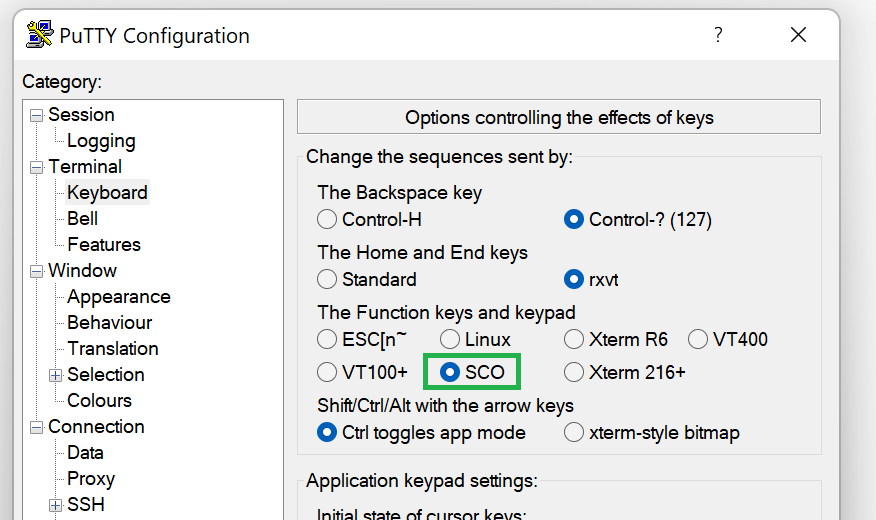

.NET continues to improve its Unix/Linux support in .NET 7. One of the aspects that was improved in RC1 was `Console.ReadKey`, which has been [rewritten](https://github.com/dotnet/runtime/pull/72193) from scratch. Key combinations are more accurately handled across many Linux distros and terminals, and modifier keys are especially improved.

## TL;DR

Developers expect APIs as fundamental as `Console.ReadKey` to be dependable. This building block for interactive console applications had accumulated many bug reports over the years though, all related to running on Unix/Linux platforms. The bugs varied in severity and complexity, but there was a common thread: key combinations and modifier keys were especially unpredictable.

With .NET 7, all known bugs related to recognizing keys pressed inside `Console.ReadKey` on Unix/Linux were addressed. This article covers the engineering effort that accomplished this and also has a [Summary](#Summary) of what was changed.

## Ensuring the new version is successful

Changing such crucial methods as `Console.ReadKey` is always risky and we speak out of our own experience, as we have reverted similar [fixes](https://github.com/dotnet/runtime/pull/42477) in the past. In order to lower a chance for introducing new bugs, the rewrite was started with increasing automated test coverage.

The first step through this goal was refactoring the code and making it testable. To tell the long story short, base class libraries like `System.Console` can't easily use mocking, as this would require creating a new abstraction, exposing new APIs just for the sake of testability and last but not least a performance hit (most of the abstractions comes at a price of at least one more virtual method invocation). Instead of that, a new internal `KeyParser` type was created and the unit test project just includes it (`<Compile Include="..\src\System\IO\KeyParser.cs" Link="src\System\IO\KeyParser.cs" />`).

Pseudocode:

```cs
internal static class KeyParser
{
    internal static ConsoleKeyInfo Parse(char[] input, TerminalData terminalData, out int consumedChars)
}
```

The next step was writing a command line application for recording test data and generating unit tests. The job of the app was simple:

* Apply exactly same terminal settings as the ones used by .NET.
* Record local user settings like `$TERM` (an environment variable used to recognize the terminal), encoding and `terminfo` (a binary file describing current terminal settings like key mappings).
* Ask the user to press various key combinations, record the output provided by the terminal and use it as an input in the generated unit test.

Some pseudocode:

```cs
List<(ConsoleKeyInfo keyInfo, byte[] input, string comment)> recorded = new ();
byte* inputBuffer = stackalloc byte[1024];

foreach ((string text, ConsoleKeyInfo keyInfo) in testCases)
{
    WriteLine($"\nPlease press {text}");
    int bytesRead = read(STDIN_FILENO, inputBuffer, 1024);

    recorded.Add((keyInfo, new ReadOnlySpan<byte>(inputBuffer, bytesRead).ToArray(), text));
}


[DllImport("libc")]
static extern int read(int fd, byte* buffer, int byteCount);
```

Sample test:

```cs
[Theory]
[MemberData(nameof(RecordedScenarios))]
public void KeysAreProperlyMapped(TerminalData terminalData, byte[] recordedBytes, ConsoleKeyInfo expected)
{
    char[] encoded = terminalData.ConsoleEncoding.GetString(recordedBytes).ToCharArray();

    ConsoleKeyInfo actual = KeyParser.Parse(encoded, terminalData.TerminalDb, out int charsConsumed);

    Assert.Equal(expected.Key, actual.Key);
    Assert.Equal(expected.Modifiers, actual.Modifiers);
    Assert.Equal(expected.KeyChar, actual.KeyChar);
    Assert.Equal(encoded.Length, charsConsumed);
}
```

The next step was running this app and recording test data for all terminals for which our customers have reported `Console.ReadKey` bugs in the past:

* xterm (`TERM=xterm`)
* GNOME Terminal (`TERM=xterm-256color`)
* Linux Console (`TERM=linux`)
* PuTTy (`TERM=xterm,putty,linux`) 
* Windows Terminal connected via SSH to Linux VM (`TERM=xterm-256color`)
* rxvt-unicode (`TERM=rxvt-unicode-256color`)
* tmux (`TERM=screen`)
* And multiple PuTTy config switches that override Terminfo settings.

At this moment of time, the [generated test file](https://github.com/dotnet/runtime/blob/release/7.0-rc1/src/libraries/System.Console/tests/KeyParserTests.cs) was almost 2k lines long and at the same time almost one thousand of tests were failing. The failures included known bugs, but also things that were previously not reported by the users (mostly unusual key combinations like `Ctrl+Shift+Alt+$key`).

**Question to the readers:** have we missed any popular Unix terminals? Please let us know in the comments!

## Understanding the internals

### Forwarding events

When a keyboard key is pressed, it's translated into an event. The event can be handled by the OS, which also forwards it to the terminal (or other GUI app). If a given key combination is not used by the terminal as one of its own key shortcuts, it's forwarded to the app itself. 

Some key combinations like `Alt+F4` are by default taken by the Operating System.



They are being handled by the Operating System and most of the terminals don't try to intercept them. It's not true for all of them, as for example GNOME Terminal gives the user the possibility to cancel window closing:



Another good example is F11, which toggles the Fullscreen mode in most Unix terminals.

You need to know that **some key combinations are reserved by the OS or terminal and `Console.ReadKey` won't be able to return when these keys are pressed**. These key combinations can be distro- and terminal-specific and you need to take this into account when choosing key mappings for your command line application, so it works well in every environment.

### sys-calls

`Console.ReadKey` uses the following sys-calls:

- [tcgetattr](https://linux.die.net/man/3/tcgetattr) is a sys-call that allows for getting current terminal settings. .NET uses it to read the current settings when `System.Console` is used for the first time. Some of them: 
    - `ECHO` describes whether terminal should echo the input characters. .NET exposes [Console.ReadKey(bool intercept)](https://learn.microsoft.com/dotnet/api/system.console.readkey?#system-console-readkey(system-boolean)) which allows for controlling whether the input should be echoed or not (this overload is frequently used for reading secrets from the terminal).
    - `VMIN` describes how many bytes need to be available before [read](https://linux.die.net/man/3/read) sys-call returns. `VMIN=1` means "don't return unless at least one byte is available for reading" (a blocking call).
    - `VTIME` describes the timeout for reads.
- [tcsetattr](https://linux.die.net/man/3/tcsetattr) allows for changing the terminal settings. It's used by .NET to apply its own setting at startup, and restore the previous settings at rundown.
- [read](https://linux.die.net/man/3/read) fills given buffer with data representing user input. It's used to read user input.

These sys-calls are also used by [showkey](https://man7.org/linux/man-pages/man1/showkey.1.html), which is a well-know Linux command line utility for printing keycodes, scancodes, or ASCII codes of keys pressed on the keyboard. Its [implementation](https://kernel.googlesource.com/pub/scm/linux/kernel/git/legion/kbd/+/1.10/src/showkey.c) is very simple: it uses `tcsetattr` to set its own settings with echoing enabled and `read` for reading 1 byte at a time. Every byte from the user input is printed in decimal, octal and hexadecimal form to standard output.

Let's run `showkey -a` and press `a`, `1`, `F1`, `Home` and `Ctrl+Alt+Shift+F12` to see how they are mapped by the terminal:



The output printed for simple keys like `a` or `1` is just their ASCII representation. But **more complex keys are mapped to [terminal input sequences](https://en.wikipedia.org/wiki/ANSI_escape_code#Terminal_input_sequences)**. Moreover, **most terminals implement their own mappings for various keys**. And `Console.ReadKey` needs to handle all of them (at least the most popular ones).

## Old implementation

The old `Console.ReadKey` implementation was identifying every terminal by reading the [TERM](https://linux.die.net/man/7/term) environment variable and parsing its [terminfo](https://en.wikipedia.org/wiki/Terminfo) database file to fetch known input sequence mappings. Example: `ESC[H` represents Home key.

This is perfectly valid solution, the problem is that it's not complete as `terminfo` does not define mappings for all keys pressed with key modifiers (`Alt/Ctrl/Shift`). That is why some users were hitting issues like [#45597](https://github.com/dotnet/runtime/issues/45597) where `End` was mapped correctly but `Shift+End` was not.

Another problem with relying only on `terminfo` files is caused by terminals that allow to set `TERM` environment variable to a terminal that does not represent the key mappings that they are using. A good example of such terminal is PuTTY, which makes it possible to set `TERM` to certain terminal like `xterm` (the default value is not `putty`):



and at the same time use key mappings defined by different terminal like `SCO`:



Example: for this config pressing `PageUp` is mapped to `ESC[I` (SCO), rather than `ESC[5~`(xterm).

Moreover, to get `NumLock` to work as expected with PuTTY, users need to [disable application keypad mode](https://github.com/dotnet/runtime/issues/25735#issuecomment-1189087119).

## New implementation

The new implementation extended the previous one with a fallback to well known input sequences mappings.

Example: when `xterm` user presses `Ctrl+Shift+Alt+F12` and `read` populates the buffer with `ESC[24;8~`, `Console.ReadKey` tries to find this mapping in terminfo. It's not found, so it searches for known patterns. It recognizes that it can be an `xterm` sequence (it ends with `~`), maps the key ([24](https://github.com/dotnet/runtime/blob/39b331b2a7e18e0e5486216d33fcdba95af29d49/src/libraries/System.Console/src/System/IO/KeyParser.cs#L268)) to F12 key and the modifier ([8](https://github.com/dotnet/runtime/blob/39b331b2a7e18e0e5486216d33fcdba95af29d49/src/libraries/System.Console/src/System/IO/KeyParser.cs#L291)) to `Ctrl+Shift+Alt`.

If it fails to recognize the pattern, it returns full raw ASCII representation. Example: the user pastes `ESC[99;9~` to the terminal. The first call to `Console.ReadKey` returns `Escape`, second `[`, third and fourth `9`, sixth `;`, seventh `9` and eighth `~`.

### Limitations

The new implementation still has some limitations and they are all derived from Unix terminals:

- For Ctrl+(D1, D3, D8, D9 and D0) it's impossible to detect the modifier (`Control`) because every Unix terminal maps it to just plain number. Example: `Ctrl+1` maps to single ASCII character representing digit one, so does pressing `1` and `NumPad1`.
- We can't distinguish `Ctrl+D2` vs `Ctrl+Space` as they both produce null ASCII character. Currently `Ctrl+Space` is mapped to `Ctrl+D2`.
- `Ctrl+H` can't be mapped to `key=H` and `modifiers=Control` as every terminal maps it to `Ctrl+Backspace`. Same goes for `Ctrl+I` (`Tab`), `Ctrl+J` (`Ctrl+Enter` with new line character), `Ctrl+M` (`Enter`) with carriage return character.
- `Shift+letter` and `CapsLock+letter` is always mapped to just uppercase letter, so it's impossible to detect whether shift was pressed or not. The new implementation is backward compatible with the old one and recognizes both scenarios as `Shift+letter` (so `CapsLock+letter=Shift+letter`).
- We can't make assumptions about keyboard layout or easily read it on every Unix. Therefore all `Shift+D$x` combinations result in a single ASCII character read by the `read` sys-call. `Shift+D$x` keys can't be mapped to key and modifier, but instead just to the resulting character. Example: `Shift+D1` (`!` on most, but not all keyboards) is mapped to `KeyChar=!` with no key and no modifier.
- We can't distinguish `ConsoleKey.OemX` and `ConsoleKey.Divide` (Numeric Keypad on Windows), as they are both mapped to `/` ASCII character. They are both mapped to `ConsoleKey.Divide`. Same goes for `ConsoleKey.OemPlus` and `ConsoleKey.Add` (they are both mapped to `ConsoleKey.Add` and `KeyChar=+`) and `ConsoleKey.OemMinus` and `ConsoleKey.Subtract` (they are both mapped to `ConsoleKey.Subtract` and `KeyChar=-`).
- On Unix `ConsoleKey.Num5` is mapped to `Begin` but `ConsoleKey` does not define such value, so it's mapped to `ConsoleKey.NoName`.

## .NET 6 compatibility mode

The rewrite did not include any breaking changes, but you can request .NET 6 compatibility mode in `runtimeconfig.json`:

```json
{
    "configProperties": {
        "System.Console.UseNet6CompatReadKey": true
    }
}
```

Or using the following environment variable:

```cmd
set DOTNET_SYSTEM_CONSOLE_USENET6COMPATREADKEY=1
```

This compatibility mode is going to be removed in .NET 8. **Please let us know if you discover any bugs related to the new implementation, so they can be fixed before it happens.**

## Summary

When you upgrade to .NET 7, you should see substantial accuracy improvements in `System.Console.ReadKey` on Unix:

* `System.Console.ReadKey` is capable of recognizing all keys and modifiers except of the ones listed in the [Limitations](#Limitations) section.
* The new implementation was tested with xterm, GNOME Terminal, Linux Console, PuTTy, Windows Terminal, rxvt-unicode and tmux.
* No breaking changes were introduced.
* Users can request .NET 6 compatibility mode using a configuration file or an environment variable.