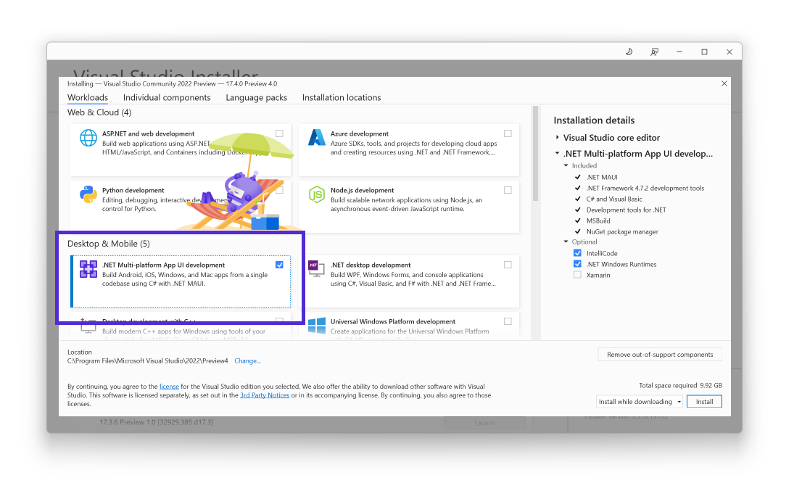

.NET Multi-platform App UI (MAUI) with [.NET 7 Release Candidate 2](https://devblogs.microsoft.com/dotnet/announcing-dotnet-7-rc-2/) is now available in Visual Studio 17.4 Preview 4 on both Windows and Mac. The primary themes of RC2 are quality and .NET support for Xcode 14 with iOS 16. This release is covered by a go-live support license for use in production.

In related news, new libraries have also shipped for MSAL.NET and App Center (Preview). These are both key libraries that .NET MAUI developers have been asking for. MSAL.NET is essential when using Azure Active Directory and the Microsoft identity platform for authentication. App Center provides services for app diagnostics and analytics.

* [Authentication for .NET MAUI Apps with MSAL.NET](https://devblogs.microsoft.com/dotnet/authentication-in-dotnet-maui-apps-msal/)
* [App Center (Preview)](https://www.nuget.org/packages/Microsoft.AppCenter/5.0.0-preview.1)

## Getting Started

Install or upgrade to the latest preview of Visual Studio 2022:

* Visual Studio 2022 for Mac – 17.4 Preview 4 [Download](https://visualstudio.microsoft.com/vs/mac/preview/)
* Visual Studio 2022 for Windows – 17.4 Preview 4 [Download](https://visualstudio.microsoft.com/vs/preview/)

If targeting iOS, you can now [build directly to your iOS device](https://learn.microsoft.com/dotnet/maui/deployment/hot-restart) on Windows, or if you use a Mac (or [Mac build host](https://learn.microsoft.com/dotnet/maui/ios/pair-to-mac)) by installing Xcode 14.0.x from the Apple Developer website. Note Apple’s minimum requirement for Xcode 14 is macOS Monterey 12.5 which is higher than Xcode 13.4 required.

## .NET MAUI Learning Resources

Whether you're just now jumping into developing native client apps with .NET MAUI, or you've been at it for a while, there are a lot of resources available to help you. Don't see what you're looking for below? Please [open an issue](https://github.com/dotnet/docs-maui/) on GitHub and we'll see what we can do to help.

| | |
|:--|:--|
| **How do I** * [.NET Multi-platform App UI documentation](https://learn.microsoft.com/dotnet/maui/) * [.NET MAUI Samples](https://learn.microsoft.com/samples/browse/?expanded=dotnet&products=dotnet-maui) * [Enterprise application patterns using .NET MAUI](https://learn.microsoft.com/dotnet/architecture/maui/)  **Beginner Training** * [Learn Path - Build mobile and desktop apps with .NET MAUI](https://learn.microsoft.com/training/paths/build-apps-with-dotnet-maui) * [.NET MAUI for beginners video series](https://www.youtube.com/playlist?list=PLdo4fOcmZ0oUBAdL2NwBpDs32zwGqb9DY)  **Release Notes** * [.NET for Android](https://github.com/xamarin/xamarin-android/releases) * [.NET for iOS](https://github.com/xamarin/xamarin-macios/releases) * [.NET MAUI](https://github.com/dotnet/maui/releases) | **Community Collections** * [Javier's Awesome .NET MAUI list](https://github.com/jsuarezruiz/awesome-dotnet-maui) * [Vladislav's list](https://github.com/VladislavAntonyuk/MauiSamples) * [Egvijay's list](https://github.com/egvijayanand/dotnet-maui-samples) * [Matt's list](https://goforgoldman.com/2022/05/19/maui-ui-july.html) * [Gerald Versluis' YouTube](https://www.youtube.com/c/GeraldVersluis) * [James Montemagno's YouTube](https://www.youtube.com/c/JamesMontemagno) * [Javier Suarez's YouTube](https://www.youtube.com/c/JavierSu%C3%A1rezRuiz)  **Keeping Up-to-date** * [.NET MAUI podcast](https://www.dotnetmauipodcast.com/) * [.NET MAUI blogs](https://devblogs.microsoft.com/dotnet/category/maui/) |

## Feedback

Please let us know about your experience using .NET MAUI by [opening issues on GitHub](https://github.com/dotnet/maui/issues), and these latest versions of Visual Studio 2022 via the feedback button ([Mac](https://learn.microsoft.com/visualstudio/mac/report-a-problem?view=vsmac-2022) | [Windows](https://learn.microsoft.com/visualstudio/ide/how-to-report-a-problem-with-visual-studio?view=vs-2022)).