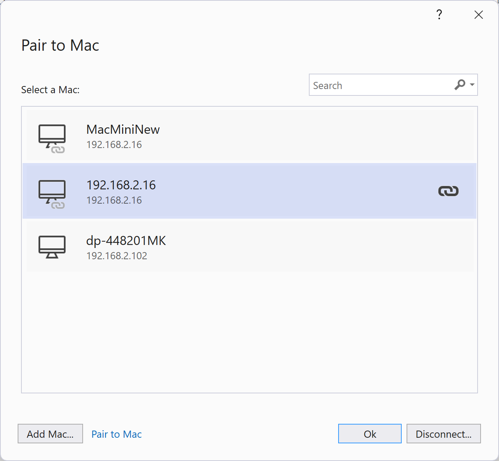

Today we are shipping .NET 6 and Visual Studio 2022 support for Xcode 14, and our sixth service release for .NET MAUI. Xcode 14 introduces iOS 16, the latest mobile operating system from Apple. The other Apple SDKs in this release are unchanged from the last release. Whether you're building apps with UIKit or .NET MAUI, you can can now take advantage of the [latest SDK features](https://developer.apple.com/documentation/ios-ipados-release-notes/ios-16-release-notes). Let's take a closer look at building for iOS with .NET.

> .NET 7 Release Candidate 2 (RC2) with .NET MAUI, iOS, and Xcode 14 support is scheduled to ship in one week. Until then, .NET MAUI 7 RC1 is the latest version.

## Getting Started

Install or upgrade to the latest Visual Studio 2022 in order to acquire the .NET 6 workloads for iOS. The specific versions are:

* Visual Studio 2022 for Mac - 17.4 Preview 3 [Download](https://visualstudio.microsoft.com/vs/mac/preview/)
* Visual Studio 2022 for Windows - 17.3 or 17.4 Preview 3 [Download](https://visualstudio.microsoft.com/vs/)

On your Mac install Xcode 14.0.x from the [Apple Developer website](https://developer.apple.com/xcode/). If you install from the Mac App Store, it may auto-update to versions incompatible with .NET, so we recommend directly controlling your installation. Note [Apple's minimum requirement](https://developer.apple.com/support/xcode/) is macOS Monterey 12.5 which is higher than Xcode 13.4 requires.

## Developing for iOS from Windows

Visual Studio 2022 offers two ways to develop for iOS from Windows, "Pair to Mac" and "Hot Restart". Pair to Mac connects Visual Studio to a Mac on your local network, installs the necessary build tools, and uses that machine to compile and sign the app.

For detailed instructions on configuring Pair to Mac follow [this guide](https://learn.microsoft.com/dotnet/maui/ios/pair-to-mac).

Hot Restart enables you to connect any iOS or iPadOS device to Visual Studio 2022 on Windows and develop directly. This is best suited for day-to-day development of .NET MAUI apps. When you're ready to distribute your application and sign it, you can use a build machine on your network or a service such as App Center. Follow [the hot restart documentation steps](https://learn.microsoft.com/dotnet/maui/deployment/hot-restart) from Windows to get started.

ADD VIDEO HERE

## Developing for iOS from Mac

This option is straight forward: install the Visual Studio 2022 preview for Mac and Xcode 14. If you are managing multiple versions of Xcode for any reason, take a look at [xcodes](https://github.com/RobotsAndPencils/xcodes), a popular app for acquiring and switching between versions.

If you have any feedback we'd love to hear from you! Please send us details by using the [Send Feedback](https://learn.microsoft.com/visualstudio/ide/how-to-report-a-problem-with-visual-studio?view=vs-2022) button in Visual Studio.

**Resources:**

* [iOS Release Notes](https://github.com/xamarin/xamarin-macios/releases/tag/dotnet-6.0.4xx-xcode14-517)
* [.NET MAUI Release Notes](https://github.com/dotnet/maui/releases/tag/6.0.541)
* [Pair to Mac](https://learn.microsoft.com/dotnet/maui/ios/pair-to-mac)
* [iOS Hot Restart](https://learn.microsoft.com/dotnet/maui/deployment/hot-restart)
