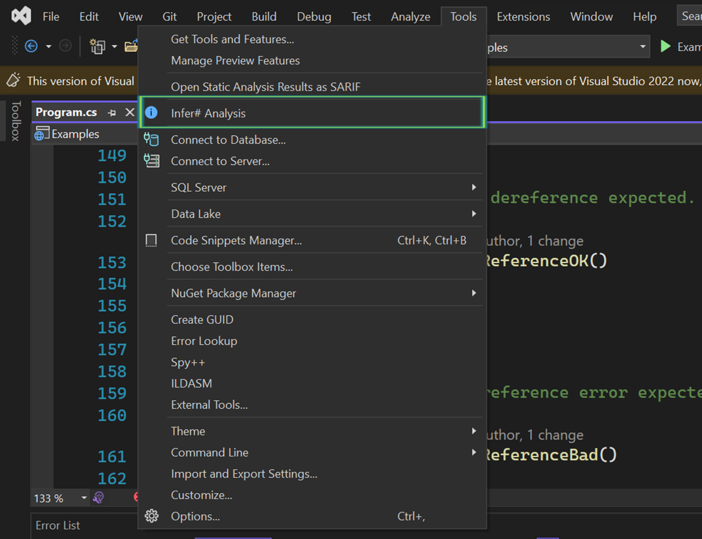
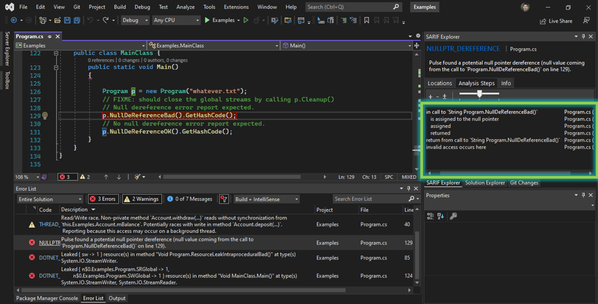
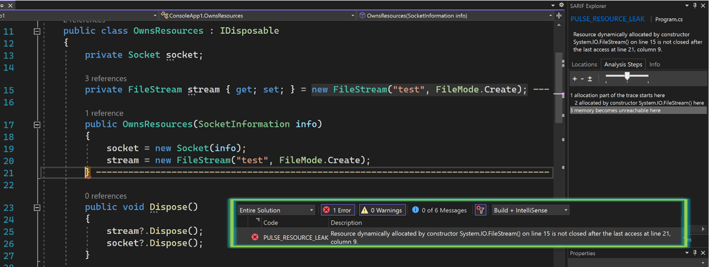
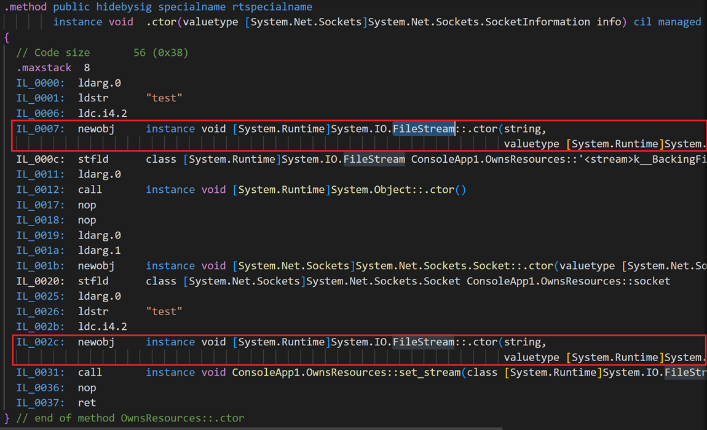
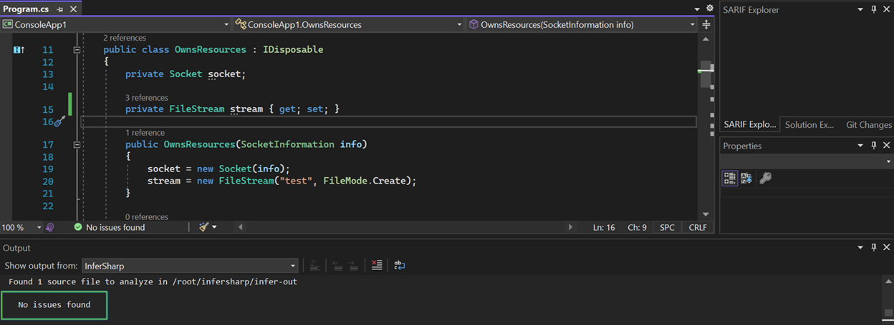
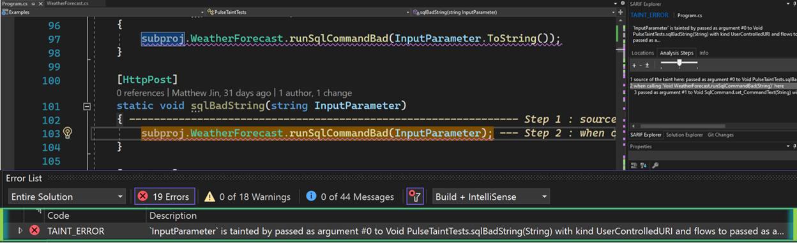
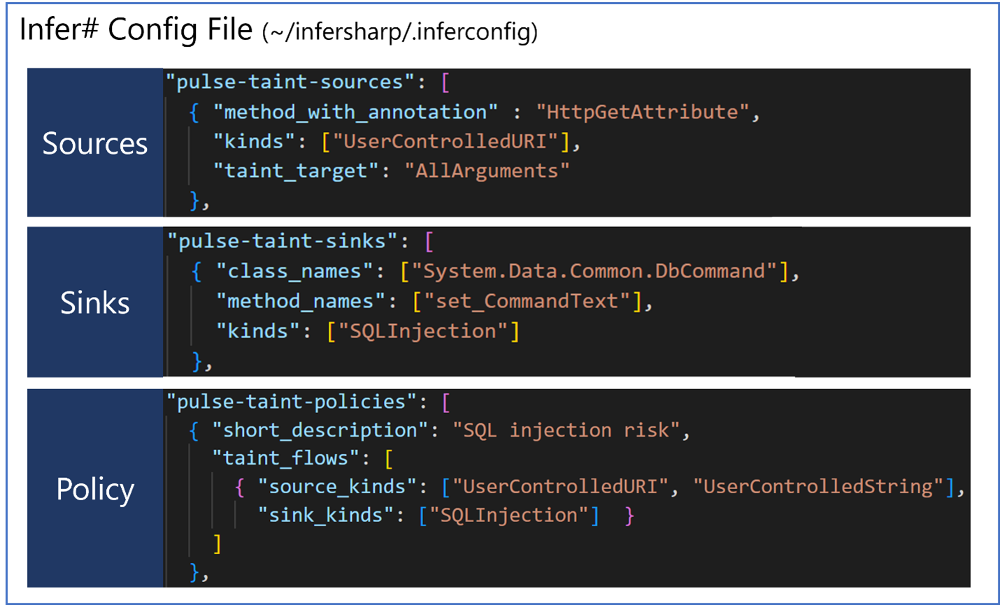
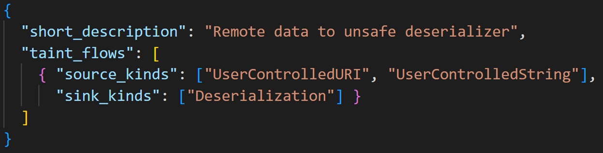

You slide into your office chair, cup of coffee in hand, and check your email. Another high severity ticket – your servers have crashed, and you have by tomorrow morning to figure out why. Heaving a heavy sigh, you soon find yourself sifting through tens of thousands of lines of code and logs. Morning soon passes to afternoon, fading into dusk. Finally, you find it, push the fix, and reboot the application. Minutes pass. *Crash*. Your night of the living dead has begun – no matter how many times you try to put this bug down, it just keeps coming back to life.

We’ve all suffered from “zombie bugs” before. There are many static analysis tools on the marketplace today to help you detect bugs, many of which work by searching for a series of syntactic patterns in code. Unfortunately, due to the huge variation and complexity of coding constructs and conventions in different projects, this approach often leads to the high false positive and false negative rates for which static analysis tools are notorious. 

In today’s post, we’re going to show you how [Infer#](https://github.com/microsoft/infersharp) can help you put down these zombie bugs, once and for all. [Microsoft open-sourced Infer#](https://devblogs.microsoft.com/dotnet/infer-interprocedural-memory-safety-analysis-for-c/) in 2020, which leverages Meta’s [Infer](https://fbinfer.com/). Infer# takes a different approach from other tools you’ve heard of – it derives summaries of each method’s semantics and reasons over the program’s behavior. It uses [incorrectness separation logic](https://dl.acm.org/doi/10.1145/3527325), one of the latest advancements in program analysis research, to mathematically prove the presence of bugs in code. Infer# performs cross-assembly analysis to find issues like null pointer dereferences, resource leaks, and thread safety violations, in addition to security vulnerabilities like SQL injections and DLL injections.

## Getting started with Infer#

With Infer# v1.4 you can identify security and performance issues with a single click, all in VS2022 and VSCode. First, make sure that [Windows Subsystem for Linux (WSL)](https://learn.microsoft.com/windows/wsl/install) is properly installed. Then, download and install the InferSharp extension from the [Visual Studio](https://marketplace.visualstudio.com/items?itemName=matthew-jin.infersharp) or [Visual Studio Code](https://marketplace.visualstudio.com/items?itemName=matthew-jin.infersharp-ext) marketplaces. In this article, we’ll show the VS experience, which is mimicked in VS Code. You can also use Infer# directly in [WSL](https://github.com/microsoft/infersharp/blob/main/RUNNING_INFERSHARP_ON_WINDOWS.md) and [Docker](https://github.com/microsoft/infersharp/blob/main/RUNNING_IN_DOCKER.md).

The extension adds an *Infer# Analysis* menu item to the Tools menu. The first time it’s selected, it will complete setup by downloading and installing the Infer# custom WSL distro from Github. 




## Analyze your code

After waiting for setup to complete, selecting the *Infer# Analysis* menu item again will prompt you to provide a directory tree (defaulting to the solution directory, if it exists) containing the DLLs and PDBs you want to analyze. Your selection is automatically saved for future runs in the *.infersharpconfig* file created in your project directory. The analysis will then run, displaying the warnings in the Error List pane. Additionally, information about the analysis steps is shown in a pane on the right side of the editor, with clickable links to the relevant lines of code.



## Issue or not?

Now that we’ve seen how to use Infer#, let’s look at a couple of examples that demonstrate how Infer# works under the hood. Suppose we created the following IDisposable class `OwnsStreamReader`:

```csharp
public class OwnsStreamReader : IDisposable
{
    public StreamReader reader;

    public OwnsStreamReader(StreamReader input)
    {
        reader = input;
    }

    public void Dispose()
    {
        reader?.Dispose();
    }
```
Does the following method contain a resource leak or not?
```csharp
    public static void LeakOrNot()
    {
        var fileStream = new FileStream("test.txt", FileMode.Create, FileAccess.Write);
        var reader = new StreamReader(fileStream);
        using (var myClass = new OwnsStreamReader(reader))
        {
            myClass.reader.Read();
        }
    }
```
The answer is no. Infer# determines this by producing method summaries that represent the semantics of `OwnsStreamReader`’s constructor and Dispose(). It determines that the Dispose() method takes care of the StreamReader, whose Dispose() in turn takes care of the FileStream object. The using statement ensures that the Dispose() function is invoked.

Let’s look at another example:
```csharp
    public class OwnsResources : IDisposable
    {
        private Socket socket;

        private FileStream stream { get; set; } = new FileStream("test", FileMode.Create);

        public OwnsResources(SocketInformation info)
        {
            socket = new Socket(info);
            stream = new FileStream("test", FileMode.Create);
        }

        public void Dispose()
        {
            stream?.Dispose();
            socket?.Dispose();
        }
```
Is there a resource leak in the following method?
```csharp
        public static void LeakOrNot()
        {
            using (var myClass = new OwnsResources(new SocketInformation()))
            {
                myClass.stream.Flush();
            }
        }
```
The answer is yes. Let’s see what Infer# found:



It reports “*Resource dynamically allocated by constructor System.IO.FileStream(…)is not closed after the last access at…*” The problem lies in the construction of the `OwnsResources` class itself. The stream field gets initialized twice: once in its field initialization and again in the constructor. This is clear if we look at the bytecode, which is what Infer# uses to produce its analysis*:


*You might notice that the first created object is stored into the stream field, whereas the second one is followed by an invocation of stream’s setter method. A naïve approach might not realize that these both have the ultimate effect of storing the object into the field. Infer#’s semantic analysis of stream’s setter method determines this equivalence.

Removing one of the assignments and rerunning Infer# confirms that the issue is fixed:



## Finding critical security issues in your code

Those of you building ASP.NET web apps might be familiar with issues like [SQL injections](https://learn.microsoft.com/sql/relational-databases/security/sql-injection?view=sql-server-ver16) or using unsafe deserializers like [BinaryFormatter](https://learn.microsoft.com/dotnet/standard/serialization/binaryformatter-security-guide), which all involve the flow of information from an untrustworthy source into a sensitive location within the app. We’re excited to announce the initial release of Infer#’s ability to detect security vulnerabilities via *taint analysis*. For example, suppose we have a project with the following method:

```csharp
namespace subproj
{
    public class WeatherForecast
    {
        public static void runSqlCommandBad(string input)
        {
            var command = new SqlCommand()
            {
                CommandText = "SELECT ProductId FROM Products WHERE ProductName = '" + input + "'",
                CommandType = CommandType.Text
            };
            var reader = command.ExecuteReader();
        }
```
On its own, this method doesn’t pose a SQL injection issue, as it is only an issue if it gets invoked with a string `input` that comes from a user-controlled source. An example of this would be the invocation of this method with `input` coming as the parameter of a method with an HttpPost annotation. Infer# can detect this issue despite its trace spanning across multiple assemblies:



Behind the scenes, Infer#’ starts tracking tainted information when it passes through certain methods, known as “pulse-taint-sources,” specified in the *~/infersharp/.inferconfig* file in Infer#’s WSL distro. This JSON specifies parameters to the analysis and is invoked by the extension by default. Infer# alerts when it detects that the tainted information reaches certain methods, known as “pulse-taint-sinks.” Putting it together, just specify the sources and sinks of the taint flow you want to track under “pulse-taint-policies.” Here’s what that looks like for the case above:



You can easily specify more flows of your own, reusing sources and sinks as needed:



## Try it today!

By using a framework whose analysis stretches across all input assemblies, Infer# can detect issues that wouldn’t be easy for a human to spot. We’re excited to continue sharing with you the capabilities of the latest semantic analysis technologies. Become a zombie bug slayer today!
-   Come hear our [.NET Conf 2022](https://www.dotnetconf.net/agenda) talk (same title as this article's) at 7:00 PM PST on November 9
-	Questions, feature requests, issue reporting: [Infer# GitHub](https://github.com/microsoft/infersharp), or email us at ec550f20.microsoft.com@amer.teams.ms
-	Developer tool extensions: [VS2022](https://marketplace.visualstudio.com/items?itemName=matthew-jin.infersharp) and [VSCode](https://marketplace.visualstudio.com/items?itemName=matthew-jin.infersharp-ext)
-	Build time tools: [Github Action](https://github.com/marketplace/actions/infersharp), [Azure Pipelines](https://github.com/microsoft/infersharp/blob/main/.build/azure-pipelines-example-multistage.yml)
-	Configured Environment: [WSL](https://github.com/microsoft/infersharp/blob/main/RUNNING_INFERSHARP_ON_WINDOWS.md) and [Docker](https://github.com/microsoft/infersharp/blob/main/RUNNING_IN_DOCKER.md)

