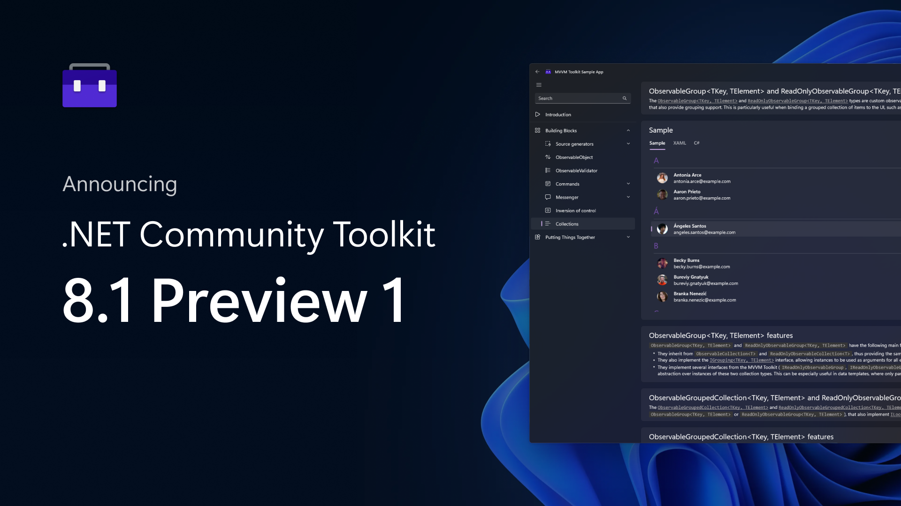

We're happy to announce Preview 1 of the upcoming .NET Community Toolkit 8.1 release! This first official preview includes several highly requested new features, bug fixes, and most importantly it includes **massive** performance improvements to the MVVM Toolkit source generators, to make the developer UX when using them even in very large solutions, better than ever!

[](https://aka.ms/toolkit/dotnet/)

Just like for all our previous releases, we've put a lot of effort into listening to feedback received both by teams here at Microsoft using the Toolkit, as well as other developers in the community, and that feedback has helped shape all the new changes in the .NET Community Toolkit. We’re really thankful to everyone that has contributed and that keeps helping the .NET Community Toolkit get better every day! 🎉

## What's in the .NET Community Toolkit? 👀

Just to give a brief summary of what the .NET Community Toolkit includes, here's the libraries it consists of:

- `CommunityToolkit.Common`
- `CommunityToolkit.Mvvm` (aka “Microsoft MVVM Toolkit”)
- `CommunityToolkit.Diagnostics`
- `CommunityToolkit.HighPerformance`

The libraries are also widely used in several inbox apps that ship with Windows, such as the Microsoft Store and the Photos app! 🚀

> For more details on the history of the .NET Community Toolkit, [here is a link to our previous 8.0.0 announcement post](https://devblogs.microsoft.com/dotnet/announcing-the-dotnet-community-toolkit-800/).

Here is a breakdown of the main changes you can expect in this new release.

## Custom attributes for `[ObservableProperty]` 🤖

One of the [most requested features](https://github.com/CommunityToolkit/dotnet/issues/413) (see [#208](https://github.com/CommunityToolkit/dotnet/issues/208), [#217](https://github.com/CommunityToolkit/dotnet/discussions/217), [#228](https://github.com/CommunityToolkit/dotnet/discussions/228)) for the MVVM Toolkit source generator was to support using custom attributes for `[ObservableProperty]`. There were several proposed designs to support this, and we eventually decided to leverage the existing `property:` syntax in C# to let developers mark attributes to propagate to generated properties. This gives us several advantages:
- It leverages built-in C# syntax, making the feature feel "native" and without needing extra attributes
- It solves the issue of annotating attributes that can only target properties and not fields

That is, with the MVVM Toolkit 8.1, the following scenario is now supported:

```csharp
[ObservableProperty]
[property: JsonPropertyName("responseName")]
[property: JsonRequired]
private string? _name;
```

This will then generate the following property behind the scenes:

```csharp
[JsonPropertyName("responseName")]
[JsonRequired]
public string? Name
{
    get => _name;
    set
    {
        if (!EqualityComparer<string?>.Default.Equals(_name, value))
        {
            OnPropertyChanging("Name");
            OnNameChanging(value);

            _name = value;

            OnPropertyChanged("Name");
            OnNameChanged(value);
        }
    }
}

partial void OnNameChanging(string? value);
partial void OnNameChanged(string? value);
```

You can see how the generated property has the two attributes we specified! This allows complete flexibility in annotations for generated properties, all while using built-in C# syntax and with no constraints on the types of attributes that this features supports 🙌

> Note: the generated code is slightly different and includes additional performance optimizations not shown here.

> You can find all of our docs on the new source generators [here](https://learn.microsoft.com/dotnet/communitytoolkit/mvvm/generators/overview), and if you prefer a video version, [James Montemagno](https://twitter.com/JamesMontemagno) has also done several videos on them, such as [this one](https://www.youtube.com/watch?v=AXpTeiWtbC8&t=600s).

## MVVM Toolkit source generator optimizations 🛫

As we mentioned, this new preview release also includes major performance optimizations to the MVVM Toolkit, to improve the developer UX even more especially when working on very large solutions. We spent a lot of time improving the architecture of all our generators and talking with engineers from the Roslyn team to make sure that we were doing everything possible to squeeze as much performance out of them as we could.

Here's just some of the improvements on this front:
- **Added multi-targeting for Roslyn 4.3** ([#428](https://github.com/CommunityToolkit/dotnet/pull/428), [#462](https://github.com/CommunityToolkit/dotnet/pull/462)): the MVVM Toolkit source generators will now use the Roslyn 4.3 target if supported, so that they can opt-in into some more optimized APIs if the host supports it. This is automatically enabled when referencing the MVVM Toolkit.
- **Used `ForAttributeWithMetadataName<T>`** ([#436](https://github.com/CommunityToolkit/dotnet/pull/436)): we switched the generators to the new [high-level Roslyn API to match attributes](https://github.com/dotnet/roslyn/issues/54725), which greatly improves performance for generators triggering over specific attributes. For instance, `[ObservableProperty]` is now using this.
- **Moved diagnostics to diagnostic analyzers** ([#433](https://github.com/CommunityToolkit/dotnet/pull/433), [#434](https://github.com/CommunityToolkit/dotnet/pull/434)): we moved almost all diagnostics to diagnostics analyzers, which are run out of process and independently from source generators. This significantly reduces overhead when typing, as all the logic for the diagnostics is now run in a separate process and cannot slow IntelliSense down.
- **Stopped using symbols in incremental providers** ([#435](https://github.com/CommunityToolkit/dotnet/pull/435)): we updated all our incremental providers to no longer propagate symbols. This can reduce memory use, as propagating symbols can cause Roslyn to unnecessarily root compilation objects.
- **More performance optimizations** ([#447](https://github.com/CommunityToolkit/dotnet/pull/447), [#460](https://github.com/CommunityToolkit/dotnet/pull/460), [#469](https://github.com/CommunityToolkit/dotnet/pull/469), [#487](https://github.com/CommunityToolkit/dotnet/pull/487), [#489](https://github.com/CommunityToolkit/dotnet/pull/489)): we overhauled all our incremental models and incremental pipelines to significantly improve performance and reduce memory allocations.

## `IObservable<T>` messenger extensions 📫

Another requested feature, especially by developers heavily using Reactive-style APIs in their applications, was to have a way to bridge the functionality exposed by the [messenger APIs](https://learn.microsoft.com/dotnet/communitytoolkit/mvvm/messenger) in the MVVM Toolkit. This is now supported, thanks to the new [`IObservable<T>` extensions](https://github.com/CommunityToolkit/dotnet/issues/408) for the `IMessenger` interface. They can be used as follows:

```csharp
IObservable<MyMessage> observable = Messenger.CreateObservable<MyMessage>();
```

...That's it! This extension will create an `IObservable<T>` object that can be used to subscribe to messages and dynamically react to them. Specifying different tokens is also supported, through a separate overloads. Here is another example showing an end-to-end use of the new API:

```csharp
var token =
    Messenger
    .CreateObservable<MyMessage>()
    .Where(...)
    .Subscribe(m => Console.WriteLine($"Hello {m.Username}!"));
```

## .NET 7 and C# 11 support 🚀

This new preview release of the .NET Community Toolkit also adds the .NET 7 TFM to the HighPerformance package, and includes several changes to benefit from the new C# 11 language features, specifically [`ref` fields](https://github.com/dotnet/csharplang/blob/main/proposals/csharp-11.0/low-level-struct-improvements.md).

The following types are now no longer in preview, and have been updated to leverage the new `ref` safety rules:
- `Ref<T>`
- `ReadOnlyRef<T>`
- `NullableRef<T>`
- `ReadOnlyNullableRef<T>`

An example of where these can be used is as follows:

```csharp
public static bool TryGetElementRef(out NullableRef<T> reference)
{
    // Logic here...
}
```

That is, the `NullableRef<T>` type effectively enables a method to have an `out ref T` parameter, which is not otherwise expressible in C#. We also plan to extend the API surface of these types in the future to allow these types to provide an easy to use alternative to GC-ref arithmetic using the `Unsafe` type, which can also be visually more similar to traditional pointer arithmetic.

## Other changes ⚙️

There is much more being included in this new release!

You can see the full changelog in the [GitHub release page](https://github.com/CommunityToolkit/dotnet/releases/tag/v8.1.0-Preview1).

## Get started today! 🎉

You can find all source code in our [GitHub repo](https://aka.ms/toolkit/dotnet/), some handwritten docs on [MS learn](https://aka.ms/toolkit/docs/), and complete API references in the .NET API browser website. If you would like to contribute, feel free to open issues or to reach out to let us know about your experience! To follow the conversation on Twitter, use the #CommunityToolkit hashtag. All your feedbacks greatly help in shape the direction of these libraries, so make sure to share them!

## More resources 🎞️

If you want to learn more about the MVVM Toolkit, you can also check out this video from the last [.NET Conf Focus on MAUI](https://devblogs.microsoft.com/dotnet/dotnet-conf-focus-on-maui-recap/) event earlier this year, that showcases how you can use the MVVM Toolkit and all the new source generator features to build a MAUI application:

<iframe width="560" height="315" src="https://www.youtube.com/embed/OP9g5dM0bgk" title="YouTube video player" frameborder="0" allow="accelerometer; autoplay; clipboard-write; encrypted-media; gyroscope; picture-in-picture" allowfullscreen></iframe>

There's a whole ecosystem of Toolkit-s that are available, with tons of useful APIs to build .NET applications! Tune in to the upcoming [.NET Conf 2022](https://www.dotnetconf.net/) to discover more!

Happy coding! 💻