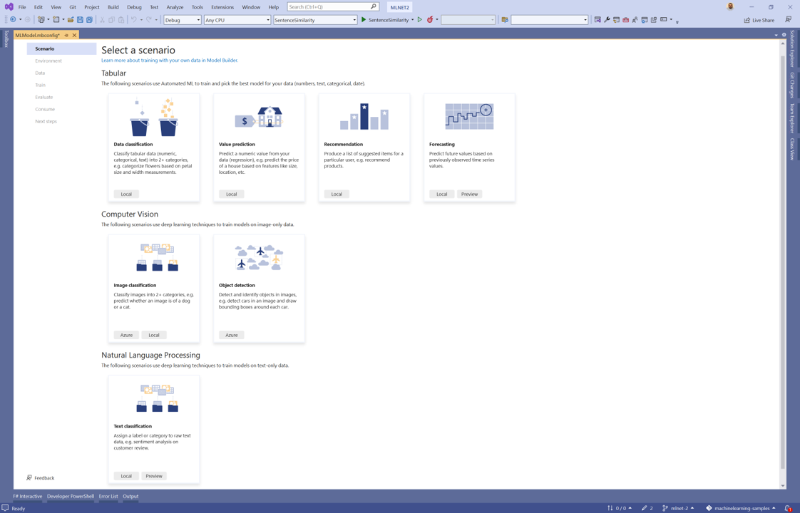
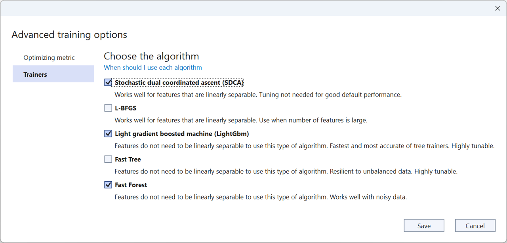
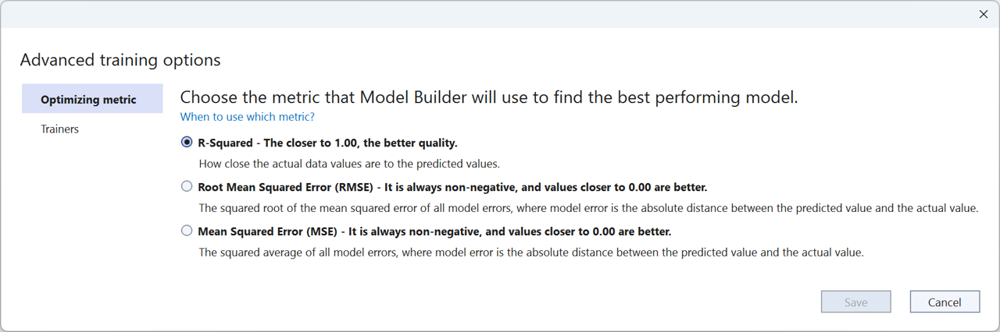

[ML.NET](https://dot.net/ml) is an open-source, cross-platform machine learning framework for .NET developers that enables integration of custom machine learning models into .NET apps.

[ML.NET version 2.0](https://www.nuget.org/packages/Microsoft.ML/2.0.0) and a new version of [Model Builder](https://marketplace.visualstudio.com/items?itemName=MLNET.ModelBuilder2022) are now released!

## What's new?

The following are highlights from this release. You can find a list of all the changes in the respective [ML.NET](https://github.com/dotnet/machinelearning/blob/main/docs/release-notes/2.0/release-2.0.0.md) and [Model Builder](https://github.com/dotnet/machinelearning-modelbuilder/blob/main/docs/release-notes/16.14.0.md) release notes.

To get started with these new features, install or upgrade to the latest versions of the ML.NET 2.0.0 and 0.20.0 packages as well as Model Builder 16.4.0 or later.

### Text Classification scenario in Model Builder

A few months ago we released a [preview of the Text Classification API](https://devblogs.microsoft.com/dotnet/introducing-the-ml-dotnet-text-classification-api-preview/). As the name implies, this API enables you to train custom models that classify raw text data. It does so by integrating a [TorchSharp](https://github.com/dotnet/TorchSharp) implementation of [NAS-BERT](https://arxiv.org/abs/2105.14444) into ML.NET. Using a pre-trained version of this model, the Text Classification API uses your data to fine-tune the model.

Since then, we've been working on refining the API. Today we're excited to announce the Text Classification scenario in Model Builder powered by the ML.NET Text Classification API.



With this new scenario, you can train custom text classification models using the latest deep learning techniques from Microsoft Research inside of Model Builder.

This scenario supports local training on both CPU and GPU. For GPUs you need a CUDA-compatible GPU and we recommend at least 6 GB of dedicated memory. For more details on setting up your GPU, see the [ML.NET GPU guide](https://learn.microsoft.com/dotnet/machine-learning/how-to-guides/install-gpu-model-builder). 

To get started with the Text Classification scenario, follow the [sentiment analysis tutorial](https://learn.microsoft.com/dotnet/machine-learning/tutorials/sentiment-analysis-model-builder).

### Sentence Similarity API

With ML.NET 2.0 we've also introduced a new API for sentence similarity. This API uses the same underlying TorchSharp NAS-BERT model as the Text Classification API. The main difference though is instead of predicting a category, the model calculates a numerical value that represents how similar two phrases are.  

```csharp
// Add using statements
using Microsoft.ML;
using Microsoft.ML.TorchSharp;

// Initialize MLContext
var mlContext = new MLContext();

// (Recommended) Use GPU
mlContext.GpuDeviceId = 0;
mlContext.FallbackToCpu = false;

// Load your data
var phrases = new []
{
    new {Source="ML.NET 2.0 just released", Target="There's a new version of ML.NET", Similarity=5f},
    new {Source="ML.NET 2.0 just released", Target="The rain in Spain stays mainly in the plain", Similarity=1f}
};

var dataView = mlContext.Data.LoadFromEnumerable(phrases);

// Define your training pipeline
var pipeline = 
    mlContext.Regression.Trainers.SentenceSimilarity(
        labelColumnName:"Similarity",
        sentence1ColumnName:"Source",
        sentence2ColumnName:"Target");

// Train the model
var model = pipeline.Fit(dataView);
```

In this example, a model is trained using sentences like "ML.NET 2.0 just released", "There's a new version of ML.NET", and "The rain in Spain stays mainly in the plain" with the goal of predicting their similarity. Similarity is defined by the value in the "Similarity" column which is a scale between 1 and 5 where 1 is least similar and 5 is most similar. To train a sentence similarity model, add the [`SentenceSimilarity`](https://learn.microsoft.com/dotnet/api/microsoft.ml.torchsharp.nasbert.sentencesimilaritytrainer?view=ml-dotnet-preview) trainer to your pipeline and call `Fit`. After training the model, you can provide source and target sentences and the model will predict the similarity between them. 

For a more detailed example of the Sentence Similarity API, see the [ML.NET 2.0 samples](https://aka.ms/mlnet-2-samples).

### Tokenizer support

To enable Natural Language Processing scenarios like Text Classification and Sentence Similarity, we needed a way to process text data. This is often done using tokenization techniques. We implemented a tokenizer for the English Roberta model which uses the [Byte-Pair Encoding](https://en.wikipedia.org/wiki/Byte_pair_encoding) algorithm to satisfy the NAS-BERT model requirements. 

We then decided to publish the tokenization APIs inside of ML.NET in the [`Microsoft.ML.Tokenizers`](https://www.nuget.org/packages/Microsoft.ML.Tokenizers) NuGet package. You can use the APIs provided in that package to import custom vocabularies and use the [BPE](https://learn.microsoft.com/dotnet/api/microsoft.ml.tokenizers.bpe?view=ml-dotnet-preview) tokenizer to process text data. 

This sample uses vocabulary resources from the [HuggingFace GPT-2 repository](https://huggingface.co/gpt2/tree/main).

```csharp
// Add using statements
using Microsoft.ML;
using Microsoft.ML.Tokenizers;

// Initialize MLContext
var mlContext = new MLContext();

// Define vocabulary file paths
var vocabFilePath = @"C:\Tokenizers\vocab.json";
var mergeFilePath = @"C:\Tokenizers\merges.txt";

// Initialize Tokenizer
var tokenizer = new Tokenizer(new Bpe(vocabFilePath, mergeFilePath),RobertaPreTokenizer.Instance);

// Define input for tokenization
var input = "the brown fox jumped over the lazy dog!";

// Encode input
var tokenizerEncodedResult = tokenizer.Encode(input);

// Decode results
tokenizer.Decode(tokenizerEncodedResult.Ids);
```

The encoded results provide information such as Ids which map to the index of that word in the vocabulary file as well as offsets which indicate the positions where each of the tokens starts and ends. For example:

| Ids | Offsets |
| --- | --- | 
| [ 1169, 0, 33282, 0, 12792, 0, 73, 27073, 0, 2502, 0, 1169, 0, 75, 12582, 0, 9703, 0 ] | [ ( 0, 3 ), ( 3, 4 ), ( 4, 9 ), ( 9, 10 ), ( 10, 13 ), ( 13, 14 ), ( 14, 15 ), ( 15, 20 ), ( 20, 21 ), ( 21, 25 ), ( 25, 26 ), ( 26, 29 ), ( 29, 30 ), ( 30, 31 ), ( 31, 34 ), ( 34, 35 ), ( 35, 38 ), ( 38, 39 ) ] |

Once your text data is tokenized can use it as input for your model. In this example, the vocabulary used for encoding is for the is [GPT-2](https://github.com/onnx/models/tree/main/text/machine_comprehension/gpt-2) model so that's the one you'd use. 

Decoding the tokens converts them back to a string.

To get started with tokenizers, install and reference the [`Microsoft.ML.Tokenizers`](https://www.nuget.org/packages/Microsoft.ML.Tokenizers) NuGet package inside your .NET projects. 

### Automated machine learning (AutoML) improvements

Automated machine learning (AutoML) automates the process of applying machine learning to data. AutoML powers experiences like those found in Model Builder and the ML.NET CLI. 

Last year we [updated the AutoML API implementation](https://devblogs.microsoft.com/dotnet/ml-net-june-updates-model-builder/#new-and-improved-automl) used inside Model Builder and the ML.NET CLI to use the latest techniques from Microsoft Research like the ones found in the [FLAML](https://microsoft.github.io/FLAML/) library.

This year we worked on bringing that implementation of AutoML to the dotnet/machinelearning repo and adding more capabilities to provide great code-first experiences for machine learning beginners as well as experienced users. 

In ML.NET 2.0, you are able to:

- Automate data preprocessing using the [AutoML Featurizer](https://learn.microsoft.com/dotnet/api/microsoft.ml.automl.autocatalog.featurizer?branch=main&view=ml-dotnet-preview).
- Train binary classification, multiclass classification, and regression models using preconfigured AutoML pipelines which make it easier to get started with machine learning.
- Choose which trainers are used as part of training process.
- Customize and create your own search space to choose hyperparameters from.
- Choose the tuning algorithms used to find the optimal hyperparamters.
- Persist all AutoML runs.

To get started using the AutoML API, see the [ML.NET 2.0 samples](https://aka.ms/mlnet-2-samples) and [AutoML API How-To guide](https://learn.microsoft.com/dotnet/machine-learning/how-to-guides/how-to-use-the-automl-api).

### Advanced options in Model Builder

Richer AutoML APIs enable us to add more advanced capabilities to Model Builder and the ML.NET CLI. In this release of Model Builder, we're introducing advanced training options which enable you to:

- Choose trainers

    

- Choose the evaluation metric you want to optimize

    

## What's next?

At a high-level the following items provide an overview of the areas we'll be focusing on over the next year. For more details, see the [ML.NET roadmap](https://aka.ms/mlnet-roadmap).

### Deep learning

For deep learning we plan to:

- Continue to expand deep learning scenario coverage. This includes new scenario APIs like the text classification and sentence similarity APIs for the following tasks:
  - Object detection
  - Named entity recognition
  - Question answering
- Enable integrations with TorchSharp for scenarios and models not supported out of the box by ML.NET.
- Accelerate deep learning workflows by improving batch support and enabling easier use of accelerators such as ONNX Runtime Execution Providers.
- Simplify ONNX model consumption inside ML.NET.

### LightGBM

LightGBM is a flexible framework for classical machine learning tasks such as classification and regression. To make the best of the features LightGBM provides, we plan to:

- Upgrade the version included in ML.NET to the latest LightGBM version
- Make interoperability with other frameworks easier by enabling saving and loading models in the native LightGBM format.

### DataFrame

Data processing is an important part of any analytics and machine learning workflow. This process often involves loading, inspecting, transforming, and visualizing your data. We've heard your feedback that one of the ways you'd like to perform some of these tasks is by using the DataFrame API in the `Microsoft.Data.Analysis` NuGet package. This past year we worked on making the loading experience more robust and adding new column types like DateTime to enable better interoperability with the ML.NET `IDataView`. In the next year, we plan to continue focusing on the areas of:

- Improving interoperability with the `IDataView` by supporting `VBuffer` and `KeyType` columns.
- Improving stability for common operations such as loading, filtering, merging, and joining data. 

### AutoML & tooling

Over the next year, we plan to continue improving the AutoML API to enable new scenarios and customizations to simplify machine learning workflows for both beginners and experience users. As we refine these experiences we plan to bring them to the Model Builder and ML.NET CLI tools.

### Improve documentation

As we continue to drive improvements in ML.NET and add new features, it's important to us that you're successful in adopting and using these enhanced capabilities to deliver value. Documentation and samples are an key part of that. Over the next year we plan to dedicate more resoures to deliver quality documentation and samples.  

## Get started and resources

Learn more about ML.NET, Model Builder, and the ML.NET CLI in [Microsoft Docs](https://docs.microsoft.com/dotnet/machine-learning/).

If you run into any issues, feature requests, or feedback, please file an issue in the [ML.NET repo](https://github.com/dotnet/machinelearning/issues).

Join the [ML.NET Community Discord](https://aka.ms/virtual-mlnet-community-discord) or #machine-learning channel on the [.NET Development Discord](https://aka.ms/dotnet-discord).

Tune in to the [Machine Learning .NET Community Standup](https://dotnet.microsoft.com/live/community-standup) every other Wednesday at 10am Pacific Time.
