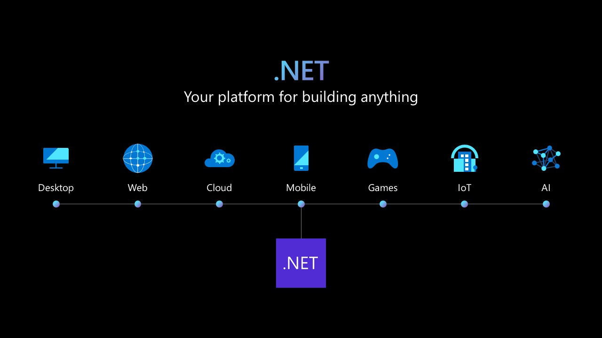
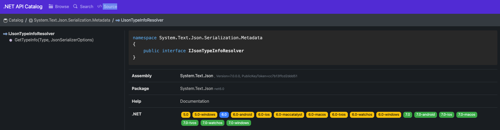
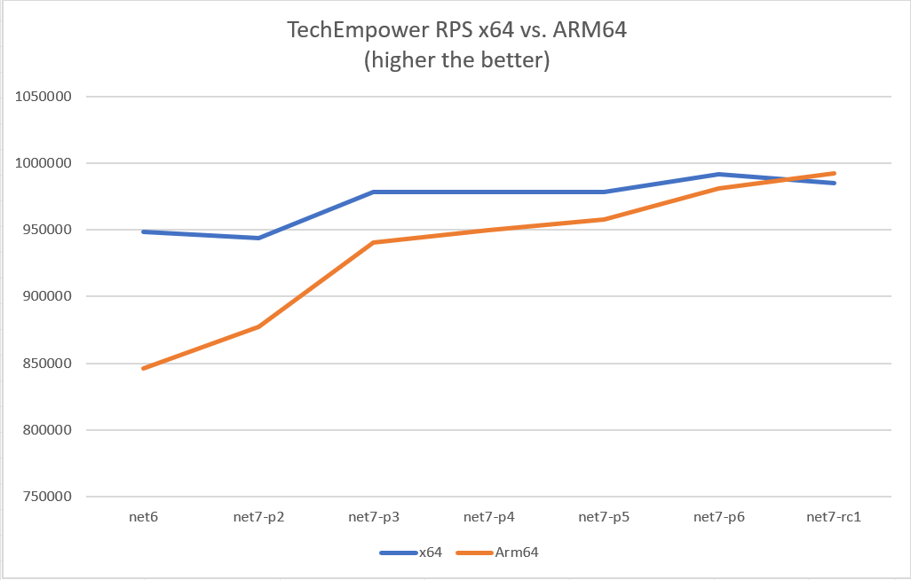
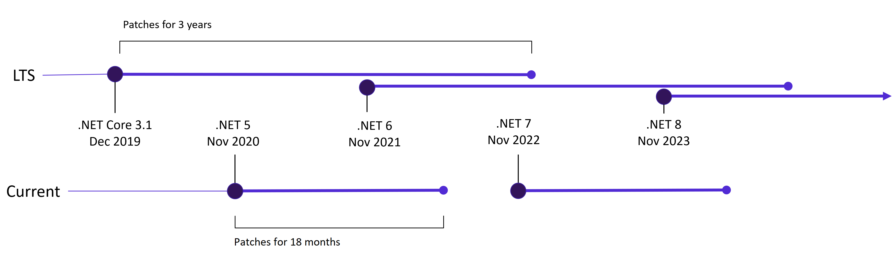

[](https://dotnet.microsoft.com/download/dotnet/7.0)

[Download .NET 7 today!](https://dotnet.microsoft.com/download/dotnet/7.0)

.NET 7 brings your apps [increased performance](https://devblogs.microsoft.com/dotnet/performance_improvements_in_net_7/) and new features for [C# 11](https://devblogs.microsoft.com/dotnet/welcome-to-csharp-11)/[F# 7](https://devblogs.microsoft.com/dotnet/announcing-fsharp-7/), [.NET MAUI](https://devblogs.microsoft.com/dotnet/dotnet-maui-7-ga), [ASP.NET Core/Blazor](https://devblogs.microsoft.com/dotnet/announcing-asp-net-core-in-dotnet-7), Web APIs, [WinForms](https://devblogs.microsoft.com/dotnet/winforms-enhancements-in-dotnet-7), [WPF](https://devblogs.microsoft.com/dotnet/wpf-on-dotnet-7) and more. With .NET 7, you can also easily containerize your .NET 7 projects, set up CI/CD workflows in GitHub actions, and achieve cloud-native observability.

Thanks to the [open-source .NET community](https://github.com/dotnet) for your numerous contributions that helped shape this .NET 7 release. [28k contributions made by over 8900 contributors throughout the .NET 7 release](https://dotnet.microsoft.com/thanks)!

.NET remains one of the [fastest](https://www.techempower.com/benchmarks/#section=data-r21&hw=ph&test=plaintext), [most loved](https://survey.stackoverflow.co/2022/#technology-most-loved-dreaded-and-wanted), and trusted platforms with an expansive [.NET package ecosystem](https://www.nuget.org/) that includes over 330,000 packages.

## Download and Upgrade

You can [download the free .NET 7 release](https://dotnet.microsoft.com/download/dotnet/7.0) today for Windows, macOS, and Linux.

* [Installers and binaries](https://dotnet.microsoft.com/download/dotnet/7.0)
* [Container images](https://mcr.microsoft.com/catalog?search=dotnet/)
* [Linux packages](https://github.com/dotnet/core/blob/master/release-notes/7.0/)
* [Release notes](https://github.com/dotnet/core/tree/master/release-notes/7.0)
* [Breaking changes](https://learn.microsoft.com/dotnet/core/compatibility/7.0)
* [Known issues](https://github.com/dotnet/core/blob/main/release-notes/7.0/known-issues.md)
* [GitHub issue tracker](https://github.com/dotnet/core/issues)

.NET 7 provides a straightforward upgrade if you're on a [.NET Core version](https://learn.microsoft.com/dotnet/fundamentals/implementations#net-5-and-later-versions) and several compelling reasons to migrate if you're currently maintaining a [.NET Framework version](https://learn.microsoft.com/dotnet/fundamentals/implementations#net-framework).

[Visual Studio 2022 17.4](https://visualstudio.microsoft.com/downloads/) is also available today. Developing .NET 7 in Visual Studio 2022 gives developers best-in-class productivity tooling. To find out what's new in Visual Studio 2022, check out [the Visual Studio 2022 blogs](https://devblogs.microsoft.com/visualstudio/visual-studio-2022-17-4).

## What's new in .NET 7

.NET 7 releases in conjunction with several other products, libraries, and platforms that include:

* [ASP.NET Core 7](https://devblogs.microsoft.com/dotnet/announcing-asp-net-core-in-dotnet-7)
* [Entity Framework Core 7](https://devblogs.microsoft.com/dotnet/announcing-ef7)
* [.NET MAUI](https://devblogs.microsoft.com/dotnet/dotnet-maui-7-ga)
* [Windows Forms](https://devblogs.microsoft.com/dotnet/winforms-enhancements-in-dotnet-7)
* [WPF](https://devblogs.microsoft.com/dotnet/wpf-on-dotnet-7)
* [Orleans 7](https://devblogs.microsoft.com/dotnet/whats-new-in-orleans-7/)

In this blog post, we'll highlight the major themes the .NET Teams focused on delivering:

* **Unified**
  * One BCL
  * New TFMs
  * Native support for ARM64
  * Enhanced .NET support on Linux
* **Modern**
  * Continued performance improvements
  * Developer productivity enhancements, like container-first workflows
  * Build cross-platform mobile and desktop apps from same codebase
* **.NET is for cloud-native apps**
  * Easy to build and deploy distributed cloud native apps
* **Simple**
  * Simplify and write less code with C# 11
  * HTTP/3 and minimal APIs improvements for cloud native apps
* **Performance**
  * Numerous perf improvements

Below, we'll cover these themes in more detail and share more context about why this work is important.

### Scenarios

.NET 7 is so versatile that you can build any app on any platform.

Let's highlight some scenarios that you can achieve with .NET starting today:

- [Call an existing .NET library from React code running in the browser](https://devblogs.microsoft.com/dotnet/use-net-7-from-any-javascript-app-in-net-7/) by including a streamlined .NET runtime optimized to run on WebAssembly.
- [Access the contents of a JSON document](https://learn.microsoft.com/ef/core/what-is-new/ef-core-7.0/whatsnew#json-columns) stored in your SQL Server database using strongly-typed C#.
- [Rapidly build and deploy a secure REST endpoint auto-documented with OpenAPI](https://learn.microsoft.com/aspnet/core/tutorials/web-api-help-pages-using-swagger?view=aspnetcore-6.0) by writing just a few lines of code.
- [Generate a streamlined native app using Ahead of Time (AOT) compilation](https://learn.microsoft.com/dotnet/core/deploying/native-aot/) from C# source and publish directly to a container image.
- Run a .NET Core app that uses built-in APIs to [compress and archive content into a Linux-friendly `tar.gz` file](https://learn.microsoft.com/dotnet/api/system.formats.tar.tarfile?view=net-7.0).
- Materialize your vision for a [mobile app on Android, iOS, and Windows using a single codebase](https://learn.microsoft.com/dotnet/maui/what-is-maui) and design that creates native code and components for each target platform.
- Reap the performance benefits of .NET 7 by automatically migrating your legacy apps using the [upgrade assistant](https://dotnet.microsoft.com/platform/upgrade-assistant) and [modernize your Windows Communication Foundation (WCF) web services with the help of CoreWCF](https://devblogs.microsoft.com/dotnet/corewcf-v1-released/).
- Make it easier than ever for developers to kickstart new applications using boilerplate templates that reflect *your* architecture and design choices.
- [Handle key combination and modifier keys better in Unix/Linux with Console.ReadKey](https://devblogs.microsoft.com/dotnet/console-readkey-improvements-in-net-7/).

## Unified

### One Base Class Library (BCL)



.NET 7 release is the third major release in our .NET unification journey (since .NET 5 in 2016).

With .NET 7, you learn once and reuse your skills with one SDK, one Runtime, one set of base libraries to build many types of apps (Cloud, Web, Desktop, Mobile, Gaming, IoT, and AI).

### Targeting .NET 7

When you target a framework in an app or library, you're specifying the set of APIs that you'd like to make available. To target .NET 7, it's as easy as changing the target framework in your project.

```xml
<TargetFramework>net7.0</TargetFramework>
```

Apps that target the `net7.0` target framework moniker (TFM) will work on all supported operating systems and CPU architectures. They give you access to all the APIs in .NET 7 plus a bunch of operating system-specific ones such as:

- net7.0-android
- net7.0-ios
- net7.0-maccatalyst
- net7.0-macos
- net7.0-tvos
- net7.0-windows

The APIs exposed through the `net7.0` TFM are designed to work everywhere. If you're ever in doubt whether an API is supported with .NET 7, you can always check out https://apisof.net/. Here's an example of the newly added interface `IJsonTypeInfoResolver` which you can see is now built-in to .NET 7:



### ARM64

As the industry has been moving towards ARM, so has .NET. One of the biggest advantages of ARM CPUs is power efficiency. This brings the highest performance with the lowest power consumption. In other words, you can do more with less. In .NET 5, [we described the performance initiatives we made towards ARM64](https://devblogs.microsoft.com/dotnet/arm64-performance-in-net-5/). Now, two releases later we'd like to share with you how far we've come. Our continued goal is to match the parity of performance of x64 with ARM64 to help our customers move their .NET applications to ARM.

#### Runtime Improvements

One challenge we had with our investigation of x64 and ARM64 was finding out that the L3 cache size wasn’t being correctly read from ARM64 machines. We changed our heuristics to return an approximate size if the L3 cache size could not be fetched from the OS or the machine’s BIOS. Now we can better approximate core counts per L3 cache sizes.

| Core count | L3 cache size |
|------------|---------------|
| 1~4        | 4MB           |
| 5~16       | 8MB           |
| 17~64      | 16MB          |
| 65+        | 32MB          |

Next came our understanding of LSE atomics. Which, if you’re not familiar, provides atomic APIs to gain exclusive access to critical regions. In CISC architecture x86-x64 machines, read-modify-write (RMW) operations on memory can be performed by a single instruction by adding a lock prefix.

However, on RISC architecture machines, RMW operations are not permitted, and all operations are done through registers. Hence for concurrency scenarios, they have pair of instructions. "Load Acquire" (ldaxr) gains exclusive access to the memory region such that no other core can access it and "Store Release" (stlxr) releases the access for other cores to access. Between these pairs, the critical operations are performed. If the stlxr operation failed because some other CPU operated on the memory after you load the contents using ldaxr, there’s a code to retry (cbnz  jumps back to retry) the operation.

ARM introduced LSE atomics instructions in v8.1. With these instructions, such operations can be done in less code and faster than the traditional version. When we enabled this for Linux and later extended it to Windows, we saw a performance win of around 45%.


#### Library Improvements

To optimize libraries that use intrinsics, we added new cross-platform helpers. These include helpers for `Vector64`, `Vector128`, and `Vector256`. The cross-platform helpers allow vectorization algorithms to be unified by replacing hardware-specific intrinsics with hardware-agnostic intrinsics. This will benefit users on any platform, but we expect ARM64 to see the most benefit, as developers without ARM64 expertise will still be able to use the helpers to take advantage of Arm64 hardware intrinsics .

Rewriting APIs such as `EncodeToUtf8` and `DecodeFromUtf8` from a SSE3 implementation to a Vector-based one can provide up to 60% improvements.


Similarly converting other APIs such as `NarrowUtf16ToAscii()` and `GetIndexOfFirstNonAsciiChar()` can prove a performance win of up to 35%.


#### Performance Impact

With our work in .NET 7, many MicroBenchmarks improved by 10-60%. As we started .NET 7, the requests per second (RPS) was lower for ARM64, but slowly overcame parity of x64.



Similarly for latency (measured in milliseconds), we would bridge parity of x64.


For more details, check out [ARM64 Performance Improvements in .NET 7](https://devblogs.microsoft.com/dotnet/arm64-performance-improvements-in-dotnet-7/)

### Enhanced .NET support on Linux
.NET 6 is included in Ubuntu 22.04 (Jammy) and can be installed with the `apt install dotnet6` command. In addition, there is an optimized, pre-built, ultra-small container image that can be used out of the box. 

```bash
dotnetapp % docker run --rm dotnetapp-chiseled
         42
         42              ,d                             ,d
         42              42                             42
 ,adPPYb,42  ,adPPYba, MM42MMM 8b,dPPYba,   ,adPPYba, MM42MMM
a8"    `Y42 a8"     "8a  42    42P'   `"8a a8P_____42   42
8b       42 8b       d8  42    42       42 8PP"""""""   42
"8a,   ,d42 "8a,   ,a8"  42,   42       42 "8b,   ,aa   42,
 `"8bbdP"Y8  `"YbbdP"'   "Y428 42       42  `"Ybbd8"'   "Y428

.NET 7.0.0-preview.7.22375.6
Linux 5.10.104-linuxkit #1 SMP PREEMPT Thu Mar 17 17:05:54 UTC 2022

OSArchitecture: Arm64
ProcessorCount: 4
TotalAvailableMemoryBytes: 3.83 GiB
```

For more information on our partnership with Canonical and ARM, read [.NET 6 is now in Ubuntu 22.04](https://devblogs.microsoft.com/dotnet/dotnet-6-is-now-in-ubuntu-2204).

### 64-bit IBM Power support

In addition to x64 architecture (64-bit Intel/AMD), ARM64 (64-bit ARM) and s390x (64-bit IBM Z), .NET is now also available for the ppc64le (64-bit IBM Power) architecture targeting RHEL 8.7 and RHEL 9.1.
 
With the availability to now run natively on Power, the 25,000 plus IBM Power customers can consolidate existing .NET apps on Windows x86 to run on the same Power platform as their IBM i and AIX business apps and databases. Doing so can significantly improve sustainability with up to a 5x smaller carbon footprint combined with on-premises pay-as-you-go scaling for RHEL and OpenShift capacity while delivering industry leading end-to-end-enterprise transaction and data security.

## Modern

 .NET 7 is built for modern cloud native apps, mobile clients, edge services and desktop technologies. Create mobile experiences using a single codebase without compromising native performance using .NET MAUI. Build responsive Single Page Applications (SPA) that run in your browser and offline as Progressive Web Apps (PWA) using familiar technologies like C# and Razor templates. These faster modern experiences aren't just for new applications. The .NET Upgrade Assistant will provide feedback about compatibility and in some cases completely migrate your apps to .NET 6 and .NET 7. 
 
### .NET MAUI

NET MAUI is now part of .NET 7 with tons of improvements, and new features. You can learn about .NET MAUI and the ways it empowers you to build apps for all your mobile devices by reading the latest [.NET MAUI blog announcement](https://devblogs.microsoft.com/dotnet/dotnet-maui-7-ga).
 
### Blazor

Blazor continues to evolve and .NET 7 includes many major improvements. Blazor now has support for handling location change events, improvements to the WebAssembly debugging experience, and out-of-the-box support for authentication using OpenID Connect. To learn more, read the latest [Blazor team blog posts](https://devblogs.microsoft.com/dotnet/category/blazor/).

### Upgrade Assistant

The .NET Upgrade Assistant provides step-by-step guidance, insights, and automation  for bringing your legacy apps to .NET 6 and .NET 7. In some cases it can perform the migration for you! It helps reduce time and complexity when modernizing older codebases. For example, learn how to take your WCF apps to .NET Core with the help of CoreWCF. With .NET 7, improved experiences include:

- ASP.NET to ASP.NET Core
  - System.Web adapters (preview)
  - Incremental migrations (preview) 
- More analyzers and code fixers added for  WinForms, WPF, and console/class libraries
- The ability to analyze binaries
- UWP to Windows App SDK and WinUI support

Ready to move your app onto the latest and fastest performing .NET to date? [Download the upgrade assistant](https://dotnet.microsoft.com/platform/upgrade-assistant) today!
 
### .NET 6 Migration Highlights

After .NET 6 was announced last year, there have been many successful journeys to the latest version of .NET. These stories highlight the benefits of significant improvements to CPU usage, increased requests per second(RPS), better thread pool usage, reduced binary sizes, faster startup time, simplified dependency management, lowered future technical debt, reduced infrastructure cost, and most importantly: engineering satisfaction and productivity.

* [The Azure Cosmos DB journey to .NET 6](https://devblogs.microsoft.com/dotnet/the-azure-cosmos-db-journey-to-net-6/)
* [Microsoft Exchange Online Journey to .NET Core](https://devblogs.microsoft.com/dotnet/exchange-online-journey-to-net-core/)
* [The OneService Journey to .NET 6](https://devblogs.microsoft.com/dotnet/one-service-journey-to-dotnet-6/)
* [Microsoft Graph's Journey to .NET 6](https://devblogs.microsoft.com/dotnet/microsoft-graph-dotnet-6-journey/)
* [Microsoft Teams "MiddleTier" to .NET Core](https://dotnet.microsoft.com/platform/customers/microsoft-teams-middletier)
* [Microsoft Team's Infrastructure and Azure Communication Services' Journey to .NET 6](https://devblogs.microsoft.com/dotnet/microsoft-teams-infrastructure-and-azure-communication-services-journey-to-dotnet-6/)
* [Bing Ads Campaign Platform Journey to .NET 6](https://devblogs.microsoft.com/dotnet/bing-ads-campaign-platform-journey-to-dotnet-6/)
* [Stack Overflow's Journey to .NET 6](https://wouterdekort.com/2022/05/25/the-stackoverflow-journey-to-dotnet6/)

Have a story about migrating to the latest version of .NET? Let us know in the comments below.

## .NET is for cloud-native apps

.NET 7 makes it easier than ever to build cloud native applications out of the box. Use Visual Studio's connected services to securely connect to a data service and safely encrypt your connection strings in a user secrets file or Azure Key Vault. Build your app directly into a container image. Use Entity Framework 7 to write strongly-typed Language Integrated Query (LINQ) queries that use SQL Server's JSON support to rapidly extract content from JSON documents stored in your relational database. Deliver secure JSON documents through authenticated endpoints using just a few lines of code with the Minimal APIs experience. Gather insights about your running application with Open Telemetry.

### Azure Support on Day Zero

Not only is .NET 7 great for building cloud-native apps; Azure's PaaS services like App Service for Windows and Linux, Static Web Apps, Azure Functions, and Azure Container Apps [are ready for .NET 7 today](https://go.microsoft.com/fwlink/?linkid=2214434), for the third release in a row, like .NET 5.0 and 6.0. Throughout the first week of the release, you may experience slightly longer start-up times for .NET 7 applications, as the .NET 7 SDK will be installed just-in-time for customers who create new App Services using .NET 7. Also, if you were running a .NET 7 preview release, simply re-starting your App Service will update you to the GA bits. 

### Built-in Container Support

The popularity and practical usage of containers is rising, and for many companies, they represent the preferred way of deploying to the cloud. However, working with containers adds new work to a team's backlog, including building and publishing images, checking security and compliance, and optimizing the performance of images. We believe there's an opportunity to create a better, more streamlined experience with .NET containers.

You can now create containerized versions of your applications with just `dotnet publish`. We built this solution with the goals to be seamlessly integrated with existing build logic, taking advantage of our own rich C# tooling and runtime performance, and built right into the box of the .NET SDK for regular updates.

Container images are now a supported output type of the .NET SDK:

```bash
# create a new project and move to its directory
dotnet new mvc -n my-awesome-container-app
cd my-awesome-container-app

# add a reference to a (temporary) package that creates the container
dotnet add package Microsoft.NET.Build.Containers

# publish your project for linux-x64
dotnet publish --os linux --arch x64 -p:PublishProfile=DefaultContainer
```

To learn more about build-in container support, see [Announcing built-in container support for the .NET SDK](https://devblogs.microsoft.com/dotnet/announcing-builtin-container-support-for-the-dotnet-sdk/)

### Microsoft Orleans

Microsoft Orleans 7.0 will offer a simpler programming model with "plain old CLR object" (POCO) Grains, deliver up to 150% better performance than 3.x, and introduce new serialization and immutability improvements. ASP.NET Core developers can add distributed state with simplicity using Orleans, and be confident their applications will scale horizontally without adding complexity. We’ll continue to invest in bringing Orleans features closer to the ASP.NET stack to ensure your web and API applications are ready for cloud scale, distributed hosting scenarios, or even multi-cloud deployments. With support for most popular storage mechanisms and databases and the ability to run anywhere ASP.NET Core can run, Orleans is a great choice to enable your .NET apps with cloud native, distributed capabilities without needing to learn a new framework or toolset. [Learn more about Orleans 7](https://devblogs.microsoft.com/dotnet/whats-new-in-orleans-7/).

### Observability

The goal of observability is to help you better understand the state of your application as it scales and the technical complexity increases. .NET has embraced [OpenTelemetry](https://opentelemetry.io/) while also making the following improvements below in .NET 7.

#### Introducing Activity.Current Change Event

A typical implementation of distributed tracing uses an `AsyncLocal<T>` to track the “span context” of managed threads. Changes to the span context are tracked by using the `AsyncLocal<T>` constructor that takes the `valueChangedHandler` parameter. However, with `Activity` becoming the standard to represent spans as used by OpenTelemetry, it’s impossible to set the value-changed handler because the context is tracked via `Activity.Current`. The new change event can be used instead to receive the desired notifications.

```csharp
Activity.CurrentChanged += CurrentChanged;

void CurrentChanged(object? sender, ActivityChangedEventArgs e)
{
  Console.WriteLine($"Activity.Current value changed from Activity:  {e.Previous.OperationName} to Activity: {e.Current.OperationName}");
}
```

#### Expose Performant Activity Properties Enumerator Methods
The following newly exposed methods can be used in performance-critical scenarios to enumerate the `Activity`'s `Tags`, `Links`, and `Events` properties without any extra allocations and performant item access:

```csharp
Activity a = new Activity("Root");

a.SetTag("key1", "value1");
a.SetTag("key2", "value2");

foreach (ref readonly KeyValuePair<string, object?> tag in a.EnumerateTagObjects())
{
  Console.WriteLine($"{tag.Key}, {tag.Value}");
}
```

#### Expose Performant ActivityEvent and ActivityLink Tags Enumerator Methods
Similar to the above, the `ActivityEvent` and `ActivityLink` Tag objects are also exposed to reduce any extra allocations for performant item access:

```csharp
var tags = new List<KeyValuePair<string, object?>>()
{
  new KeyValuePair<string, object?>("tag1", "value1"),
  new KeyValuePair<string, object?>("tag2", "value2"),
};

ActivityLink link = new ActivityLink(default, new ActivityTagsCollection(tags));

foreach (ref readonly KeyValuePair<string, object?> tag in link.EnumerateTagObjects())
{
// Consume the link tags without any extra allocations or value copying.
}

ActivityEvent e = new ActivityEvent("SomeEvent", tags: new ActivityTagsCollection(tags));

foreach (ref readonly KeyValuePair<string, object?> tag in e.EnumerateTagObjects())
{
// Consume the event's tags without any extra allocations or value copying.
}
```

## Simple

### C# 11 & F# 7

The newest additions to the C# and F# languages are [C# 11](https://devblogs.microsoft.com/dotnet/welcome-to-csharp-11) and [F# 7](https://devblogs.microsoft.com/dotnet/announcing-fsharp-7/). C# 11 makes new features like generic math possible while simplifying your code with object initialization improvements, raw string literals, and much more. 

### Generic Math

.NET 7 introduces new math-related generic interfaces to the base class library. The availability of these interfaces means you can constrain a type parameter of a generic type or method to be "number-like". In addition, C# 11 and later lets you define static virtual interface members. Because operators must be declared as static, this new C# feature lets operators be declared in the new interfaces for number-like types.

Together, these innovations allow you to perform mathematical operations generically—that is, without having to know the exact type you're working with. For example, if you wanted to write a method that adds two numbers, previously you had to add an overload of the method for each type (for example, `static int Add(int first, int second)` and `static float Add(float first, float second)`. Now you can write a single, generic method, where the type parameter is constrained to be a number-like type.


```csharp
static T Add<T>(T left, T right) where T : INumber<T>
{
    return left + right;
}
```

In this method, the type parameter T is constrained to be a type that implements the new `INumber<TSelf>` interface. `INumber<TSelf>` implements the `IAdditionOperators<TSelf,TOther,TResult>` interface, which contains the `+ operator`. That allows the method to generically add the two numbers. The method can be used with any of .NET's built-in numeric types, because they've all been updated to implement `INumber<TSelf>` in .NET 7.

Library authors will benefit most from the generic math interfaces, because they can simplify their code base by removing "redundant" overloads. Other developers will benefit indirectly, because the APIs they consume may start supporting more types.

Check out the [documentation on Generic Math](https://learn.microsoft.com/dotnet/standard/generics/math) for more information on the core APIs exposed by each interface.

### Raw String Literals

There is now a new format for string literals. Raw string literals can contain arbitrary text, including whitespace, new lines, embedded quotes, and other special characters without requiring escape sequences. A raw string literal starts with at least three double-quote (""") characters and ends with the same number of double-quote characters.

```csharp
string longMessage = """
    This is a long message.
    It has several lines.
        Some are indented
                more than others.
    Some should start at the first column.
    Some have "quoted text" in them.
    """;
```

### .NET Libraries

Many of .NET's first-party libraries have seen significant improvements in the .NET 7 release. You'll see support for nullable annotations for Microsoft.Extensions.* packages, contract customization and type hierarchies for System.Text.Json, and new Tar APIs to help you write data in the Tape Archive (TAR) format to name a few.

#### Nullable annotations for Microsoft.Extensions

All of the Microsoft.Extensions.* libraries now contain the C# 8 opt-in feature that allows for the compiler to track reference type nullability in order to catch potential null dereferences. This helps you minimize the likelihood that your code causes the runtime to throw a `System.NullReferenceException`.

#### System.Composition.Hosting

A new API has been added to [allow a single object instance](https://learn.microsoft.com/dotnet/api/system.composition.hosting.containerconfiguration.withexport?view=dotnet-plat-ext-7.0) to the `System.Composition.Hosting` container providing similar functionality to the legacy interfaces as `System.ComponentModel.Composition.Hosting` through the API `ComposeExportedValue(CompositionContainer, T)`.

```csharp
namespace System.Composition.Hosting
{
  public class ContainerConfiguration
  {
      public ContainerConfiguration WithExport<TExport>(TExport exportedInstance);
      public ContainerConfiguration WithExport<TExport>(TExport exportedInstance, string contractName = null, IDictionary<string, object> metadata = null);
      public ContainerConfiguration WithExport(Type contractType, object exportedInstance);
      public ContainerConfiguration WithExport(Type contractType, object exportedInstance, string contractName = null, IDictionary<string, object> metadata = null);
  }
}
```

#### Adding Microseconds and Nanoseconds to TimeStamp, DateTime, DateTimeOffset, and TimeOnly

Before .NET 7, the lowest increment of time available in the various date and time structures was the “tick” available in the Ticks property. For reference, a single tick is 100ns. Developers have traditionally had to perform computations on the “tick” value to determine microsecond and nanosecond values. In .NET 7, we’ve introduced both microseconds and nanoseconds to the date and time implementations:

```csharp
namespace System
{
  public struct DateTime
  {
    public DateTime(int year, int month, int day, int hour, int minute, int second, int millisecond, int microsecond);
    public DateTime(int year, int month, int day, int hour, int minute, int second, int millisecond, int microsecond, System.DateTimeKind kind);
    public DateTime(int year, int month, int day, int hour, int minute, int second, int millisecond, int microsecond, System.Globalization.Calendar calendar);
    public int Microsecond { get; }
    public int Nanosecond { get; }
    public DateTime AddMicroseconds(double value);
  }

  public struct DateTimeOffset
  {
    public DateTimeOffset(int year, int month, int day, int hour, int minute, int second, int millisecond, int microsecond, System.TimeSpan offset);
    public DateTimeOffset(int year, int month, int day, int hour, int minute, int second, int millisecond, int microsecond, System.TimeSpan offset, System.Globalization.Calendar calendar);
    public int Microsecond { get; }
    public int Nanosecond { get; }
    public DateTimeOffset AddMicroseconds(double microseconds);
  }

  public struct TimeSpan
  {
    public const long TicksPerMicrosecond = 10L;
    public const long NanosecondsPerTick = 100L;
    public TimeSpan(int days, int hours, int minutes, int seconds, int milliseconds, int microseconds);
    public int Microseconds { get; }
    public int Nanoseconds { get; }
    public double TotalMicroseconds { get; }
    public double TotalNanoseconds { get; }
    public static TimeSpan FromMicroseconds(double microseconds);
  }

  public struct TimeOnly
  {
    public TimeOnly(int hour, int minute, int second, int millisecond, int microsecond);
    public int Microsecond { get; }
    public int Nanosecond { get; }
  }
}
```

#### Microsoft.Extensions.Caching

We added metrics support for `IMemoryCache`, which is a new API of `MemoryCacheStatistics` that holds cache hits, misses, and estimated size for `IMemoryCache`. You can get an instance of `MemoryCacheStatistics` by calling `GetCurrentStatistics()` when the flag `TrackStatistics` is enabled.

The `GetCurrentStatistics()` API allows app developers to use event counters or metrics APIs to track statistics for one or more memory cache.

```csharp
// when using `services.AddMemoryCache(options => options.TrackStatistics = true);` to instantiate
[EventSource(Name = "Microsoft-Extensions-Caching-Memory")]
internal sealed class CachingEventSource : EventSource
{
  public CachingEventSource(IMemoryCache memoryCache)
  {
    _memoryCache = memoryCache;
  }
  protected override void OnEventCommand(EventCommandEventArgs command)
  {
    if (command.Command == EventCommand.Enable)
    {
      if (_cacheHitsCounter == null)
      {
          _cacheHitsCounter = new PollingCounter("cache-hits", this, () => _memoryCache.GetCurrentStatistics().CacheHits)
          {
            DisplayName = "Cache hits",
          };
      }
    }
  }
}
```

You can then view stats below with the `dotnet-counters` tool:

```bash
Press p to pause, r to resume, q to quit.
    Status: Running

[System.Runtime]
    CPU Usage (%)                                      0
    Working Set (MB)                                  28
[Microsoft-Extensions-Caching-MemoryCache]
    cache-hits                                       269
```


#### System.Formats.Tar APIs

We added a new [`System.Formats.Tar`](https://learn.microsoft.com/dotnet/api/system.formats.tar?view=net-7.0) assembly that contains cross-platform APIs that allow reading, writing, archiving, and extracting of Tar archives. These APIs are even used by the SDK to create containers as a publishing target.

```csharp
// Generates a tar archive where all the entry names are prefixed by the root directory 'SourceDirectory'
TarFile.CreateFromDirectory(sourceDirectoryName: "/home/dotnet/SourceDirectory/", destinationFileName: "/home/dotnet/destination.tar", includeBaseDirectory: true);

// Extracts the contents of a tar archive into the specified directory, but avoids overwriting anything found inside
TarFile.ExtractToDirectory(sourceFileName: "/home/dotnet/destination.tar", destinationDirectoryName: "/home/dotnet/DestinationDirectory/", overwriteFiles: false);
```

#### Type Converters

There are now exposed type converters for the newly added primitive types `DateOnly`, `TimeOnly`, `Int128`, `UInt128`, and `Half`.

```csharp
namespace System.ComponentModel
{
  public class DateOnlyConverter : System.ComponentModel.TypeConverter
  {
    public DateOnlyConverter() { }
  }

  public class TimeOnlyConverter : System.ComponentModel.TypeConverter
  {
    public TimeOnlyConverter() { }
  }

  public class Int128Converter : System.ComponentModel.BaseNumberConverter
  {
    public Int128Converter() { }
  }

  public class UInt128Converter : System.ComponentModel.BaseNumberConverter
  {
    public UInt128Converter() { }
  }

  public class HalfConverter : System.ComponentModel.BaseNumberConverter
  {
    public HalfConverter() { }
  }
}
```

These are helpful converters to easily convert to more primitive types.

```csharp
TypeConverter dateOnlyConverter = TypeDescriptor.GetConverter(typeof(DateOnly));
// produce DateOnly value of DateOnly(1940, 10, 9)
DateOnly? date = dateOnlyConverter.ConvertFromString("1940-10-09") as DateOnly?;

TypeConverter timeOnlyConverter = TypeDescriptor.GetConverter(typeof(TimeOnly));
// produce TimeOnly value of TimeOnly(20, 30, 50)
TimeOnly? time = timeOnlyConverter.ConvertFromString("20:30:50") as TimeOnly?;

TypeConverter halfConverter = TypeDescriptor.GetConverter(typeof(Half));
// produce Half value of -1.2
Half? half = halfConverter.ConvertFromString(((Half)(-1.2)).ToString()) as Half?;

TypeConverter Int128Converter = TypeDescriptor.GetConverter(typeof(Int128));
// produce Int128 value of Int128.MaxValue which equal 170141183460469231731687303715884105727
Int128? int128 = Int128Converter.ConvertFromString("170141183460469231731687303715884105727") as Int128?;

TypeConverter UInt128Converter = TypeDescriptor.GetConverter(typeof(UInt128));
// produce UInt128 value of UInt128.MaxValue Which equal 340282366920938463463374607431768211455
UInt128? uint128 = UInt128Converter.ConvertFromString("340282366920938463463374607431768211455") as UInt128?;
```

#### System.Text.Json Contract Customization

System.Text.Json determines how a given .NET type is meant to be serialized and deserialized by constructing a JSON contract for that type. The contract is derived from the type’s shape — such as its available constructors, properties and fields, and whether it implements `IEnumerable` or `IDictionary` — either at runtime using reflection or at compile time using the source generator. In previous releases, users were able to make limited adjustments to the derived contract using [System.Text.Json attribute annotations](https://learn.microsoft.com/dotnet/api/system.text.json.serialization.jsonattribute), assuming they are able to modify the type declaration.

The contract metadata for a given type `T` is represented using [`JsonTypeInfo<T>`](https://learn.microsoft.com/dotnet/api/system.text.json.serialization.metadata.jsontypeinfo-1), which in previous versions served as an opaque token used exclusively in source generator APIs. Starting in .NET 7, most facets of the `JsonTypeInfo` contract metadata have been exposed and made user-modifiable. Contract customization allows users to write their own JSON contract resolution logic using implementations of the [`IJsonTypeInfoResolver`](https://learn.microsoft.com/dotnet/api/system.text.json.serialization.metadata.ijsontypeinforesolver) interface:

```csharp
public interface IJsonTypeInfoResolver
{
  JsonTypeInfo? GetTypeInfo(Type type, JsonSerializerOptions options);
}
```

A contract resolver returns a configured `JsonTypeInfo` instance for the given `Type` and `JsonSerializerOptions` combination. It can return `null` if the resolver does not support metadata for the specified input type.

Contract resolution performed by the default, reflection-based serializer is now exposed via the [`DefaultJsonTypeInfoResolver`](https://learn.microsoft.com/dotnet/api/system.text.json.serialization.metadata.defaultjsontypeinforesolver) class, which implements `IJsonTypeInfoResolver`. This class lets users extend the default reflection-based resolution with custom modifications or combine it with other resolvers (such as source-generated resolvers).

Starting from .NET 7 the [`JsonSerializerContext`](https://learn.microsoft.com/dotnet/api/system.text.json.serialization.jsonserializercontext) class used in source generation also implements `IJsonTypeInfoResolver`. To learn more about the source generator, see [How to use source generation in System.Text.Json.](https://learn.microsoft.com/dotnet/standard/serialization/system-text-json/source-generation)

A `JsonSerializerOptions` instance can be configured with a custom resolver using the new [`TypeInfoResolver`](https://learn.microsoft.com/dotnet/api/system.text.json.jsonserializeroptions.typeinforesolver) property:

```csharp
// configure to use reflection contracts
var reflectionOptions = new JsonSerializerOptions
{
    TypeInfoResolver = new DefaultJsonTypeInfoResolver()
};

// configure to use source generated contracts
var sourceGenOptions = new JsonSerializerOptions
{
    TypeInfoResolver = EntryContext.Default
};

[JsonSerializable(typeof(MyPoco))]
public partial class EntryContext : JsonSerializerContext { }
```

Check out the [[What's new in System.Text.Json in .NET 7]](https://devblogs.microsoft.com/dotnet/system-text-json-in-dotnet-7/#contract-customization) blog post for more details about Contract Customization.

#### System.Text.Json Type Hierarchies

System.Text.Json now supports polymorphic serialization and deserialization of user-defined type hierarchies. This can be enabled by decorating the base class of a type hierarchy with the new [`JsonDerivedTypeAttribute`](https://docs.microsoft.com/dotnet/api/system.text.json.serialization.jsonderivedtypeattribute):

```csharp
[JsonDerivedType(typeof(Derived))]
public class Base
{
    public int X { get; set; }
}

public class Derived : Base
{
    public int Y { get; set; }
}
```

This configuration enables polymorphic serialization for `Base`, specifically when the run-time type is `Derived`:

```csharp
Base value = new Derived();
JsonSerializer.Serialize<Base>(value); // { "X" : 0, "Y" : 0 }
```

Note that this does not enable polymorphic *deserialization* since the payload would be round tripped as `Base`:

```csharp
Base value = JsonSerializer.Deserialize<Base>(@"{ ""X"" : 0, ""Y"" : 0 }");
value is Derived; // false
```

Check out the [What's new in System.Text.Json in .NET 7](https://devblogs.microsoft.com/dotnet/system-text-json-in-dotnet-7/#type-hierarchies) blog post for more details about Type Hierarchies.

### .NET SDK

The .NET SDK continues to add new features to make you more productive than ever. In .NET 7, we improve your experiences with the .NET CLI, authoring templates, and managing your packages in a central location.

#### CLI Parser and Tab Completion

The `dotnet new` command has been given a more consistent and intuitive interface for many of the subcommands that users know and love. There’s also support for tab completion of template options and arguments. Now the CLI gives feedback on valid arguments and options as the user types.

Here’s the new help output as an example:

```bash
❯ dotnet new --help
Description:
  Template Instantiation Commands for .NET CLI.

Usage:
  dotnet new [<template-short-name> [<template-args>...]] [options]
  dotnet new [command] [options]

Arguments:
  <template-short-name>  A short name of the template to create.
  <template-args>        Template specific options to use.

Options:
  -?, -h, --help  Show command line help.

Commands:
  install <package>       Installs a template package.
  uninstall <package>     Uninstalls a template package.
  update                  Checks the currently installed template packages for update, and install the updates.
  search <template-name>  Searches for the templates on NuGet.org.
  list <template-name>    Lists templates containing the specified template name. If no name is specified, lists all templates.
```

The `dotnet CLI` has supported tab completion for quite a while with popular shells like PowerShell, bash, zsh, and fish to name a few. It’s up to individual dotnet commands to implement meaningful completions, however. For .NET 7, the `dotnet new` command learned how to provide tab completion.

```bash
❯ dotnet new angular
angular              grpc                 razor                viewstart            worker               -h
blazorserver         mstest               razorclasslib        web                  wpf                  /?
blazorwasm           mvc                  razorcomponent       webapi               wpfcustomcontrollib  /h
classlib             nugetconfig          react                webapp               wpflib               install
console              nunit                reactredux           webconfig            wpfusercontrollib    list
editorconfig         nunit-test           sln                  winforms             xunit                search
gitignore            page                 tool-manifest        winformscontrollib   --help               uninstall
globaljson           proto                viewimports          winformslib          -?                   update
```

This can be helpful for you to make choices when creating new .NET projects to know what options and arguments are available to you.

```bash
❯ dotnet new web --dry-run
--dry-run                  --language                 --output                   -lang
--exclude-launch-settings  --name                     --type                     -n
--force                    --no-https                 -?                         -o
--framework                --no-restore               -f                         /?
--help                     --no-update-check          -h                         /h
```

And additionally, what common options and arguments are commonly mistaken or not supported for the given command. Instead, you are only shown what’s supported in the current version of the .NET CLI.

```bash
❯ dotnet new blazorserver --auth Individual
Individual     IndividualB2C  MultiOrg       None           SingleOrg      Windows
```

#### Template Authoring

.NET 7 adds the concept of constraints to .NET Templates. Constraints allow you to define the context in which your templates are allowed, which helps the template engine determine what templates it should show in commands like dotnet new list. For this release, we’ve added support for three kinds of constraints:

- **Operating System:** Limits templates based on the operating system of the user
- **Template Engine Host:** Limits templates based on which host is executing the template engine. This is usually the .NET CLI itself, or an embedded scenario like the New Project Dialog in Visual Studio or Visual Studio for Mac.
- **Installed Workloads:** Requires that the specified .NET SDK workload is installed before the template will become available.

In all cases, describing these constraints is as easy as adding a new constraints section to your template’s configuration file:

```json
 "constraints": {
       "web-assembly": {
           "type": "workload",
           "args": "wasm-tools"
       },
   }
```

We’ve also added a new ability for choice parameters. This is the ability for a user to specify more than one value in a single selection. This can be used in the same way a Flags-style enum might be used. Common examples of this type of parameter might be:

- Opting into multiple forms of authentication on the web template.
- Choosing multiple target platforms (iOS, Android, web) at once in the MAUI templates.

Opting-in to this behavior is as simple as adding `"allowMultipleValues": true` to the parameter definition in your template’s configuration. Once you do, you’ll get access to several helper functions to use in your template’s content as well to help detect specific values that the user chose.

#### Central Package Management

Dependency management is a core feature of NuGet. Managing dependencies for a single project can be easy. Managing dependencies for multi-project solutions can prove to be difficult as they start to scale in size and complexity. In situations where you manage common dependencies for many different projects, you can leverage NuGet’s central package management features to do all of this from the ease of a single location.

To get started with central package management, you can create a `Directory.Packages.props` file at the root of your solution and set the MSBuild property `ManagePackageVersionsCentrally` to true.

Inside, you can define each of the respective package versions required of your solution using `<PackageVersion />` elements that define the package ID and version.

```xml
<Project>
  <PropertyGroup>
    <ManagePackageVersionsCentrally>true</ManagePackageVersionsCentrally>
  </PropertyGroup>

  <ItemGroup>
    <PackageVersion Include="Newtonsoft.Json" Version="13.0.1" />
  </ItemGroup>
</Project>
```

Within a project of the solution, you can then use the respective `<PackageReference />` syntax you know and love, but without a Version attribute to infer the centrally managed version instead.

```xml
<Project Sdk="Microsoft.NET.Sdk">

  <PropertyGroup>
    <TargetFramework>net6.0</TargetFramework>
  </PropertyGroup>

  <ItemGroup>
    <PackageReference Include="Newtonsoft.Json" />
  </ItemGroup>
</Project>
```

## Performance

Performance has been a big part of every .NET release. Every year, the .NET team publishes a blog on the latest improvements. Here's a short blurb from the latest performance post:

> TL;DR: .NET 7 is fast. Really fast. A thousand performance-impacting PRs went into runtime and core libraries this release, never mind all the improvements in ASP.NET Core and Windows Forms and Entity Framework and beyond. It’s the fastest .NET ever. If your manager asks you why your project should upgrade to .NET 7, you can say “in addition to all the new functionality in the release, .NET 7 is super fast.” - [Stephen Toub](https://devblogs.microsoft.com/dotnet/performance_improvements_in_net_7/)

Below is a short summary of some of the performance improvements to the JIT compiler. If you want a full deep dive into all the changes, take a look at [Performance improvements in .NET 7](https://devblogs.microsoft.com/dotnet/performance_improvements_in_net_7/).

### On Stack Replacement (OSR)

On Stack Replacement (OSR) allows the runtime to change the code executed by currently running methods in the middle of method execution, although those methods are active “on stack.” It serves as a complement to tiered compilation.

OSR allows long-running methods to switch to more optimized versions mid-execution, so the runtime can JIT all the methods quickly at first and then transition to more optimized versions when those methods are called frequently through tiered compilation or have long-running loops through OSR.

OSR improves startup time. Almost all methods are now initially jitted by the quick JIT. We have seen 25% improvement in startup time in jitting-heavy applications like Avalonia “IL” spy, and the various TechEmpower benchmarks we track show 10-30% improvements in time to first request.


OSR can also improve performance of applications, and in particular, applications using Dynamic PGO, as methods with loops are now better optimized. For example, the `Array2` microbenchmark showed dramatic improvement when OSR was enabled.


### Profile-Guided Optimization (PGO)

Profile-Guided Optimization (PGO) has been around for a long time in a number of languages and compilers. The basic idea is that you compile your app, asking the compiler to inject instrumentation into the application to track various pieces of interesting information. You then put your app through its paces, running through various common scenarios, causing that instrumentation to “profile” what happens when the app is executed, and the results of that are then saved out. The app is then recompiled, feeding those instrumentation results back into the compiler, and allowing it to optimize the app for exactly how it’s expected to be used.

This approach to PGO is referred to as “static PGO,” as the information is all gleaned ahead of actual deployment, and it’s something .NET has been doing in various forms for years. The interesting development in .NET is “dynamic PGO,” which was introduced in .NET 6, but turned off by default.

Dynamic PGO takes advantage of tiered compilation. The JIT instruments the tier-0 code to track how many times the method is called, or in the case of loops, how many times the loop executes. Tiered compilation can instrument a variety of possibilities. For example, it can track exactly which concrete types are used as the target of an interface dispatch, and then, in tier-1, specialize the code to expect the most common types (this is referred to as “guarded devirtualization,” or GDV). You can see this in this little example. Set the `DOTNET_TieredPGO` environment variable to 1, and then run it on .NET 7:

```csharp
class Program
{
  static void Main()
  {
    IPrinter printer = new Printer();
    for (int i = 0; ; i++)
    {
      DoWork(printer, i);
    }
  }

  static void DoWork(IPrinter printer, int i)
  {
    printer.PrintIfTrue(I == int.MaxValue);
  }

  interface iPrinter
  {
    void PrintIfTrue(bool condition);
  }

  class Printer : iPrinter
  {
    public void PrintIfTrue(bool condition)
    {
      if (condition) Console.WriteLine“"Print”");
    }
  }
}
```

The main improvement you get with PGO is that it now works with OSR in .NET 7. This means that hot-running methods that do interface dispatch can get these devirtualization/inlining optimizations.

With PGO disabled, you get the same performance throughput for .NET 6 and .NET 7.

| Method      | Runtime  | Mean     | Ratio |
|-------------|----------|----------|-------|
| DelegatePGO | .NET 6.0 | 1.665 ns | 1.00  |
| DelegatePGO | .NET 7.0 | 1.659 ns | 1.00  |

But the picture changes when you enable dynamic PGO in a .csproj via `<TieredPGO>true</TieredPGO>` or environment variable of `DOTNET_TieredPGO=1`. .NET 6 gets ~14% faster, but .NET 7 gets ~3x faster.

| Method      | Runtime  | Mean       | Ratio |
|-------------|----------|------------|-------|
| DelegatePGO | .NET 6.0 | 1.427.7 ns | 1.00  |
| DelegatePGO | .NET 7.0 | 539.0      | 0.38  |

### Native AOT

To many people, the word “performance” in the context of software is about throughput. How fast does something execute? How much data per second can it process? How many requests per second can it process? And so on. But there are many other facets to performance. How much memory does it consume? How fast does it start up and get to the point of doing something useful? How much space does it consume on disk? How long does it take to download?

And then there are related concerns. To achieve these goals, what dependencies are required? What kinds of operations does it need to perform to achieve these goals, and are all of those operations permitted in the target environment? If any of this paragraph resonates with you, you’re the target audience for the Native AOT support now shipping in .NET 7.

.NET has long had support for AOT code generation. For example, .NET Framework had it in the form of `ngen`, and .NET Core has it in the form of `crossgen`. Both of those solutions involve a standard .NET executable that has some of its IL already compiled to assembly code, but not all methods will have assembly code generated for them, various things can invalidate the assembly code that was generated, external .NET assemblies without any native assembly code can be loaded, and so on, and, in all those cases, the runtime continues to use a JIT compiler. Native AOT is different. It’s an evolution of CoreRT, which itself was an evolution of .NET Native, and it’s entirely free of a JIT.

The binary that results from publishing a build is a completely standalone executable in the target platform’s platform-specific file format (for example, COFF on Windows, ELF on Linux, Mach-O on macOS) with no external dependencies other than that one is standard to that platform (for example, libc). And it’s entirely native: no IL in sight, no JIT, no nothing. All required code is compiled and/or linked into the executable, including the same GC that’s used with standard .NET apps and services, and a minimal runtime that provides services around threading and the like.

All of that brings great benefits: super-fast startup time, small and entirely self-contained deployment, and the ability to run in places JIT compilers aren’t allowed (because memory pages that were writable can’t then be executable). It also brings limitations: No JIT means no dynamic loading of arbitrary assemblies (for example, `Assembly.LoadFile`) and no reflection emit (for example, `DynamicMethod`), and with everything compiled and linked into the app, that means more functionality is used (or might be used) and the larger your deployment can be. Even with those limitations, for a certain class of application, Native AOT is an incredibly exciting and welcome addition to .NET 7.

Today, Native AOT is focused on console applications, so let’s create a console app:

```bash
dotnet new console -o nativeaotexample
```

You now have a “Hello World” console application. To enable publishing the application with Native AOT, edit the .csproj to include the following in the existing `<PropertyGroup>`:

```xml
<PublishAot>true</PublishAot>
```

The app is now fully configured to be able to target Native AOT. All that’s left is to publish. If you wanted to publish to the `Windows x64` runtime, you might use the following command:

```bash
dotnet publish -r win-x64 -c Release
```

This generates an executable in the output publish directory:

```bash
    Directory: C:\nativeaotexample\bin\Release\net7.0\win-x64\publish

Mode                 LastWriteTime         Length Name
----                 -------------         ------ ----
-a---           8/27/2022  6:18 PM        3648512 nativeaotexample.exe
-a---           8/27/2022  6:18 PM       14290944 nativeaotexample.pdb
```

That ~3.5MB .exe is the executable, and the .pdb next to it is debug information, which isn’t needed deploying the app. You can now copy that `nativeaotexample.exe` to any 64-bit Windows machine, regardless of what .NET may or may not be installed anywhere on the box, and the app will run.

## .NET 7 is Supported



.NET 7 is officially supported by Microsoft. It's labeled as a **Standard Term Support** (STS) release that will be supported for 18 months. Odd numbered .NET releases are STS releases that get free support and patches for six months after a subsequent STS or LTS release. See our [.NET and .NET Core Support Lifecycle](https://dotnet.microsoft.com/platform/support/policy/dotnet-core) documentation for more details.

## Feedback

Help us shape .NET 8 and future releases by [upvoting issues on GitHub](https://github.com/orgs/dotnet/repositories), [providing feedback on Developer Community](https://developercommunity.visualstudio.com/), and sharing your .NET apps and projects with others in the community.

Share your thoughts and stay informed on the latest news around .NET 7 with [#dotnet7](https://twitter.com/search?q=%23dotnet7&src=typed_query).

## .NET Conf 2022

Be sure to tune into [.NET Conf 2022](https://dotnetconf.net). It's a free, three-day, virtual developer event that celebrates the major releases of .NET. Join us today, November 8th, through November 10th to learn about .NET 7 directly from the product teams at Microsoft and the .NET community behind the release. .NET Conf features over 80 sessions that cover the myriad new features that empower your apps built with .NET 7.

## Download .NET 7 today

We would just like to end by saying:


.NET cannot exist without the community. The .NET project is a project through everyone's unique and creative contributions. These great accomplishments and generosity come from the support and caring for those around us. Thank you for your participation, your sharing, and your belonging to the .NET community.

.NET 7 is a major release that improves your developer quality of life by improving fundamentals like performance, functionality, and usability. We hope these new features and additions continue to delight your usage of the .NET platform.

What are you waiting for? It's ready. [Download .NET 7.](https://dotnet.microsoft.com/download/dotnet/7.0)
