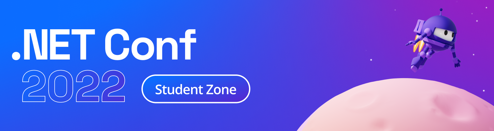

Join the .NET Student Zone on November 7 to learn all about .NET and build amazing .NET projects! You will walk away with a project portfolio on your very own portfolio website – don't worry, we will build it right along with you.

In each 30-minute session, you will build an app or project to add to your portfolio. You will build web apps, a mobile app, an ML project, and more! At the end of the event, we will give you the tools you need to ace your next coding assignment with Visual Studio!

## Register
[cta-button align='center' text='Europe, Middle East, Africa, Asia Pacific - Register Now' url='https://aka.ms/dotnetstudentemea'  color='#5c33b8']
[cta-button align='center' text='North and South America - Register Now' url='https://aka.ms/dotnetstudentamerica'  color='#5c33b8']

## More Details
### What is the .NET Conf Student Zone?
As part of [.NET Conf this year](https://www.dotnetconf.net/), we are hosting a .NET Student Zone on Monday, November 7! This is a livestreamed event where experts will introduce you to .NET and and build awesome, follow-along projects. You will walk away with a project portfolio on your very own portfolio website. In total the event will be 4+ hours of content.

### When is the Student Zone?
**November 7, 2022**

**Session 1** (12:00PM UTC | 08:00AM EST): Europe, Middle East, Africa, Asia Pacific Timezones

**Session 2** (09:30PM UTC | 05:30PM EST): North and South America Timezones

### Agenda

| Session Title | Speaker(s) | Tools |
|-------|---------|-----------|
| Welcome to the Student Zone!| Scott Hanselman, Katie Savage  |  |
| Create a GitHub Profile |Bethany Jepchumba  | GitHub |
| Build your Project Portfolio website with .NET | Vincent Nwonah | Blazor |
| Detect water bottle consumption from IoT sensors | Krzysztof Wicher | IoT |
| Use machine learning to estimate future water consumption  | Carlotta Castelluccio | ML.NET |
| Add a backend to your website  | Chris Noring | Minimal API |
| Build a mobile app to track water consumption | Someleze Diko  | .NET MAUI |
| Build a water consumption tracker website    | Justin Yoo | Blazor |
| Ace your next assignment with .NET  | Diego Colombo | Visual Studio |

## Join the challenge to win SWAG 
[Join the .NET Conf Student Zone Microsoft Learn, Cloud Skills Challenge and Win Swag](https://aka.ms/dotnetstudententry)
After enjoying the .NET Conf Student Zone, you will be ready to complete the .NET Conf Student Zone Cloud Skills Challenge. The challenge is open to all students who registered for .NET Conf on November 7 and three lucky winners will get a .NET Conf SWAG bag 🎁🎉

**We will see you there!**