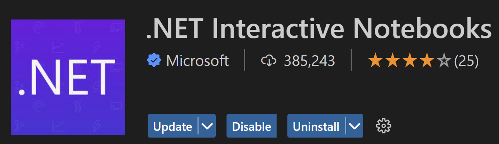
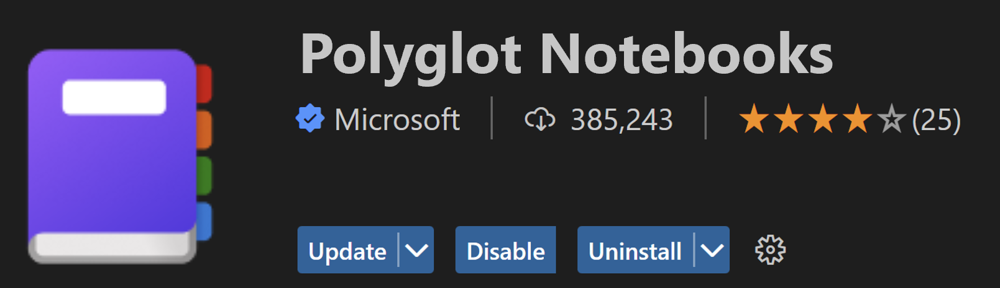

The .NET Interactive Notebooks extension in Visual Studio Code has been renamed to Polyglot Notebooks!

## A little bit of history

In 2019, we set out on a mission to bring .NET languages into the Jupyter ecosystem by creating a .NET-based (C#, F#, PowerShell) Jupyter kernel. Over time, we learned that many developer workflows were inherently multi-language as developers are drawn to use the best language for the task at hand. Users want to be able to use the best language for what they want, when they want. This is the developer philosophy that led .NET Interactive to evolve into what it is today.  

Today .NET Interactive is an engine capable of running multiple languages. It also supports full language server support and variable sharing for the following languages: 

 - C# 
 - F#
 - PowerShell 
 - JavaScript 
 - SQL
 - KQL (Kusto Query Language) 
 - HTML*
 - Mermaid*    

*Variable sharing not available

These capabilities and language combinations make it a powerful kernel for Jupyter notebooks that allows for uninterrupted multi-language workflows. For example, developers using Polyglot Notebooks today can connect to and query a SQL database, pass the tabular result to JavaScript, and create visualizations all within the same tool and the same notebook file. 

This functionality and experience was previously enabled in VS Code by the _.NET Interactive Notebooks_ extension, which has now been renamed to _Polyglot Notebooks_. 

## Why the name change? 

Firstly, it is important to reiterate that we are changing the name of our extension in VS Code, not the name of the engine itself. The engine itself will still be called .NET Interactive. That means you can think about the Polyglot Notebooks extension as being powered by .NET Interactive. In addition, if you happen to be using the .NET Interactive APIs, the name of our libraries will also remain the same. More specifically, package names, namespaces, and CLI (dotnet-interactive) will remain the same. 

Secondly, as the number of languages supported by .NET Interactive expanded, the previous extension name, _.NET Interactive Notebooks_, no longer adequately reflected its full capabilities. _Polyglot Notebooks_ fully captures the multi-language power of using .NET Interactive as the kernel for your Jupyter notebooks. 

## What does this really mean for me? 

If you previously installed the .NET Interactive Notebooks extension in VS Code, you will now see that the extension name has been updated to Polyglot Notebooks. When creating a notebook in VS Code, you will still see .NET Interactive as a kernel option in the dropdown menu; no changes there. 

Commands from the Command Palette will also be updated to reflect this name change and we recommend using the new commands as the old ones will soon be removed.  

**Previously:**

**Newly:**
 

## Where should I be filing issues? 

The location to file issues or feature requests has not changed! Please continue to reach out to us with any feedback on the Polyglot Notebooks extension on the [.NET Interactive GitHub Repository](https://github.com/dotnet/interactive). 

## Summary

Try it out by installing [Visual Studio Code](https://code.visualstudio.com/), [.NET 6 SDK](https://dotnet.microsoft.com/download/dotnet/6.0), and the [Polyglot Notebooks extension](https://marketplace.visualstudio.com/items?itemName=ms-dotnettools.dotnet-interactive-vscode) and [let us know what you think](https://github.com/dotnet/interactive/issues/new/choose)!
