When .NET MAUI reached GA, we had goals of improving upon
Xamarin.Forms in startup time and application size. See last release's
[Performance Improvements in .NET MAUI][mauiperf], to learn about the
performance benefits of migrating from Xamarin.Android, Xamarin.iOS,
or Xamarin.Forms to .NET 6+ and .NET MAUI.

We continued with these themes in .NET 7, building upon the excellent
[.NET performance work described by Stephen Toub][netperf]. General
improvements in the .NET runtime or base class libraries (BCL) lay the
foundation for the performance we are able to achieve in .NET MAUI.

For Android, our focus remains on startup performance, since
application size is in a good place. For iOS, we have the opposite
goal: we continued to focus on application size, since startup
performance on iOS is in good shape.

From customer feedback we found the need to go beyond just startup
performance, also focusing a bit on general UI performance, layout,
scrolling, etc. We also improved startup time and general performance
for desktop platforms. We hope to continue making improvements in
these areas in future .NET releases.

For an overall comparison of startup time between .NET 6 and .NET 7,
apps in `Release` mode on a Pixel 5:

| Application        | Version | Startup Time(ms) |
|------------------- |---------| ----------------:|
| dotnet new maui    |  .NET 6 |            568.1 |
| dotnet new maui    |  .NET 7 |            545.4 |
| .NET Podcast       |  .NET 6 |            814.2 |
| .NET Podcast       |  .NET 7 |            759.7 |

In .NET 7, .NET MAUI applications should see an improvement to startup
time as well as smoothing scrolling, navigation, and general UI
performance.

Likewise, iOS applications have continued to get smaller in .NET 7:

| Application        | Version | `.ipa` Size (MB) |
|------------------- |---------| ----------------:|
| dotnet new maui    |  .NET 6 |            12.64 |
| dotnet new maui    |  .NET 7 |            12.48 |
| .NET Podcast       |  .NET 6 |            25.08 |
| .NET Podcast       |  .NET 7 |            23.91 |

Testing a [`CollectionView` sample][collectionview-sample] on a modest
Android device (Pixel 4a). We can see a clear improvement with
[Android's visual GPU profiler][gpu-profiler], a screenshot taken
during some "brisk" scrolling:

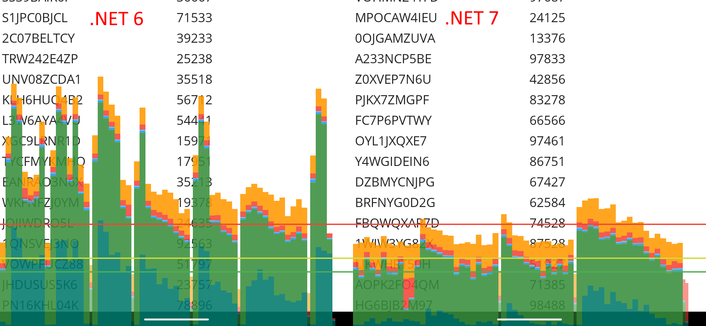

This sample is a `CollectionView` with 10,000 rows of two data-bound
labels.

Simply updating to .NET 7 should result in smaller/faster .NET MAUI
applications. Details below!

## Table Of Contents

Scrolling and Layout Performance Improvements

* [LOLs per second](#lols-per-second)
* [Avoid Repeated `View.Context` Calls](#avoid-repeated-viewcontext-calls)
* [Avoid `View.Context` Calls in `CollectionView`](#avoid-viewcontext-calls-in-collectionview)
* [Reduce JNI Calls During Layout](#reduce-jni-calls-during-layout)
* [Cache Values for RTL and Dark Mode](#cache-values-for-rtl-and-dark-mode)
* [Avoid Creating `IView[]` During Layout](#avoid-creating-iview-during-layout)
* [Defer RTL Layout Calculations to Platform](#defer-rtl-layout-calculations-to-platform)
* [Further Notes on `CollectionView`](#further-notes-on-collectionview)

Startup Performance Improvements

* [Android NDK Compiler Flags](#android-ndk-compiler-flags)
* [`DateTimeOffset.Now`](#datetimeoffsetnow)
* [Avoid `ColorStateList(int[][],int[])`](#avoid-colorstatelistintint)
* [Improvements to .NET MAUI's AOT Profile](#improvements-to-net-mauis-aot-profile)
* [Better String Comparisons in Java Interop](#better-string-comparisons-in-java-interop)
* [XAML Compilation Improvements](#xaml-compilation-improvements)
* [`ReadyToRun` by Default on Windows](#readytorun-by-default-on-windows)
* [Dual Architectures by Default on macOS](#dual-architectures-by-default-on-macos)
* [Notes about `RegexOptions.Compiled`](#notes-about-regexoptionscompiled)
* [Improvements to Mono's Interpreter](#improvements-to-monos-interpreter)

App Size Improvements

* [Fix `DebuggerSupport` Trimmer Value for Android](#fix-debuggersupport-trimmer-value-for-android)
* [R8 Java Code Shrinker Improvements](#r8-java-code-shrinker-improvements)
* [Feature to Exclude Kotlin-related Files](#feature-to-exclude-kotlin-related-files)
* [Improve AOT Output for Generics](#improve-aot-output-for-generics)

Tooling and Documentation

* [Profiling .NET MAUI Apps](#profiling-net-maui-apps)
* [Measuring Startup Time](#measuring-startup-time)
* [App Size Reporting Tools](#app-size-reporting-tools)
* [Experimental or Advanced Options](#experimental-or-advanced-options)

## Scrolling and Layout Performance Improvements

### LOLs per Second

We have seen benchmarks of different UI frameworks that follow a
pattern, such as:

1. Put text on the screen with a random rotation and color

2. Report how many times a second you can do this

The existing samples were OK, but I found starting from scratch I
could avoid minor performance issues and focus on the raw numbers .NET
MAUI could achieve. This also gave me the opportunity to use the word
"LOL" in the text onscreen, aptly timing the number of "LOLs per
second" we can achieve in .NET MAUI. LOL?

Additionally, we timed different types of apps:

* A Xamarin.Forms application (thanks [@roubachof][roubachof] for the contribution!)
* A .NET MAUI application
* A .NET 6 Android application (using our C# bindings for Android APIs)
* An Android application written in Java

The above apps would all use the same underlying
`Android.Widget.TextView`. Each app should progressively be able to
achieve better results: Xamarin.Forms to MAUI to C# `TextView` to Java
`TextView` (no C# to Java interop):

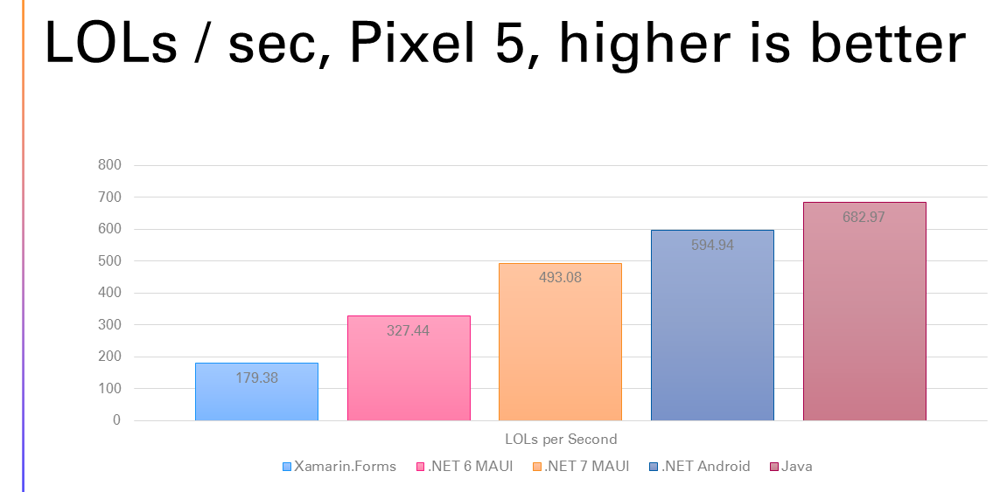

Overall, this concept (although quite fun!) isn't an exact science. My
version of the sample required some duration of `Thread.Sleep()`,
which will certainly vary depending on the device you are running on.
The sample needs to sleep long enough for the UI thread to be able to
keep up with a background thread. Just from visually watching the app,
I tried to pick a `Thread.Sleep()` time where we got a good number of
LOLs per second and the UI appeared to be updating quickly.

However, the sample in itself is still useful:

1. We have a fun, visual comparison between .NET MAUI in .NET 6 vs .NET 7

2. It is a literal gold mine for finding performance issues!

Simply reviewing `dotnet-trace` output of these apps, led to changes
to improve the performance in .NET MAUI of:

* Each `View` added to the screen

* Layout performance

* Scrolling performance

* Navigation between pages

In total, the LOLs per second on a Pixel 5 went from ~327 per second
to ~493 per second moving from .NET 6 to .NET 7:


For full details and source code for this sample/benchmark, see the
[jonathanpeppers/lols][lols] repository on GitHub.

### Avoid Repeated `View.Context` Calls

When reviewing `dotnet-trace` output of the LOLs/second sample, we
noticed:

```csharp
7.60s (14%) mono.android!Android.Views.View.get_Context()
```

There is an interesting Java to C# interop implication in this call.
Since the beginning of Xamarin.Android we've had the behavior:

* C# calls a Java method

* A Java object is returned to C#

* Using the `Handle` of the Java object, find out if we have a C#
  object alive with the same `Handle`.

* If not, create a new C# instance to wrap this object for use in
  managed code.

So you could see how repeated calls to `.Context` would be a
performance concern, after realizing the work happening behind the
scenes.

We found layout-related code in .NET MAUI, such as:

```csharp
var deviceIndependentWidth = widthMeasureSpec.ToDouble(Context);
var deviceIndependentHeight = heightMeasureSpec.ToDouble(Context);
//...
var platformWidth = Context.ToPixels(width);
var platformHeight = Context.ToPixels(height);
```

Where the four calls here could be replaced by a local variable, or
even a member field for the lifetime of this object. This simple
change directly translated to more `Label`'s per second as well as
faster startup and scrolling in .NET MAUI.

See [dotnet/maui#8001][maui-8001] for details about this improvement.

### Avoid `View.Context` Calls in `CollectionView`

In .NET 6, we had some reports of poor CollectionView performance
while scrolling on older Android devices.

Reviewing `dotnet-trace` output, I did find some issues similar to
[dotnet/maui#8001][maui-8001]:

```csharp
317.42ms (1.1%) mono.android!Android.Views.View.get_Context()
```

1% of the time was spent in repeated calls to `View.Context` inside the
`ItemContentView` class, such as:

```csharp
if (pixelWidth == 0)
{
    pixelWidth = (int)Context.ToPixels(measure.Width);
}
if (pixelHeight == 0)
{
    pixelHeight = (int)Context.ToPixels(measure.Height);
}
//...
var x = (int)Context.ToPixels(mauiControlsView.X);
var y = (int)Context.ToPixels(mauiControlsView.Y);
var width = Math.Max(0, (int)Context.ToPixels(mauiControlsView.Width));
var height = Math.Max(0, (int)Context.ToPixels(mauiControlsView.Height));
```

Making a new overload for `ContextExtensions.FromPixel()`, we were
able to remove all of these `View.Context` calls.

After these changes, we see a huge difference in the time spent in
this method:

```csharp
1.30ms (0.01%) mono.android!Android.Views.View.get_Context()
```

We also tested these changes with the "janky frames" profiler in
Android Studio, which gives information like this on Android 12+
devices (such as a Pixel 4a). We could see several dropped frames when
scrolling a `CollectionView`:

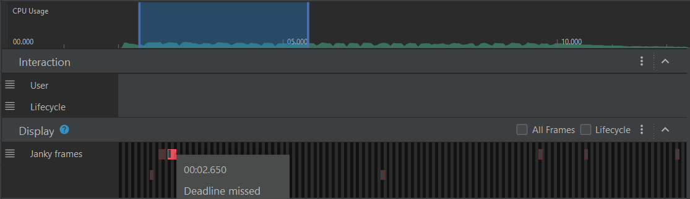

On the same Pixel 4a afterward, we only saw a single dropped frame:

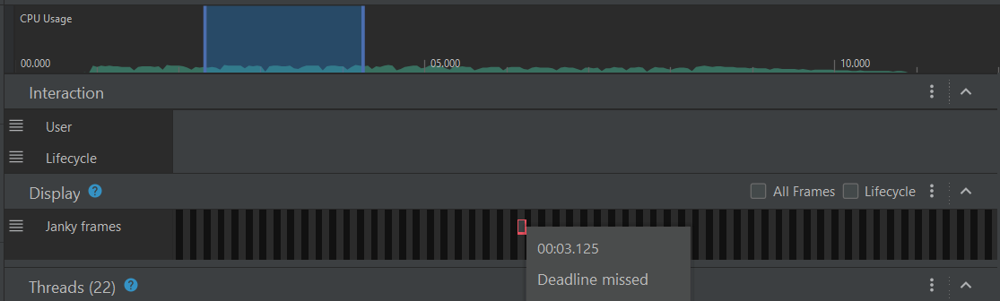

We could also test these changes with [Android's visual GPU
profiler][gpu-profiler], seeing a visual difference in before:

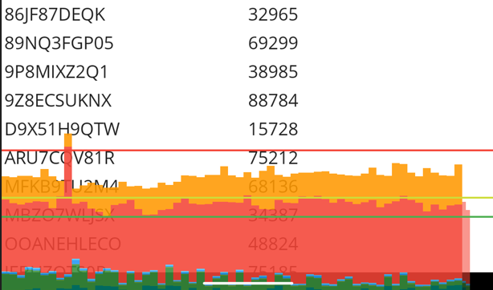

Versus afterward:

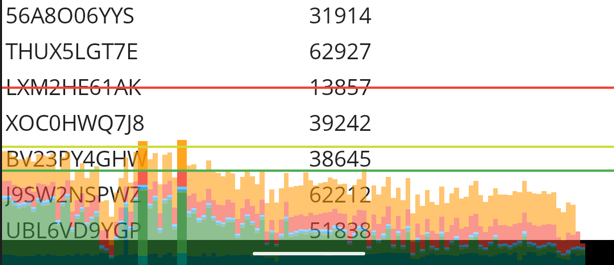

The larger bars represents time spent in code paths that attribute to
a poor framerate. These changes should improve the performance of
scrolling for any .NET MAUI `CollectionView` on Android.

See [dotnet/maui#8243][maui-8243] for details about this improvement.

### Reduce JNI Calls During Layout

While profiling customer sample similar to the "LOLs per second" app,
we noticed a decent chunk of time spent measuring Android `View`'s:

```csharp
932.51ms (7.4%)  mono.android!Android.Views.View.Measure(int,int)
115.53ms (0.91%) mono.android!Android.Views.View.get_MeasuredWidth()
 96.97ms (0.77%) mono.android!Android.Views.View.get_MeasuredHeight()
```

This led us to write a Java method that calls all three Java APIs and
return `MeasuredWidth` and `MeasuredHeight`. After a little research,
it seemed the best approach here was to "pack" two integers into a
`long`. If we tried to return some Java object instead, then we'd have
the same number of JNI calls to get the integers out.

The Java side implementation arrives at:

```java
public static long measureAndGetWidthAndHeight(View view, int widthMeasureSpec, int heightMeasureSpec) {
    view.measure(widthMeasureSpec, heightMeasureSpec);
    int width = view.getMeasuredWidth();
    int height = view.getMeasuredHeight();
    return ((long)width << 32) | (height & 0xffffffffL);
}
```

Which is unpacked in C# via:

```csharp
var packed = PlatformInterop.MeasureAndGetWidthAndHeight(platformView, widthSpec, heightSpec);
var measuredWidth = (int)(packed >> 32);
var measuredHeight = (int)(packed & 0xffffffffL);
```

So instead of three transitions from C# to Java, we now have one. It
appears the performance of the additional math is negligible compared
to reducing the amount of interop overhead in this example.

Measuring again *after* the change, we were able to see an obvious
savings in this method:

```diff
--783.92ms (6.2%) microsoft.maui!Microsoft.Maui.ViewHandlerExtensions.GetDesiredSizeFromHandler
++528.96ms (4.5%) microsoft.maui!Microsoft.Maui.ViewHandlerExtensions.GetDesiredSizeFromHandler
```

Which also translated to more `Label`'s per second in the sample app.

See [dotnet/maui#8034][maui-8034] for details about this improvement.

### Cache Values for RTL and Dark Mode

While profiling customer sample similar to the "LOLs per second" app,
we noticed time spent calculating if the OS is in Dark Mode or a
Right-to-Left language:

```csharp
1.06s (6.3%) Microsoft.Maui.Essentials!Microsoft.Maui.ApplicationModel.AppInfoImplementation.get_RequestedLayoutDirection()
4.46ms (0.03%) Microsoft.Maui.Essentials!Microsoft.Maui.ApplicationModel.AppInfoImplementation.get_RequestedTheme()
```

This appears to happen for every .NET MAUI `View` on Android, so this
impacts startup time, scrolling, etc.

Reviewing the `AppInfoImplementation` class on Android, we could
simply use `Lazy<T>` for every value that queries
`Application.Context`. These values cannot change after the app
launches, so they don't need to be computed on every call.

This should also improve subsequent calls to various Maui.Essentials
APIs on Android.

See [dotnet/maui#7996][maui-7996] for details about this improvement.

### Avoid Creating `IView[]` During Layout

While profiling customer sample similar to the "LOLs per second" app,
time was spent ordering views by their `ZIndex` such as:

```csharp
3.42s (16%)  microsoft.maui!Microsoft.Maui.Handlers.LayoutHandler.Add(Microsoft.Maui.IView)
1.52s (7.3%) microsoft.maui!Microsoft.Maui.Handlers.LayoutExtensions.GetLayoutHandlerIndex()
1.50s (7.2%) microsoft.maui!Microsoft.Maui.Handlers.LayoutExtensions.OrderByZIndex(Microsoft.Maui.ILayout)
```

Reviewing the code in `OrderByZIndex()`, it did the following:

* Make a `record ViewAndIndex(IView View, int Index)` for each child
* Make a `ViewAndIndex[]` the size of the number of children
* Call `Array.Sort()`
* Make a `IView[]` the size of the number of children
* Iterate twice over the arrays in the process

Then the `GetLayoutHandlerIndex()` method, did all the same work to
create an `IView[]`, get the index, then throws the array away.

To improve this process, we made the following changes:

* Removed much of the above code and used a System.Linq `OrderBy()`
with "fast paths" for 0 or 1 children.
* Made an `internal` `EnumerateByZIndex()` method for use by `foreach`
loops. This avoids creating arrays in those cases.

After these changes, the time dropped substantially in `dotnet-trace`
output:

```csharp
  1.84s (13%)    microsoft.maui!Microsoft.Maui.Handlers.LayoutHandler.Add(Microsoft.Maui.IView)
352.24ms (2.50%) microsoft.maui!Microsoft.Maui.Handlers.LayoutExtensions.GetLayoutHandlerIndex()
181.27ms (1.30%) microsoft.maui!Microsoft.Maui.Handlers.LayoutExtensions.<>c.<EnumerateByZIndex>b__0_0(Microsoft.Maui.IView)
  2.78ms (0.02%) microsoft.maui!Microsoft.Maui.Handlers.LayoutExtensions.EnumerateByZIndex(Microsoft.Maui.ILayout)
```

We also saw a significant increase in the number of `Label`'s a second
in the customer sample. `System.Linq` was used in the improvement,
which goes a little against traditional guidance to avoid it. In this
case, the code was implementing its own version of `OrderBy()`, where
we could just use `OrderBy()` instead. "Rolling your own"
`System.Linq` is generally not a great idea, unless you have
benchmarks showing your implementation is better.

This change should improve layout performance of all .NET MAUI
applications on any platform.

See [dotnet/maui#8250][maui-8250] for details about this improvement.

### Defer RTL Layout Calculations to Platform

When profiling our [LOLs per second][lols] sample app, a percentage of
time is spent calculating if each view is setup to support "Right to
Left" languages or not:

```csharp
290.86ms (1.4%)    microsoft.maui!Microsoft.Maui.Layouts.LayoutExtensions.ShouldArrangeLeftToRight(Microsoft.Maui.IView)
```

In this sample app, we have a nested layout, 5 views deep, with ~100
`Label`'s on the screen. Each `Label` we ended up querying the same
views for flow direction 500 times.

To solve this issue and many others, the cross-platform implementation
of RTL was removed from .NET MAUI in favor of native APIs on each
platform. This should improve performance and correctness in this
area.

`LayoutExtensions.ShouldArrangeLeftToRight()` is completely removed
from .NET MAUI in .NET 7. This should improve layout performance for
.NET MAUI on all platforms.

See [dotnet/maui#9558][maui-9558] for details about this improvement.

### Further Notes on `CollectionView`

As seen in issue [dotnet/maui#6317][maui-6317], a `CollectionView`
with 10,000 rows contributed to poor startup time and slow scrolling
performance.

In this case, the sample app on a Pixel 5 would start in:

* .NET 6: 16s412ms
* .NET 7: 14s642ms

The root cause here appears to be the specific `.xaml` layout:

```xml
<ContentPage ...>
    <ScrollView>
        <VerticalStackLayout>
            <CollectionView 
                ItemsSource="{Binding Bots}"
                HorizontalOptions="FillAndExpand"
                VerticalOptions="FillAndExpand">
```

The `CollectionView` is placed inside a `VerticalStackLayout` that
will happily expand to an infinite height. Then subsequently placed
inside a `ScrollView` (which isn't necessary because `CollectionView`
supports scrolling). This effectively causes the `CollectionView` to
"realize" all 10,000 rows, and voids any virtualization of the
control.

To solve this issue, we could simply remove the outer views:

```xml
<ScrollView>
    <VerticalStackLayout>
```

Resulting with an identical look and feel on screen, and a drastically
improved ~822ms (94% shorter!) startup time on a Pixel 5.

If you're getting similar behavior in a `CollectionView`, verify that
the rows are actually virtualized and not wrapped in unnecessary
views. In future .NET releases, we are working on ways to prevent
someone falling into this trap accidentally.

## Startup Performance Improvements

### Android NDK Compiler Flags

When we first got .NET MAUI running on early previews of .NET 7, we
noticed a regression to both startup & app size:

* A ~1.5MB increase in `libmonosgen-2.0.so`, the Android native
  library for the Mono runtime.
* A ~250ms increase in startup time

In NDK23b, Google decided to no longer pass the `-O2` compiler
optimization flag for arm64 as part of the Android toolchain. Instead
the flag is decided by upstream CMake behavior, see
[android/ndk#1536][ndk-1536]. Thus we needed to specify the
optimization flag going forward for the Mono runtime.

We tested three flags to compile `libmonosgen-2.0.so` in a `dotnet new
maui` application:

* `-O3`: 893.7ms
* `-O2`: 600.2ms
* `-Oz`: 649.1ms

Interestingly, `-03` (the new default!) produced a larger *and* slower
`libmonosgen-2.0.so`. We settled on `-O2`, which gave us the same
performance and size we were getting in .NET 6.

See [dotnet/runtime#68354][rt-68354] for details about this improvement.

### DateTimeOffset.Now

Reviewing a customer's .NET 6 Android application, we found a
significant amount of time spent in the very first
`DateTimeOffset.Now` call. In this case it was accidental (`UtcNow`
could simply be used instead), but nevertheless is a common API that
.NET developers are going to use.

Reviewing `dotnet-trace` output, the first call to
`DateTimeOffset.UtcNow` took around 277ms on a Pixel 5 device:

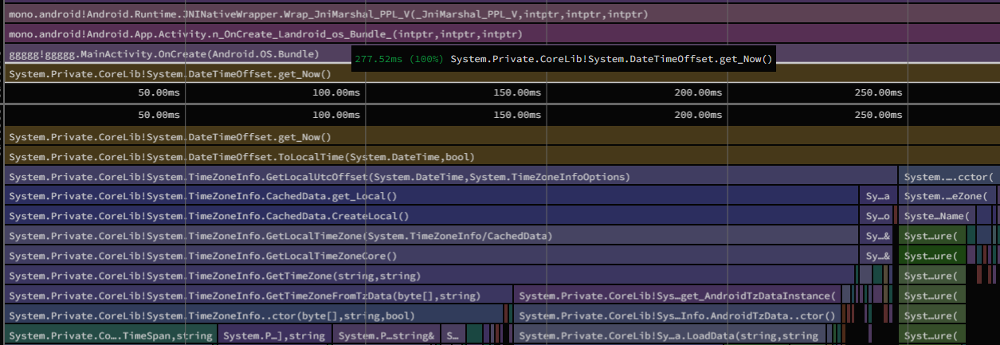

Some of the time here was spent in the JIT, so our first idea was to
record a custom AOT profile (using our experimental
[Mono.AotProfiler.Android][Mono.AotProfiler] package), and see if this
was a good candidate for our standard profile. This got a decent
improvement (~161ms), but the number still seemed like it could be
improved:

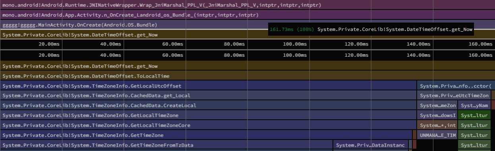

It turns out, the bulk of the time here was spent loading timezone
data -- and then calculating the current time from the result.

Instead, we could:

1. Call an Android Java API for the current time offset. Our startup
   code in the Android workload *is* Java, so it can easily retrieve
   the value for use by the BCL.

2. Load timezone data on a background thread. This results in the
   original BCL behavior when complete, while using the offset from
   Java in the meantime.

This greatly improved `DateTimeOffset.Now` to a mere ~17.67ms -- even
without adding the code path to an AOT profile.

See [dotnet/runtime#74459][rt-74459] and
[xamarin-android#7331][xa-7331] for details about this improvement.

### Avoid `ColorStateList(int[][],int[])`

`dotnet-trace` output of a .NET 6 `dotnet new maui` application shows
time spent creating Android `ColorStateList` objects:

```csharp
16.63ms microsoft.maui!Microsoft.Maui.Platform.ColorStateListExtensions.CreateDefault(int)
16.63ms mono.android!Android.Content.Res.ColorStateList..ctor(int[][],int[])
11.38ms mono.android!Android.Runtime.JNIEnv.NewArray
```

Reviewing the C# binding for this type, reveals part of the
performance impact of this constructor:

```csharp
public unsafe ColorStateList (int[][]? states, int[]? colors)
    : base (IntPtr.Zero, JniHandleOwnership.DoNotTransfer)
{
    //...
    IntPtr native_states = JNIEnv.NewArray (states);
```

There is a general performance problem in passing C# arrays
(especially multidimensional ones) into Java. We have to create a Java
array and copy each array element over to the Java array. We slightly
improved upon this scenario in [xamarin-android#6870][xa-6870], but
the array duplication remains a problem.

To solve this, we can design some internal Java APIs for .NET MAUI like:

```java
@NonNull
public static ColorStateList getDefaultColorStateList(int color)
{
    return new ColorStateList(ColorStates.DEFAULT, new int[] { color });
}

@NonNull
public static ColorStateList getEditTextColorStateList(int enabled, int disabled)
{
    return new ColorStateList(ColorStates.getEditTextState(), new int[] { enabled, disabled });
}
```

And move any C# `const int` values to be completely in Java:

```java
private static class ColorStates
{
    static final int[] EMPTY = new int[] { };
    static final int[][] DEFAULT = new int[][] { EMPTY };

    private static int[][] editTextState;

    static int[][] getEditTextState()
    {
        if (editTextState == null) {
            editTextState = new int[][] {
                new int[] {  android.R.attr.state_enabled },
                new int[] { -android.R.attr.state_enabled },
            };
        }
        return editTextState;
    }
}
```

Usage in C# then could look like:

```csharp
ColorStateList defaultColors = PlatformInterop.GetDefaultColorStateList(color);
ColorStateList editTextColors = PlatformInterop.GetEditTextColorStateList(enabled, disabled);
```

This removes the need for marshaling various `int[]` values to Java,
and we only pass in a single integer parameter for each state the
Android control supports.

Measuring startup after these changes, we instead get:

```csharp
2.44ms microsoft.maui!Microsoft.Maui.Platform.ColorStateListExtensions.CreateDefault(int)
```

Which appears to save ~14ms of startup time on a Pixel 5 in the
`dotnet new maui` template. Other apps that use `Entry`, `CheckBox`,
`Switch`, etc. will also see an improvement to startup time.

See [dotnet/maui#5654][maui-5654] for details about this improvement.

### Improvements to .NET MAUI's AOT Profile

[Startup tracing or Profiled AOT][profiled-aot] is a feature of
Xamarin.Android we brought forward to .NET 6+. This is a mechanism for
AOT'ing the startup path of applications, which improves launch times
significantly with only a modest app size increase.

In .NET 6, we had already recorded a pretty decent AOT profile for .NET
MAUI. However, we added a couple more scenarios to the recorded app to
improve things further.

First, we added flyout content to the profile, such as:

```xml
<Shell ...>
    <FlyoutItem Title="Flyout Item">
        <ShellContent
            Title="Page 1"
            ContentTemplate="{DataTemplate local:MainPage}" />
        <ShellContent
            Title="Page 2"
            ContentTemplate="{DataTemplate local:MainPage}" />
    </FlyoutItem>
</Shell>
```

This simple change improved the startup of the [.NET Podcast sample
app][podcast] by around 25ms.

Secondly, we added a scenario of a non-Shell .NET MAUI app using
`FlyoutPage`. Shell is the default navigation pattern in .NET MAUI,
but developers familiar with Xamarin.Forms may want to use APIs such
as `FlyoutPage`, `NavigationPage`, and `TabPage`.

So for example, `AppFlyoutPage.xaml`:

```xml
<FlyoutPage ...>
    <FlyoutPage.Detail>
        <local:Tabs Title="Detail"></local:Tabs>
    </FlyoutPage.Detail>
    <FlyoutPage.Flyout>
        <ContentPage Title="Flyout">
            <VerticalStackLayout>
                <Label Text="Flyout Item 1"></Label>
                <Label Text="Flyout Item 2"></Label>
                <Label Text="Flyout Item 3"></Label>
                <Label Text="Flyout Item 4"></Label>
            </VerticalStackLayout>
        </ContentPage>
    </FlyoutPage.Flyout>
</FlyoutPage>
```

Then we can simply replace `MainPage` during the AOT profile recording:

```csharp
App.Current.MainPage = new AppFlyoutPage();
```

This improved startup of a template project using `FlyoutPage` by
about 12ms. To go even further with your .NET MAUI application, it is
possible to record a completely custom AOT profile for your app. See
our experimental [Mono.AotProfiler.Android][Mono.AotProfiler] package
for details.

See [dotnet/maui#8939][maui-8939] and [dotnet/maui#8941][maui-8941]
for details about these improvements.

### Better String Comparisons in Java Interop

`dotnet-trace` output of a .NET MAUI application revealed:

```csharp
21.28ms (0.45%) java.interop!Java.Interop.JniRuntime.JniTypeManager.AssertSimpleReference(string,string)
```

*Note that changes to [Android NDK Compiler Flags](#android-ndk-compiler-flags) may have also contributed to the above timing.*

Reviewing the method, it is mostly assertions around the string syntax
of `jniSimpleReference`:

```csharp
internal static void AssertSimpleReference (string jniSimpleReference, string argumentName = "jniSimpleReference")
{
    if (jniSimpleReference == null)
        throw new ArgumentNullException (argumentName);
    if (jniSimpleReference != null && jniSimpleReference.IndexOf (".", StringComparison.Ordinal) >= 0)
        throw new ArgumentException ("JNI type names do not contain '.', they use '/'. Are you sure you're using a JNI type name?", argumentName);
    if (jniSimpleReference != null && jniSimpleReference.StartsWith ("[", StringComparison.Ordinal))
        throw new ArgumentException ("Arrays cannot be present in simplified type references.", argumentName);
    if (jniSimpleReference != null && jniSimpleReference.StartsWith ("L", StringComparison.Ordinal) && jniSimpleReference.EndsWith (";", StringComparison.Ordinal))
        throw new ArgumentException ("JNI type references are not supported.", argumentName);
}
```

These assertions are needed, as there is now a way to "remap"
underlying Java type names in .NET 7 as implemented in
[xamarin/java.interop#936][ji-936]. This was also compounded by how
many times this method is called in a typical .NET MAUI application on
Android.

However, we can simply improve the method by using the `char` overload
of `string.IndexOf()` and the indexer instead of `string.StartsWith()`:

```csharp
internal static void AssertSimpleReference (string jniSimpleReference, string argumentName = "jniSimpleReference")
{
    if (string.IsNullOrEmpty (jniSimpleReference))
        throw new ArgumentNullException (argumentName);
    if (jniSimpleReference.IndexOf ('.') >= 0)
        throw new ArgumentException ("JNI type names do not contain '.', they use '/'. Are you sure you're using a JNI type name?", argumentName);
    switch (jniSimpleReference [0]) {
        case '[':
            throw new ArgumentException ("Arrays cannot be present in simplified type references.", argumentName);
        case 'L':
            if (jniSimpleReference [jniSimpleReference.Length - 1] == ';')
                throw new ArgumentException ("JNI type references are not supported.", argumentName);
            break;
        default:
            break;
    }
}
```

This resulted in a much smaller time when reviewing these code changes
in `dotnet-trace`:

```csharp
1.21ms java.interop!Java.Interop.JniRuntime.JniTypeManager.AssertSimpleReference(string,string)
```

We found other code in `Java.Interop.JniTypeSignature`'s constructor
that validates the string syntax of Java type names, so we made
similar changes in both places.

See [xamarin/java.interop#1001][ji-1001] and
[xamarin/java.interop#1002][ji-1002] for details about these
improvements.

### XAML Compilation Improvements

[XAML Compilation][xamlc] (or XamlC) in .NET MAUI is on by default,
transforming your `.xaml` files directly to IL at build time.

To illustrate this, take a couple `<Image/>` elements:

```xml
<Image Source="https://picsum.photos/200/300" />
<Image Source="foo.png" />
```

In a `Debug` build, the `.xaml` is validated to give good error
messages about mistakes, but not written to disk. In a `Release`
build, however, this `.xaml` is emitted directly into your .NET
assembly as IL.

In .NET 6, the above would `.xaml` would compile to the equivalent of:

```csharp
var image1 = new Image();
image1.Source = new ImageSourceConverter().ConvertFromInvariantString("foo.png");
var image2 = new Image();
image2.Source = new ImageSourceConverter().ConvertFromInvariantString("https://picsum.photos/200/300");
```

.NET MAUI's type converters take `string` values at runtime and
convert them into the appropriate type. These are not as performant as
if you created plain C# objects directly. Even the `dotnet new maui`
template with a single `<Image/>` shows an impact of the above code:

```csharp
1.17ms (<0.01%) microsoft.maui.controls!Microsoft.Maui.Controls.ImageSourceConverter.ConvertFrom()
```

[XamlC][xamlc] has a concept of *compiled* type converters, when
implemented for `ImageSource` generates better code:

```csharp
var image1 = new Image();
image1.Source = ImageSource.FromUri(new Uri("foo.png", UriKind.Absolute));
var image2 = new Image();
image2.Source = ImageSource.FromFile("https://picsum.photos/200/300");
```

This treatment was applied for every type converter currently used at
runtime in the `dotnet new maui` template:

* [`ImageSource`][maui-8843]
* [`StrokeShape`][maui-8849]
* [`Brush`][maui-8567]
* [`Point`][maui-8599]

This results in better/faster generated IL from `.xaml` files on all
platforms .NET MAUI supports.

### `ReadyToRun` by Default on Windows

When the .NET Fundamentals team implemented .NET MAUI startup tracking
for Windows, we found a huge "easy win" to improve startup.
[`ReadyToRun`][readytorun] (or R2R) is not enabled by default in .NET
6 MAUI applications on Windows. R2R is form of ahead-of-time (AOT)
compilation that can be used on platforms running the CoreCLR runtime
(such as Windows).

Simply adding `-p:PublishReadyToRun=true` resulted in a huge
improvement in our graphs:


*Note that this graph is running the .NET MAUI application on an Azure DevOps hosted pool, so the times here are a bit worse than what we see on desktop PCs or laptops.*

This made us consider making `PublishReadyToRun` default for `Release`
builds on Windows. .NET MAUI is built on top of [`WinUI3` and the
Windows App SDK][winui3] to leverage the latest UI framework and APIs
for Windows. `WinUI3` templates already set `PublishReadyToRun` by
default for `Release` mode, so this was a "no-brainer" to bring to .NET
MAUI by default.

Note that `PublishReadyToRun` does increase application size, so if
this is undesirable, you can simply set `PublishReadyToRun` to `false`
in your project file.

See [dotnet/maui#9357][maui-9357] for details about this improvement.

### Dual Architectures by Default on macOS

A customer reported this behavior in their .NET MAUI application
running on macOS:

1. Launching the app after first install -- over four seconds.
2. Subsequent launches are under one second.
3. A reboot causes the next launch of the application to be slow again.

It turns out, the application was built for `x86_64` and running on an
M1 (`arm64`) MacBook. This behavior is what you would see when
[`Rosetta`][rosetta], Apple's translation technology for Apple silicon
processors, is in effect:

> To the user, Rosetta is mostly transparent. If an executable
> contains only Intel instructions, macOS automatically launches
> Rosetta and begins the translation process. When translation
> finishes, the system launches the translated executable in place of
> the original. However, the translation process takes time, so users
> might perceive that translated apps launch or run more slowly at
> times.

We could avoid [`Rosetta`][rosetta] translation behavior by building
the application for multiple architectures:

```xml
<RuntimeIdentifiers Condition=" == 'MacCatalyst' ">maccatalyst-x64;maccatalyst-arm64</RuntimeIdentifiers>
```

The `MacCatalyst` workload, in this case, builds for both
architectures, merging both architectures into the final app.

This led us to default to building two architectures in `Release` mode
for both `net7.0-maccatalyst` and `net7.0-macos` applications. In most
cases, developers will want a dual-architecture application for the
App Store. If this is undesirable, you can define a single
`$(RuntimeIdentifier)` in your project file to opt out.

To verify what architecture your .NET MAUI application is built for,
you can run:

```bash
file /Applications/YourApp.app/Contents/MacOS/YourApp
/Applications/YourApp.app/Contents/MacOS/YourApp: Mach-O 64-bit executable x86_64
```

Where a dual-architecture binary would result with:

```bash
file /Applications/YourApp.app/Contents/MacOS/YourApp
/Applications/YourApp.app/Contents/MacOS/YourApp: Mach-O universal binary with 2 architectures:
- Mach-O 64-bit executable x86_64
- Mach-O 64-bit executable arm64
/Applications/YourApp.app/Contents/MacOS/YourApp (for architecture x86_64):    Mach-O 64-bit executable x86_64
/Applications/YourApp.app/Contents/MacOS/YourApp (for architecture arm64):    Mach-O 64-bit executable arm64
```

See [xamarin-macios#15769][xi-15769] for details about this improvement.

### Notes about `RegexOptions.Compiled`

As seen in issue [dotnet/runtime#71007][rt-71007], a customer's app
was spending ~258ms creating a `Regex` object in the .NET 6 version of
their app, that was significantly higher than the previous
Xamarin.Android counterpart:

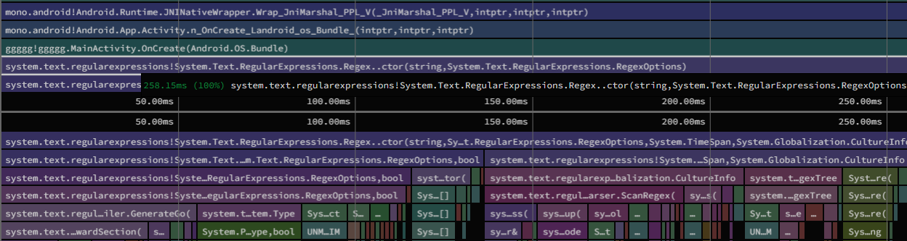

This showed up as a regression from Xamarin.Android to .NET 6, because
`RegexOptions.Compiled` was not implemented at all in the BCL from
mono/mono. While `RegexOptions.Compiled` *is* implemented in the BCL
from .NET Core (and .NET 6+). The new behavior is that time is spent
calling `System.Reflection.Emit` to generate code at runtime to make
future `Regex` calls faster.

In this example, the `Regex` was only used once, so the setting was
not actually needed at all. Avoid using `RegexOptions.Compiled`,
unless you really *are* using the `Regex` many times, and are willing
to pay the startup cost for improved throughput.

However! We have an *even better* solution in .NET 7, as described in
[Regular Expression Improvements in .NET 7][net7-regex].

So for example, take the following usage of `RegexOptions.Compiled`:

```csharp
private static readonly Regex s_myCoolRegex = new Regex("abc|def", RegexOptions.Compiled | RegexOptions.IgnoreCase);
...
if (s_myCoolRegex.IsMatch(text)) { ... }
```

We can rewrite this in .NET 7 using `[RegexGenerator]`, such as:

```csharp
[RegexGenerator("abc|def", RegexOptions.IgnoreCase)]
private static partial Regex MyCoolRegex();
...
if (MyCoolRegex().IsMatch(text)) { ... }
```

Testing the new `Regex` implementation in a [sample Android
app][android-regex], shows a noticeable improvement to startup time:

```diff
--Average(ms): 307.9
--Std Err(ms): 2.38723456930585
--Std Dev(ms): 7.54909854809757
++Average(ms): 214.4
++Std Err(ms): 3.06666666666667
++Std Dev(ms): 9.69765149118303
```

An average of 10 runs on a Pixel 5, shows a total ~93.5ms savings to
startup just by using the new `Regex` APIs.

Diving deeper into `dotnet-trace` output, we can see `RegexOptions.Compiled` taking:

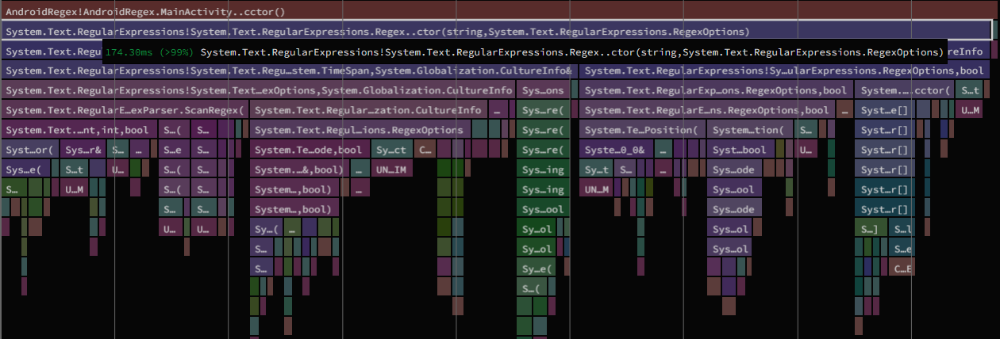
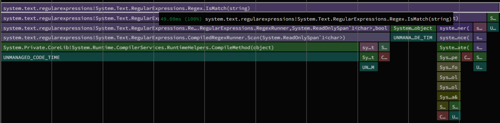

`[RegexGenerator]` is now so fast that the static constructor of
`MainActivity` completely disappears from the trace. We are merely
left with:

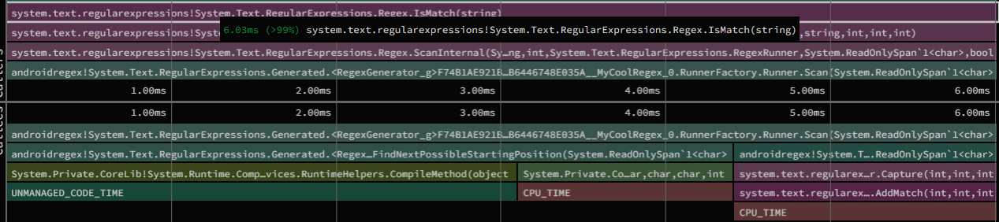

There is even a built-in refactoring inside of Visual Studio to
quickly make this change in your own applications:

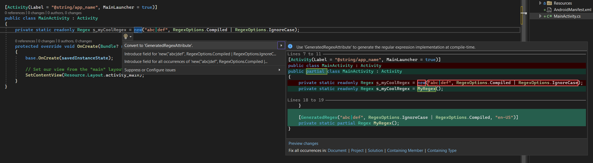

### Improvements to Mono's Interpreter

In .NET MAUI, the Mono runtime's interpreter is used in two main scenarios:

* C# Hot Reload: when debugging (or `Debug` configurations), the Mono
  interpreter is used by default.

* iOS (and other Apple platforms) where JIT is restricted: the
  interpreter enables APIs like `System.Reflection.Emit`.

In .NET 7, Mono's interpreter has gained "tiered compilation". Where
startup is greatly improved in methods that are only called once (or
very few times). When a certain threshold of calls occurs, an
optimization pass takes place on the intermediate representation (IR)
of the code. This lets the interpreter achieve fast performance in
frequently called code-paths in your applications.

We can see the direct result of these changes in a Blazor WASM
application:

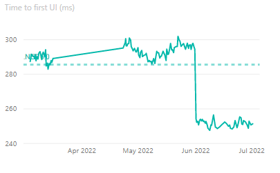

However, we are also able to see a decent improvement in .NET MAUI
scenarios. For example, take the following .NET MAUI applications
running on a Pixel 5 device with solely the interpreter enabled:

| Application        | Version | Startup Time(ms) |
|------------------- |---------| ----------------:|
| dotnet new maui    |  .NET 6 |            978.0 |
| dotnet new maui    |  .NET 7 |            775.3 |
| .NET Podcast       |  .NET 6 |           1171.1 |
| .NET Podcast       |  .NET 7 |            972.9 |

With these changes, you can expect .NET MAUI applications on iOS & Mac
to have improved startup performance for the interpreter. We can also
expect "inner development loop" improvements for Debugging and Hot
Reload scenarios.

See [dotnet/runtime#68823][rt-68823] for details about this
improvement.

## App Size Improvements

### Fix `DebuggerSupport` Trimmer Value for Android

Reviewing .NET trimmer output for .NET 6 Android applications, we
found methods decorated with attributes such as:

* `System.Diagnostics.DebuggableAttribute`
* `System.Diagnostics.DebuggerBrowsableAttribute`
* `System.Diagnostics.DebuggerDisplayAttribute`
* `System.Diagnostics.DebuggerHiddenAttribute`
* `System.Diagnostics.DebuggerStepThroughAttribute`
* `System.Diagnostics.DebuggerVisualizerAttribute`

Were not being *removed* in `Release` builds, attributing to larger
application sizes.

We discovered the underlying cause was an incorrect value for the
`$(DebuggerSupport)` trimmer flag, after fixing this, a "Hello World"
Android application saw the following improvements:

```diff
--Java.Interop.dll             59419 bytes
++Java.Interop.dll             58642 bytes
--Mono.Android.dll             89327 bytes
++Mono.Android.dll             87877 bytes
--System.Private.CoreLib.dll  532428 bytes
++System.Private.CoreLib.dll  472318 bytes
--Overall package:           2738143 bytes
++Overall package:           2676703 bytes
```

This change will improve application size of all .NET 7 Android
applications.

See [xamarin-android#7176][xa-7176] for details about this
improvement.

### R8 Java Code Shrinker Improvements

[R8](https://r8.googlesource.com/r8/) is whole-program optimization,
shrinking and minification tool that converts java byte code to
optimized Android dex code. `R8` can be too aggressive, and remove
something that is called by Java reflection, etc. We don't yet have a
good approach for making this the default across all .NET Android
applications.

However, in .NET 7, we now pass any included `proguard.txt` files from
Android `.aar` libraries to `R8`. AndroidX libraries that are
implicitly used by .NET MAUI will use the ProGuard rules provided by
Google. This should result in less problems when enabling R8 in .NET 7
Android applications.

To opt into using `R8` for `Release` builds, add the following to your
`.csproj`:

```xml
<!-- NOTE: not recommended for Debug builds! -->
<AndroidLinkTool Condition="'$(Configuration)' == 'Release'">r8</AndroidLinkTool>
```

See [xamarin-android#5310][xa-5310] for details about this
improvement.

### Feature to Exclude Kotlin-related Files

Recent changes to Google's AndroidX libraries are bringing more and
more APIs implemented in Kotlin instead of Java. One result of this
change, is additional "stuff" added to Android `.apk` files.

In the case of a `dotnet new maui` app:

* `kotlin` directory: 386,289 bytes uncompressed, 154,519 bytes compressed
* `DebugProbesKt.bin`:  1,719 bytes uncompressed,     777 bytes compressed

These files are general metadata from Kotlin, and are not used or
needed in .NET Android applications. The `kotlin` folder has files
with names such as `kotlin/Error.kotlin_metadata`.

We added a new MSBuild item group to exclude custom files from the
final Android application. By default we include the following exclusions:

```xml
<ItemGroup>
  <AndroidPackagingOptionsExclude Include="DebugProbesKt.bin" />
  <AndroidPackagingOptionsExclude Include="$([MSBuild]::Escape('*.kotlin_*')" />
</ItemGroup>
```

This removes the extra files from any .NET 7+ Android application. It
also gives developers the flexibility to remove other files in the
future if needed.

See [xamarin-android#7356][xa-7356] for details about this improvement.

### Improve AOT Output for Generics

To improve the generated AOT code size of .NET 7 iOS applications, the
following cases are now implemented:

* If a generic method or a method of a generic type has all type
  parameters constrained to value types - methods for reference types
  will not be generated.

* If a generic method or a method of a generic type has all type
  parameters constrained to reference types - methods for value types
  will not be generated.

In both cases, we were generating AOT code for methods that were not
possible to be called. This is impactful for a large assembly like
`System.Private.CoreLib.dll`.

The results of this change in a "hello world" iOS application:

| File                              |   Before |    After |    diff |      % |
|:----                              |     ----:|     ----:|    ----:|   ----:|
| HelloiOS                          | 19539824 | 19158672 | -381152 | -1,95% |
| System.Private.CoreLib.dll-llvm.o |  6870572 |  6734416 | -136156 | -1,98% |

See [dotnet/runtime#70838][rt-70838] for details about this
improvement.

## Tooling and Documentation

### Profiling .NET MAUI Apps

The way to profile your .NET MAUI application varies depending on the
platform. Mobile platforms leverage `dotnet-trace` and
`dotnet-dsrouter`, while Windows desktop applications have access to
[PerfView][perfview].

To gather instructions for various platforms, we've aggregated docs for:

* [.NET MAUI, in general][profile-docs-0]
* [Android][profile-docs-1]
* [iOS, macOS, and MacCatalyst][profile-docs-2]
* [Windows][profile-docs-3]

This should assist in profiling your own code -- the same way we would
profile to optimize .NET MAUI itself.

### Measuring Startup Time

Just like profiling, the way to measure a .NET MAUI application's
startup time is drastically different on each platform.

We've collected guidance such as:

* [.NET MAUI, in general][startup-docs-0]
* [Google's Android Documentation][startup-docs-1]
* [.NET Android Startup Documentation][startup-docs-2]
* [Apple's iOS Documentation][startup-docs-3]
* [.NET iOS Startup Documentation][startup-docs-4]
* [Windows/.NET MAUI][startup-docs-5]

Additionally, we have a [`measure-startup`][measure-startup] tool for
measuring startup for desktop .NET MAUI applications on Windows or macOS.

This tool can be built from source such as:

```bash
git clone https://github.com/jonathanpeppers/measure-startup.git
cd measure-startup
dotnet run -- dotnet help
```

Everything after `--` for `dotnet run` are arguments passed to
`measure-startup`, where this example times how long the `dotnet`
command launches and takes to print the text `help`. This example
isn't that useful, but can be easily applied to a .NET MAUI
application.

To measure a .NET MAUI app, first add a subscription to your main
`Page`'s `Loaded` event:

```csharp
Loaded += (sender, e) => Dispatcher.Dispatch(() => Console.WriteLine("loaded"));
```

`Dispatcher` is used to give the app one pass for rendering/layout. In
an app using `BlazorWebView`, you might consider logging this message
when the web view finishes loading.

On Windows, build the app for `Release` mode, such as:

```dotnetcli
dotnet publish -f net7.0-windows10.0.19041.0 -c Release
```

You can then measure startup time via:

```dotnetcli
dotnet run -c Release -- bin\Release\net7.0-windows10.0.19041.0\win10-x64\publish\YourApp.exe loaded
```

This launches `YourApp.exe` recording the time it takes for `loaded`
to be printed to stdout:

```md
0:00:07.0961628
Dropping first run...
0:00:01.4743315
0:00:01.4700848
0:00:01.4834235
0:00:01.4752893
0:00:01.4695317
Average(ms): 1474.53216
Std Err(ms): 2.4945246400065977
Std Dev(ms): 5.577926666602944
```

This also works for .NET MAUI applications running on macOS:

```dotnetcli
dotnet publish -f net7.0-maccatalyst -c Release
dotnet run -- bin/Release/net7.0-maccatalyst/YourApp.app/Contents/MacOS/YourApp loaded
```

If the [`measure-startup`][measure-startup] tool is useful for you,
let us know. We can release it as a .NET global tool on NuGet.org if
there is enough interest.

### App Size Reporting Tools

To assist with diagnosing app size, we have two tools for Android and
iOS: [`apkdiff`][apkdiff] and [`dotnet-appsize-report`][appsize-report].

[`apkdiff`][apkdiff] can compare sizes between two Android `.apk`
files and report what changed.

To simulate what will be delivered to a user's device from Google Play
(which now uses [Android App Bundles][app-bundles]), build an `.apk`
for a single architecture:

```dotnetcli
dotnet build -c Release -f net7.0-android -r android-arm64 -p:AndroidPackageFormat=apk
```

Google Play delivers a device-specific `.apk` to users' devices, and
so we can mimic this behavior by building for a single runtime
identifier: `-r android-arm64`.

You can compare two `.apk` files, using `apkdiff` such as:

```dotnetcli
dotnet tool install --global apkdiff
...
apkdiff -f before.apk after.apk
Size difference in bytes ([*1] apk1 only, [*2] apk2 only):
+           8 lib/arm64-v8a/libaot-Microsoft.Maui.Controls.Xaml.dll.so
-         608 lib/arm64-v8a/libaot-Microsoft.Maui.Controls.Compatibility.dll.so
-       3,448 lib/arm64-v8a/libaot-Microsoft.Maui.Controls.dll.so
-       4,424 lib/arm64-v8a/libaot-Microsoft.Maui.dll.so
-       5,656 lib/arm64-v8a/libaot-Microsoft.NetConf2021.Maui.dll.so
-     129,617 assemblies/assemblies.blob
Summary:
-     129,617 Other entries -1.03% (of 12,605,899)
+           0 Dalvik executables 0.00% (of 11,756,376)
-      14,128 Shared libraries -0.10% (of 14,849,096)
-     131,072 Package size difference -0.64% (of 20,380,049)
```

Likewise for iOS, we have [`dotnet-appsize-report`][appsize-report]:

```dotnetcli
git clone https://github.com/rolfbjarne/dotnet-appsize-report.git
cd dotnet-appsize-report
dotnet run -- -i path/to/bin/Release/net7.0-ios/YourApp.app
```

Which can give reports for:

```dotnetcli
App size report for YourApp.app

1) View 167 assemblies
2) View 381 namespaces
3) View 26592 types
q) Quit
```

And show .NET assemblies, namespaces, or types sorted by IL size. For
example:

```md
Assembly                                            Types    IL Size         File size
System.Private.CoreLib                              2,157  1,126,514   3,605,144 bytes
System.Private.Xml                                  1,667  1,378,583   3,099,800 bytes
Microsoft.iOS                                      14,978  5,086,414  24,121,232 bytes
```

### Experimental or Advanced Options

Just as in .NET 6, many of the same experimental or advanced options
are still available in .NET 7:

* [R8 Java Code Shrinker](https://devblogs.microsoft.com/dotnet/performance-improvements-in-dotnet-maui/#r8-java-code-shrinker)
* [AOT Everything](https://devblogs.microsoft.com/dotnet/performance-improvements-in-dotnet-maui/#aot-everything)
* [AOT and LLVM](https://devblogs.microsoft.com/dotnet/performance-improvements-in-dotnet-maui/#aot-and-llvm)
* [Record a Custom AOT Profile](https://devblogs.microsoft.com/dotnet/performance-improvements-in-dotnet-maui/#record-a-custom-aot-profile)

In future .NET releases, we will work toward making some of these
settings the default -- where it best makes sense.

## Conclusion

We hope that our continued investment in performance in .NET MAUI will
be helpful for your own cross-platform desktop and mobile
applications. *Always be profiling!*

Please try out .NET MAUI, file issues, or learn more at
[http://dot.net/maui](https://dot.net/maui)!

[mauiperf]: https://devblogs.microsoft.com/dotnet/performance-improvements-in-dotnet-maui/
[netperf]: https://devblogs.microsoft.com/dotnet/performance_improvements_in_net_7/
[Mono.AotProfiler]: https://github.com/jonathanpeppers/Mono.Profiler.Android#usage-of-the-aot-profiler
[lols]: https://github.com/jonathanpeppers/lols
[roubachof]: https://github.com/roubachof
[podcast]: https://github.com/microsoft/dotnet-podcasts
[profiled-aot]: https://devblogs.microsoft.com/xamarin/faster-startup-times-with-startup-tracing-on-android/
[xamlc]: https://learn.microsoft.com/dotnet/maui/xaml/xamlc
[perfview]: https://github.com/microsoft/perfview
[measure-startup]: https://github.com/jonathanpeppers/measure-startup
[appsize-report]: https://github.com/rolfbjarne/dotnet-appsize-report
[apkdiff]: https://github.com/radekdoulik/apkdiff
[app-bundles]: https://developer.android.com/guide/app-bundle
[readytorun]: https://docs.microsoft.com/dotnet/core/deploying/ready-to-run
[winui3]: https://learn.microsoft.com/windows/apps/winui/winui3/
[rosetta]: https://developer.apple.com/documentation/apple-silicon/about-the-rosetta-translation-environment
[gpu-profiler]: https://developer.android.com/topic/performance/rendering/inspect-gpu-rendering
[net7-regex]: https://devblogs.microsoft.com/dotnet/regular-expression-improvements-in-dotnet-7/
[android-regex]: https://github.com/jonathanpeppers/AndroidRegex
[collectionview-sample]: https://github.com/Kalyxt/Test_CollectionView

[profile-docs-0]: https://github.com/dotnet/maui/wiki/Profiling-.NET-MAUI-Apps
[profile-docs-1]: https://github.com/xamarin/xamarin-android/blob/main/Documentation/guides/tracing.md
[profile-docs-2]: https://github.com/xamarin/xamarin-macios/wiki/Profiling
[profile-docs-3]: https://github.com/dotnet/maui/wiki/Profiling-.NET-MAUI-Apps#windows--perfview

[startup-docs-0]: https://github.com/dotnet/maui/wiki/Profiling-.NET-MAUI-Apps#measuring-startup-times
[startup-docs-1]: https://developer.android.com/topic/performance/vitals/launch-time
[startup-docs-2]: https://github.com/xamarin/xamarin-android/blob/main/Documentation/guides/profiling.md#overall-startup
[startup-docs-3]: https://developer.apple.com/documentation/xcode/reducing-your-app-s-launch-time
[startup-docs-4]: https://github.com/xamarin/xamarin-macios/wiki/Profiling-App-Launch
[startup-docs-5]: https://github.com/dotnet/maui/wiki/Profiling-.NET-MAUI-Apps#windows

[ndk-1536]: https://github.com/android/ndk/issues/1536

[rt-68354]: https://github.com/dotnet/runtime/pull/68354
[rt-68823]: https://github.com/dotnet/runtime/pull/68823
[rt-70838]: https://github.com/dotnet/runtime/pull/70838
[rt-71007]: https://github.com/dotnet/runtime/issues/71007
[rt-74459]: https://github.com/dotnet/runtime/pull/74459

[xa-5310]: https://github.com/xamarin/xamarin-android/pull/5310
[xa-6870]: https://github.com/xamarin/xamarin-android/pull/6870
[xa-7176]: https://github.com/xamarin/xamarin-android/pull/7176
[xa-7331]: https://github.com/xamarin/xamarin-android/pull/7331
[xa-7356]: https://github.com/xamarin/xamarin-android/pull/7356

[xi-15769]: https://github.com/xamarin/xamarin-macios/pull/15769

[ji-936]: https://github.com/xamarin/java.interop/pull/936
[ji-1001]: https://github.com/xamarin/java.interop/pull/1001
[ji-1002]: https://github.com/xamarin/java.interop/pull/1002

[maui-5654]: https://github.com/dotnet/maui/pull/5654
[maui-6317]: https://github.com/dotnet/maui/issues/6317
[maui-7996]: https://github.com/dotnet/maui/pull/7996
[maui-8001]: https://github.com/dotnet/maui/pull/8001
[maui-8034]: https://github.com/dotnet/maui/pull/8034
[maui-8243]: https://github.com/dotnet/maui/pull/8243
[maui-8250]: https://github.com/dotnet/maui/pull/8250
[maui-8843]: https://github.com/dotnet/maui/pull/8843
[maui-8849]: https://github.com/dotnet/maui/pull/8849
[maui-8567]: https://github.com/dotnet/maui/pull/8567
[maui-8599]: https://github.com/dotnet/maui/pull/8599
[maui-8939]: https://github.com/dotnet/maui/pull/8939
[maui-8941]: https://github.com/dotnet/maui/pull/8941
[maui-9357]: https://github.com/dotnet/maui/pull/9357
[maui-9558]: https://github.com/dotnet/maui/pull/9558
