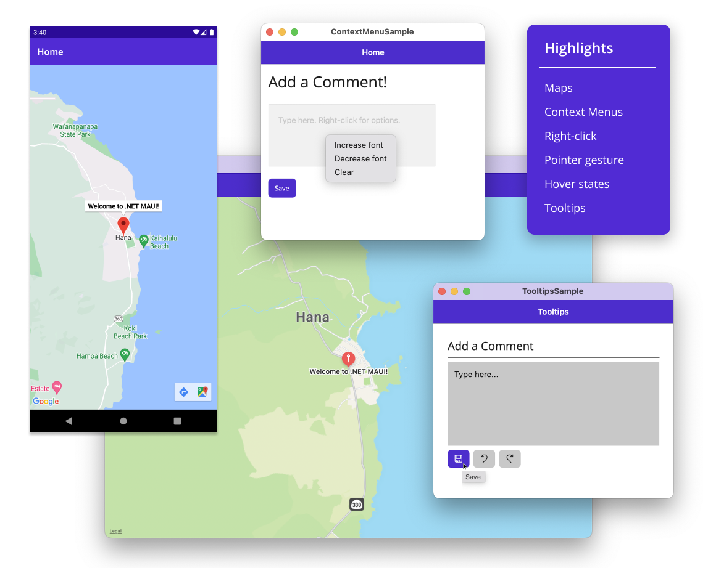

Six short months ago we introduced you to .NET Multi-platform App UI (MAUI) and today we are excited to announce the general availability of .NET MAUI in our next major release, [.NET 7](https://devblogs.microsoft.com/dotnet/announcing-dotnet-7). Our primary work in .NET MAUI during this shortened timeframe has been on addressing your top feedback reports, improving the performance of `CollectionView`, and introducing desktop features as we have expanded your reach beyond mobile to desktop. This release accompanies the release of Visual Studio 17.4, and the first .NET MAUI features have graduated from preview to stable release on Mac. 

> .NET MAUI for .NET 7 is supported through May of 2024. This includes a 6 month overlap with support for .NET MAUI for .NET 6 through May of 2023. .NET MAUI support includes the .NET MAUI framework as well as the .NET SDKs for Android, CarPlay, iOS, macOS, Mac Catalyst, and tvOS.

You, the .NET customers and ecosystem contributors, have also been hard at work building new applications with .NET MAUI, and modernizing old SDKs and libraries to be .NET compatible. Join us for the State of .NET MAUI presentation today on the [.NET Conf 2022 livestream](https://www.dotnetconf.net) where we will highlight and celebrate all this progress.



## .NET MAUI 7 Themes

This release addresses top feedback issues and introduces new features for desktop developers. The top feedback theme from you has been a strong desire to see the quality of the toolkit itself improved. To that end this release includes many fixes to fundamentals of UI controls and layouts.

Here are some other highlights:

### Map Control

In this release we are shipping the .NET MAUI Map control, updated from Xamarin.Forms. Like our other UI controls, this is a cross-platform abstraction of the native map control provided by each platform. `Map` supports a, b, c, and d. 

### Mobile Rendering Performance

.NET MAUI for .NET 7 is even faster than .NET 6 after 6 short months. We have optimized the rendering path for basic views, and addressed several issues that were impacting the smoothness of scrolling in the `CollectionView` list control. Jonathan Peppers will share an in-depth review of these improvements in an upcoming blog post.

### Desktop Enhancements

We have been working closely with companies building desktop applications using .NET MAUI, and were able to include some enhancements based on their use cases including:

* Window size and position
* Context Menus
* Tooltips
* Pointer hover gesture
* Right-click

### And more

These are only the highlights. 

We'd like to thank all of you who contributed to this release with your issue reports, pull requests, and thoughtful feedback. Thank you!

You'll discover more in our release notes, documentation, and samples.

* Release notes
  * [.NET MAUI 7.0.49](https://github.com/dotnet/maui/releases/tag/7.0.49)
  * [Android 33.0.5](https://github.com/xamarin/xamarin-android/releases)
  * [iOS 16.0.1480](https://github.com/xamarin/xamarin-macios/releases)
* [Documentation](https://learn.microsoft.com/dotnet/maui)
* [Samples](https://learn.microsoft.com/dotnet/samples)

### Compatibility Notes

.NET MAUI 7 is compatible with:

* Android API 33
* Tizen 7.0
* Xcode 14.0.1 (iOS 16)
* WinUI 1.1.5

> Xcode 14.1 was released during out final QA cycle, so we will be adding .NET support in an upcoming service release. For immediate usage of Xcode 14.1 you may access builds from our public build pipeline.

## Get Started

Aquire .NET MAUI and .NET 7 by installing Visual Studio 17.4. When creating a new .NET MAUI or .NET client application (Android, iOS, macOS, tvOS), select .NET 7 from the framework selector.


### Upgrading from .NET 6

To upgrade your projects from .NET 6 to .NET 7, open your *csproj* file and change the target framework monikers (TFM) from 6 to 7. 

Before: 

```xml
<TargetFrameworks>net6.0-ios;net6.0-android;net6.0-maccatalyst;net6.0-tizen</TargetFrameworks>
<TargetFrameworks Condition="$([MSBuild]::IsOSPlatform('windows')) and '$(MSBuildRuntimeType)' == 'Full'">$(TargetFrameworks);net6.0-windows10.0.19041</TargetFrameworks>
```

After: 

```xml
<TargetFrameworks>net7.0-ios;net7.0-android;net7.0-maccatalyst;net7.0-tizen</TargetFrameworks>
<TargetFrameworks Condition="$([MSBuild]::IsOSPlatform('windows')) and '$(MSBuildRuntimeType)' == 'Full'">$(TargetFrameworks);net7.0-windows10.0.19041</TargetFrameworks>
```

### Feedback

We guide our investments in .NET MAUI based upon your input. Here's how you can make an impact.

1. File new SDK issues on GitHub in the [dotnet/maui](https://github.com/dotnet/maui) repo
2. Add a reaction to existing issues that you're also impacted by
3. Use the [Visual Studio Feedback option](https://learn.microsoft.com/visualstudio/ide/how-to-report-a-problem-with-visual-studio) to submit issues related to editing, intellisense, debugging, hot reload, hot restart, remote mac, etc.
