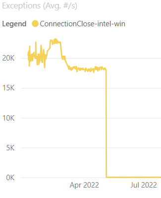
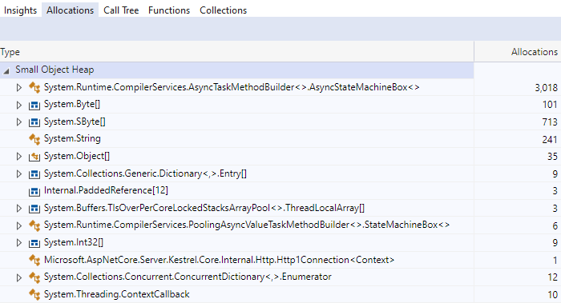
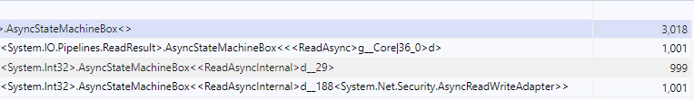
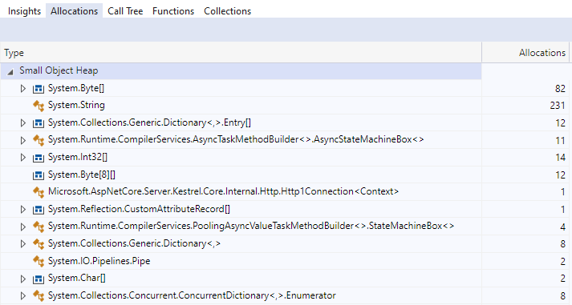
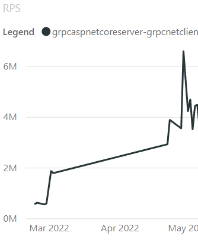

Performance is a feature of .NET. In every release the .NET team and community contributors spend time making performance improvements, so .NET apps are faster and use less resources.

This blog post highlights some of the performance improvements in ASP.NET Core 7. This is a continuation of last year's post on [Performance improvements in ASP.NET Core 6](https://devblogs.microsoft.com/dotnet/performance-improvements-in-aspnet-core-6). And, of course, it continues to be inspired by [Performance Improvements in .NET 7](https://devblogs.microsoft.com/dotnet/performance_improvements_in_net_7). Many of those improvements either indirectly or directly improve the performance of ASP.NET Core as well.

## Benchmarking Setup

We will use [BenchmarkDotNet](https://github.com/dotnet/benchmarkdotnet) for most of the examples in this blog post.

To setup a benchmarking project:
1. Create a new console app (`dotnet new console`)
2. Add a Nuget reference to BenchmarkDotnet (`dotnet add package BenchmarkDotnet`) version 0.13.2+
3. Change Program.cs to `var summary = BenchmarkSwitcher.FromAssembly(typeof(Program).Assembly).Run();`
4. Add the benchmarking code snippet below that you want to run
5. Run `dotnet run -c Release` and enter the number of the benchmark you want to run when prompted

Some of the benchmarks test internal types, and a self-contained benchmark cannot be written. In those cases I'll either reference numbers that are gotten by running the benchmarks in the repository, or I'll provide a simplified example to showcase what the improvement is doing.

There are also some cases where I will reference our end-to-end benchmarks which are public at https://aka.ms/aspnet/benchmarks. Although we only display the last few months of data so that the page will load in a reasonable amount of time.

## General server

Ampere machines are ARM based, have many cores, and are being used as servers in cloud environments due to their lower power consumption and parity performance with x64 machines. As part of .NET 7, we identified areas where many core machines weren't scaling very well and fixed them to bring massive performance gains. [dotnet/runtime#69386](https://github.com/dotnet/runtime/pull/69386) and [dotnet/aspnetcore#42237](https://github.com/dotnet/aspnetcore/pull/42237) partitioned the global thread pool queue and the memory pool used by socket connections respectively. Partitioning enables cores to operate on their own queues, which helps reduce contention and improve scalability with large core count machines. On our 80-core Ampere machine, the plaintext platform benchmark improved 514%, 2.4m RPS to 14.6m RPS, and the JSON platform improved 311%, 270k RPS to 1.1m RPS!

There are a couple tradeoffs that were made to get this perf increase. First off, strict FIFO ordering of work items to the global thread queue is no longer guaranteed because there are now multiple queues being read from. Second, there is the potential for a small increase in CPU usage when a machine has low load due to work stealing needing to search more queues to find work.

A significant change (windows specific) came from [dotnet/runtime#64834](https://github.com/dotnet/runtime/pull/64834), which switched the Windows IO pool to use a managed implementation. While this change by itself resulted in perf improvements, such as an ~11% increase in RPS for our JSON platform benchmark, it also allowed us to remove a thread pool dispatch in Kestrel in [dotnet/aspnetcore#43449](https://github.com/dotnet/aspnetcore/pull/43449) that was previously there to get off the IO thread. Removing dispatching on Windows gave another ~18% RPS increase resulting in a total of ~27% RPS increase, going from 800k RPS to 1.1m RPS.

[Throwing exceptions can be expensive](https://github.com/dotnet/runtime/issues/12892) and [dotnet/aspnetcore#38094](https://github.com/dotnet/aspnetcore/pull/38094) identified an area in Kestrel's Socket transport where we could avoid throwing an exception at one layer during connection closure. Not throwing exceptions resulted in reduced CPU usage in our connection close benchmarks. 50% to 40% CPU on Linux, 15% to 14% CPU on Windows, and 24% to 18% CPU on 28 core ARM Linux! Another nice side-effect of the change is that the number of exceptions per second, as shown in the graph below, drastically dropped, which is always a nice thing to see.



We started using `PoolingAsyncValueTaskMethodBuilder` in 6.0 with [dotnet/aspnetcore#35011](https://github.com/dotnet/aspnetcore/pull/35011), which updated a lot of the `ReadAsync` methods in Kestrel to reduce the memory used when reading from requests. In 7.0 we've applied the `PoolingAsyncValueTaskMethodBuilder` to a few more methods in [dotnet/aspnetcore#41345](https://github.com/dotnet/aspnetcore/pull/41345), [dotnet/runtime#68467](https://github.com/dotnet/runtime/issues/68467), and [dotnet/runtime#68457](https://github.com/dotnet/runtime/pull/68457).

WebSockets are an excellent example for showcasing the allocation differences because they are long lived connections that read multiple times from the request.
A benchmark performed 1000 reads on a single WebSocket connection in the following images.

In 6.0, 1000 reads resulted in 3000 allocated state machines.



And digging into them, we can see three separate state machines per read.



In 7.0, all state machine allocations have been eliminated from WebSocket connection reads.



Please note that `PoolingAsyncValueTaskMethodBuilder` isn't just free performance that should be applied to all async APIs. While it may look nice from an allocation perspective and could improve microbenchmarks, it can perform worse in real-world applications. Thoroughly measure pooling before committing to using it, which is why we have only applied the feature to specific APIs.

## HTTP/2

In 6.0, we identified an area with high lock contention in HTTP/2 processing in Kestrel. HTTP/2 has the concept of multiple streams over a single connection. When a stream writes to the connection, it needs to take a lock which can block other concurrent streams. We experimented with a few different approaches to improve concurrency. We found a potential improvement by queuing the writes to a [`Channel`](https://learn.microsoft.com/dotnet/core/extensions/channels) and letting a single consumer task process the queue and do all the writing, which removes most of the lock contention. PR [dotnet/aspnetcore#40925](https://github.com/dotnet/aspnetcore/pull/40925) rewrote the HTTP/2 output processing to use the `Channel` approach, and the results speak for themselves.
Using a gRPC benchmark of 70 streams per connection and 28 connections, we saw 110k RPS with the server CPU sitting around 14%, which is a good indicator that either we weren't generating enough load from the client or there was something stopping the server from doing more processing. After the change, RPS went to 4.1m, and the server CPU is now 100%, showing we are generating enough load and the server isn't being blocked by the lock contention anymore! This change also improved the single stream multiple connection benchmark from 1.2m to 6.8m RPS. This benchmark wasn't suffering from lock contention and was already at 100% CPU before the change, so it was a pleasant surprise when it improved this much by changing our approach for handling HTTP/2 frames!

It's always nice to see significant improvements in graphs, so here is the lock contention from before and after the change:


And here is the RPS improvement:



Another concept in HTTP/2 is called flow-control. Flow-control is a protocol honored by both the client and server to specify how much data can be sent to either side before waiting to send more data. On connection start, a window size is specified and used as the max amount of data allowed to be sent over the connection until a `WINDOW_UPDATE` frame is received. This frame specifies how much data has been read and lets the sender know that more data can be sent over the connection. By default, Kestrel used a window size of 96kb and will send a `WINDOW_UPDATE` once about half the window has been read. The window size means a client uploading a large file will send between 48kb and 96kb at a time to the server before receiving a `WINDOW_UPDATE` frame. Using these numbers we can get rough numbers for how long a 108Mb file with 10ms round-trip latency would take. 108mb / 48kb = 2,250 segments. 2,250 segments / 10ms = 22.5 seconds for the upper bound. 108mb / 96kb = 1,125 segments. 1,125 segments / 10ms = 11.25 seconds for the lower bound. These numbers aren't precise because there will be some overhead in sending and processing the data, but they give us a rough idea of how long it can take. [dotnet/aspnetcore#43302](https://github.com/dotnet/aspnetcore/pull/43302) increased the default window size used by Kestrel to 768kb and shows that the upload of a 108mb file now takes 4.3 seconds vs 26.9 seconds before. The new upper and lower bound become 2.8 seconds - 1.4 seconds, again without taking overhead into account.

That raises the question, why not make the window size as big as possible to allow faster uploads? The reason is that there is still a connection level limit on how many bytes can be sent at a time and that limit is there to avoid any single connection from using too much memory on the server.

## HTTP/3

ASP.NET Core 6 introduced experimental support for HTTP/3. In 7.0, HTTP/3 is no longer experimental but still opt-in. Many changes to make HTTP/3 non-experimental were around reliability, correctness, and finalizing the API shape. But that didn't stop us from making performance improvements. 

Let's start with this massive 900x performance improvement by [dotnet/aspnetcore#38826](https://github.com/dotnet/aspnetcore/pull/38826), which improves the performance of QPack, which HTTP/3 uses to encode headers. Both the client and server use QPack, and we take advantage of that by sharing the .NET QPack implementation with the server code in ASP.NET Core and the client code (HttpClient) in .NET. So any improvements to QPack benefits both the client and server!

QPack handles header compression to send and receive headers more efficiently. [dotnet/aspnetcore#38565](https://github.com/dotnet/aspnetcore/pull/38565) taught QPack about a bunch of common headers. [dotnet/aspnetcore#38681](https://github.com/dotnet/aspnetcore/pull/38681) further improved QPack by compressing some header values as well.

Given the headers:
```csharp
headers.ContentLength = 0;
headers.ContentType = "application/json";
headers.Age = "0";
headers.AcceptRanges = "bytes";
headers.AccessControlAllowOrigin = "*";
```

Originally the output from QPack was 109 bytes: `0x00 0x00 0x37 0x05 0x63 0x6F 0x6E 0x74 0x65 0x6E 0x74 0x2D 0x74 0x79 0x70 0x65 ...`

After the two changes above, the QPack output becomes the following 7 bytes: `0x00 0x00 0xEE 0xE0 0xE3 0xC2 0xC4`

Looking at the `0x63` byte through `0x65`, these represent the ASCII string `content-type` in hex. In .NET 7, we are compressing these into indexes, so each header in this example becomes a single byte.

Running a benchmark before and after the changes shows a 5x improvement.

Before:
|                                           Method |      Mean |    Error |   StdDev |         Op/s |
|------------------------------------------------- |----------:|---------:|---------:|-------------:|
|            DecodeHeaderFieldLine_Static_Multiple | 235.32 ns | 2.981 ns | 2.788 ns |  4,249,586.2 |

After:
|                                           Method |      Mean |    Error |   StdDev |         Op/s |
|------------------------------------------------- |----------:|---------:|---------:|-------------:|
|            DecodeHeaderFieldLine_Static_Multiple |  45.47 ns | 0.556 ns | 0.520 ns | 21,992,040.2 |

## Other

### SignalR

[dotnet/aspnetcore#41465](https://github.com/dotnet/aspnetcore/pull/41465) identified an area in [SignalR](https://learn.microsoft.com/aspnet/core/signalr/introduction) where we were allocating the same strings over and over again. The allocation was removed by caching the strings and comparing them against the raw `Span<byte>`. The change did make the code path zero alloc, but it made microbenchmarks a few nanoseconds slower (which can be fine since we're reducing GC pressure in full apps). Still, we were not completely happy with that so [dotnet/aspnetcore#41644](https://github.com/dotnet/aspnetcore/pull/41644) improved the change. It assumes that case-sensitive comparisons will be the most common (which they should be in this use case) and avoids UTF8 encoding when doing same-case comparisons. The .NET 7 code is now allocation free and faster.

|           Method |      Mean |    Error |   StdDev |   Gen0 | Allocated |
|----------------- |----------:|---------:|---------:|-------:|----------:|
|     StringLookup | 100.19 ns | 1.343 ns | 1.256 ns | 0.0038 |      32 B |
| Utf8LookupBefore | 109.24 ns | 2.243 ns | 2.203 ns |      - |         - |
|  Utf8LookupAfter |  85.20 ns | 0.831 ns | 0.777 ns |      - |         - |

### Auth

[dotnet/aspnetcore#43210](https://github.com/dotnet/aspnetcore/pull/43210) from [@Kahbazi](https://github.com/Kahbazi) cached `PolicyAuthorizationResult`'s because they are immutable and, in common cases, they are created with the same properties. You can see how effective this is with the following simplified benchmark.
```csharp
[MemoryDiagnoser]
public class CachedBenchmark
{
    private static readonly object _cachedObject = new object();

    [Benchmark]
    public object GetObject()
    {
        return new object();
    }

    [Benchmark]
    public object GetCachedObject()
    {
        return _cachedObject;
    }
}
```
|          Method |      Mean |     Error |    StdDev |   Gen0 | Allocated |
|---------------- |----------:|----------:|----------:|-------:|----------:|
|       GetObject | 3.5884 ns | 0.0488 ns | 0.0432 ns | 0.0029 |      24 B |
| GetCachedObject | 0.7896 ns | 0.0439 ns | 0.0389 ns |      - |         - |

[dotnet/aspnetcore#43268](https://github.com/dotnet/aspnetcore/pull/43268), also from [@Kahbazi](https://github.com/Kahbazi), applied the same change to multiple types in Authentication, and additionally added a cache for `Task<AuthorizationPolicy>` when resolving the authorization policy. The server knows about authorization policies at startup time, so it can create all the tasks upfront and save the per-request task allocation.
```csharp
[MemoryDiagnoser]
public class CachedTaskBenchmark
{
    private static readonly object _cachedObject = new object();
    private static readonly Dictionary<string, object> _cachedObjects = new Dictionary<string, object>()
        { { "policy", _cachedObject } };
    private static readonly Dictionary<string, Task<object>> _cachedTasks = new Dictionary<string, Task<object>>()
        { { "policy", Task.FromResult(_cachedObject) } };

    [Benchmark(Baseline = true)]
    public Task<object> GetTask()
    {
        return Task.FromResult(_cachedObjects["policy"]);
    }
    [Benchmark]
    public Task<object> GetCachedTask()
    {
        return _cachedTasks["policy"];
    }
}
```
|        Method |     Mean |    Error |   StdDev | Ratio |   Gen0 | Allocated |
|-------------- |---------:|---------:|---------:|------:|-------:|----------:|
|       GetTask | 22.59 ns | 0.322 ns | 0.285 ns |  1.00 | 0.0092 |      72 B |
| GetCachedTask | 11.70 ns | 0.065 ns | 0.055 ns |  0.52 |      - |         - |

[dotnet/aspnetcore#43124](https://github.com/dotnet/aspnetcore/pull/43124) adds a cache to the Authorization middleware that will avoid recomputing the combined `AuthorizationPolicy` per request for each endpoint. Because endpoints generally stay the same after startup, we don't need to grab the authorization metadata off endpoints for every request and combine them into a single policy. We can instead cache the combined policy on first access to the endpoint. Caching can have significant savings if you implement custom `IAuthorizationPolicyProvider`'s that have expensive operations like database access and only need to run them once for the application's lifetime.

### HttpResult

[dotnet/aspnetcore#40965](https://github.com/dotnet/aspnetcore/pull/40965) is an excellent example of exploring multiple routes to achieve better performance. The goal was to cache `HttpResult` types. Most result types are like `UnauthorizedHttpResult`, which has no arguments and can be cached by creating a static instance once and always returning it. A more interesting result is `StatusCodeHttpResult`, which can be given any integer to represent the status code to return to the caller. The PR explored multiple ways to cache the `StatusCodeHttpResult` object and showed the performance numbers for each approach.

**Known status codes (e.g. 200):**
|                                       Method |     Mean |     Error |    StdDev |  Gen 0 | Allocated |
|----------------------------------------------|---------:|----------:|----------:|-------:|----------:|
|                                      NoCache | 2.725 ns | 0.0285 ns | 0.0253 ns | 0.0001 |      24 B |
|                    StaticCacheWithDictionary | 5.733 ns | 0.0373 ns | 0.0331 ns |      - |         - |
|               DynamicCacheWithFixedSizeArray | 2.184 ns | 0.0227 ns | 0.0212 ns |      - |         - |
| DynamicCacheWithFixedSizeArrayPerStatusGroup | 3.371 ns | 0.0151 ns | 0.0134 ns |      - |         - |
|         DynamicCacheWithConcurrentDictionary | 5.450 ns | 0.1495 ns | 0.1468 ns |      - |         - |
|              StaticCacheWithSwitchExpression | 1.867 ns | 0.0045 ns | 0.0042 ns |      - |         - |
|             DynamicCacheWithSwitchExpression | 1.889 ns | 0.0143 ns | 0.0119 ns |      - |         - |

**Unknown status codes (e.g. 150):**
|                                       Method |     Mean |     Error |    StdDev |  Gen 0 | Allocated |
|----------------------------------------------|---------:|----------:|----------:|-------:|----------:|
|                                      NoCache | 2.477 ns | 0.0818 ns | 0.1005 ns | 0.0001 |      24 B |
|                    StaticCacheWithDictionary | 8.479 ns | 0.0650 ns | 0.0576 ns | 0.0001 |      24 B |
|               DynamicCacheWithFixedSizeArray | 2.234 ns | 0.0361 ns | 0.0302 ns |      - |         - |
| DynamicCacheWithFixedSizeArrayPerStatusGroup | 4.809 ns | 0.0360 ns | 0.0281 ns | 0.0001 |      24 B |
|         DynamicCacheWithConcurrentDictionary | 6.076 ns | 0.0672 ns | 0.0595 ns |      - |         - |
|              StaticCacheWithSwitchExpression | 4.195 ns | 0.0823 ns | 0.0770 ns | 0.0001 |      24 B |
|             DynamicCacheWithSwitchExpression | 4.146 ns | 0.0401 ns | 0.0335 ns | 0.0001 |      24 B |

We ended up picking "StaticCacheWithSwitchExpression", which uses a [T4 template](https://learn.microsoft.com/visualstudio/modeling/code-generation-and-t4-text-templates) to generate cached fields for well-known status codes and a switch expression to return them.
This approach gave the best performance for known status codes, which will be the common case for most apps.

### IndexOfAny

[dotnet/aspnetcore#39743](https://github.com/dotnet/aspnetcore/pull/39743) from [@martincostello](https://github.com/martincostello) noticed some places where we were passing a `char[]` of length 2 to `string.IndexOfAny`. The char array overload is slower than passing the 2 `char`s directly to the `ReadOnlySpan<char>.IndexOfAny` method. This change updated multiple call sites to remove the `char[]` and use the faster method. Note, `IndexOfAny` provides this method for 2 and 3 characters.
```csharp
public class IndexOfAnyBenchmarks
{
    private const string AUrlWithAPathAndQueryString = "http://www.example.com/path/to/file.html?query=string";
    private static readonly char[] QueryStringAndFragmentTokens = new[] { '?', '#' };

    [Benchmark(Baseline = true)]
    public int IndexOfAny_String()
    {
        return AUrlWithAPathAndQueryString.IndexOfAny(QueryStringAndFragmentTokens);
    }

    [Benchmark]
    public int IndexOfAny_Span_Array()
    {
        return AUrlWithAPathAndQueryString.AsSpan().IndexOfAny(QueryStringAndFragmentTokens);
    }

    [Benchmark]
    public int IndexOfAny_Span_Two_Chars()
    {
        return AUrlWithAPathAndQueryString.AsSpan().IndexOfAny('?', '#');
    }
}
```
|                    Method |     Mean |     Error |    StdDev | Ratio |
|-------------------------- |---------:|----------:|----------:|------:|
|         IndexOfAny_String | 7.004 ns | 0.1166 ns | 0.1091 ns |  1.00 |
|     IndexOfAny_Span_Array | 6.847 ns | 0.0371 ns | 0.0347 ns |  0.98 |
| IndexOfAny_Span_Two_Chars | 5.161 ns | 0.0697 ns | 0.0582 ns |  0.73 |

### Filters

In .NET 7, we introduced [filters for Minimal APIs](https://learn.microsoft.com/aspnet/core/fundamentals/minimal-apis/min-api-filters?view=aspnetcore-7.0). When designing the feature, we were very performance conscious. We profiled filters during previews to find areas where we could improve the code's performance after the feature's initial merge.

[dotnet/aspnetcore#41740](https://github.com/dotnet/aspnetcore/pull/41740) fixed a case where we allocated an empty array for every request to parameterless endpoints when using filters. This was fixed by using `Array.Empty<object>()` instead of `new object[0]`. This might seem obvious, but when writing [Expressions Trees](https://learn.microsoft.com/dotnet/csharp/programming-guide/concepts/expression-trees/), it's quite easy to do.

[dotnet/aspnetcore#41379] removed the [boxing](https://learn.microsoft.com/dotnet/csharp/programming-guide/types/boxing-and-unboxing) allocation for `ValueTask<object>` returning methods in Minimal APIs, which is what filters used to wrap the user provided delegate. Removing boxing made it so that the only overhead of adding a filter is allocating a context object that lets the user code inspect the arguments from a request to their endpoint.

[dotnet/aspnetcore#41406](https://github.com/dotnet/aspnetcore/pull/41406) improved the allocations for creating the filter context object by adding generic class implementations for 1 to 10 parameter arguments in your endpoint. This change avoids the `object[]` allocation for holding the parameter values and any boxing that would occur if using struct parameters.
The improvement can be shown with a simplified example:
```csharp
[MemoryDiagnoser]
public class FilterContext
{
    internal abstract class Context
    {
        public abstract T GetArgument<T>(int index);
    }

    internal sealed class DefaultContext : Context
    {
        public DefaultContext(params object[] arguments)
        {
            Arguments = arguments;
        }

        private IList<object?> Arguments { get; }

        public override T GetArgument<T>(int index)
        {
            return (T)Arguments[index]!;
        }
    }

    internal sealed class Context<T0> : Context
    {
        public Context(T0 argument)
        {
            Arg0 = argument;
        }

        public T0 Arg0 { get; set; }

        public override T GetArgument<T>(int index)
        {
            return index switch
            {
                0 => (T)(object)Arg0!,
                _ => throw new IndexOutOfRangeException()
            };
        }
    }

    [Benchmark]
    public TimeSpan GetArgBoxed()
    {
        var defaultContext = new DefaultContext(new TimeSpan());
        return defaultContext.GetArgument<TimeSpan>(0);
    }

    [Benchmark]
    public TimeSpan GetArg()
    {
        var typedContext = new Context<TimeSpan>(new TimeSpan());
        return typedContext.GetArgument<TimeSpan>(0);
    }
}
```
|      Method |      Mean |     Error |    StdDev |   Gen0 | Allocated |
|------------ |----------:|----------:|----------:|-------:|----------:|
| GetArgBoxed | 16.865 ns | 0.1878 ns | 0.1466 ns | 0.0102 |      80 B |
|      GetArg |  3.292 ns | 0.0806 ns | 0.0792 ns | 0.0031 |      24 B |


## Summary

Try out .NET 7 and let us know how your app's performance has changed! We are always looking for feedback on how to improve the product and look forward to your contributions, be it an issue report or a PR.
If you want more performance goodness, you can read the [Performance Improvements in .NET 7](https://devblogs.microsoft.com/dotnet/performance_improvements_in_net_7/) post. Also, take a look at [Developer Stories](https://devblogs.microsoft.com/dotnet/category/developer-stories/) which showcases multiple teams at Microsoft migrating from .NET Framework to .NET Core and seeing major performance and [COGS](https://www.investopedia.com/terms/c/cogs.asp) wins.
