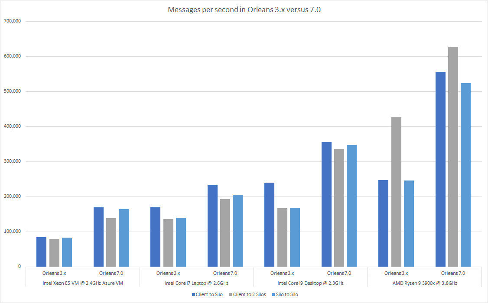
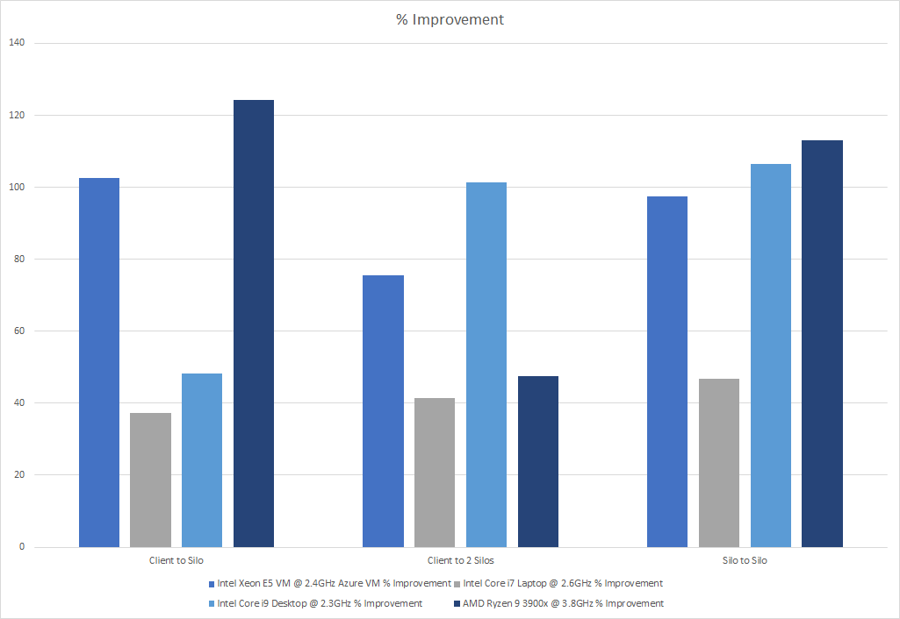
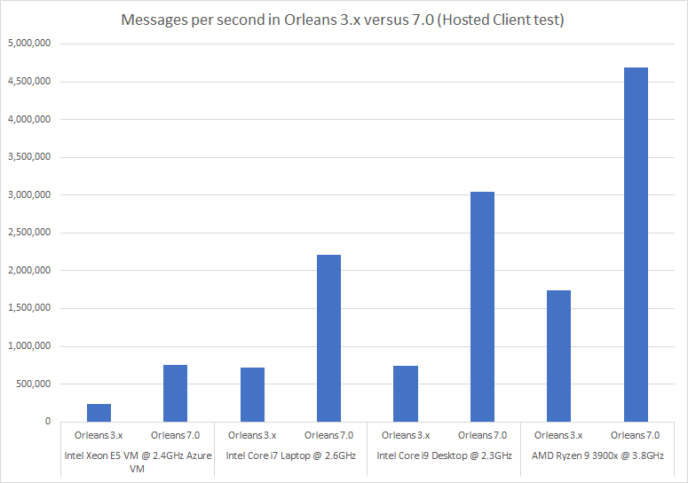

The .NET 7 release marks an exciting milestone in many ways, but one in particular that's exciting for ASP.NET developers building distributed apps or apps designed to be cloud native and ready for dynamic horizontal scale out is the addition of the Orleans team to the broader .NET team. Bringing Orleans and ASP.NET Core closer together has led to some exciting ideas for the future of how we blend Orleans into the ASP.NET toolchain, and coupled with the huge advances in performance throughout .NET 7 are improvements to Orleans 7 that bring **over 150% improvements** to some areas of the Orleans toolchain. This post will introduce you to some of the new features in Orleans 7. 

## Dramatic performance improvements

Much effort has been put into making Orleans 7 the fastest, most performant version of Orleans to date. Included in the Orleans GitHub repository is a [benchmarking project](https://github.com/dotnet/orleans/tree/main/test/Benchmarks). We've executed *many* tests inside of this benchmark, but the goal is to understand how Orleans performs in a variety of ways. First, the silo-to-silo and client-to-silo test results, across a variety of laptop, desktop, and virtual machine processors. 



To simplify this a bit, take a look at the percentage improvements across each of these test matrices. Performance tests demonstrate how Orleans 7 has improved from 40% to over 120% across a variety of scenarios. If you've built apps with Orleans in the past, you know it was already fast (enough to support Halo, Mesh, and a variety of Microsoft services requiring cloud scale and low latency). 



The Hosted Client tests paint an even clearer picture of the general performance of Orleans and the level of improvements we've made in Orleans 7. This chart shows how Orleans 3.x apps could transmit over 1.5 million messages per second. But with Orleans 7, you can expect up to 4.5 million messages per second. 



With improvements in performance up to 169% in Orleans 7, you can be confident it'll support any distributed-state needs you have when building ASP.NET Core applications. Feel free to try these benchmarks in your own development and hosting environment and let us know if you're seeing consistent numbers in your own hosting and development environments. 

## Improved development experience

Consistent with previous releases of Orleans, we're keeping the NuGet packages small, specific, and isolated. With Orleans 7, however, we're adding a few roll-up packages that will make it much easier for you to get started with new projects and solutions that take a dependency on Orleans. With Orleans 3.x, for example, you needed to remember to reference `Microsoft.Orleans.CodeGenerator.MSBuild` in every project, be it an abstraction or implementation project or a silo or client host project. With Orleans 7.0, we've simplified the variety of NuGet package references you need to set up with new projects dramatically: 

- Orleans client projects reference the `Microsoft.Orleans.Client` package. 
- Orleans silo projects reference the `Microsoft.Orleans.Server` package. 
- Abstractions and any other Orleans-dependent project references the `Microsoft.Orleans.Sdk` package. 

That's it. Much easier project setup processes and fewer dependencies to remember and manage means you'll be coding in less time with Orleans 7. 

## Simplified Grain and Stream identification

Grain identities now take the form `type/key` where both `type` and `key` are strings. This greatly simplifies how grain identity works and improves support for generic grain types.

Previous versions of Orleans used a compound type for `GrainId`s in order to support grain keys of either: `Guid`, `long`, `string`, `Guid` + `string`, or `long` + `string`.  This involves some complexity when it comes to dealing with grain keys. Grain identities consist of two components: a type and a key. The type component previously consisted of a numeric type code, a category, and 3 bytes of generic type information.

In Orleans 3.x, this made the development experience somewhat cumbersome, especially if you were learning an existing system with lots of different Grain types, all with different forms of identification. Conceptually, there were so many ways to identify a Grain...

``` csharp
public class PingGrain : Grain, IPingGrain
{
    public ILogger<PingGrain> Logger { get; set; }

    public PingGrain(ILogger<PingGrain> logger) => Logger = logger;

    public Task ReceivePing(PingMessage message)
    {
        string grainId = this.GetGrainIdentity().PrimaryKeyString;
        Guid grainId = this.GetGrainIdentity().PrimaryKey;
        long grainId = this.GetGrainIdentity().PrimaryKeyLong;

        // or...

        string grainId = this.GetPrimaryKeyString();
        Guid grainId = this.GetPrimaryKey();
        long grainId = this.GetPrimaryKeyLong();

        Logger.LogInformation($"{message.Message} from {grainId} at {message.Timestamp}.");
    }
}
```

With Orleans 7, the process of ascertaining how to identify a Grain is far simpler - you simply make a call to `GetGrainId`. 

``` csharp
public class PingGrain : Grain, IPingGrain
{
    public ILogger<PingGrain> Logger { get; set; }

    public PingGrain(ILogger<PingGrain> logger) => Logger = logger;

    public Task ReceivePing(PingMessage message)
        => Task.Run(() => Logger.LogInformation($"{message.Message} from {this.GetGrainId()} at {message.Timestamp}."));
}
```

Streams are also now identified using a `string` instead of a `Guid`, which grants more flexibility, especially when working with declarative subscriptions (most commonly accessed via the `[ImplicitStreamSubscription(...)]` attribute)

This move to stringly-typed ids is expected to be easier for developers to work with, particularly since the `GrainId` and `StreamId` types are now `public` (they were `internal`) and `GrainId` is able to identify any grain.

## Keep up with the project and changes 

As with all .NET Core projects, Orleans has an active set of GitHub repositories and even a contribution organization where our passionate community is always coming up with exciting ways to use Orleans. We're actively working with many of these community members to help them upgrade their projects to the latest release. We engage with many of these community members daily on the [Orleans Discord channel](https://aka.ms/orleans-discord), so feel free to drop in and join the conversation. 

If you'd like to keep up with all of the releases we've shipped to get an idea of the scope of effort and list of improvements made in Orleans 7, here's our list of preview/RC releases in 7. 

* [v7.0.0-rc2](https://github.com/dotnet/orleans/releases/tag/v7.0.0-rc2)
* [v4.0.0-preview2](https://github.com/dotnet/orleans/releases/tag/v4.0.0-preview2)
* [v4.0.0-preview1](https://github.com/dotnet/orleans/releases/tag/v4.0.0-preview1)

## Migration won't be automatic

If you've been developing with Orleans 3.x for some time, you'll want to explore some of the changes you'll need to make on [this important doc on learn.microsoft.com](https://aka.ms/orleans-7-migration-guide) focused on all the lower-level changes you'll want to familiarize yourself with if you want to plan a migration from the previous version of Orleans to this new release. We're investigating options to make upgrading easier, but chose the .NET 7 release as a good point in time to make some tough changes, as we know they'll make Orleans more attractive to new customers with these improvements (some of which have been requested by Orleans customers for some time). 

