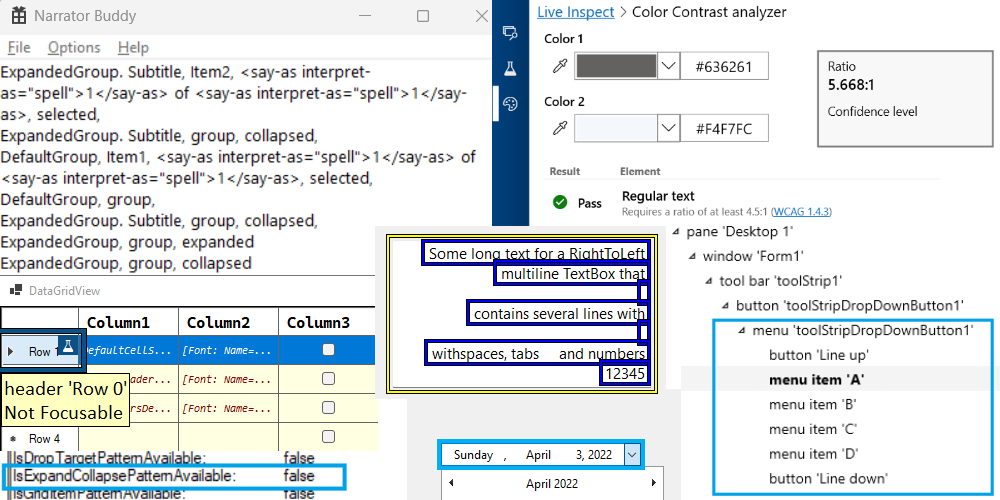
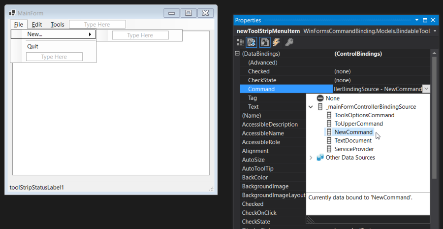
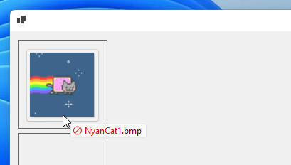

There are a lot of exciting enhancements for Windows Forms developers in .NET 7. We are committed to support and innovate in the Windows Forms runtime, so let's look at what is new in .NET 7.


## Accessibility improvements and fixes

We strive to improve the experience for users of assistive technology. This release adds further improvements to accessibility, including but not limited to the following:
*  Many announcement-related issues observed in  screen readers (e.g., Narrator) have been addressed, ensuring the information about controls is correct and complete. For example, `ListView` now correctly announces when a group is expanded or collapsed.
* More controls now provide UI Automation support:
    - `TreeView`
    - `DateTimePicker`
    - `ToolStripContainer` and `ToolStripPanel`
    - `FlowLayoutPanel`, `TableLayoutPanel` and `SplitContainer`
    - `PrintPreviewControl`
    - `WebBrowser`
* Multiple memory leaks resulting from running Windows Forms applications under assistive tools (e.g., Narrator) have been fixed. Specifically, some controls and their corresponding accessible objects would remain in memory after a form that hosted those controls was closed.
* Assistive tools now accurately draw focus indicators and report correct bounding rectangles for nested forms and some elements of composite controls, such as `DataGridView`, `ListView`, `TabControl` and others.
* [ExpandCollapse Control Pattern](https://learn.microsoft.com/windows/win32/winauto/uiauto-implementingexpandcollapse) support in `ListView`, `TreeView` and `PropertyGrid` controls has been corrected to activate only for expandable items.
* Various color contrast ratio corrections in `Button`, `DataGridView` and `PropertyGrid` controls.
* Visibility improvements for `ToolStripTextBox` and `ToolStripButton` in high-contrast themes.




## High DPI and scaling improvements

Throughout the .NET 7 release we continued our work on improving the high DPI support in multi-monitor scenarios (that is, `PerMonitorV2`). Most notably, the Windows Forms runtime now can:

* Correctly scale nested controls (e.g., a button which resides in panel, which itself is placed on a tabpage).  This class of layout issues was caused by the different order of Windows messages – in `PerMonitorV2` mode, a parent control receive the [`WM_DPICHANGED`](https://learn.microsoft.com/windows/win32/hidpi/wm-dpichanged) message *after* all its children have received the message and scaled themselves.

* Scale [`Form.MaximumSize`](https://learn.microsoft.com/dotnet/api/system.windows.forms.form.maximumsize) and [`Form.MinimumSize`](https://learn.microsoft.com/dotnet/api/system.windows.forms.form.minimumsize) properties based on the current monitor DPI settings for applications that run [`ApplicationHighDpiMode`](https://learn.microsoft.com/dotnet/core/project-sdk/msbuild-props-desktop#applicationhighdpimode) set to `PerMonitorV2`.

The progress is slow because any changes in the layout engine carry a very high risk. To help reduce the risk we have (re-)introduced "feature switches" back into Windows Forms runtime. This will allow us to add new features and functionality with an escape plan, if those don't work out for our developers.

In .NET 7 we added the first switch `System.Windows.Forms.ScaleTopLevelFormMinMaxSizeForDpi` that controls whether the form's `MaximumSize` and `MinimumSize` properties are scaled whenever [`WM_DPICHANGED`](https://learn.microsoft.com/windows/win32/hidpi/wm-dpichanged) message is received.

In .NET 7 the new scaling behaviour is _disabled_ by default, but in .NET 8 it will be _on by default_. The switch can be configured via [runtimeconfig.json](https://learn.microsoft.com/dotnet/core/runtime-config/#runtimeconfigjson) like so:

```json
{
  "runtimeOptions": {
    "tfm": "net7.0",
    "frameworks": [
        ...
    ],
    "configProperties": {
      "System.Windows.Forms.ScaleTopLevelFormMinMaxSizeForDpi": true,
    }
  }
}
```


## Databinding improvements

We want to help Windows Forms developers to modernize their existing apps and to adopt new cloud-based technologies. One way to modernize is the ability to move business logic of a typical line-of-business (LOB) application away from the Windows Forms code-behind pattern towards more modern patterns like [Model-View-ViewModel](https://learn.microsoft.com/dotnet/architecture/maui/mvvm) (MVVM), which can be easily reused and tested. We also wanted to provide an incentive to pivot away from the 15-year-old Typed DataSets. They have very limited support in the Windows Forms [out-of-process designer](https://devblogs.microsoft.com/dotnet/state-of-the-windows-forms-designer-for-net-applications/) because Visual Studio no longer supports Data Source Provider Service for the .NET runtime. The feedback to the proposed [new Binding strategy](https://devblogs.microsoft.com/dotnet/databinding-with-the-oop-windows-forms-designer/#new-approaches-when-using-object-data-source-binding) was very positive and indicated that we're on the right track with that.

Windows Forms already had a powerful binding engine, but to achieve the above goals we introduced support for a more modern form of data binding with data contexts and command patterns, similar to data binding provided by WPF.



The new API surface is as follows:

```diff
     public class Control  {
+        [BindableAttribute(true)]
+        public virtual object DataContext { get; set; }
+        [BrowsableAttribute(true)]
+        public event EventHandler DataContextChanged;
+        protected virtual void OnDataContextChanged(EventArgs e);
+        protected virtual void OnParentDataContextChanged(EventArgs e);
     }

+    [RequiresPreviewFeaturesAttribute]
+    public abstract class BindableComponent : Component, IBindableComponent, IComponent, IDisposable {
+        protected BindableComponent();
+        public BindingContext? BindingContext { get; set; }
+        public ControlBindingsCollection DataBindings { get; }
+        public event EventHandler BindingContextChanged;
+        protected virtual void OnBindingContextChanged(EventArgs e);
+    }

     public abstract class ButtonBase : Control {
+        [BindableAttribute(true)]
+        [RequiresPreviewFeaturesAttribute]
+        public ICommand? Command { get; set; }
+        [BindableAttribute(true)]
+        public object? CommandParameter { [RequiresPreviewFeaturesAttribute] get; [RequiresPreviewFeaturesAttribute] set; }
+        [RequiresPreviewFeaturesAttribute]
+        public event EventHandler? CommandCanExecuteChanged;
+        [RequiresPreviewFeaturesAttribute]
+        public event EventHandler? CommandChanged;
+        [RequiresPreviewFeaturesAttribute]
+        public event EventHandler? CommandParameterChanged;
+        [RequiresPreviewFeaturesAttribute]
+        protected virtual void OnCommandCanExecuteChanged(EventArgs e);
+        [RequiresPreviewFeaturesAttribute]
+        protected virtual void OnCommandChanged(EventArgs e);
+        [RequiresPreviewFeaturesAttribute]
+        protected virtual void OnCommandParameterChanged(EventArgs e);
+        [RequiresPreviewFeaturesAttribute]
+        protected virtual void OnRequestCommandExecute(EventArgs e);
     }

+    public abstract class ToolStripItem : BindableComponent, IComponent, IDisposable, IDropTarget {
+        [BindableAttribute(true)]
+        [RequiresPreviewFeaturesAttribute]
+        public ICommand Command { get; set; }
+        [BindableAttribute(true)]
+        public object CommandParameter { [RequiresPreviewFeaturesAttribute] get; [RequiresPreviewFeaturesAttribute] set; }
+        [RequiresPreviewFeaturesAttribute]
+        public event EventHandler CommandCanExecuteChanged;
+        [RequiresPreviewFeaturesAttribute]
+        public event EventHandler CommandChanged;
+        [RequiresPreviewFeaturesAttribute]
+        public event EventHandler CommandParameterChanged;
+        [RequiresPreviewFeaturesAttribute]
+        protected virtual void OnCommandCanExecuteChanged(EventArgs e);
+        [RequiresPreviewFeaturesAttribute]
+        protected virtual void OnCommandChanged(EventArgs e);
+        [RequiresPreviewFeaturesAttribute]
+        protected virtual void OnCommandParameterChanged(EventArgs e);
+        [RequiresPreviewFeaturesAttribute]
+        protected virtual void OnRequestCommandExecute(EventArgs e);
     }
```

The new data binding features allows you to fully embrace the MVVM pattern and the use of object-relational mappers from ViewModels in Windows Forms much easier than before. This, in turn, makes it possible to reduce code in the code-behind files, and opens new testing possibilities. More importantly, it enables code share between Windows Forms and other .NET GUI frameworks such as WPF, UWP/WinUI and MAUI. (To preempt any questions, there are no plans to introduce support for XAML into Windows Forms.)

It's important to add that these new binding features are only available under ["preview" status](https://learn.microsoft.com/dotnet/core/project-sdk/msbuild-props#enablepreviewfeatures) in .NET 7, so that we can react to developer feedback and tweak the binding during the .NET 8 development cycle. We expect that the new binding functionality will become generally available in .NET 8.

To enable the new binding, you need to add `<EnablePreviewFeatures>true</EnablePreviewFeatures>` to your project file. This is supported for both C# _and_ Visual Basic from the start.


## ComWrappers and native AOT

In .NET 7 as part of a wider experiment we replaced the selected Windows Forms built-in COM interops with [ComWrappers](https://learn.microsoft.com/dotnet/standard/native-interop/cominterop). 

\- _What's the difference?_ - you may ask. Mostly it's that the built-in COM gets completely disabled in trimming/native AOT scenarios. That was one of the reasons why trimming was disabled for Windows Forms in .NET 5. 

\- _Why does this matter for Windows Forms which disables trimming during `dotnet publish` step?_ - you may ask again. Even if trimming is disabled it still works, and the migration work allows for further experiments. As an example, it greatly simplifies the ability to run code in [native AOT](https://learn.microsoft.com/dotnet/core/deploying/native-aot/) without additional customizations. In addition, if you provide a global ComWrappers implementation for the missing accessibility COM objects, you could run a Windows Forms application under native AOT.


:warning: This work is still highly experimental, and some scenarios are rough and require manual work. Mostly this comes from the [native AOT limitations](https://learn.microsoft.com/dotnet/core/deploying/native-aot/#limitations-of-native-aot-deployment) and  [trimming quirks](https://learn.microsoft.com/dotnet/core/deploying/trimming/fixing-warnings). Please keep in mind that you need to test your application after you publish.

If you feel adventurous and wish to experiment or just like to know more about ComWrappers and native AOT for Windows Forms, see [@kant2002](https://github.com/kant2002)'s post on Medium ["Again WinForms and NativeAOT"](https://codevision.medium.com/again-winforms-and-nativeaot-fd068425cc13) and his [GitHub repository](https://github.com/kant2002/winformscominterop).


## Other notable changes

In no particular order:

* [dotnet/winforms#6576](https://github.com/dotnet/winforms/pull/6576) enhanced drag-and-drop handling to match the Windows drag-and-drop functionality with richer display effects with an icon and a text label.

  

* [dotnet/winforms#6244](https://github.com/dotnet/winforms/pull/6244) brought the file and folder dialogs options to parity with the [options available in Windows dialogs](https://learn.microsoft.com/windows/win32/api/shobjidl_core/ne-shobjidl_core-_fileopendialogoptions), such as don't add to recent, ok button needs interaction, force show hidden, and more.

* [dotnet/winforms#7403](https://github.com/dotnet/winforms/pull/7403) made `TreeView` control respect the `DoubleBuffer` property.

* [dotnet/winforms#6244](https://github.com/dotnet/winforms/pull/6244) extended `ErrorProvider` with `HasErrors` property.

* [dotnet/winforms#6335](https://github.com/dotnet/winforms/pull/6335) fixed the `Form`'s snap layout in Windows 11.

And we have some very cool new [UI integration tests](https://github.com/dotnet/winforms/tree/main/src/System.Windows.Forms/tests/IntegrationTests/UIIntegrationTests) as a direct result of some of these changes.


## Breaking Changes

While we intend to maintain backward compatibility with .NET Framework and previous .NET releases as much as possible, it is not always prudent. Follow the link to see the [list of breaking changes](https://learn.microsoft.com/dotnet/core/compatibility/7.0#windows-forms).


## Community contributions

The community continues to play an important part in the life of Windows Forms runtime and the SDK. In .NET 7 timeframe we have merged over 700 pull requests (excluding the automated pull requests) in [dotnet/winforms](https://github.com/dotnet/winforms/) repository with almost 60% of those pull requests authored by the community. All these contributions – big and small – are really appreciated. 

We'd like to call out a few community contributors:

* [@gpetrou](https://github.com/gpetrou) has been tirelessly helping with nullable reference types annotations. This work isn't over, but as you can see from the [API diff](https://github.com/dotnet/core/tree/main/release-notes/7.0/preview/api-diff) the progress is substantial.

* [@kant2002](https://github.com/kant2002) has been driving the ComWrappers and Windows Forms native AOT stories.

* [@willibrandon](https://github.com/willibrandon) has helped modernizing the drag and drop and the dialogs functionality, as well as writing very elaborate tests for the drag and drop scenarios.

* [@kirsan31](https://github.com/kirsan31) has taken interest in perf-related issues and removed redundant finalizers, as well as helped stabilizing flaky tests.

* [@jbhensley](https://github.com/jbhensley) spent some time fixing various control rendering issues (some of which date back to .NET Framework).


## Looking ahead

We are committed to providing the complete support for `PerMonitorV2` mode. We will continue to work on the scaling-related issues (e.g., [dotnet/winforms#7973](https://github.com/dotnet/winforms/pull/7973)). We're also working on a new layout and anchor calculation mechanisms, which are not only expected to address the anchoring issues but should also deliver performance improvements. You can learn more about the new achor layout at [dotnet/winforms#7956](https://github.com/dotnet/winforms/pull/7956). In addition, we've been considering how we can improve the designer-related developer experience in this area.

We are also set to continue our modernization journey and to closer align our functionality with Windows. We have started replacing our manually created interop code with the source-generated interops produced by [CsWin32 project](https://github.com/microsoft/CsWin32). This not only reduces the maintenance burden for the team, but also opens up new possibilities (e.g., [support Windows 11 dark mode](https://github.com/dotnet/winforms/issues/7641)). We also expect that it may help advancing the trimming and the native AOT stories.

Furthermore, we will continue our work to migrate built-in COM to ComWrapper and bypass the .NET COM interop layer, where possible. And, hopefully, next time around, we will have a significantly better story for self-contained, single-file Windows Forms applications.


## Reporting bugs and suggesting features

If you have any comments, suggestions or faced some issues, please let us know! Submit Visual Studio and Designer related issues via **Visual Studio Feedback** (look for a button in the top right corner in Visual Studio), and Windows Forms runtime related issues at  [dotnet/winforms](https://github.com/dotnet/winforms) repository.

We also consider API proposals that further enrich Windows Forms SDK and make it easier to build Windows applications. And if you champion a proposal - there is a high chance that you will see it in the Windows Forms SDK.

You can also become a contributor to the Windows Forms code base! Our repository has items marked  ["help wanted"](https://github.com/dotnet/winforms/labels/help%20wanted) and [API approved for implementation](https://github.com/dotnet/winforms/labels/api-approved), we would really appreciate your help implementing them!

 Happy coding!
