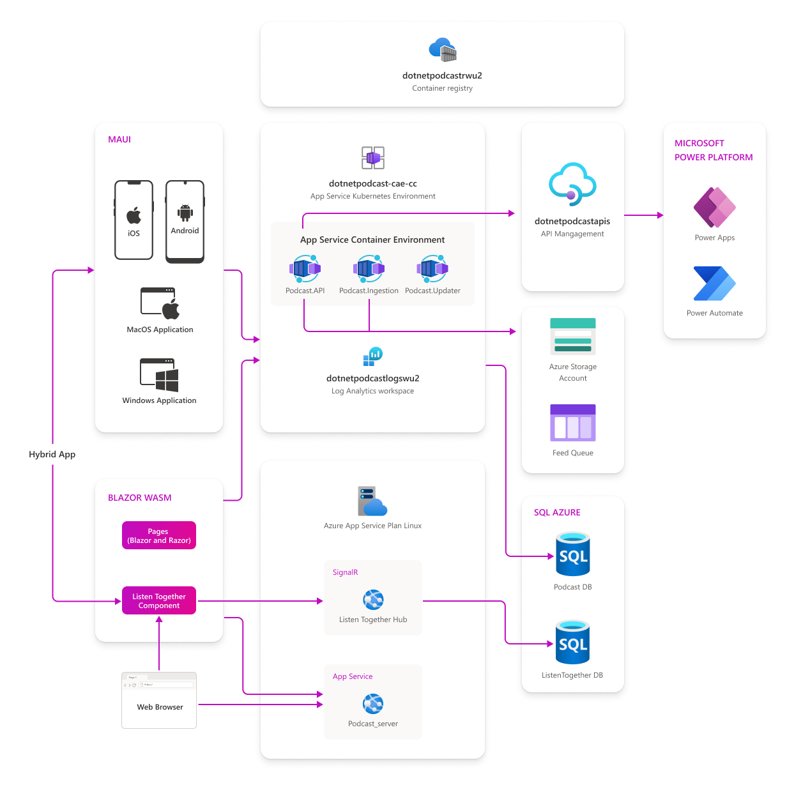
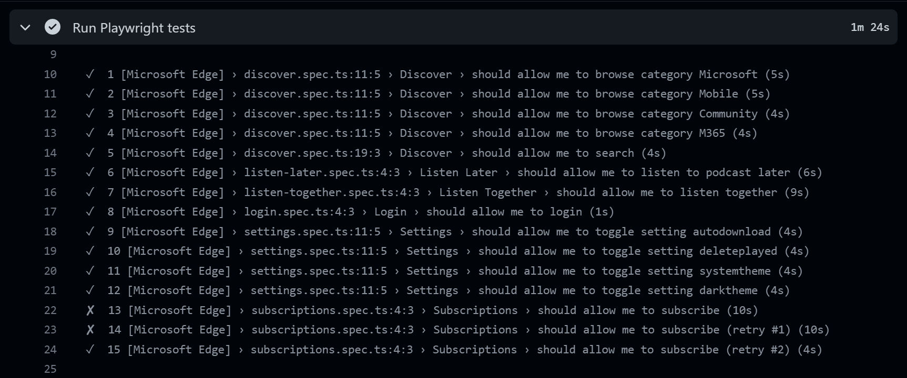
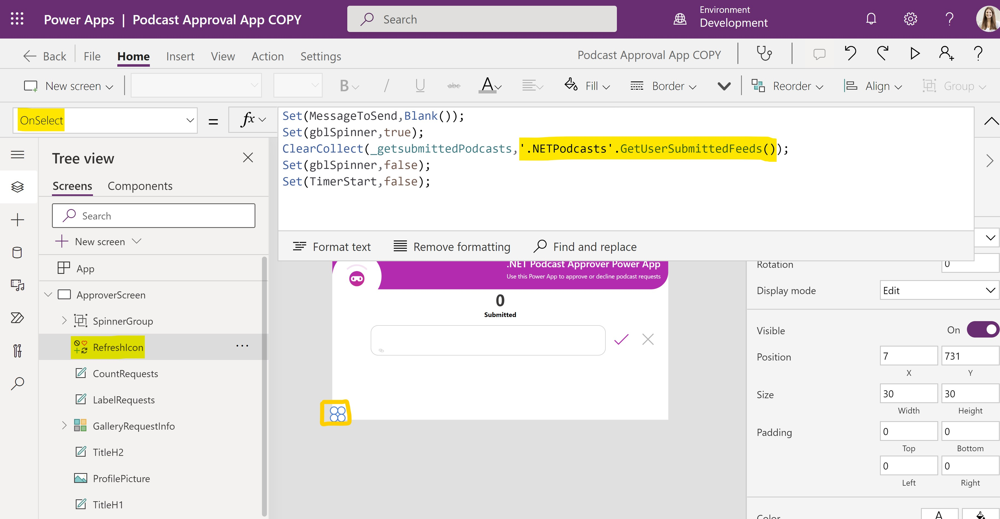

The [.NET Podcast app](https://github.com/microsoft/dotnet-podcasts) was first introduced at .NET Conf 2021 and recently updated to highlight new features in .NET 7 at the [.NET Conf 2022 keynote](https://www.youtube.com/watch?v=8V_BUGFKdaI). The podcast app is ready to use sample application that showcases .NET, ASP.NET Core, Blazor, .NET MAUI, Azure Container Apps, Orleans, Power Platform, Playwright, and more. In this post, I'll explain all the new features and show how we upgraded the .NET Podcast app to take advantage of them.


## Architecture

As mentioned, the .NET Podcast app uses a cloud-native architecture to power the mobile, desktop, and web apps.  Microservices were used for the worker services that add and update the podcasts feeds and the APIs that serve up data to the apps. These are all powered by [Azure Container Apps](https://learn.microsoft.com/azure/container-apps/overview) to dynamically scale the microservices based on the different characteristics of each service.



There is a lot more to the .NET Podcast app including integration into Azure SQL Server for our database, Azure Storage to save images and queuing submissions, and Azure API Management to leverage the APIs in Power Apps and Power Automate.

## API Updates

The .NET Podcast APIs have been updated to use the latest features in ASP.NET Core including [Output Cache](https://learn.microsoft.com/aspnet/core/performance/caching/output), [Rate Limiting](https://learn.microsoft.com/aspnet/core/performance/rate-limit), [API Versioning](https://github.com/dotnet/aspnet-api-versioning#aspnet-api-versioning), and new [Route Groups for Minimal APIs](https://learn.microsoft.com/aspnet/core/fundamentals/minimal-apis#route-groups). Additionally, it integrates the latest enhancements with authentication and authorization that great simplifies these features for developers.

```csharp
// Authentication and authorization-related services

builder.Services.AddMicrosoftIdentityWebApiAuthentication(builder.Configuration);

builder.Services.AddAuthorizationBuilder().AddPolicy("modify_feeds", policy => policy.RequireScope("API.Access"));

// OpenAPI and versioning-related services
builder.Services.AddSwaggerGen();
builder.Services.Configure<SwaggerGeneratorOptions>(opts =>
{
    opts.InferSecuritySchemes = true;
});
builder.Services.AddEndpointsApiExplorer();
builder.Services.AddApiVersioning(options =>
{
    options.DefaultApiVersion = new ApiVersion(2, 0);
    options.ReportApiVersions = true;
    options.AssumeDefaultVersionWhenUnspecified = true;
    options.ApiVersionReader = new HeaderApiVersionReader("api-version");
});

// Enable Output Cache
builder.Services.AddOutputCache();

// Rate-limiting and output caching-related services
builder.Services.AddRateLimiter(options => options.AddFixedWindowLimiter("feeds", options =>
{
    options.PermitLimit = 5;
    options.QueueProcessingOrder = QueueProcessingOrder.OldestFirst;
    options.QueueLimit = 0;
    options.Window = TimeSpan.FromSeconds(2);
    options.AutoReplenishment = false;
}));


// Create version set
var versionSet = app.NewApiVersionSet()
                    .HasApiVersion(1.0)
                    .HasApiVersion(2.0)
                    .ReportApiVersions()
                    .Build();

// create new mapping for apis
var shows = app.MapGroup("/shows");

shows
    .MapShowsApi()
    .WithApiVersionSet(versionSet)
    .MapToApiVersion(1.0)
    .MapToApiVersion(2.0);
```

Looking for more updates with APIs in .NET 7? Checkout the [Making the Most of Minimal APIs in .NET 7](https://www.youtube.com/watch?v=HXHwtEjQoyM) from .NET Conf.

## Observability & Monitoring

Once you have built and deployed your services, you need to observe and monitor them. During the keynote we showed how to integrate Open Telemetry, Azure Monitor, and more in just a few lines of code to completely instrument your services.

```csharp
builder.Services.AddOpenTelemetryTracing(tracing =>
        tracing.SetResourceBuilder(serviceResource)
        .AddAzureMonitorTraceExporter(o =>
        {
            o.ConnectionString = azureMonitorConnectionString;
        })
        .AddJaegerExporter()
        .AddHttpClientInstrumentation()
        .AddAspNetCoreInstrumentation()
        .AddEntityFrameworkCoreInstrumentation()
    );

builder.Services.AddOpenTelemetryMetrics(metrics =>
{
    metrics
    .SetResourceBuilder(serviceResource)
    .AddPrometheusExporter()
    .AddAzureMonitorMetricExporter(o =>
    {
        o.ConnectionString = azureMonitorConnectionString;
    })
    .AddAspNetCoreInstrumentation()
    .AddHttpClientInstrumentation()
    .AddRuntimeInstrumentation()
    .AddProcessInstrumentation()
    .AddHttpClientInstrumentation()
    .AddEventCountersInstrumentation(ec =>
    {
        ec.AddEventSources("Microsoft.AspNetCore.Hosting");
    });
});

builder.Logging.AddOpenTelemetry(logging =>
{
    logging
    .SetResourceBuilder(serviceResource)
    .AddAzureMonitorLogExporter(o =>
    {
        o.ConnectionString = azureMonitorConnectionString;
    })
    .AttachLogsToActivityEvent();
});
```

## .NET SDK Containers

The .NET Podcast application is powered by microservices and containers. The [.NET SDK can now containerize your app](https://devblogs.microsoft.com/dotnet/announcing-builtin-container-support-for-the-dotnet-sdk/) with just a few configuration changes. This feature is now integrated into the services that power the .NET Podcast app and the CI/CD pipeline as well.

```xml
<PropertyGroup>
    <ContainerImageName>podcastapi</ContainerImageName>
</PropertyGroup>

<ItemGroup>
    <PackageReference Include="Microsoft.NET.Build.Containers" Version="0.2.7" />
</ItemGroup>
```

```yml
dotnet publish -c Release -r linux-x64 -p PublishProfile=DefaultContainer src/Services/Podcasts/Podcast.API/Podcast.API.csproj
```

If you are interested in containers and microservices be sure to watch some of these sessions from .NET Conf:
* [Using .NET with Chiseled Ubuntu Containers](https://www.youtube.com/watch?v=FLGFzlWF4Gs)
* [Azure Container Apps with .NET](https://www.youtube.com/watch?v=Blhk-F_m0LU)
* [State of Azure + .NET](https://www.youtube.com/watch?v=NBbI52liUR4)

## Playwright Tests
[Playwright](https://playwright.dev/) is an open source testing framework from Microsoft that enables reliable end-to-end testing for modern web apps. As the team was working on backend and frontend updates, they wanted to ensure that the core scenarios of the podcast app didn't break. They setup several Playwright tests and integrated it into their CI pipeline so they ran with every pull request. 



Checkout the [session from .NET Conf](https://www.youtube.com/watch?v=gBky9_AskNQ) from Max and Debbie from the Playwright team on testing Blazor apps with Playwright:

<iframe width="560" height="315" src="https://www.youtube.com/embed/gBky9_AskNQ" title="YouTube video player" frameborder="0" allow="accelerometer; autoplay; clipboard-write; encrypted-media; gyroscope; picture-in-picture" allowfullscreen></iframe>


## Power App Integration

With [Azure API Management](https://learn.microsoft.com/azure/api-management/)(APIM) you can easily take your .NET APIs to power more services and apps including the Power Platform. During .NET Conf 2022, we showcased a Power App that would triage approving and denying new podcast submissions with .NET APIs that were surfaced through APIM. Now included in the repo is the full Power App the you can deploy yourself.



Be sure to watch the [APIM and Power Apps session from .NET Conf](https://www.youtube.com/watch?v=qd7x2pH4rwo): 

<iframe width="560" height="315" src="https://www.youtube.com/embed/qd7x2pH4rwo" title="YouTube video player" frameborder="0" allow="accelerometer; autoplay; clipboard-write; encrypted-media; gyroscope; picture-in-picture" allowfullscreen></iframe>

## Give it a try today

The GitHub repository has [step-by-step directions](https://github.com/microsoft/dotnet-podcasts#local-deployment-quickstart) on how to easily get the entire application running locally for development with just one simple command. Additionally, you can set a [full continuous integration and deployment pipeline](https://github.com/microsoft/dotnet-podcasts/blob/main/Deploy-websites-services.md) with GitHub Actions that deploys the entire solution to Azure by settings up a few GitHub secrets in your cloned repo.

In addition to just running the apps, you can also [step-by-step demo directions](https://github.com/microsoft/dotnet-podcasts/tree/main/docs/demos) for any of the demos at .NET Conf. 

We will be continuing to add new features to the app and are also interested in what you are interested in seeing or what you are building with this sample architecture. Head over to the [GitHub discussions](https://github.com/microsoft/dotnet-podcasts/discussions) to let us know.
