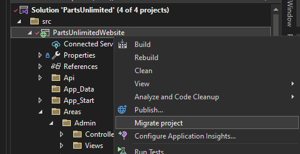
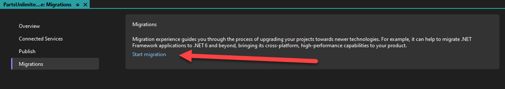
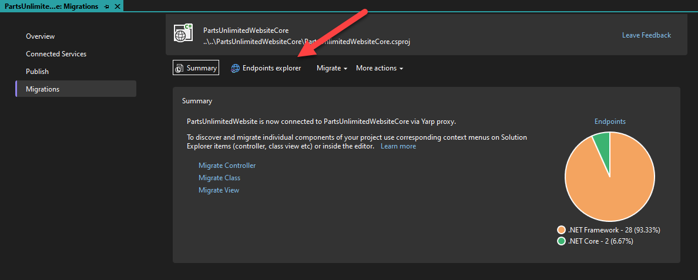
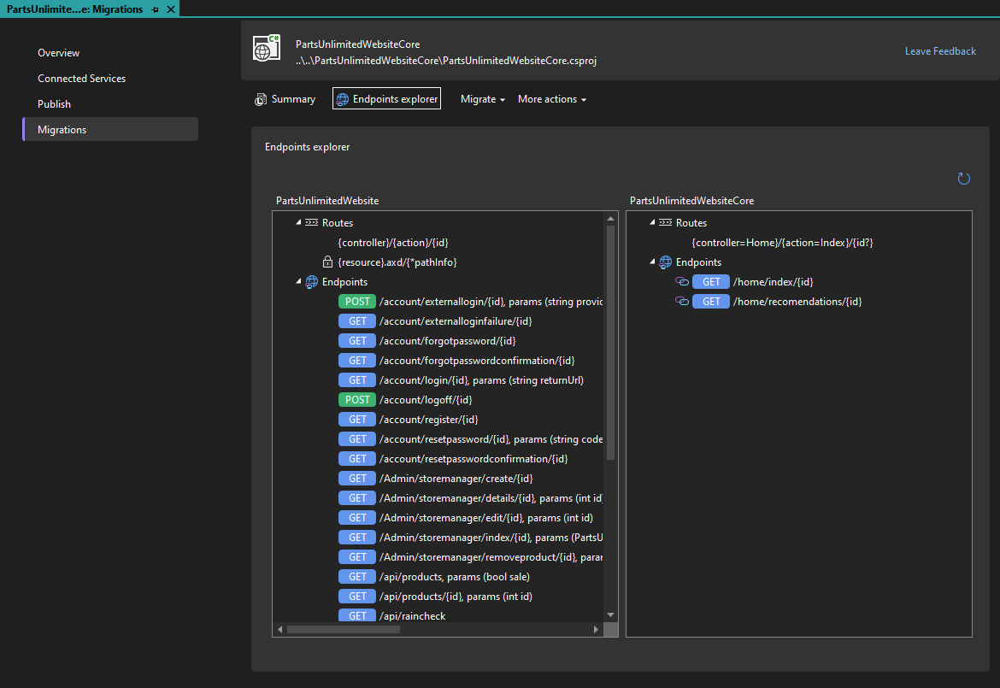

ASP.NET Core is a unified and modern web framework for .NET. Migrating existing ASP.NET apps to ASP.NET Core has many advantages, including better performance, cross-platform support (Windows, macOS, Linux), and access to all the latest improvements to the modern .NET web platform. But migrating from ASP.NET to ASP.NET Core can be very challenging and time consuming due to the many differences between the two frameworks. That's why we've been working to provide libraries and tooling for performing incremental migrations from ASP.NET to ASP.NET Core so that you can slowly migrate existing ASP.NET apps a piece at a time while still enabling ongoing app development. In this [blog series](https://devblogs.microsoft.com/dotnet/tag/migrate-to-aspnetcore/), we've been working on tooling in Visual Studio to simplify the migration experience, and a new update to the incremental ASP.NET migration tooling is now available. Along with this latest release of the incremental ASP.NET migration tooling extension, we're happy to announce that the System.Web adapters libraries for ASP.NET Core have reached 1.0.

The incremental ASP.NET migration tooling extension can be installed from the [Visual Studio Marketplace](https://marketplace.visualstudio.com/items?itemName=WebToolsTeam.aspnetprojectmigrations)

The System.Web adapters ship in four packages:

- [Microsoft.AspNetCore.SystemWebAdapters](https://www.nuget.org/packages/Microsoft.AspNetCore.SystemWebAdapters) – The core adapters package which includes adapters for common System.Web APIs, allowing them to be used from .NET Standard targeted projects.
- [Microsoft.AspNetCore.SystemWebAdapters.FrameworkServices](https://www.nuget.org/packages/Microsoft.AspNetCore.SystemWebAdapters.FrameworkServices) - Adds new functionality to ASP.NET apps for incremental migration scenarios. This includes exposing endpoints for sharing session or authentication state with paired ASP.NET Core apps.
- [Microsoft.AspNetCore.SystemWebAdapters.CoreServices](https://www.nuget.org/packages/Microsoft.AspNetCore.SystemWebAdapters.CoreServices) - The corresponding package for ASP.NET Core apps to take advantage of new functionality for sharing session or authentication state with an ASP.NET app during incremental migration.
- [Microsoft.AspNetCore.SystemWebAdapters.Abstractions](https://www.nuget.org/packages/Microsoft.AspNetCore.SystemWebAdapters.Abstractions) - A collection of shared abstractions for the Core and Framework System.Web adapter packages.

In this series we've previously posted the following posts related to project migrations:

- [Incremental ASP.NET to ASP.NET Core Migration](https://devblogs.microsoft.com/dotnet/incremental-asp-net-to-asp-net-core-migration/)
- [Incremental ASP.NET Migration Tooling Preview 2](https://devblogs.microsoft.com/dotnet/incremental-asp-net-migration-tooling-preview-2/)
- [Migrating from ASP.NET to ASP.NET Core in Visual Studio](https://devblogs.microsoft.com/dotnet/introducing-project-migrations-visual-studio-extension/)
- [Migrating from ASP.NET to ASP.NET Core (Part 4)](https://devblogs.microsoft.com/dotnet/migrating-from-asp-net-to-asp-net-core-part-4/)

In this blog post we'll cover the significant updates to the Project Migrations extension and System.Web adapters. We made the following improvements to the experience in Visual Studio when using the Project Migrations extension.

- Endpoints explorer to visually represent which routes have been migrated
- Added support for attribute based MVC controllers
- Improved support for convention based MVC controllers
- Support for API controllers
- Support for Areas
- Quality improvements in existing features

We will go into details for some of these areas now. Before we go through the updates, let's summarize how you can get started with migrating an ASP.NET Framework project to ASP.NET Core.

## Getting started

To migrate an existing ASP.NET Framework project to ASP.NET Core, first right click on the project in the Solution Explorer and select Migrate project. See the next image.

After clicking on this menu option, the Project Migrations page will be opened.

From here click on Start migration to enter the flow to migrate your project. After this you'll be prompted to create a new ASP.NET Core project, or select an existing ASP.NET Core to use as the migration target project. After you go through the wizard you should end up back in the Project Migrations page with content that is like the following.

From here, you'll use _Migrate Controller_, _Migrate class_ and _Migrate view_ to migrate your files to the new ASP.NET Core project. For more details see this previous blog post [Migrating from ASP.NET to ASP.NET Core in Visual Studio](https://devblogs.microsoft.com/dotnet/introducing-project-migrations-visual-studio-extension/). Now that we have recapped how to get started, let's move on to discuss the updates. Let's start with the Endpoints Explorer.

## Endpoints Explorer

In this release we've added the ability to view which endpoints, or routes, have been migrated and those that remain to be migrated. For projects which have already started the migration process, when you go to the Project Migrations page you should now see something like the following.

This page now has a new button _Endpoints explorer_ that will visualize the endpoints, or routes, which have been migrated and those which have not. When you click on that button, the Endpoints explorer view will be opened. See the following image.

In this view the endpoints for the original ASP.NET Framework project are shown on the left side and the routes which have been migrated to the ASP.NET Core project are on the right. From this view, you can see that I've only migrated a small number of routes and that there is still a lot of work remaining before I complete this migration process. You can right click a route in this view and select _Open in editor_ to view the source for that route. We hope that this can help you understand which routes have been migrated, and which remain to be migrated. Let's briefly cover the other updates included in this release.

## Other updates

In this release we've added support for migrating API Controllers. In previous releases we didn't have first-class support for API Controllers. You could migrate API Controllers, but they would be migrated as a standard class instead of an API Controller. When migrating an API Controller, we now apply code transformations to improve the migration result.

We've also added support for Areas. In previous releases we didn't have any knowledge of ASP.NET Areas during the migration process. Now when you migrate content in an ASP.NET Area, an Area will be created in the migration target project if needed. This should reduce the amount of work that you need to perform when migrating content in an ASP.NET Area.

In addition to these features we've improved the quality of existing features and added more transformers to reduce the amount of code that you need to manually fix up after the migration process.

## System.Web adapter improvements

The System.Web adapter packages enable migrating projects with System.Web dependencies to .NET Standard, .NET 6, or .NET 7 by exposing common System.Web APIs via .NET Standard-compatible adapters. This enables migrating class libraries with System.Web dependencies to .NET Standard so that they can be used by both ASP.NET and ASP.NET Core callers in incremental migration scenarios. Available APIs include many commonly used members from HttpRequest, HttpResponse, HttpContext, and other common types.

In addition to the System.Web APIs, the System.Web adapters include new functionality to enhance incremental migration. While incrementally migrating a solution, portions of the web app will be served by the original ASP.NET project and portions will be served by a new ASP.NET Core project. For simple endpoints, this works well. But when the user's session includes state – whether that's session items or authentication decisions – it's necessary to share this state between the two apps so that signing into one of the apps also signs into the other and so that a session item written by an endpoint from one app can be read by the other app. The System.Web adapters include functionality to enable sharing such state via connections between the ASP.NET Core and the ASP.NET apps.

The latest release of the adapters, version 1.0, is a stabilization release that fixes a number of bugs found in the original release candidate.

## Documentation update

Documentation for both the System.Web adapters and the incremental ASP.NET migration tooling has been improved and added to learn.microsoft.com at [https://learn.microsoft.com/aspnet/core/migration/inc/overview](https://learn.microsoft.com/aspnet/core/migration/inc/overview).

The documentation covers:

- [Getting started](https://learn.microsoft.com/aspnet/core/migration/inc/start) with the incremental migration tooling.
- An overview of the [System.Web adapters](https://learn.microsoft.com/aspnet/core/migration/inc/adapters) and [guidance](https://learn.microsoft.com/aspnet/core/migration/inc/usage_guidance) on how to enable features that bring some functionality closer to ASP.NET behavior.
- Documentation on sharing [session state](https://learn.microsoft.com/aspnet/core/migration/inc/remote-session) and [authentication](https://learn.microsoft.com/aspnet/core/migration/inc/remote-authentication) between ASP.NET and ASP.NET Core apps.

## Give feedback

We want to hear from you how we can best improve the incremental ASP.NET migration experience. The best place to share your feedback with us is on GitHub in the [dotnet/systemweb-adapters](https://github.com/dotnet/systemweb-adapters) repo. Use the 👍 reaction to indicate features or improvements that are most important to you.

For more details you can check out the additional related resources listed below. Please try it out on your existing ASP.NET projects and share feedback so that we can continue to improve the incremental ASP.NET migration experience.

Thanks, and happy coding!

## Resources

- [Microsoft Project Migrations (Experimental) – Visual Studio Marketplace](https://marketplace.visualstudio.com/items?itemName=WebToolsTeam.aspnetprojectmigrations)
- [dotnet/systemweb-adapters (github.com)](https://github.com/dotnet/systemweb-adapters)
- [YARP Documentation (microsoft.github.io)](https://microsoft.github.io/reverse-proxy/)
- [Incremental ASP.NET to ASP.NET Core Migration – .NET Blog (microsoft.com)](https://devblogs.microsoft.com/dotnet/incremental-asp-net-to-asp-net-core-migration/)
- [Incremental ASP.NET Migration Tooling Preview 2 – .NET Blog (microsoft.com)](https://devblogs.microsoft.com/dotnet/incremental-asp-net-migration-tooling-preview-2/)
- [Migrating from ASP.NET to ASP.NET Core in Visual Studio](https://devblogs.microsoft.com/dotnet/introducing-project-migrations-visual-studio-extension/)
- [Migrating from ASP.NET to ASP.NET Core (Part 4)](https://devblogs.microsoft.com/dotnet/migrating-from-asp-net-to-asp-net-core-part-4/)