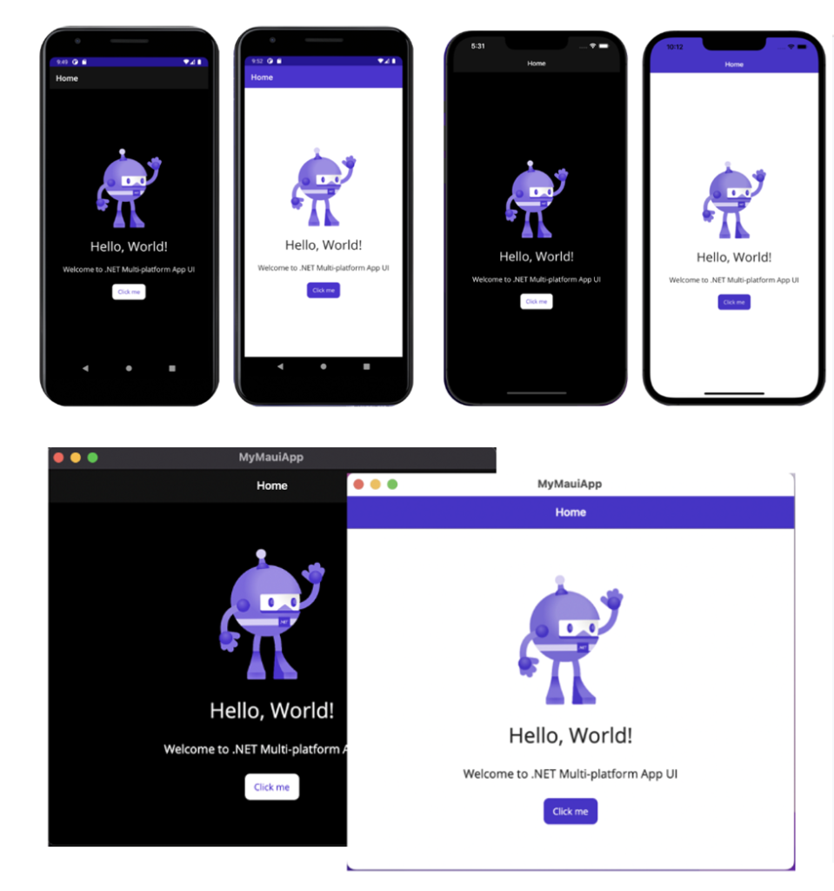
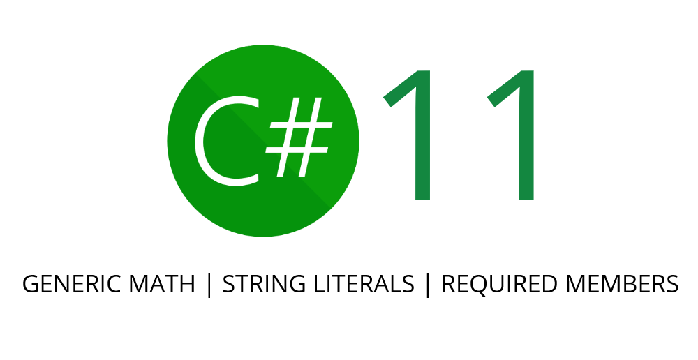

This is the introduction to your post. It's the post's first paragraph. Don't
put a heading in front of it. The title will be the post's first heading.

## [Performance Improvements in .NET 7](https://devblogs.microsoft.com/dotnet/performance_improvements_in_net_7/)

Deep dive in over 255 pages (when printed to PDF) of performance improvements for developers in .NET 7. The yearly entry by Stephen Toub is not only the most viewed post of the year, but also the most commented on as well! If you want to learn even more about performance improvements in .NET 7, Stephen also had a [session on performance](https://www.youtube.com/watch?v=yNPEdaxkTZw) at .NET Conf 2022!

<iframe width="752" height="423" src="https://www.youtube.com/embed/yNPEdaxkTZw" title="YouTube video player" frameborder="0" allow="accelerometer; autoplay; clipboard-write; encrypted-media; gyroscope; picture-in-picture" allowfullscreen></iframe>

In addition to this amazing blog post on overall performance improvements, each team also did entries for the different frameworks & platforms:

* [Performance improvements in ASP.NET Core 7](https://devblogs.microsoft.com/dotnet/performance-improvements-in-aspnet-core-7/)
* [Arm64 Performance Improvements in .NET 7](https://devblogs.microsoft.com/dotnet/arm64-performance-improvements-in-dotnet-7/)
* [.NET 7 Performance Improvements in .NET MAUI](https://devblogs.microsoft.com/dotnet/dotnet-7-performance-improvements-in-dotnet-maui/)

## [Introducing .NET MAUI - One Codebase, Many Platforms](https://devblogs.microsoft.com/dotnet/introducing-dotnet-maui-one-codebase-many-platforms/)

It was a huge year for mobile & desktop .NET developers with the launch of .NET MAUI, the Multi-platform App UI enabling developers to build cross-platform apps for iOS, Android, Mac, and Windows from a single shared codebase. David Ortinau highlights everything developers need to know to start their journey building native apps with .NET MAUI and hybrid apps by integrated Blazor into .NET MAUI! All of this while having full access to the native APIs all in C#. Be sure to also dive into the [.NET MAUI update for .NET 7](https://devblogs.microsoft.com/dotnet/dotnet-maui-dotnet-7/) and the .NET Conf - [State of .NET MAUI session](https://www.youtube.com/watch?v=Z6UPJmerTo8).

## [.NET 7 is Available Today](https://devblogs.microsoft.com/dotnet/announcing-dotnet-7/)

.NET 7 is here and brings your apps [increased performance](https://devblogs.microsoft.com/dotnet/performance_improvements_in_net_7/) and new features for [C# 11](https://devblogs.microsoft.com/dotnet/welcome-to-csharp-11)/[F# 7](https://devblogs.microsoft.com/dotnet/announcing-fsharp-7/), [.NET MAUI](https://devblogs.microsoft.com/dotnet/dotnet-maui-dotnet-7), [ASP.NET Core/Blazor](https://devblogs.microsoft.com/dotnet/announcing-asp-net-core-in-dotnet-7), Web APIs, [WinForms](https://devblogs.microsoft.com/dotnet/winforms-enhancements-in-dotnet-7), [WPF](https://devblogs.microsoft.com/dotnet/wpf-on-dotnet-7) and more. With .NET 7, you can also easily containerize your .NET 7 projects, set up CI/CD workflows in GitHub actions, and achieve cloud-native observability. Jon, Jeremy, and Angelos dive into everything you need to know about .NET 7!

## [Announcing .NET Framework 4.8.1](https://devblogs.microsoft.com/dotnet/announcing-dotnet-framework-481/)

Native Arm64 support comes to .NET Framework in version 4.8.1! Tara Overfield covers everything developers need to know about this release beyond Arm64 support including all sorts of accessibility improvements for Windows Forms and WPF.

Speaking of Arm64, did you know that [Visual Studio 2022 17.4](https://devblogs.microsoft.com/visualstudio/arm64-visual-studio-is-officially-here/) delivers a fully native Arm64 experience for developers?

## [Early peek at C# 11 features](https://devblogs.microsoft.com/dotnet/early-peek-at-csharp-11-features/)

There is so much to love in C# 11 and Kathleen Dollard gave everyone an early peek into highly anticipated features including [list patterns](https://learn.microsoft.com/dotnet/csharp/whats-new/csharp-11#list-patterns), [raw string literals](https://learn.microsoft.com/dotnet/csharp/whats-new/csharp-11#raw-string-literals), [required members](https://learn.microsoft.com/dotnet/csharp/whats-new/csharp-11#required-members), and so much more.

With the launch of .NET 7, C# 11 was also released and Mads Torgersen did a [full blog on the final features](https://devblogs.microsoft.com/dotnet/welcome-to-csharp-11/), so be sure to give that a look and watch the .NET Conf session on [What's New in C# 11](https://www.youtube.com/watch?v=H18CfoinPZg).

## Honorable Mentions

Throughout the year the .NET team continued to keep everyone up to date on the progress of .NET 7 and these blog posts continued to get great traction. Beyond the "update" blogs the team also did plenty of feature deep dives and product announcements, here are some of the top blogs in these categories:

* [Announcing Rate Limiting for .NET](https://devblogs.microsoft.com/dotnet/announcing-rate-limiting-for-dotnet/)
* [.NET 6 is now in Ubuntu 22.04](https://devblogs.microsoft.com/dotnet/dotnet-6-is-now-in-ubuntu-2204/)
* [Announcing built-in container support for the .NET SDK](https://devblogs.microsoft.com/dotnet/announcing-builtin-container-support-for-the-dotnet-sdk/)
* [CoreWCF 1.0 has been Released, WCF for .NET Core and .NET 5+](https://devblogs.microsoft.com/dotnet/corewcf-v1-released/)

There you have it, the top .NET blogs of 2022! What were your favorites? What do you want to see more of in 2023? Let us know in the comments below!