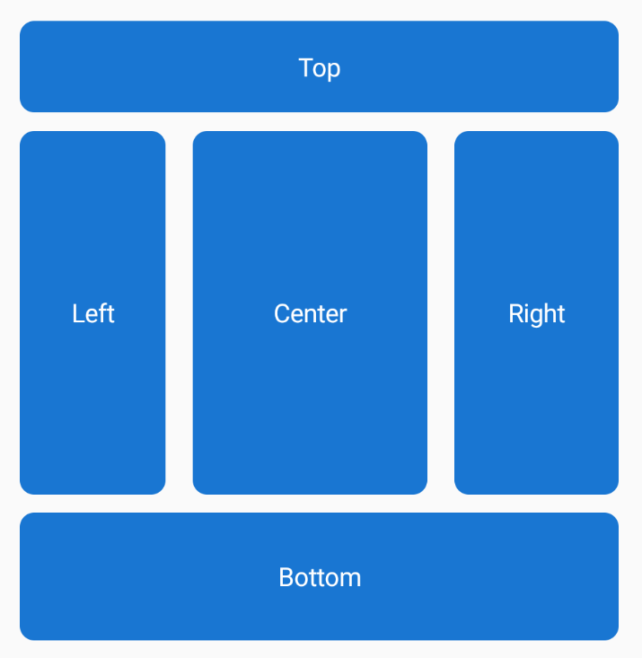

November has been a busy time for the .NET MAUI Community toolkit with multiple releases featuring a ton of amazing new features (not to mention a long list of bug fixes). The latest releases have new Views, Layouts, Tizen support, .NET 7 support and so much more. This post will get you up to speed on all the new features.

## What is the .NET Community Toolkit?

For those not familiar with the .NET MAUI Community Toolkit, it is a community-created library that contains Extensions, Advanced UI/UX Controls, Converters, and Behaviors to help make your life as a .NET MAUI developer easier. It is [free and open source](https://github.com/CommunityToolkit/Maui) and created for .NET MAUI Developers by .NET MAUI developers.

Let's dive into some of the big new features in the latest .NET MAUI Community Toolkit releases.

### Expander View

The `Expander` view is a container control that provides a way to expand and collapse visual content when tapping a header. The control comprises of two sections, the header and content. The content is shown or hidden by tapping the `Expander.Header` or by setting the `IsExpanded` bindable property.

```xaml
<toolkit:Expander>
    <toolkit:Expander.Header>
        <Label Text="Simple Expander (Tap Me)" FontSize="16" FontAttributes="Bold"/>
    </toolkit:Expander.Header>

    <toolkit:Expander.Content BackgroundColor="LightGray">
        <VerticalStackLayout>
            <Label Text="Item 1"/>
            <Label Text="Item 2"/>
        </VerticalStackLayout>
    </toolkit:Expander.Content>
</toolkit:Expander>
```


### DockLayout

The DockLayout is a layout where views can be docked to the sides of the layout container. This makes it a great choice in many situations, where you want to divide the screen into specific areas.



This basic `DockLayout` can be created in XAML like this:

```xaml
<toolkit:DockLayout>
    <Button toolkit:DockLayout.DockPosition="Top" Text="Top" HeightRequest="50" />
    <Button toolkit:DockLayout.DockPosition="Bottom" Text="Bottom" HeightRequest="70" />
    <Button toolkit:DockLayout.DockPosition="Left" Text="Left" WidthRequest="80" />
    <Button toolkit:DockLayout.DockPosition="Right" Text="Right" WidthRequest="90" />
    <Button Text="Center" />
</toolkit:DockLayout>
```

### StateContainer

The `StateContainer` makes it super easy to dynamically display content based on the state of your application. Examples range from creating loading views to an overlay on the screen, or on a subsection of the screen. Empty state views can be created for when there's no data to display, and error state views can be displayed when an error occurs.


### Tizen Support

In a massive contribution by the Samsung team there is now Tizen support for the .NET MAUI Community Toolkit. This brings the .NET MAUI Community toolkit to millions of Samsung TVs, phones, and other devices running Tizen.


### .NET 7 Support

We also pushed out a release of .NET MAUI Community Toolkit built on .NET 7, which means those of you who want to enjoy all the great benefits of .NET 7 can do so with the .NET MAUI Community Toolkit.

### MAUI.Markup Toolkit

In addition to the .NET MAUI Community Toolkit we also have the [MAUI.Markup Toolkit](https://github.com/CommunityToolkit/Maui.Markup) which  is a collection of Fluent C# Extension Methods that allows developers to architect their apps using MVVM, Bindings, Resource Dictionaries, etc. in C# without having to work in XAML.

The MAUI.Markup Toolkit has been updated to add C# extension methods for App Themeing and ITextAlignment. In fact, using source generators, Maui.Markup auto-generates extension methods for every ITextAlignment control, even if you create your own custom control! We also gave MAUI.Markup the .NET 7 treatment as well.

## Versions

Those of you looking at our releases on Nuget may have noticed that there are multiple releases of the .NET MAUI Community toolkit that happened in quick succession. It is worth giving an overview of the different versions:

* Version 1.4.0 - adds Expander, DockLayout & StateContainer (and of course a lot of bugfixes!) - [Release Notes](https://github.com/CommunityToolkit/Maui/releases/tag/1.4.0)
* Version 2.0.0 - adds full Tizen support for all of out features, including the changes from v1.4.0 - [Release Notes](https://github.com/CommunityToolkit/Maui/releases/tag/2.0.0)
* Version 3.0.0 - everything from v1.4.0 and v2.0.0 but is built against .NET 7 - [Release Notes](https://github.com/CommunityToolkit/Maui/releases/tag/3.0.0)

With this versioning strategy we aim to empower as many developers as possible: everyone on .NET 6 can get all the features we've merged so far, including Tizen support using v2.0.0. For those using .NET 7 you can get all the features using v3.0.0.  

> Importantly, going forward, .NET 7 will be the target for the amazing new features of .NET MAUI Community Toolkit!

## More Resources
If you want to learn more about the .NET MAUI Community toolkit you can check out this great overview video from [.NET Conf 2022](https://www.dotnetconf.net/) where [Gerald Versluis](https://twitter.com/jfversluis) walks through the history of the Community Toolkit(s), what you can do with it today and how to get started!

<iframe width="560" height="315" src="https://www.youtube.com/embed/2Zxmb_3DGQU" title="YouTube video player" frameborder="0" allow="accelerometer; autoplay; clipboard-write; encrypted-media; gyroscope; picture-in-picture" allowfullscreen></iframe>

Of course, you can find all source code and our sample app in our [GitHub repo](https://github.com/CommunityToolkit/Maui) and check out our [official documentation](https://learn.microsoft.com/dotnet/communitytoolkit/maui/).

## Summary
Finally, a massive thank you to all the contributors! It really is a community effort powered by your efforts. If you would like to contribute, feel free to open issues or let us know about your experience!

We hope you enjoy the latest releases of .NET MAUI Community toolkit and don't forget you can join us live on the 1st Thursday of each month @ 1200 PT, where we live-stream our standups on the [.NET Foundation YouTube Channel](https://www.youtube.com/channel/UCiaZbznpWV1o-KLxj8zqR6A).

Happy coding! 💻