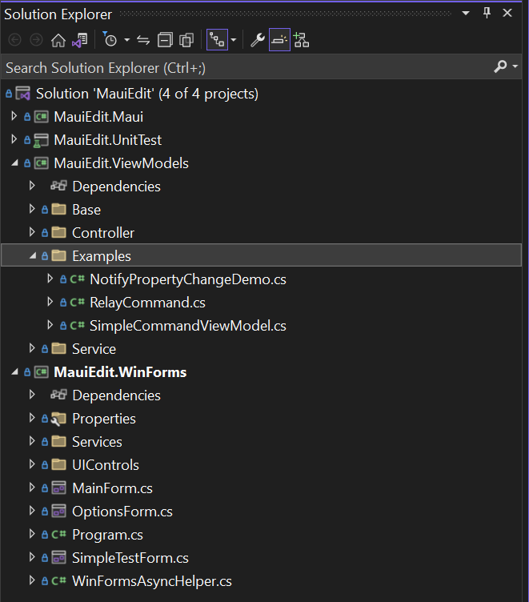
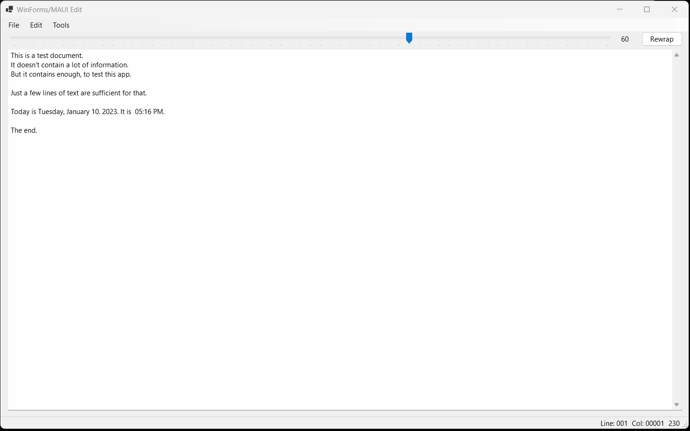
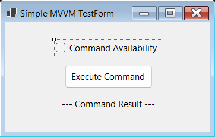
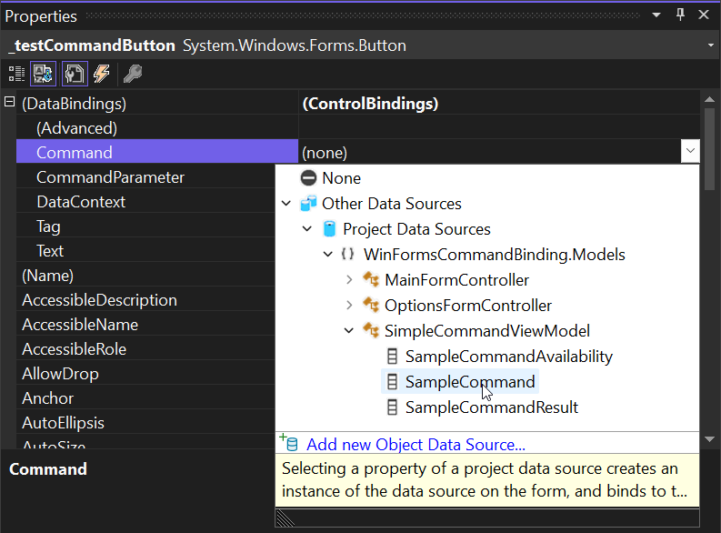
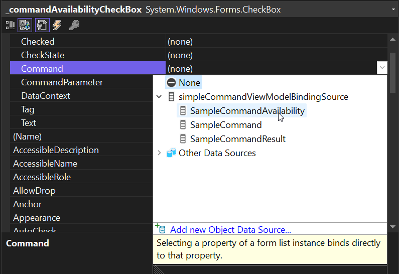
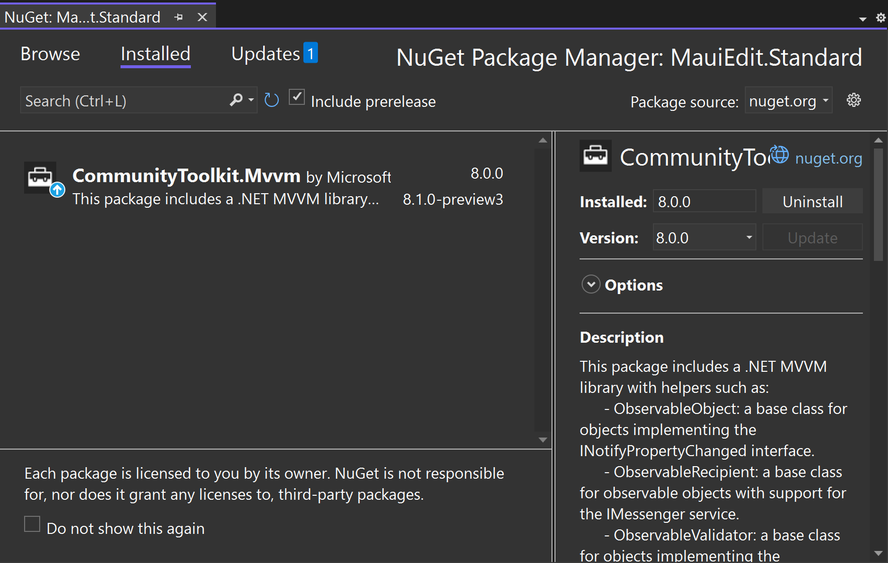
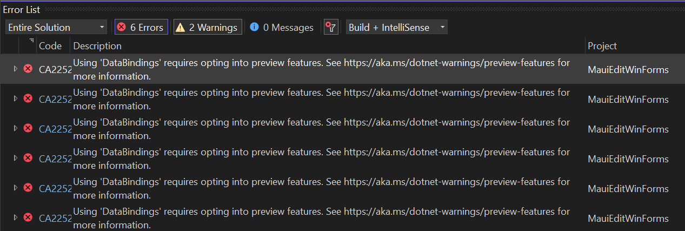
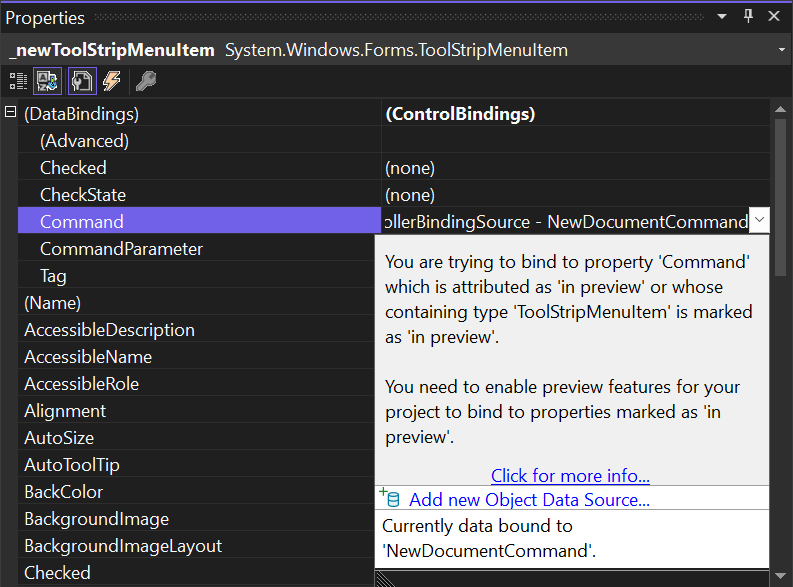

Large line-of-business WinForms applications can often benefit from the use of
the Model-View-ViewModel (MVVM) pattern to simplify maintenance, reuse, and unit
testing. In this post, I'll explain the important concepts and architectural
patterns, then explain how you can leverage modern libraries, .NET 7 features,
and Visual Studio tooling to efficiently modernize your WinForms applications.

One of the features that has led WinForms to its overwhelming popularity as a
RAD (rapid application development) tool is often, for large line-of-business
apps, also its biggest architectural challenge: placing application logic as
code behind UI-Element's event handlers. As an example: The developer wants to
display a database view after a mouse click on a pulldown menu entry. The
pulldown menu is located in the main form of the application. This form is a
class derived from `System.Windows.Forms`, so it has dependencies to the .NET
WinForms runtime. This means every line of code put here can only be reused in
a context of _a_, probably even only if the context of exactly _this_ WinForms
app. Typically for WinForms, user interaction with any UI elements triggers
events. These events are then handled in corresponding event handler routines,
and this approach is often called _code-behind_. So, the _code behind_ the menu
entry is triggered. In many cases, the form is now executing the logic for a
domain-specific task that basically has nothing to do with the UI. For large
line-of-business apps, this can quickly become an architectural nightmare.

In the case of this example, the code which is executed as a result of a user
clicking a menu item contains many steps. The form connects to a database, sends
a query to that database, then feeds the data, perhaps prepares it by performing
additional calculations or pulling in additional data from other sources, and
finally passes the resulting data set to another WinForms form which it then
presents in a `DataGridView`. Code-behind application architectures in this way
tend to easily mix domain-specific with UI-technical tasks. The resulting
codebase is not only difficult to maintain, it is also hard to reuse in other
scenarios, let alone easily support unit testing of the business logic.

## Enter UI-Controller architecture

With the introduction of Windows Presentation Foundation (WPF) in 2008, a new
design pattern emerged that set out to clean up the code-behind spaghetti
architecture of previous UI stacks and introduced a clear separation of code
based on the layer in the application: UI-relevant code remained alone in a view
layer, domain-specific code migrated to a ViewModel layer, and additional data
transport classes, which were used to transport data from a database or an alike
data source and were processed in the view model, were simply called _Model_
classes.

The name of the pattern became _Model-View-ViewModel_, or _MVVM_ for short. The
processing of data and the execution of the domain-specific code are reserved
for the ViewModel. As an example, the business logic for an accounting
application only runs in the context of one (or more) ViewModel assemblies.
Projects that build these assemblies have no references to concrete UI stacks
like WinForms, WPF or .NET MAUI. Rather, they provide an invisible or virtual UI
only through properties, which are then linked to the UI at runtime via data
binding.

This technique is not entirely new for WinForms apps. Abstraction via
data binding was already common practice in the VB6 days and became even more
flexible with WinForms and the introduction of Typed DataSets. The abstraction
of data and UI worked according to the same principle then as it does today: The
various properties of a data source (in MVVM the ViewModel, in typical WinForms
or VB6 architectures often a filtered and specially prepared view of the
database directly) are bound to specific control elements of the UI. The
`Firstname` property of a data source class is bound to the `Text` property of
the `FirstnameTextBox` control. The `JoinDate` property of the same data source
class is bound to the `Value` property of the `JoinDateTimePicker` control, and
so on. Even the notifications of the data classes to the UI that data has
changed worked in the first WinForms versions in the same way as is still the
case today in WPF, WinUI or .NET MAUI: data classes implement an interface
called `INotifyPropertyChanged`. This mandates an event called `PropertyChanged`
for the data source classes. It is then the task of the data classes to
determine in the respective setters of the property implementations whether the
property value had really changed and, if this is the case, to trigger the
corresponding event, specifying the property name. A typical implementation of a
property in a class looks something like this:

```cs
    public class NotifyPropertyChangeDemo : INotifyPropertyChanged
    {
        // The event that is fired when a property changes.
        public event PropertyChangedEventHandler? PropertyChanged;

        // Backing field for the property.
        private string? _lastName;
        private string? _firstName;

        // The property that is being monitored.
        public string? LastName
        {
            get => _lastName;
            
            set
            {
                if (_lastName == value)
                {
                    return;
                }
                
                _lastName = value;

                // Notify the UI that the property has changed.
                // Using CallerMemberName at the call site will automatically fill in
                // the name of the property that changed.
                OnPropertyChanged();
            }
        }

        public string? FirstName
        {
            get => _firstName;

            set
            {
                if (_firstName == value)
                {
                    return;
                }

                _firstName = value;
                OnPropertyChanged();
            }
        }

        private void OnPropertyChanged([CallerMemberName] string propertyName = "") 
            => PropertyChanged?.Invoke(this, new PropertyChangedEventArgs(propertyName));
    }
```

In summary, the general idea is to remote-control the actual UI through data
binding. However, in contrast to the original thought coming from VB6 and the
classical WinForms data binding, using a UI-Controller pattern like MVVM is more
than a convenience to populate a complex form with data: While VB6 and classic
WinForms applications typically only used populated data classes like Typed
DataSets or Entity Framework model class instances, the ViewModel holds the data
_and_ encapsulates the business logic to prepare that data logically in such a
way that practically the only task of the UI layer is to present the data in a
user-friendly way.

### UI-Controller Architecture in WinForms: To what end?

If you wanted to architect and develop a new application from scratch, you would
most likely consider using a modern UI stack for your new development endeavors,
and in many cases, that makes sense. If you were to start developing a new
Windows app from scratch, a more modern stack like
[WinUI](https://learn.microsoft.com/windows/apps/winui/winui3/create-your-first-winui3-app)
might be a meaningful alternative. Alternatively, a web-based front end and
adapting technologies like
[Blazor](https://learn.microsoft.com/aspnet/core/blazor/?view=aspnetcore-7.0) or
[Angular/TypeScript](https://angular.io/start#:~:text=In%20the%20product-list%20folder%2C%20open%20the%20template%20file,as%20in%20the%20%28click%29%20event%20on%20the%20)
also have merit. But it's often not that easy in real life. Here is a list of
points to consider, why adapting a UI-Controller architecture for new or
existing WinForms apps makes sense:

* **Acceptance of UI paradigm changes in LOB apps:** Users usually are trained
  not only in one particular business application, but also build muscle memory
  in how the UI is handled across an LOB app-suite in general. If LOB apps get
  rewritten for a new UI Stack, additional training for the users needs to be
  taken into account. Modernizing the core of a WinForms business app without
  changing the workflow for a big existing user base might be a requirement in
  certain scenarios.

* **Feasibility of re-writes of huge line-of-business apps:** There are hundreds
  of thousands of line-of-business WinForms apps already out there. Simply
  discarding a huge, often several hundred-thousand lines of code business app
  is simply not feasible. It makes more sense to re-architect and modernize such
  an app step by step. The vast majority of development teams simply don't have
  the time to keep supporting the actively in-use legacy app while developing
  the same app - modernized, based on a completely new technology - from
  scratch. Modernizing the app in place, step-by-step, and area by area is often
  the only viable alternative.

* **Unit tests for ViewModels:** Introducing a UI-controller architecture into
  an existing LOB app opens up another advantage: Since
  UI-Controllers/ViewModels are not supposed to have dependencies to certain UI
  technologies, unit tests for such apps can be implemented much more easily. We
  cover this topic in more detail in the context of the sample app below.

* **Mobile Apps spin-offs:** The necessity for spin-offs of mobile apps from a
  large WinForms line-of-business apps is a growing requirement for many
  businesses. With an architecture in which ViewModels can be shared and
  combined between for example WinForms and .NET MAUI, the development of such
  mobile apps can be streamlined with a lot of synergy effects. This topic is
  also covered in more detail in the context of the sample app.

* **Consolidating and modernizing backend technologies:** Last but not at all
  least - with a proper architecture - consolidating onsite server-backends and
  migrating the backends of a LOB apps to Azure based cloud technologies is
  straight forward, and can be done as a migration project over time. The users
  do not lose their usual way of working and the modernization can happen mostly
  in the background without interruptions.

### The sample apps of this blog post

You can find the sample app used in this blog post [in the WinForms-Designer-Extensibility Github
repo](https://github.com/microsoft/winforms-designer-extensibility/tree/main/Samples/CommandBinding). It contains
these areas:

* The simplified scenarios used in this blog post to explain the
  UI-Controller/MVVM approach in WinForms with the new WinForms Command Binding
  features. You find this samples in the project _MauiEdit.ViewModel_ in the solution folder _Examples_.
* A bigger example (the WinForms Editor), showing the new WinForms features in
  the context of a real-world scenario.
* A .NET MAUI-Project, adapting the exact same ViewModel used for the WinForms
  App for a .NET MAUI app. We are limiting the showcase here to Android for
  simplicity in this context.
* A unit test project, which shows how using ViewModels enables you to write
  unit tests for a UI based on an UI-Controller abstraction like MVVM.

  

**NOTE:** This blog post is not an introduction to .NET MAUI. There are a lot of
resources on the web, showing the basic approach of MVVM with XAML-based UI
stacks, an [Introduction to .NET MAUI](https://learn.microsoft.com/dotnet/architecture/maui/introduction), many examples, and lots of [really good YouTube videos](https://www.youtube.com/watch?v=DuNLR_NJv8U).



## Command Binding for calling methods inside the UI-controller

While WinForms brought a pretty complete infrastructure for data binding along
from the beginning, and data could also flow between the UI and the binding
source in both directions, one aspect was missing. Up to now, there wasn't a
"bindable" way to connect business logic methods in the data source - or more
accurately: the UI-Controller or ViewModel - with the UI. The goal with the
_separation of concerns_ is that a form or UserControl shouldn't execute code
which manipulates business data. It should leave that task completely to that UI
Controller. Now, in the spirit of MVVM, the approach is to connect an element of
the UI to the a method inside UI-Controller, so when the UI Element is engaged
in the UI, the respective method in the Controller (the ViewModel) is executed.
These methods, which are responsible for the domain-specific functionality
inside a ViewModel, are called _Commands_. For linking these ViewModel commands
with the user interface, MVVM utilizes _Command Binding_ which is based on types
implementing the
[`ICommand`](https://learn.microsoft.com/dotnet/api/system.windows.input.icommand?view=net-7.0)
interface. Those types can then be used in UI Controllers like ViewModels to
define properties so they don't hold the actual code to be executed, they rather
_point_ to the methods which get automatically executed when the UI Element the
Command is bound to in the View gets engaged.

**Note:** Although `ICommand` is located in the Namespace `System.Windows.Input`
which in principle points to namespaces used in the WPF context, `ICommand`
doesn't have any dependencies to any existing UI Stack in .NET or the .NET
Framework. Rather, `ICommand` is used across all .NET based UI Stacks, including
WPF, .NET MAUI, WinUI, UWP, and now also WinForms.

If you have a Command defined in your ViewModel, you also need `Command`
properties in UI elements to bind against. To make this possible for the .NET 7
WinForms runtime, we made several changes to WinForms controls and components:

* **Introduced `Command` for `ButtonBase`:** `ButtonBase` got a [`Command`
  property](https://learn.microsoft.com/dotnet/api/system.windows.forms.buttonbase.command?view=windowsdesktop-7.0)
  of type `ICommand`. That means that the controls `Button`, `CheckBox` and
  `RadioButton` in WinForms also now have a `Command` property as will every
  WinForms control derived either from `Button` or `ButtonBase`.
* **Introduced `BindableComponent`:** The WinForms .NET 7 runtime introduced
  [`BindableComponent`](https://learn.microsoft.com/dotnet/api/system.windows.forms.bindablecomponent?view=windowsdesktop-7.0).
  Before, components were not intrinsically bindable in WinForms, they were
  missing the necessary binding infrastructure. `BindableComponent` derives from
  `Component` and provides the infrastructure to create properties for a
  component, which can be bound.
* **Made `ToolStripItem` bindable:** [`ToolStripItem`](https://learn.microsoft.com/dotnet/api/system.windows.forms.toolstripitem?view=windowsdesktop-7.0) no longer derives from
  `Component` but rather now from `BindableComponent`. This was necessary, since
  `ToolStripButton` and `ToolStripMenuItem` are desired candidates for command
  binding targets, but for that they need to be able to be bound to begin with.
* **Introduced `Command` for `ToolStripItem`:** `ToolStripItem` also got a
  [`Command`](https://learn.microsoft.com/dotnet/api/system.windows.forms.toolstripitem.command?view=windowsdesktop-7.0#system-windows-forms-toolstripitem-command) property of type `ICommand`. Although every component derived from
  `ToolStripItem` now has a `Command` property, especially `ToolStripButton`,
  `ToolStripDropDownButton`, `ToolStripMenuItem` and `ToolStripSplitButton` are
  ideal candidates for command binding due to their UI characteristics.
* **Introduced `CommandParameter` properties:** For a simplified passing of
  `Command` parameters, both `ButtonBase` and `ToolStripItem` got a
  [`CommandParameter`
  property](https://learn.microsoft.com/dotnet/api/system.windows.controls.primitives.buttonbase.commandparameter?view=windowsdesktop-7.0).
  When a command gets executed, the content of `CommandParameter` is
  automatically passed to the command's method in the UI-Controller/ViewModel.
* **Introduced public events for new properties:** Both `ButtonBased` and
  `ToolStripItem` got the new events
  [`CommandCanExecuteChanged`](https://learn.microsoft.com/dotnet/api/system.windows.forms.buttonbase.commandcanexecutechanged?view=windowsdesktop-7.0),
  [`CommandChanged`](https://learn.microsoft.com/dotnet/api/system.windows.forms.buttonbase.commandchanged?view=windowsdesktop-7.0)
  and
  [`CommandParameterChanged`](https://learn.microsoft.com/dotnet/api/system.windows.forms.buttonbase.commandparameterchanged?view=windowsdesktop-7.0).
  With these events the new properties are supported by the binding
  infrastructure of WinForms and make the those properties bindable.
* **Introduced (protected) `OnRequestCommandExecute`:** Overriding
  [`OnRequestCommandExecute`](https://learn.microsoft.com/dotnet/api/system.windows.forms.buttonbase.onrequestcommandexecute?view=windowsdesktop-7.0)
  allows `ButtonBase`- or `ToolStripItem`-derived classes to intercept the
  request to execute a command when the user has clicked a bound command control
  or component. The derived control can then decide _not_ to invoke the bound UI
  Controller's or ViewModel's command by simply not calling the base class's
  method.

### Controlling Command Execution and Command Availability by Utilizing Relay Commands

Since `ICommand` is just an interface which mandates properties and methods, a
UI-Controller or ViewModel needs to use a concrete class instance, which
implements the `ICommand` interface.

The `ICommand` interface has three methods:

* `Execute`: This method is called when the command is invoked. It contain the
  domain specific the logic.
* `CanExecute`: This method is called whenever the command's context to execute
  changes. It returns a boolean value indicating the command's availability.
* `CanExecuteChanged`: This event is raised whenever the value of the CanExecute method changes.

 One typical implementation of a class implementing `ICommand` is called
 `RelayCommand`, and a simplified version would look like this:

```cs
    // Implementation of ICommand - simplified version not taking parameters into account.
    public class RelayCommand : ICommand
    {
        public event EventHandler? CanExecuteChanged;

        private readonly Action _commandAction;
        private readonly Func<bool>? _canExecuteCommandAction;

        public RelayCommand(Action commandAction, Func<bool>? canExecuteCommandAction = null)
        {
            ArgumentNullException.ThrowIfNull(commandAction, nameof(commandAction));

            _commandAction = commandAction;
            _canExecuteCommandAction = canExecuteCommandAction;
        }

        // Implicit interface implementations, since there will never be the necessity to call this 
        // method directly. It will always exclusively be called by the bound command control.
        bool ICommand.CanExecute(object? parameter)
            => _canExecuteCommandAction is null || _canExecuteCommandAction.Invoke();

        void ICommand.Execute(object? parameter)
            => _commandAction.Invoke();

        /// <summary>
        ///  Triggers sending a notification, that the command availability has changed.
        /// </summary>
        public void NotifyCanExecuteChanged()
            => CanExecuteChanged?.Invoke(this, EventArgs.Empty);
    }
```

When you bind the `Command` property of a control against a property of type
`RelayCommand` (or any other implementation of `ICommand`), two things happen:

* Whenever the user engages the control (by clicking or pressing the related
  shortcut key on the keyboard), the `Action` defined for the RelayCommand gets
  executed.
* The control whose `Command` property is bound gets disabled when the execution
  context changes. The execution context is controlled by the `CanExecute` method
  of the RelayCommand. When it returns `false`, it indicates that the command
  cannot be executed. In that case, the control gets automatically disabled.
  When it returns `true`, the opposite happens: the control gets enabled.

**Note:** The execution context of a command is usually controlled by the UI
Controller/ViewModel. It might be affected by the UI alright, but it's the
ultimate decision of the ViewModel to enable or disable a command based on some
domain specific context. The sample code below will give a practical example how
to to enable or disable a command's execution context based on a user's input.

### Additional WinForms Binding Features in .NET 7

In addition to the new binding features, we added a new general data binding
infrastructure feature on `Control`: For an easier cascading of data source
population in nested Forms (for example a form holds UserControls which hold
other UserControls which hold custom controls etc.), .NET 7 also introduced a
**`DataContext` property** of type `Object` on `Control`. This property has
ambient characteristics (like `BackColor` or `Font`). That means when you assign
a data source instance to `DataContext`, that instance gets automatically
delegated down to every child control of the form. Currently, the `DataContext`
property does simply serve the purpose of a data source carrier, but does not
affect any bindings directly. It is still the duty of the control to then
delegate a new data source down to the respective `BindingSource` components,
where it makes sense. Examples:

* UserControls, which are used inside of Forms, utilize dedicated
  `BindingSource` components for internal binding scenarios. They all need to be
  taken from one central data source. This data source can now be handed down
  from the parent control via its `DataContext` property. When the `DataContext`
  property gets assigned to the form, not only will every child control of the
  controls collection of this parent have that same `DataContext` - as soon as
  the data source of the parent's `DataContext` changes, all the children
  receive the [**DataContextChange
  event**](https://learn.microsoft.com/dotnet/api/system.windows.forms.control.datacontextchanged?view=windowsdesktop-7.0),
  so they know they can provide their `BindingSource`'s `DataSource` properties
  with whatever updated data source their domain-specific context requires. We
  cover this scenario also in the sample app down below.
* If you have implemented data binding scenarios with custom binding engines,
  you can also use `DataContext` to simplify binding scenarios and make them
  more robust. In derived controls, you can overwrite
  [**`OnDataContextChanged`**](https://learn.microsoft.com/dotnet/api/system.windows.forms.control.ondatacontextchanged?view=windowsdesktop-7.0)
  to control the change notification of the `DataContext`, and you can use
  [**`OnParentDataContextChanged`**](https://learn.microsoft.com/dotnet/api/system.windows.forms.control.onparentfontchanged?view=windowsdesktop-7.0)
  to intercept notifications, when the parent control notifies its child
  controls that the `DataContext` property has changed.

## Binding Commands and ViewModels with the WinForms out-of-proc Designer

Now, let's put all of the puzzle pieces we've covered so far together, and apply
them in a very simple WinForms App:



The idea here is to have a form which is controlled by a ViewModel, providing a
Command and properties to bind against the CheckBox control and the Label. When
the Button is engaged, the bound command in the ViewModel gets executed,
changing the `CommandResult` property which states how often the Button has been
clicked. Since `CommandResult` is bound against the Label, the UI reflects this
result. The CheckBox in this scenario controls the availability of the command.
When the CheckBox is checked, the command is available. Therefore, the button is
enabled, since the command's CanExecute method returns `true`. As soon as the
CheckBox' check state changes, the bound `SampleCommandAvailability` gets
updated, and its setter gets executed. That in turn invokes the
`NotifyCanExecuteChanged` method. That again triggers the execution of the
command's `CanExecute` method, which now returns the updated execution context
and automatically updates the enabled state of the bound button so it becomes
disabled.  

The business logic for this application is completely implemented in the
ViewModel. Except for what is in `InitializeComponent` to setup the form's
controls, the form only holds the code to setup the ViewModel as the form's data
source.

```cs
public class SimpleCommandViewModel : INotifyPropertyChanged
    {
        // The event that is fired when a property changes.
        public event PropertyChangedEventHandler? PropertyChanged;

        // Backing field for the properties.
        private bool _sampleCommandAvailability;
        private RelayCommand _sampleCommand;
        private string _sampleCommandResult = "* not invoked yet *";
        private int _invokeCount;

        public SimpleCommandViewModel()
        {
            _sampleCommand = new RelayCommand(ExecuteSampleCommand, CanExecuteSampleCommand);
        }

        /// <summary>
        ///  Controls the command availability and is bound to the CheckBox of the Form.
        /// </summary>
        public bool SampleCommandAvailability
        {
            get => _sampleCommandAvailability;
            set
            {
                if (_sampleCommandAvailability == value)
                {
                    return;
                }

                _sampleCommandAvailability = value;

                // When this property changes we need to notify the UI that the command availability has changed.
                // The command's availability is reflected through the button's enabled state, which is - 
                // because its command property is bound - automatically updated.
                _sampleCommand.NotifyCanExecuteChanged();

                // Notify the UI that the property has changed.
                OnPropertyChanged();
            }
        }

        /// <summary>
        ///  Command that is bound to the button of the Form.
        ///  When the button is clicked, the command is executed.
        /// </summary>
        public RelayCommand SampleCommand
        {
            get => _sampleCommand;
            set
            {
                if (_sampleCommand == value)
                {
                    return;
                }

                _sampleCommand = value;
                OnPropertyChanged();
            }
        }

        /// <summary>
        ///  The result of the command execution, which is bound to the Form's label.
        /// </summary>
        public string SampleCommandResult
        {
            get => _sampleCommandResult;
            set
            {
                if (_sampleCommandResult == value)
                {
                    return;
                }

                _sampleCommandResult = value;
                OnPropertyChanged();
            }
        }

        /// <summary>
        ///  Method that is executed when the command is invoked.
        /// </summary>
        public void ExecuteSampleCommand()
            => SampleCommandResult = $"Command invoked {_invokeCount++} times.";

        /// <summary>
        ///  Method that determines whether the command can be executed. It reflects the 
        ///  property CommandAvailability, which in turn is bound to the CheckBox of the Form.
        /// </summary>
        public bool CanExecuteSampleCommand()
            => SampleCommandAvailability;

        // Notify the UI that one of the properties has changed.
        private void OnPropertyChanged([CallerMemberName] string propertyName = "")
            => PropertyChanged?.Invoke(this, new PropertyChangedEventArgs(propertyName));
    }
```

Setting up the form and the ViewModel through binding in WinForms is of course
different than it is in typical XAML languages like WPF, UWP or .NET MAUI. But it's
pretty quick and 100% in the spirit of WinForms.

**Note:** Please keep in mind that the out-of-process Designer doesn't support
the _Data Source Provider Service_, which is responsible for providing the
classic Framework Data Sources Window. The [data binding blog
post](https://devblogs.microsoft.com/dotnet/databinding-with-the-oop-windows-forms-designer/)
tells more about the background. So, in a .NET WinForms App at this point you
cannot interactively create Typed DataSets with the Designer or add existing
Typed DataSets as data sources through the Data Sources tool window. Keep also
in mind that although there is no Designer support to _add_ Typed DataSets as
data sources, the out-of-process Designer for .NET does support binding against
Typed DataSets of already defined data sources (which have been brought over
from a .NET Framework application just by copying the files structure of a
project).

The out-of-process Designer provides an easier alternative to hook up new Object
Data Sources, which can be based on ViewModels as described here, but also based
on classes which results from Entity Framework or EFCore. The Microsoft docs
[provide a neat guide](https://learn.microsoft.com/ef/core/get-started/winforms)
how to work with EFCore and this new Feature to create a simple data bound
WinForms application.

To set up the bindings for the ViewModel to the sample WinForms UI, follow these
steps:

1. Open and design the form in the WinForms out-of-process Designer according to the screenshot above.
2. Select the Button control by clicking on it.
3. In the Property Browser, scroll to the top, find the _(DataBindings)_ property
  and open it.
4. Find the row for the `Command` property, and open the Design Binding Picker by
    clicking the arrow-down button at the end of the cell.

    :::image type="content" source="EngageAddDataSourceDialog.png" alt-text="Screenshot showing the open Design Binding Picker to add a new object data source.":::

5. In the Design Binding Picker, click on _Add new Object Data Source_.
6. The Designer now shows the _Add Object Data Source_-Dialog. In this dialog,
  click on the class you want to add, and then click _OK_.
7. After closing the dialog, the new data source becomes available, and you can
  find the `SampleCommand` property in the Design Binding Picker and assign it to
  the Button's `Command` property.

    

8. Select the CheckBox control in the form, and bind its `Checked` property to
  the ViewModel's `CommandAvailability` property. Please note from the following
  screenshot: The previous step automatically inserted the required
  `BindingSource` component, which is in most cases common to use as a mediator
  for binding and syncing between several control instances (like the current
  line of a bound DataGridView and a detail view on the same Form). When you
  earlier picked the `SampleCommand` property directly from the ViewModel, the
  Designer created the BindingSource based on that pick and then selected that
  property from the BindingSource. Successive bindings on this form should now
  be picked directly from that BindingSource instance.

        

9. Select the Label control in the form, and bind its `Text` property to the
  ViewModel's `CommandResult` property.

The only code now which needs to be run in the form directly, is the hook up of the ViewModel with the form using the BindingSource at runtime:

```cs
        protected override void OnLoad(EventArgs e)
        {
            base.OnLoad(e);
            simpleCommandViewModelBindingSource.DataSource = new SimpleCommandViewModel();
        }
```

### Using the MVVM community toolkit for streamlined coding

For more complex scenarios, developing the domain-specific MVVM classes would
require writing comparatively expensive boilerplate code. Typically, developers
using XAML-based UI stacks like WPF or .NET MAUI use a library called [MVVM Community
Toolkit](https://learn.microsoft.com/windows/communitytoolkit/mvvm/introduction)
to utilize the many provided MVVM-base classes of that library, but also to let
code generators do the writing of this kind of code wherever it makes sense.

To use the MVVM community toolkit, you just need to add the respective [NuGet
reference](https://www.nuget.org/packages/CommunityToolkit.Mvvm/)
_CommunityToolkit.Mvvm_ to the project which is hosting the ViewModel classes
for your app.



The introduction to the MVVM community toolkit explains the steps in more
detail.

Our more complex MVVM-Editor sample uses the Toolkit for different disciplines:

* **`ObservableObject`:** ViewModels in the Editor sample app use
  [`ObservableObject`](https://learn.microsoft.com/windows/communitytoolkit/mvvm/observableobject)
  as their base class (indirectly through `WinFormsViewController` - take a look
  at the source code of the sample for additional background info). It
  implements `INotifyPropertyChanged` and encapsulates all the necessary
  property notification Infrastructure.
* **`RelayCommand`:** If the dedicated implementation of Commands is necessary,
  use the Toolkit's
  [`RelayCommand`](https://learn.microsoft.com/windows/communitytoolkit/mvvm/relaycommand),
  which is an extended version of the class which you already learned about
  earlier.

What really helps saving time though, are the code generators the MVVM Community
Toolkit provides. Instead of writing the implementation for a bindable ViewModel
property yourself, you just need to apply the [`ObservableProperty`
attribute](https://learn.microsoft.com/dotnet/communitytoolkit/mvvm/generators/observableproperty)
over the backing field, and the code generators do the rest:

```cs
    /// <summary>
    ///  UI-Controller class for controlling the main editor Window and most of the editor's functionality.
    /// </summary>
    public partial class MainFormController : WinFormsViewController
    {
        /// <summary>
        ///  Current length of the selection.
        /// </summary>
        [ObservableProperty]
        private int _selectionLength;
```

You can save even more time by using the [`RelayCommand`
attribute](https://learn.microsoft.com/dotnet/communitytoolkit/mvvm/generators/relaycommand),
which you put on top of the command methods of your ViewModel. In this case, the
`Command` property which you need to bind against the View is completely
generated by the Toolkit, along with the code which hooks up the command. If the
command needs to take a related `CanExecuteCommand` method into account in
addition, you can provide that method like shown in the code snippet below. It
doesn't really matter if the method is an async method or not. In this example,
converting the whole text into upper case is done inside a dedicated task to
show that asynchronous methods are in WinForms as valid as synchronous methods
as a base for command code generation.

```cs
        [RelayCommand(CanExecute = nameof(CanExecuteContentDependingCommands))]
        private async Task ToUpperAsync()
        {
            string tempText = null!;
            var savedSelectionIndex = SelectionIndex;

            await Task.Run(() =>
            {
                var upperText = TextDocument[SelectionIndex..(SelectionIndex + SelectionLength)].ToUpper();

                tempText = string.Concat(
                    TextDocument[..SelectionIndex].AsSpan(),
                    upperText.AsSpan(),
                    TextDocument[(SelectionIndex + SelectionLength)..].AsSpan());
            });

            TextDocument = tempText;
            SelectionIndex = savedSelectionIndex;
        }
```

Those are just a few examples, how the Toolkit supports you, and how the Editor
sample app uses the Toolkit in several spots. Refer to the toolkit's
documentation for additional information.

### Honoring Preview Features in the Runtime and the out-of-proc WinForms Designer

The WinForms Command Binding feature is currently under preview. That means, we
might introduce additional functionality for the .NET 8 time frame for it or
slightly change implementation details, based on feedback. So, feedback is
really important to us, especially with this feature!

When you use features which have been marked as in preview - and please note,
that also in a release version of .NET there can be features still in preview -
you need to acknowledge in your app that you aware of using a preview feature.
You do that by adding a special tag named `EnablePreviewFeatures` into your
_csproj_ file (or _vbproj_ for Visual Basic .NET 7 projects), like this. The
[Preview Features Design
Document](https://github.com/dotnet/designs/blob/main/accepted/2021/preview-features/preview-features.md)
describes this feature in detail.

```xml
<Project Sdk="Microsoft.NET.Sdk">

  <PropertyGroup>
    <EnablePreviewFeatures>true</EnablePreviewFeatures>
    <OutputType>WinExe</OutputType>
    <TargetFramework>net7.0-windows</TargetFramework>
    <UseWindowsForms>true</UseWindowsForms>
    <LangVersion>10.0</LangVersion>
    <Nullable>enable</Nullable>
  </PropertyGroup>
```

This way, the whole assembly is automatically attributed with
[`RequiresPreviewFeatures`](https://learn.microsoft.com/dotnet/api/system.runtime.versioning.requirespreviewfeaturesattribute?view=net-7.0).
If you omit this, and you use preview features of the WinForms runtime, like the
`Command` property of a button control in .NET 7, you would see the following
error message:



In addition, if you tried to bind against a property of the runtime in preview,
instead of the Design Binding Picker, you would see an error message, stating
that you needed to enable preview features as described.



## Reusing WinForms ViewModels in .NET MAUI Apps

Examining the WinForms sample app, you will see that the actual MainForm of the app doesn't consist of a lot of code:

```cs
public partial class MainForm : Form
{
    public MainForm()
    {
        InitializeComponent();
    }

    protected override void OnLoad(EventArgs e)
    {
        base.OnLoad(e);
        DataContext = new MainFormController(SimpleServiceProvider.GetInstance());
    }

    private void MainForm_DataContextChanged(object sender, EventArgs e)
        => _mainFormControllerBindingSource.DataSource = DataContext;
}

```

This is really all there is: On loading the app's main form, we create an
instance of the `MainFormController` and pass in a service provider. The
`MainFormController` serves as the ViewModel which holds every aspect of the
business logic - the animated gif above does show, what that means: Reporting
the cursor position, creating a new document, wrapping text or converting the
whole text to upper case characters - the ViewModel provides every command to do
that, and all the methods are assigned to the view (the main form) via command
binding.

We already saw how the command binding is done with the new Command Binding
features in WinForms .NET 7. In .NET MAUI, command binding to an existing
ViewModel can be done via [XAML data
binding](https://learn.microsoft.com/dotnet/maui/xaml/fundamentals/data-binding-basics?view=net-maui-7.0).
Without going too much into detail of that actual topic, this is a small excerpt
of the .NET MAUI sample app's XAML code:

```xaml
<?xml version="1.0" encoding="utf-8" ?>
<ContentPage xmlns="http://schemas.microsoft.com/dotnet/2021/maui"
             xmlns:x="http://schemas.microsoft.com/winfx/2009/xaml"
             x:Class="MauiEdit.MainPage">

    <Shell.TitleView>
        <Grid Margin="0,8,0,0">
            <Grid.ColumnDefinitions>
                <ColumnDefinition Width="*"/>
                <ColumnDefinition Width="Auto"/>
            </Grid.ColumnDefinitions>

            <Label 
                Margin="20,0,0,0"
                Text="WinForms/Maui Edit"
                FontAttributes="Bold"
                FontSize="32"/>

            <HorizontalStackLayout 
                Grid.Column="1">

                <Button 
                    Margin="0,0,10,0"
                    Text="New..." 
                    HeightRequest="40"
                    Command="{Binding NewDocumentCommand}"/>

                <Button 
                    Margin="0,0,10,0"
                    Text="Insert Demo Text" 
                    HeightRequest="40"
                    Command="{Binding InsertDemoTextCommand}"/>
```

Basically, while the WinForms designer provides a UI for linking up the commands
of a data source with the form interactively, in XAML based UI stacks it is
common practice to write the XAML code to design the UI, and add the binding
directly in that process.

The Microsoft docs hold more information about [XAML data binding in the context
of
MVVM](https://learn.microsoft.com/dotnet/maui/xaml/fundamentals/mvvm?view=net-maui-7.0)
and command binding (which is also called
[Commanding](https://learn.microsoft.com/dotnet/maui/xaml/fundamentals/mvvm?view=net-maui-7.0#commanding)).

One additional aspect is important to point out in the context of reusing a
ViewModel for different UI stacks like WinForms and .NET MAUI: When the user
clicks, as one example, on _New Document_, the respective command is executed in
the ViewModel. As you can observe in the application's live demo gif: The user
is then prompted in the WinForms version with a Task Dialog, and is asked if
deleting the current text is OK. Taking a look at the respective ViewModel's
code, we see the following method:

```csharp
    [RelayCommand(CanExecute = nameof(CanExecuteContentDependingCommands))]
    private async Task NewDocumentAsync()
    {
        // So, this is how we control the UI via a Controller or ViewModel.
        // We get the required Service over the ServiceProvider, 
        // which the Controller/ViewModels got via Dependency Injection.
        // Dependency Injection means, _depending_ on what UI-Stack (or even inside a Unit Test)
        // we're actually running, the dialogService will do different things:

        // * On WinForms it shows a WinForms MessageBox.
        // * On .NET MAUI, it displays an alert.
        // * In the context of a unit test, it doesn't show anything: the unit test,
        //   just pretends, the user had clicked the result button.
        var dialogService = ServiceProvider.GetRequiredService<IDialogService>();

        // Now we use this DialogService to remote-control the UI completely
        // _and_ independent of the actual UI technology.
        var buttonString = await dialogService.ShowMessageBoxAsync(
            title: "New Document",
            heading: "Do you want to create a new Document?",
            message: "You are about to create a new Document. The old document will be erased, changes you made will be lost.",
            buttons: new[] { YesButtonText, NoButtonText });

        if (buttonString == YesButtonText)
        {
            TextDocument = string.Empty;
        }
    }
```

Of course, the ViewModel must not call WinForms TaskDialog directly. After all,
the ViewModel is supposed to be reused in or with other UI stacks and cannot
have any dependencies on assemblies of a _particular_ UI stack. So, when our
ViewModel is used in the context of a WinForms app, it's supposed to show a
WinForms
[TaskDialog](https://learn.microsoft.com/dotnet/api/system.windows.forms.taskdialog?view=windowsdesktop-7.0).
If, however, it's run in the context of a .NET MAUI app, it is supposed to
[display an
alert](https://learn.microsoft.com/dotnet/maui/user-interface/pop-ups?view=net-maui-7.0).
_Depending_ on in what context the ViewModel is executed, it effectively needs
to do different things. To overcome this, we _inject_ the ViewModel on
instantiation with a service provider, which provides an abstract way to
interact with the respective UI elements. In WinForms, we pass the service for a
WinForms dialog service. In .NET MAUI, we pass the service for a .NET MAUI
dialog service:

```csharp
    public static MauiApp CreateMauiApp()
    {
        var builder = MauiApp.CreateBuilder();

        // We pass the dialog service to the service provider, so we can use it in the view models.
        builder.Services.AddSingleton(typeof(IDialogService), new MauiDialogService());

        builder
            .UseMauiApp<App>()
            .ConfigureFonts(fonts =>
            {
                fonts.AddFont("OpenSans-Regular.ttf", "OpenSansRegular");
                fonts.AddFont("OpenSans-Semibold.ttf", "OpenSansSemibold");
            });

#if DEBUG
        builder.Logging.AddDebug();
#endif

        return builder.Build();
    }
```

With this, the ViewModel doesn't need to know what exactly is going to happen,
if for example the `dialogService.ShowMessageAsync` is called. `DialogService`
will call different things _depending_ on the UI context. This is the reason
this approach is called _dependency injection_. The easiest way to learn and get
a feeling what exactly is happening in both cases, is to just debug in single
steps through the code paths in both apps and observe what parts are being used
in the respective UI stacks. Please also note, that this sample is using the
dialog service in a very simplistic way. You can find more powerful libraries on
the web which are dedicated to that purpose.

### Unit testing ViewModels with dependency injection

The Editor sample solution uses the same approach to provide a Unit Test (inside
the solution's unit test project) for the ViewModel. In this case, the ViewModel
also gets injected with the service provider to retrieve a dialog service at
runtime. This time, however, the dialog service's purpose is not to show
something visually or interact with the user, but to rather emulate the user's
input:

```csharp
    public Task<string> ShowMessageBoxAsync(
        string title, string heading, string message, params string[] buttons)
    {
        ShowMessageBoxResultEventArgs eArgs = new();
        ShowMessageBoxRequested?.Invoke(this, eArgs);

        if (eArgs.ResultButtonText is null)
        {
            throw new NullReferenceException("MessageBox test result can't be null.");
        }

        return Task.FromResult(eArgs.ResultButtonText);
    }
```

When the ViewModel is supposed to show the MessageBox, rather than to actually
show an UI component, an event is fired. This event can be then handled by the
unit test method, and the emulated user response is just passed as the event
result:

```csharp
        .
        .
        .
        // We simulate the user requesting to 'New' the document,
        // but says "No" on the MessageDialogBox to actually clear it.
        dialogService!.ShowMessageBoxRequested += DialogService_ShowMessageBoxRequested;

        // We test the first time; our state machine returns "No" the first time.
        await mainFormController.NewDocumentCommand.ExecuteAsync(null);
        Assert.Equal(MainFormController.GetTestText(), mainFormController.TextDocument);

        // We test the second time; our state machine returns "Yes" the first time.
        await mainFormController.NewDocumentCommand.ExecuteAsync(null);
        Assert.Equal(String.Empty, mainFormController.TextDocument);

        void DialogService_ShowMessageBoxRequested(object? sender, ShowMessageBoxResultEventArgs e)
            => e.ResultButtonText = dialogState++ switch {
                0 => MainFormController.NoButtonText,
                1 => MainFormController.YesButtonText,
                _ => string.Empty
            };

```

## Summary

Command Binding in WinForms will make it easier to modernize WinForms
applications in a feasible way. Separating the UI from the business logic by
introducing UI Controller can be done step by step over time. Introducing unit
tests will make your WinForms app more robust. Using ViewModels in additional UI
stacks like .NET MAUI allows you to take parts of a LOB app cross-platform and
have Mobile Apps for areas where it makes sense. Additionally, the adoption of
Azure services becomes much easier with a sound architecture, and essential code
can also be easily shared with the Mobile App's spin-off.

Feedback about the subject matter is really important to us, so
please let us know your thoughts and additional ideas! We're also interested
about what additional topics of this area you would like hear about from us.
Please also note that the WinForms .NET runtime is open source, and you can
contribute! If you have general feature ideas, encountered bugs, or even want to
take on existing issues around the WinForms runtime and submit PRs, have a look
at the [WinForms Github repo](https://github.com/dotnet/winforms). If you have
suggestions around the WinForms Designer, feel free to file new issues there as
well.

Happy coding!
