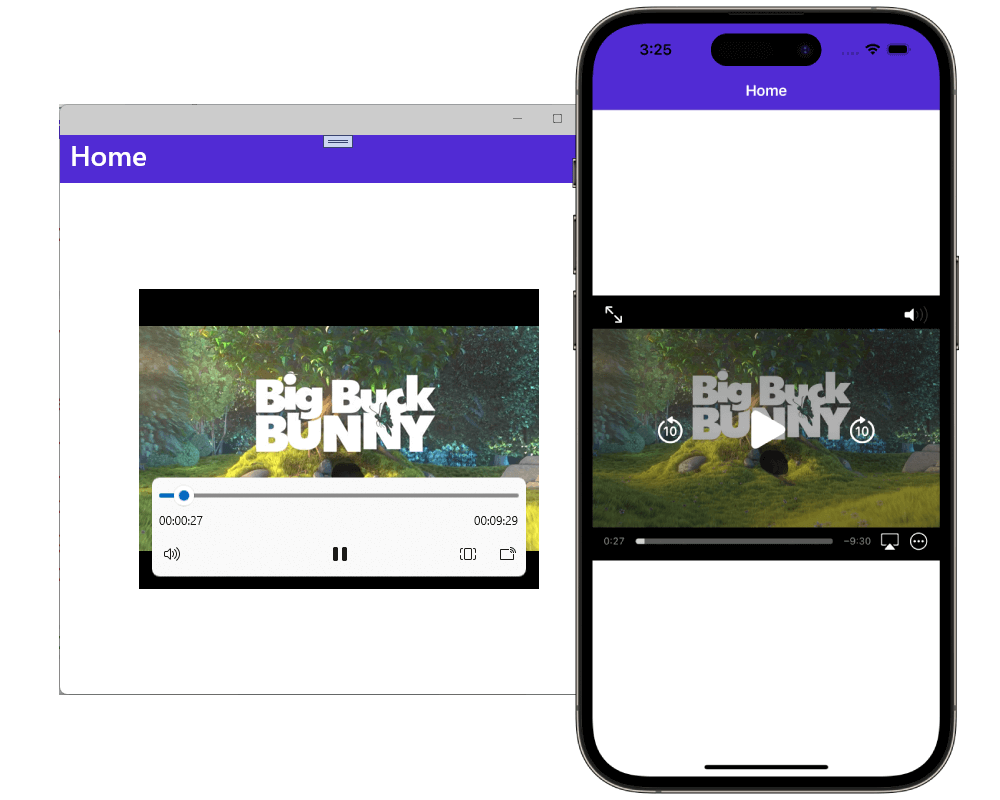

One of the most anticipated controls for .NET MAUI has been released; MediaElement. With MediaElement you can easily play audio and video from within your .NET MAUI app, in this post you'll learn everything you need to know about this first version and the plans we have for the future! The Media Element is part of the  [.NET MAUI Community Toolkit](https://github.com/communityToolkit/Maui/), a community-created library that is supported by amazing developers around the globe both from the community and Microsoft.

## What is MediaElement?

With MediaElement you gain a powerful control that allows you to play multimedia inside of your .NET MAUI app.

You might already know MediaElement from the Xamarin Community Toolkit where it was added by the amazing work from community member Peter Foot. While that version was already pretty good, it also had room for improvement, especially on Android.

That is why, when porting MediaElement to .NET MAUI, we have rebuilt everything from the ground up. This way we could make sure to keep all the parts that are already good, while improving on the things that could use some love.

### Under the hood

For Android we have chosen to use [`ExoPlayer`](https://exoplayer.dev/) as the platform counterpart, replacing the Android MediaPlayer that we used for Xamarin. This way we automatically gain a lot of extra features that are available to us out of the box, like playing HTTP Live Streaming (HLS) videos, great looking platform transport controls, and many other things.

On iOS and macOS we're using the platform [`AVPlayer`](https://developer.apple.com/documentation/avfoundation/media_playback/creating_a_basic_video_player_ios_and_tvos) as we did for with Xamarin's MediaElement as well. Also the Tizen one is unchanged using the [`Tizen.Multimedia.Player`](https://docs.tizen.org/application/dotnet/guides/multimedia/media-playback/).

Now that .NET MAUI builds on top of WinUI instead of UWP, we're using the WinUI's brand new [`MediaPlayerElement`](https://learn.microsoft.com/windows/apps/design/controls/media-playback) here. While this control is also very young to WinUI, it is already very complete and looking promising.

Support for different media formats differ between platforms (and potentially what codecs you have installed), but by using the platform native media players we leverage all the power, and related optimized performance, for each operating system.

## Getting started

Getting started with MediaElement is easy. First you want to install the [`CommunityToolkit.Maui.MediaElement`](https://nuget.org/packages/CommunityToolkit.Maui.MediaElement) NuGet package. This is a separate package from the main Community Toolkit package.

When the installation completes, go into your `MauiProgram.cs` and add the following initialization line to the `MauiAppBuilder`:

```csharp
public static MauiApp CreateMauiApp()
{
    var builder = MauiApp.CreateBuilder();
    builder
        .UseMauiApp<App>()
        // Initialize the .NET MAUI Community Toolkit MediaElement by adding the below line of code
        .UseMauiCommunityToolkitMediaElement()
        // After initializing the .NET MAUI Community Toolkit, optionally add additional fonts, and other things
        .ConfigureFonts(fonts =>
        {
            fonts.AddFont("OpenSans-Regular.ttf", "OpenSansRegular");
            fonts.AddFont("OpenSans-Semibold.ttf", "OpenSansSemibold");
        });

    // Continue initializing your .NET MAUI App here

    return builder.Build();
}
```

Now you're ready to start using MediaElement in your app! A simple example in XAML can be found below.

```xml
<ContentPage xmlns="http://schemas.microsoft.com/dotnet/2021/maui"
             xmlns:x="http://schemas.microsoft.com/winfx/2009/xaml"
             xmlns:toolkit="http://schemas.microsoft.com/dotnet/2022/maui/toolkit"
             x:Class="MediaElementDemos.GettingStarted"
             Title="MediaElement Getting Started">

    <toolkit:MediaElement x:Name="mediaElement"
                      ShouldAutoPlay="True"
                      ShouldShowPlaybackControls="True"
                      Source="https://commondatastorage.googleapis.com/gtv-videos-bucket/sample/BigBuckBunny.mp4"
                      HeightRequest="300"
                      WidthRequest="400"
                      ... />
</ContentPage>
```

This will add the MediaElement control to a page that starts playing automatically when the video is loaded, the result, running this on iOS and Windows can be seen below.



In this blog post I won't go into too much detail about the rich features that are already in this first version, but one thing is important to point out. You, as the developer, are responsible for releasing the MediaElement resources. For instance an app could play a video in picture-in-picture mode or play audio in the background, with these scenarios it's impossible to automatically determine when to clean up the MediaElement resources.

Doing so requires just one line of code. In the code snippet below you can see how the resources are freed when the user navigates away from the `ContentPage` that the MediaElement control is shown on.

```csharp
public partial class FreeResourcesPage : ContentPage
{
    void ContentPage_Unloaded(object? sender, EventArgs e)
    {
        // Stop and cleanup MediaElement when we navigate away
        mediaElement.Handler?.DisconnectHandler();
    }
}
```

To learn more about all the current functionalities of MediaElement, check out the [documentation page](https://learn.microsoft.com/dotnet/communitytoolkit/maui/views/mediaelement) for a deep dive.

I also have made a video where I walk you through some basics on getting started with MediaElement which you can find below.

<iframe width="752" height="423" src="https://www.youtube.com/embed/_sp4RG0I0x4" title="YouTube video player" frameborder="0" allow="accelerometer; autoplay; clipboard-write; encrypted-media; gyroscope; picture-in-picture" allowfullscreen></iframe>

## The future of MediaElement

First, I want to give a huge thanks to the community members that not only helped get this control into the .NET MAUI Community Toolkit, but all the other features as well. If you haven't checked it out yet, please do. 

For this initial released we focused on  the core functionality and made sure that that is solid. But from here on out, we can start adding all kinds of amazing features!

One of the requests we hear a lot is support for full-screen video playback. We hear you! However, unfortunately, implementing that is not as straight-forward as it may seem. A [discussion](https://github.com/CommunityToolkit/Maui/discussions/929) is open on the Toolkit repository, feel free to join in!

You can also add your own [feature request](https://github.com/CommunityToolkit/Maui). I've heard many ideas ranging from supporting playlists, being able to play DRM multimedia, subtitle support, and allowing you to set your own custom HTTP headers. Check if your favorite functionality is already in the Discussions tab, if not, open one with as much detail as you can.

We're looking forward to see your amazing multimedia powered .NET MAUI app projects!
