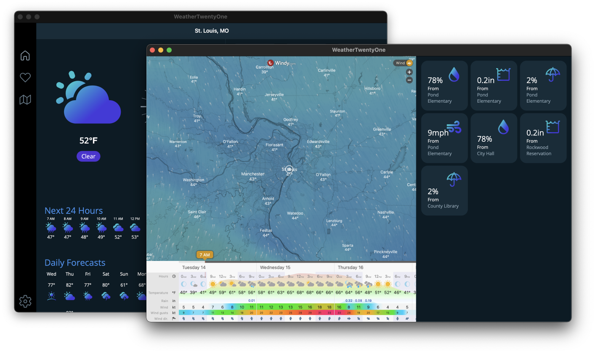
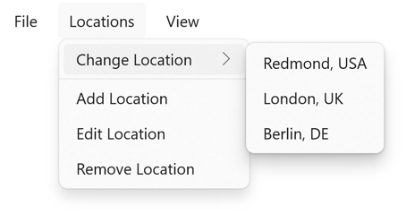
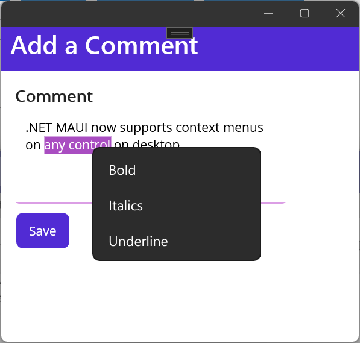

In addition to building cross-platform mobile apps with .NET MAUI, you can also craft beautiful desktop apps for Windows and Mac. Your application may only be targeting desktop platforms, or it perhaps it is going everywhere across mobile & desktop form factors. Either way, you want to deliver the best experience for your users no matter what device they are on. That means taking advantage of the hardware and operating system your app is running on. In the case of the desktop, .NET MAUI delivers several unique features to enhance the experience for users and today I am going to break down my top 5.

## Multi-window

A fundamental change in .NET MAUI was the introduction of the [`Window`](https://learn.microsoft.com/dotnet/maui/fundamentals/windows) as the base foundation. When you create and run your .NET MAUI app it automatically has a default `Window` that your `Application` creates and uses to display content. The `Application` class has a new `CreateWindow` method that is invoked when any new `Window` is created. When applications are running on the desktop (or tablet) there is  more real estate to take advantage of, which means you may want to create a second or third `Window` instead of navigating around. Let's take an example of a weather application. Once a user navigates to a city we may want to display further information including a map. We have the option to navigate to that page, or open a brand new window with the built in API:

```csharp
var weatherDetails = new Window(new WeatherDetailsPage());
Application.Current.OpenWindow(weatherDetails);
```




Our users now have multiple views that they can take advantage of instead of being constrained to a single window of information. At any point the user can close a `Window` or we can progmatically close it as well.

```csharp
// Close a specific window
Application.Current.CloseWindow(weatherDetails);

// Close the active window
Application.Current.CloseWindow(GetParentWindow());
```

For more information on configuring multi-window support be sure to read through [the multi-window documentation.](https://learn.microsoft.com/dotnet/maui/fundamentals/windows).


## Top level menu bar

When using desktop applications one of the most common features is the menu bar that is either integrated into the app on Windows or in the system menu bar on Mac. With .NET MAUI you can easily integrate a menu bar with just a few lines of code. As an added benefit when your users run your application on an iPad with a keyboard they will be able to access the menu as well.

Let's take the weather application as an example again, we may want to have a menu that allows our users to add, remove, or browse different locations.



Every `ContentPage` has a `MenuBarItems` collection that can have multiple levels of menus:

```xaml
<ContentPage ...>
    <ContentPage.MenuBarItems>
        <MenuBarItem Text="File">
            <MenuFlyoutItem Text="Exit"
                            Command="{Binding ExitCommand}" />
        </MenuBarItem>
        <MenuBarItem Text="Locations">
            <MenuFlyoutSubItem Text="Change Location">
                <MenuFlyoutItem Text="Redmond, USA"
                                Command="{Binding ChangeLocationCommand}"
                                CommandParameter="Redmond" />
                <MenuFlyoutItem Text="London, UK"
                                Command="{Binding ChangeLocationCommand}"
                                CommandParameter="London" />
                <MenuFlyoutItem Text="Berlin, DE"
                                Command="{Binding ChangeLocationCommand}"
                                CommandParameter="Berlin"/>
            </MenuFlyoutSubItem>
            <MenuFlyoutSeparator />            
            <MenuFlyoutItem Text="Add Location"
                            Command="{Binding AddLocationCommand}" />
            <MenuFlyoutItem Text="Edit Location"
                            Command="{Binding EditLocationCommand}" />
            <MenuFlyoutItem Text="Remove Location"
                            Command="{Binding RemoveLocationCommand}" />                            
        </MenuBarItem>
        <MenuBarItem Text="View">
            <!--More items-->
        </MenuBarItem>
    </ContentPage.MenuBarItems>
</ContentPage>
```

You can create these menu items directly in XAML or create them progmatically in code so your menus are dynamic. Menu items can be enabled or disabled, have separators, sub-menus, have icons on Windows, and in addition binding to a `Command` there is a `Clicked` event available. Be sure to browser the [menu bar documentation](https://learn.microsoft.com/dotnet/maui/user-interface/menu-bar) for more details.

## Context menus

Sometimes you want to give more options when a user right-clicks on an element. You want a menu like the menu bar, but based on a specific context. This is where context menus come into play in .NET MAUI applications. They have a similar API as the menu bar, but are placed on a specific control. For example we may want to add a comment on a specific city in our weather app. We may want to open a new window and then provide an area to type into with an `Editor`.



We can apply a `MenuFlyout` to the `Editor` and fill it with `MenuFlyoutItem`s similar to our menu bar earlier.

```xaml
<Editor>
    <FlyoutBase.ContextFlyout>
        <MenuFlyout>
            <MenuFlyoutItem Text="Bold" Clicked="OnBoldClicked"/>
            <MenuFlyoutItem Text="Italics" Clicked="OnItalicsClicked"/>
            <MenuFlyoutItem Text="Underline" Clicked="OnUnderlineClicked"/>
        </MenuFlyout>
    </FlyoutBase.ContextFlyout>
</Editor>
```

Just like the menu bar you can also bind to a `Command` for the event, have icons, sub-menus, dividers, and more. Checkout the [context menu documentation](https://learn.microsoft.com/dotnet/maui/user-interface/context-menu) for all the details.


## Tooltips

Tooltips are a quick and easy way to add functionality to your application and enhance the user experience. Your desktop users have a mouse and keyboard available to them, which means you can provide additional context when they hover over a control in your app. Using the `TooltipProperties.Text` attached property enables you to specify additional information that is displayed to the user on mouse hover.

Let's say we want to add additional information to the save button on our comment page. All we need to do is set the property and just like that it is good to go.

```xaml
<Button Text="Save"
        ToolTipProperties.Text="Click to save your comment" />
```

This can also be set progmatically in code for any control:

```csharp
var button = new Button { Text = "Save" };
ToolTipProperties.SetText(button, "lick to save your comment");
```

Browser through the [tooltip documentation](https://learn.microsoft.com/dotnet/maui/user-interface/tooltips) for more information.

## Pointer gestures

Speaking of enhancing desktop applications when users are navigating with a mouse, .NET MAUI has several new gesture recognizers specifically for the mouse pointer. You are easily able to see when any pointer has entered, exited, or moved inside of a control.

```csharp
<Image Source="dotnet_bot.png">
    <Image.GestureRecognizers>
        <PointerGestureRecognizer PointerEntered="OnPointerEntered"
                                  PointerExited="OnPointerExited"
                                  PointerMoved="OnPointerMoved" />
  </Image.GestureRecognizers>
</Image>
```

Here we are get events when the pointer is interacting with our `Image`. Once we get the event we can also get the pointer position inside of the `Image` or relative to it. 

```csharp
void OnPointerExited(object sender, PointerEventArgs e)
{
    // Position inside window
    Point? windowPosition = e.GetPosition(null);

    // Position relative to an Image
    Point? relativeToImagePosition = e.GetPosition(image);

    // Position relative to the container view
    Point? relativeToContainerPosition = e.GetPosition((View)sender);
}
```
And just like that we have our `Point` that  we can use to perform actions in our app. To learn more about the different gesture recognizers be sure to browse through the [documentation](https://learn.microsoft.com/dotnet/maui/fundamentals/gestures/pointer).

## Even more desktop features

There you have it, 5 awesome features to enhance your .NET MAUI apps on desktop. That is only the start as there are plenty more great features to built great apps across all platforms. Be sure to browse through all of the [.NET MAUI documentation](https://learn.microsoft.com/dotnet/maui/) for other features and controls that you may want to take advantage of.