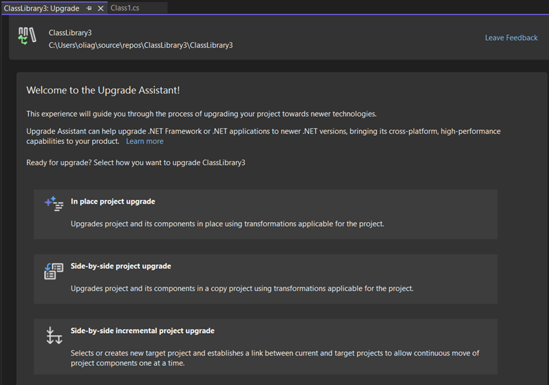
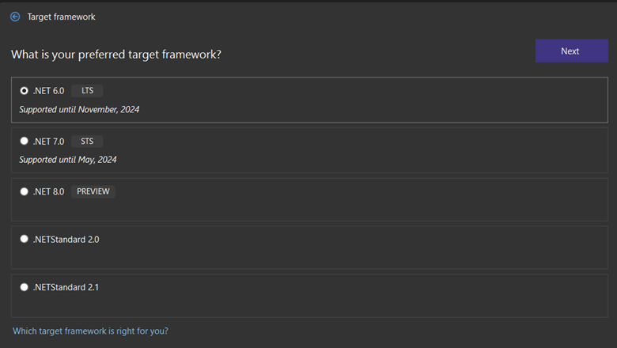
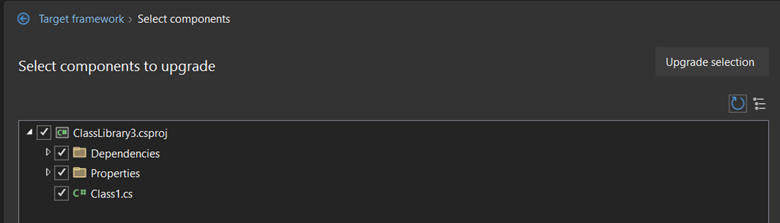
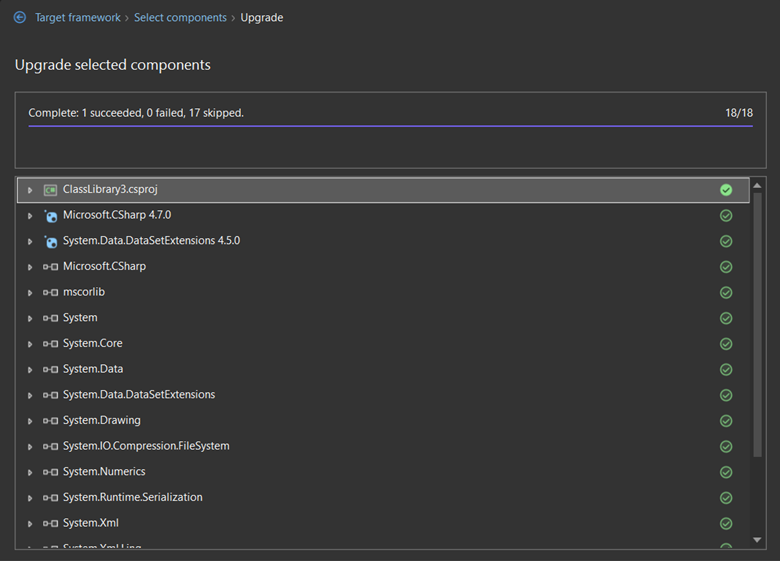

Now you can upgrade any .NET application to the latest version of .NET inside of Visual Studio! We are happy to introduce it as a [Visual Studio extension](https://marketplace.visualstudio.com/items?itemName=WebToolsTeam.aspnetprojectmigrations) and will upgrade your .NET Framework or .NET Core web- and desktop apps. Some project types are in development and coming soon, see the details below.

<iframe width="752" height="423" src="https://www.youtube.com/embed/3mPb4KAbz4Y" title="Upgrade Your .NET Projects Faster with Visual Studio" frameborder="0" allow="accelerometer; autoplay; clipboard-write; encrypted-media; gyroscope; picture-in-picture; web-share" allowfullscreen></iframe>

## Why upgrade and to what version?

If your applications are built for .NET Framework or .NET Core, now is a great time to upgrade them to .NET 6 (Long Term Support version) or .NET 7 (Standard Term Support version) that have much better performance and give you access to the latest features and capabilities. There have been huge improvements between .NET Framework and the latest .NET, but even if you’re targeting .NET Core 3.1 or earlier, it has reached the end of support in December 2022.

> We recommend to port to .NET 6 or .NET 7!

Between those two, .NET 6 has longer support time and .NET 7 is the latest, so has newer features. We release a new version of .NET every year in November and every even version number is supported for 3 years (Long Term Support, or LTS for short). So, you can either stay on the latest cutting-edge tech and upgrade every year, or switch from LTS to LTS once every 2-3 years.

## About Upgrade Assistant

Upgrading your application, especially from .NET Framework, was a complicated process. We kept prototyping and improving in this area to simplify your upgrades. In the past, you might have used the Upgrade Assistant CLI tool or Microsoft Project Migrations. We have collected your feedback, big thanks to everyone who filled in our survey or left us comments, created issues and feature requests! To address your feedback, we concluded that we needed to provide a unified upgrade experience for every project type inside of Visual Studio.

Now you will be able to upgrade every type of .NET application from any initial version (.NET Framework or .NET Core) by right-clicking on your project in Solution Explorer and choose “Upgrade”. Don’t forget to install the extension first.

The general philosophy of Upgrade Assistant is that it will take care of the mechanics, but depending on what framework and project type you're upgrading from, you should expect to do some manual post processing. While we try to automatically fix breaking changes, it cannot detect and fix all of them. So you might need to make some additional modifications to get the code to compile and you need to test thoroughly to ensure your code continues to work as expected.

## Supported application types

We have a goal to support every .NET project type. Also, we think of this tool not just as a one-time upgrade from .NET Framework to .NET 6/7, but as the way to upgrade your application to the latest .NET in the future as well. Besides changing the target framework version, the tool will be able to modify your code to fix breaking changes. These are our plans for the future, and currently here is what the tool supports in the latest version:

### Supported

- ASP.NET
- Class libraries
- Console
- WPF
- WinForms

These workloads are at parity with Upgrade Assistant CLI tool.

### Coming soon

- Xamarin to .NET MAUI migration
- UWP to WinUI migration
- WCF to WCF Core migration

Those migration types are in development, and you already can upgrade these projects, but we don't have the code fixers for these projects yet. If you need to migrate these project types today, we recommend using the existing Upgrade Assistant command line tool, which already has code fixers. The Visual Studio extension will get them soon too.
## Different upgrade types

Upgrade assistant supports 3 upgrade types:

* **In-place**. Different types are recommended for different project types, so
  you will see only those options that would work well for your app.

* **Side-by-side**.  In this case your original project will be upgraded all at
  once. If you are using source control and prefer to manage the copies
  yourself, for example, by using branches, this option is for you.

* **Side-by-side incremental**. With this option your original project will be
  untouched, and a copy of it will be added to the solution which will contain
  the upgraded code. This type can be handy if your application has many
  dependencies that might be broken after the upgrade. This way you can check-in
  your progress and not worry about the application not building.
  
  This is the ideal choice for web applications.
  
  Upgrade from ASP.NET to ASP.NET Core requires a lot of work and at times
  manual refactoring (because these two technologies are very different). Class
  Libraries are often used together with web apps, so we enable this type of
  upgrade for Class Libraries as well. Incremental upgrade will put a .NET 6/7
  project next to your existing .NET Framework project and route endpoints that
  are implemented in the .NET 6/7 project there, while all other calls will be
  sent to .NET Framework application. This way you can combine upgrade with
  feature development and move your items to .NET 6/7 one by one without
  breaking your app. This approach was originally built in Microsoft Project
  Migrations tool, you can think of Upgrade Assistant in Visual Studio as a new
  improved and extended version of Microsoft Project Migrations. Upgrading from
  .NET Core or .NET 5 to .NET 6/7 is much easier than from .NET Framework, so
  for those cases *In-place* option is recommended.

In the table below you can find the status of all upgrade types by project type.

|                                        | In-place       | Side-by-side   | Side-by-side incremental |
|----------------------------------------|----------------|----------------|--------------------------|
| ASP.NET   from .NET Framework          | N/A            | N/A            | supported                |
| ASP.NET   from .NET Core, .NET5+       | supported      | N/A            | N/A                      |
| WinForms   from .NET Framework         | supported      | supported      | N/A                      |
| WinForms   from .NET Core, .NET5+      | supported      | N/A            | N/A                      |
| WPF from   .NET Framework              | supported      | supported      | N/A                      |
| WPF from   .NET Core, .NET5+           | supported      | N/A            | N/A                      |
| Class   Library from .NET Framework    | supported      | supported      | supported                |
| Class   Library from .NET Core, .NET5+ | supported      | N/A            | N/A                      |
| Console   from .NET Framework          | supported      | supported      | N/A                      |
| Console  from .NET Core, .NET5+        | supported      | N/A            | N/A                      |
| Xamarin   to MAUI                      | in development | in development | N/A                      |
| MAUI   from older versions             | in development | N/A            | N/A                      |
| UWP to   WinUI                         | in development | in development | N/A                      |
| WinUI   from older versions            | in development | N/A            | N/A                      |
| Azure   Functions                      | in development | N/A            | N/A                      |
| WCF to   WCF Core                      | in development | N/A            | N/A                      |

## Step by step upgrade

1.	Install [Upgrade Assistant Visual Studio extension](https://marketplace.visualstudio.com/items?itemName=WebToolsTeam.aspnetprojectmigrations).

1. In Visual Studio in **Solution Explorer** right-click on the project you want to upgrade, choose **Upgrade**.

1. You will see the main page with a few options for your upgrade.

    

    Which option to choose is described in [different upgrade types](#different-upgrade-types).

1. For this example, I choose **In-place**. **Side-by-side** would be very similar with a few extra steps. Additional features of **side-by-side incremental** are described in our [previous blog post](https://devblogs.microsoft.com/dotnet/migrating-from-asp-net-to-asp-net-core-part-5/).

1. Then you need to choose the framework you want to upgrade to. The tool will suggest only options that make sense for your project type. In my example, it's a .NET Framework class library so it also suggests .NET Standard.

     

    All upgrades are forward, meaning that if your project for example is already on .NET 6, only .NET 7 and later will be offered.
    If you do not have the chosen SDK installed on your computer, you’ll be prompted to install it on the next step. Simply follow the link and go back to your upgrade after the SDK is installed.
    .NET Standard is suggested only for Class Libraries that were targeting .NET Framework.

1. Now is time to choose the components you’d like to upgrade. Eventually you will need to upgrade everything, but if you prefer doing it step-by-step, this is the screen to select what do you want to start with.

     

1. After you click **Upgrade selection** you will see the progress of your upgrade and a report after it is completed.

    

## Summary

You can now upgrade your .NET projects right from inside Visual Studio. Please tell us how this works for you and what else you'd need for your projects by filling out this [brief survey](https://www.surveymonkey.com/r/CX67DS8).

You can also file issues or feature requests from Visual Studio by choosing **Help** | **Send Feedback**. Ensure to mention "Upgrade Assistant vsix" in the title.

## Resources

- [Microsoft Project Migrations (Experimental) – Visual Studio Marketplace](https://marketplace.visualstudio.com/items?itemName=WebToolsTeam.aspnetprojectmigrations)
- [dotnet/systemweb-adapters (github.com)](https://github.com/dotnet/systemweb-adapters)
- [YARP Documentation (microsoft.github.io)](https://microsoft.github.io/reverse-proxy/)
- [Incremental ASP.NET to ASP.NET Core Migration – .NET Blog (microsoft.com)](https://devblogs.microsoft.com/dotnet/incremental-asp-net-to-asp-net-core-migration/)
- [Incremental ASP.NET Migration Tooling Preview 2 – .NET Blog (microsoft.com)](https://devblogs.microsoft.com/dotnet/incremental-asp-net-migration-tooling-preview-2/)
- [Migrating from ASP.NET to ASP.NET Core in Visual Studio](https://devblogs.microsoft.com/dotnet/introducing-project-migrations-visual-studio-extension/)
- [Migrating from ASP.NET to ASP.NET Core (Part 4)](https://devblogs.microsoft.com/dotnet/migrating-from-asp-net-to-asp-net-core-part-4/)
- [Migrating from ASP.NET to ASP.NET Core with Project Migrations Part 5](https://devblogs.microsoft.com/dotnet/migrating-from-asp-net-to-asp-net-core-part-5/)
