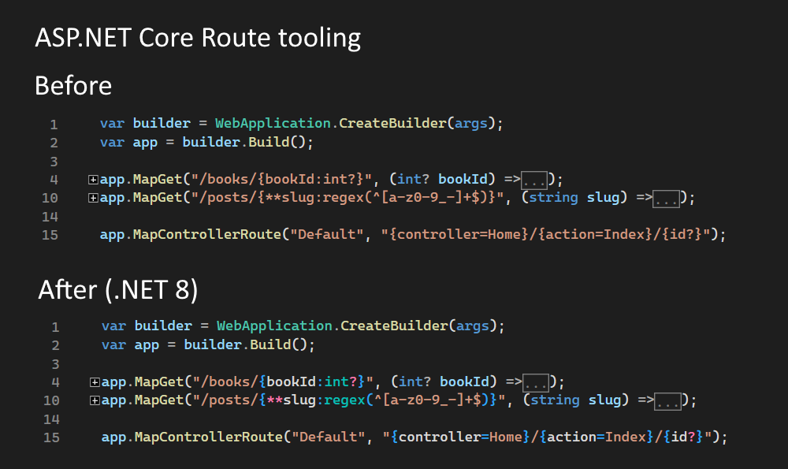
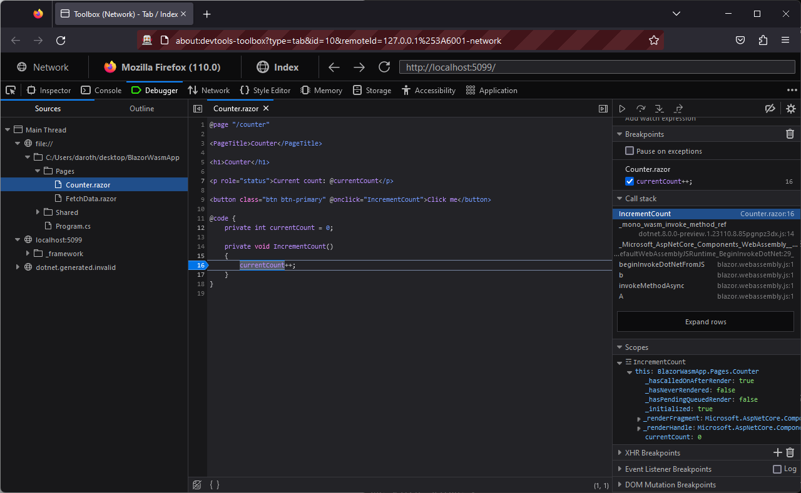

[.NET 8 Preview 1 is now available](https://devblogs.microsoft.com/dotnet/announcing-dotnet-8-preview-1)! This is the first preview of the next major version of .NET, which will include the next wave of innovations for web development with ASP.NET Core.

In .NET 8 we plan to make broad investments across ASP.NET Core. Below are some of the areas we plan to focus on:

## Blazor United

In ASP.NET Core today, we have a few different ways to build web UI:

- **MVC & Razor Pages**: The frameworks use server-side rendering (SSR) to dynamically generate HTML from the server in response to requests. Rendering from the server helps apps to _load fast_ 🚀 because all of the hard work of fetching the data and deciding how to display it has already been done on the server - the client just has to display the already rendered HTML. They can take advantage of powerful server hardware and directly access backend data and services.
- **Blazor**: Blazor's component model is focused on handling UI interactions from the client. Server-side rendering requires every UI interaction be sent to the server, so it isn't great for richly interactive UI. For _rich interactivity_ 🎮 you want to use client-side rendering (CSR), which has much lower latency and can readily access client capabilities.

Many modern web apps need to use a combination of these approaches, both server-side rendering and client-side rendering. Maybe your home page or blog is best handled with server-side rendering so that it loads fast and is easily indexed, while the more elaborate functionality of your app needs the responsiveness of running from the client. Currently, with .NET, this requires using multiple different frameworks together: MVC, Razor Pages, and Blazor.

In .NET 8 we're working to combine the benefits of server-side and client-side rendering into a single full-stack programming model based on Blazor. We're currently calling this effort "Blazor United". Blazor United will enable you to use a single Blazor-based architecture for server-side rendering and full client-side interactivity with Blazor Server or WebAssembly. That's all within a single project with the ability to easily switch between different rendering modes and even mix them in the same page. Blazor United will also enable new rendering capabilities, like [streaming rendering](https://github.com/dotnet/aspnetcore/issues/46352) and [progressive enhancement of navigations and form posts](https://github.com/dotnet/aspnetcore/issues/46399).

Check out the following video of an early prototype of Blazor United to see many of these new capabilities in action:

[iframe width="752" height="423" src="https://www.youtube.com/embed/48G_CEGXZZM" title="YouTube video player" frameborder="0" allow="accelerometer; autoplay; clipboard-write; encrypted-media; gyroscope; picture-in-picture; web-share" allowfullscreen]

Related GitHub issue: [dotnet/aspnetcore#46636](https://github.com/dotnet/aspnetcore/issues/46636)

## Improved authentication & authorization experience

Authentication and authorization can be difficult to implement in ASP.NET Core apps for certain scenarios. In .NET 8 our goal is to:

- Create an easy, intuitive, and well-documented experience for working with web-based authentication and authorization that is straightforward to develop and test.
- Provide a clear set of steps and tools to support deployment to production environments.
- Deliver meaningful diagnostics that help troubleshoot security issues quickly and effectively.

## Native AOT

.NET 7 introduced support for [publishing .NET console projects as native AOT](https://learn.microsoft.com/dotnet/core/deploying/native-aot/), producing a self-contained, platform-specific executable without any runtime JIT. Native AOT apps start up very quickly and use less memory. The application can be deployed to a machine or container that doesn't have any .NET runtime installed. In .NET 8 we will extend support for native AOT to ASP.NET Core, starting with cloud-focused, API apps built with Minimal APIs that meet expectations regarding published file size, startup time, working set, and throughput performance.

Related GitHub issue: [dotnet/aspnetcore#45910](https://github.com/dotnet/aspnetcore/issues/45910)

## ASP.NET Core Roadmap for .NET 8

In additional to above themes, we plan to make many addition improvements across ASP.NET Core. You can find a full list of the ASP.NET Core work planned for .NET 8 in the [ASP.NET Core roadmap for .NET 8](https://aka.ms/aspnet/roadmap) on GitHub.

## What's new in .NET 8 Preview 1?

.NET 8 Preview 1 is the first of many .NET 8 preview releases in preparation for the .NET 8 release in November 2023.

Here's a summary of what's new in ASP.NET Core in this preview release:

- Route tooling
- Route constraint performance improvements
- New analyzers for API development
- Dispatch exceptions to Blazor's `SynchronizationContext`
- Hot reload support for instance fields, properties, and events for .NET on WebAssembly
- Support for symbol servers when debugging .NET on WebAssembly
- Blazor WebAssembly debugging in Firefox
- Experimental Webcil format for .NET assemblies
- Specify initial URL for `BlazorWebView` to load
- New option to keep the SPA development server running
- Support for named pipes in Kestrel
- HTTP/3 enabled by default
- HTTP/2 over TLS (HTTPS) support on macOS
- gRPC JSON transcoding no longer requires `http.proto` and `annotations.proto`
- Specify server timeout and keep alive interval settings using the `HubConnectionBuilder`
- `IPNetwork.Parse` and `TryParse`
- `HTTP_PORTS` and `HTTPS_PORTS` config support
- Warning when specified HTTP protocols won't be used

## Get started

To get started with ASP.NET Core in .NET 8 Preview 8, [install the .NET 8 SDK](https://dotnet.microsoft.com/next).

If you're on Windows using Visual Studio, we recommend installing the latest [Visual Studio 2022 preview](https://visualstudio.com/preview). Visual Studio for Mac support for .NET 8 previews isn’t available yet but is coming soon.

## Upgrade an existing project

To upgrade an existing ASP.NET Core app from .NET 7 to .NET 8 Preview 1:

- Update the target framework of your app to `net8.0`.
- Update all Microsoft.AspNetCore.\* package references to `8.0.0-preview.1.*`.
- Update all Microsoft.Extensions.\* package references to `8.0.0-preview.1.*`.

See also the full list of [breaking changes](https://docs.microsoft.com/dotnet/core/compatibility/8.0#aspnet-core) in ASP.NET Core for .NET 8.

## Route tooling

ASP.NET Core is built on routing. Minimal APIs, Web APIs, Razor Pages and Blazor all use routes to customize how HTTP requests map to your code.

In .NET 8 we've invested in a suite of new features to make routing easier to learn and use. These include:

* Route syntax highlighting
* Autocomplete of parameter and route names
* Autocomplete of route constraints
* Route analyzers and fixers
* Supports Minimal APIs, Web APIs, and Blazor

Grouped all together, we call these new features route tooling. Route tooling is built on Roslyn, and features automatic light up depending upon what IDE you're using. Please try it out in preview 1 and give us feedback. A blog post that looks at route tooling's cool new features is coming soon.



## Route constraint performance improvements

[ASP.NET Core routing](https://learn.microsoft.com/aspnet/core/fundamentals/routing) is powerful, high-performance technology that is used by almost all ASP.NET Core apps. A commonly used feature of routing is route constraints. Apps use route constraints to match requests to the right endpoint:

```csharp
// Endpoint only matches requests with a URL slug. For example: article/my-article-name
app.MapGet("article/{name:regex(^[a-z0-9]+(?:-[a-z0-9]+)*$)}", (string name) => { /* ... */ });
```

In .NET 8, we've made several performance improvements to constraints:

* Regex constraints are now compiled. Creating [compiled regexes](https://learn.microsoft.com/dotnet/api/system.text.regularexpressions.regexoptions#system-text-regularexpressions-regexoptions-compiled) has a one-time cost at startup, but they maximize run-time performance.
* Duplicate constraints are now shared between routes. Sharing cached constraints reduces startup time and memory use, particularly for apps with many routes and regex constraints.
* The alpha constraint now uses a [source generated regex](https://learn.microsoft.com/dotnet/standard/base-types/regular-expression-source-generators).

## New analyzers for API development

High quality code is easier to debug, test, and service. In .NET 8, we're investing in a suite of analyzers that will help you leverage ASP.NET Core's APIs more affectively. Starting in preview1, you can take advantage of new analyzers that:

**Recommends setting or appending to a HeaderDictionary instead of adding**

The `IHeaderDictionary.Add` API throws if duplicate keys are added. Typically, you'll typically want to set, override, or append to a header using the indexer or `IHeaderDictionary.Append` API. This analyzer warns on usage of the `IHeaderDictionary.Add` API and provides a codefixer that recommends leveraging an indexer or the `Append` API.

```csharp
var context = new DefaultHttpContext();

context.Request.Headers.Add("Accept", "text/html"); // ASP0019 warning
context.Request.Headers["Accept"] = "text/html"; // Apply codefix using indexer
context.Request.Headers.Append("Accept", "text/html"); // Apply codefix using IHeaderDictionary.Append
```

Thanks to community member [@david-acker](https://github.com/david-acker) for this contribution!

**Warns if a parameter type passed to a route handler does not implement the correct interfaces**

Minimal APIs supports simple binding from the elements of the HttpContext using rules defined in the `TryParse` or `BindAsync` implementations of a type. These implementations must conform to a certain signature in order to be leveraged by the binding logic in the framework. Starting in .NET 8, you'll receive a warning if a type that doesn't implement the appropriate interface is used.

For example, the code sample below will trigger a warning because the `Customer` type does not implement a `BindAsync` method with the appropriate signature.

```csharp
var app = WebApplication.Create();

app.MapGet("/customers/{customer}", (Customer customer) => {}); // ASP0021 warning

public class Customer
{
    public async static Task<Customer> BindAsync(HttpContext context) => return new Customer();
}
```

**Detects if a `RequestDelegate` is implemented incorrectly**

`RequestDelegate`s implement a signature that takes an `HttpContext` and returns a `Task`. Because `Task` is the base type of `Task<T>`, generic variance means it's possible to write code like following:

```csharp
var app = WebApplication.Create();

Task<string> HelloWorld(HttpContext c) 
  => Task.FromResult("Hello " + c.Request.RouteValues["name"]); // ASP0016 warning

app.MapGet("/", HelloWorld);
```

However, the string response will be discarded at runtime. In .NET 8, a warning will be produced for the scenario above which can be resolved by making the following code change:

```csharp
var app = WebApplication.Create();

Task HelloWorld(HttpContext c) => c.Response.WriteAsync("Hello " + c.Request.RouteValues["name"]);
app.MapGet("/", HelloWorld);
```

Or by leveraging minimal APIs:

```csharp
var app = WebApplication.Create();

app.MapGet("/{name}", (string name) => $"Hello {name}");
```

We'd also like to thank to community member [@Youssef1313](https://github.com/Youssef1313) for submitting a collection of quality improvements and bug fixes to our existing analyzers!

## Dispatch exceptions to Blazor's `SynchronizationContext`

You can now dispatch exceptions to Blazor's `SynchronizationContext` using the new `DispatchExceptionAsync` methods on `ComponentBase` and `RenderHandle`. This allows you to handle these exceptions using Blazor's error handling features, like error boundaries.

## Hot reload support for instance fields, properties, and events for .NET on WebAssembly

.NET on WebAssembly now supports adding instance fields, properties and events to existing classes when using Hot Reload. This also enables other C# and Razor language features that use instance fields under the hood, such as certain types of C# lambdas and some uses of Razor's `@bind` directive.

## Support for symbol servers when debugging .NET on WebAssembly

When debugging .NET on WebAssembly, the debugger will now download symbol data from symbol  locations that are configured in Visual Studio preferences. This improves the debugging experience for apps that use NuGet packages.

## Blazor WebAssembly debugging in Firefox

You can now debug Blazor WebAssembly apps using Firefox. Debugging Blazor WebAssembly apps requires configuring the browser for remote debugging and then connecting to the browser using the browser developer tools through the .NET WebAssembly debugging proxy. Debuggin Firefox from Visual Studio is not supported at this time.

To debug a Blazor WebAssembly app in Firefox during development:

1. Open the Blazor WebAssembly app in Firefox.
1. Open the Firefox Web Developer Tools and go to the Console tab.
1. With Blazor WebAssembly app in focus type the debugging command <kbd>SHIFT</kbd>+<kbd>ALT</kbd>+<kbd>D</kbd>.
1. Follow the instructions in the dev console output to configure Firefox for Blazor WebAssembly debugging:
    - Open about:config in Firefox
    - Enable `devtools.debugger.remote-enabled`
    - Enable `devtools.chrome.enabled`
    - Disable `devtools.debugger.prompt-connection`
1. Close all Firefox instances and reopen Firefox with remote debugging enabled by running `firefox --start-debugger-server 6000 -new-tab about:debugging`.
1. In the new Firefox instance, leave the about:debugging tab open and open the Blazor WebAssembly app in a new browser tab.
1. Type <kbd>SHIFT</kbd>+<kbd>ALT</kbd> to open the Firefox Web Developer tools and connect to the Firefox browser instance.
1. In the Debugger tab of the Web Developer Tools, open the app source file you wish to debug under the `file://` node and set a breakpoint. For example, set a breakpoint in the `IncrementCount` method of *Pages/Counter.razor*.
1. Navigate to the Counter page and click the counter button to hit the breakpoint.



## Experimental Webcil format for .NET assemblies

In some environments, firewalls and anti-virus tools block the download or use of `.dll` files, which prevents the use of web apps based on .NET assemblies, like Blazor WebAssembly apps. To address this issue, the `wasm-experimental` workload now supports a new `.webcil` file format that can be used to package .NET assemblies for browser-based web apps. Currently the Webcil format is only available for the experimental WebAssembly Browser Apps, but we plan to enable it for Blazor WebAssembly apps in a future update.

To try out the new Webcil format with a WebAssembly Browser App:

1. Install the `wasm-experimental` workload: `dotnet install wasm-experimental`
2. Create a new app: `dotnet new wasmbrowser`
3. Add the `WasmEnableWebcil` property to the `.csproj` file:

    ```xml
    <PropertyGroup>
        <WasmEnableWebcil>true</WasmEnableWebcil>
    </PropertyGroup>
    ```

4. Run the app and verify in the browsers DevTools that `.webcil` files are being downloaded, not `.dll` files.

If you encounter issues with using `.webcil` files in your environment, please let us know by [creating an issue on GitHub](https://github.com/dotnet/runtime/issues/new).

## Specify initial URL for `BlazorWebView` to load

The new `StartPath` property on `BlazorWebView` allows you to set the path to initially navigate to. This is useful when you want to take the user straight to a specific page once the `BlazorWebView` is loaded.

## New option to keep the SPA development server running

When building a single-page app (SPA) with ASP.NET Core, both the SPA development server and the backend ASP.NET Core need to execute during development. The SPA development server is configured to proxy API requests to the ASP.NET Core backend. When the ASP.NET Core process is terminated, the SPA development server is by default terminated as well. Restarting the SPA development server can be time consuming and cumbersome. The new `KeepRunning` option on `SpaDevelopmentServerOptions` enables leaving the SPA development server running even if the ASP.NET Core process is terminated.

## Support for named pipes in Kestrel

Named pipes is a popular technology for building inter-process communication (IPC) between Windows apps. You can now build an IPC server using .NET, Kestrel, and named pipes.

```csharp
var builder = WebApplication.CreateBuilder(args);
builder.WebHost.ConfigureKestrel(serverOptions =>
{
    serverOptions.ListenNamedPipe("MyPipeName");
});
```

For more information about this feature and how to use .NET and gRPC to create an IPC server and client, see [Inter-process communication with gRPC](https://learn.microsoft.com/aspnet/core/grpc/interprocess).

## HTTP/3 enabled by default

HTTP/3 is an exciting new Internet technology that was standardized in June 2022. HTTP/3 offers several advantages over older HTTP protocols, including:

* Faster connection setup.
* No head-of-line blocking.
* Better transitions between networks.

.NET 7 added support for HTTP/3 to ASP.NET Core and Kestrel. ASP.NET Core apps could choose to turn it on. In .NET 8 we're enabling HTTP/3 (alongside HTTP/1.1 and HTTP/2) by default.


For more information about HTTP/3 and its requirements, see [Use HTTP/3 with the ASP.NET Core Kestrel web server](https://learn.microsoft.com/aspnet/core/fundamentals/servers/kestrel/http3).

## HTTP/2 over TLS (HTTPS) support on macOS

You can now use TLS and HTTP/2 with ASP.NET Core on macOS. .NET 8 adds support for Application-Layer Protocol Negotiation (ALPN) to macOS. ALPN is a TLS feature used to negotiate what HTTP protocol a connection will use. For example, ALPN allows browsers and other HTTP clients to request an HTTP/2 connection. This feature is especially useful for gRPC apps, which require HTTP/2.

It's great to see this point of friction on macOS disappear!

## gRPC JSON transcoding no longer requires `http.proto` and `annotations.proto`

[gRPC JSON transcoding](https://learn.microsoft.com/aspnet/core/grpc/json-transcoding) is an extension for ASP.NET Core that creates RESTful JSON APIs for gRPC services. Once configured, transcoding allows apps to call gRPC services with familiar HTTP concepts such as HTTP verbs, URL parameter binding and JSON requests/responses.

We've made it easier to add JSON transcoding to a .NET gRPC app. Copying `http.proto` and `annotations.proto` files into your app is no longer required. In .NET 8 preview 1 those files are included in the NuGet package and automatically referenced for you.

## Specify server timeout and keep alive interval settings using the `HubConnectionBuilder`

You can now specify the server timeout and keep alive interval settings for a SignalR client using the `HubConnectionBuilder`. This is useful in Blazor Server apps when you want to increase the timeouts while debugging to avoid hitting the timeouts while execution has been paused.

```js
Blazor.start({
    configureSignalR: function (builder) {
        builder
          .withServerTimeout(60000)
          .withKeepAliveInterval(30000);
    };
});
```

## `IPNetwork.Parse` and `TryParse`

The new `Parse` and `TryParse` methods on `IPNetwork` add support for creating an `IPNetwork` using an input string in [CIDR notation](https://en.wikipedia.org/wiki/Classless_Inter-Domain_Routing) or "slash notation".

**IPv4**
```csharp
// Using Parse
var network = IPNetwork.Parse("192.168.0.1/32");

// Using TryParse
bool success = IPNetwork.TryParse("192.168.0.1/32", out var network);

// Ctor equivalent
var network = new IPNetwork(IPAddress.Parse("192.168.0.1"), 32);
```

**IPv6**
```csharp
// Using Parse
var network = IPNetwork.Parse("2001:db8:3c4d::1/128");

// Using TryParse
bool success = IPNetwork.TryParse("2001:db8:3c4d::1/128", out var network);

// Ctor equivalent
var network = new IPNetwork(IPAddress.Parse("2001:db8:3c4d::1"), 128);
```

Thanks [@david-acker](https://github.com/david-acker) for this contribution!

## `HTTP_PORTS` and `HTTPS_PORTS` config support

Applications and containers are often only given a port to listen on, like 80, without additional constraints like host or path. `HTTP_PORTS` and `HTTPS_PORTS` are new config keys that allow specifying the listening ports for the Kestrel and HttpSys servers. These may be defined with the `DOTNET_` or `ASPNETCORE_` environment variable prefixes, or specified directly through any other config input like appsettings.json. Each is a semi-colon delimited list of port values.

```console
ASPNETCORE_HTTP_PORTS=80;8080
ASPNETCORE_HTTPS_PORTS=443;8081
```

This is shorthand for the following, which specifies the scheme (HTTP or HTTPS) and any host or IP.

```console
ASPNETCORE_URLS=http://*:80/;http://*:8080/;https://*:443/;https://*:8081/
```

These new config keys are lower priority and will be overriden by URLS or values provided directly in code. Certificates will still need to be configured seperately via server specific mechanics for HTTPS.

## Warning when specified HTTP protocols won't be used

If TLS is disabled and HTTP/1.x is available, HTTP/2 and HTTP/3 will be disabled, even if they've been specified.  This can cause some nasty surprises, so we've added warning output to let you know when it happens.

## Give feedback

We hope you enjoy this preview release of ASP.NET Core in .NET 8. Let us know what you think about these new improvements by filing issues on [GitHub](https://github.com/dotnet/aspnetcore/issues/new).

Thanks for trying out ASP.NET Core!
