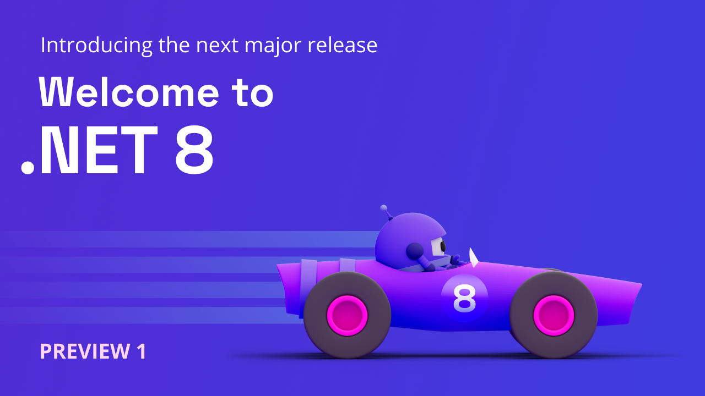

Welcome to .NET 8! The first preview is ready for you to download: [claim your copy of  the first .NET 8 preview](https://dotnet.microsoft.com/next) and start building applications today. Scroll down to see the list of features included in this preview. .NET 8 is a [long-term support (LTS) release](https://dotnet.microsoft.com/platform/support/policy/dotnet-core). This blog post covers the major themes and goals that drive the prioritization and selection of enhancements to develop. .NET 8 preview and release candidate builds will be delivered monthly. As usual, the final release will be delivered sometime in November at [.NET Conf](https://www.dotnetconf.net/).

[](https://dotnet.microsoft.com/next)

Releases of .NET include products, libraries, runtime, and tooling, and represent a collaboration across multiple teams inside and outside Microsoft. The broader themes covered in this blog post do not encompass all of the key scenarios and investments for .NET 8. They represent large areas but are just a part of all the important work going into .NET 8. We plan to make broad investments in ASP.NET Core, Blazor, EF Core, WinForms, WPF, and other platforms. You can learn more about these areas by reading the product roadmaps:

* [ASP.NET Core and Blazor](https://aka.ms/aspnet/roadmap)
* [EF 8 Roadmap](https://docs.microsoft.com/ef/core/what-is-new/ef-core-8.0/plan)
* [ML.NET](https://github.com/dotnet/machinelearning/blob/main/ROADMAP.md)
* [.NET MAUI](https://github.com/dotnet/maui/wiki/Roadmap)
* [NuGet](https://aka.ms/nuget/roadmap)
* [Roslyn](https://github.com/dotnet/roslyn/blob/main/docs/Language%20Feature%20Status.md)
* [Runtime](https://github.com/dotnet/core/blob/main/roadmap.md)
* [WinForms](https://github.com/dotnet/winforms/blob/main/docs/roadmap.md)
* [WPF](https://github.com/dotnet/wpf/blob/main/roadmap.md)

Be sure to check out [themesof.net](https://themesof.net/?q=milestone%3A8.0) for more details on the GitHub issues and milestones being tracked towards .NET 8.

You can [download .NET 8 Preview 1](https://dotnet.microsoft.com/download/dotnet/8.0), for Windows, macOS, and Linux.

Stay current with what's new and coming by reading our [What's New in .NET 8 documentation](https://learn.microsoft.com/dotnet/core/whats-new/dotnet-8), which will be updated throughout the release. As our team releases new previews, we will include a summary of the known features in it. 

* [Installers and binaries](https://dotnet.microsoft.com/download/dotnet/8.0)
* [Container images](https://github.com/dotnet/dotnet-docker/blob/main/documentation/supported-tags.md)
* [Linux packages](https://learn.microsoft.com/dotnet/core/install/linux) 
* [Release notes](https://github.com/dotnet/core/tree/main/release-notes/8.0)
* [Known issues](https://github.com/dotnet/core/blob/main/release-notes/8.0/known-issues.md)
* [GitHub issue tracker](https://github.com/dotnet/core/issues)

.NET 8 has been tested with 17.6 Preview 1. We recommend that you use the [preview channel builds](https://visualstudio.com/preview) if you want to try .NET 8 with the Visual Studio family of products. Visual Studio for Mac support for .NET 8 previews is not currently supported.

## Welcome to .NET 8

At the end of last year, we shipped .NET 7, the result of a collaboration between the .NET team and the amazing community that supported the release with over 28,000 community contributions by over 10,000 community members. .NET 7 is the framework of choice for building applications today. The release unifies the platform with native support for ARM64 and enhanced support on Linux. It helps modernize your application through tools like .NET MAUI that enables building cross-platform mobile and desktop apps from the same codebase. It includes improvements to the performance of APIs and makes it easier to build and deploy distributed cloud native apps. .NET 7 simplifies the experience of building apps by reducing the amount of code necessary through improvements in C# 11 and making it possible to create and configure APIs with just a few lines of code. Numerous improvements to tooling from dev tunnels that help debug cloud API integrations to building containers directly from the .NET SDK help developers be more productive.

We will be updating [What's new in .NET 8](https://learn.microsoft.com/dotnet/core/whats-new/dotnet-8) throughout the release. It will describe they key features for the whole release, while the blog posts will focus on new features in each preview release.

You can read about what we shipped in preview 1 by scrolling down. First, let's look ahead at what the vision for .NET 8 is.

### The best platform and tools for cloud native developers

We believe .NET developers should be able to get their apps to the cloud quickly, scale their apps without compromising performance, and evolve their apps based on actionable data and feedback about your apps in production. We'll invest in making it easier to manage the full end-to-end experience from local development and testing through continuous integration and deployment. Our goal is to make it easier to implement microservice architectures and build and deploy containers.

> **Cloud native** is a term used to describe the architecture and design of applications that are built specifically for deployment in cloud computing environments. The main idea behind cloud native is to take advantage of the benefits provided by cloud computing platforms, such as scalability, elasticity, and self-healing, to create highly scalable and resilient applications. This allows flexibility and avoids potential over-investing in hardware and software to support growth. Many developers associate cloud native with concepts such as microservices, container orchestration (Kubernetes) and "-as-a-service" offerings. 

### A great experience using MAUI and Blazor hybrid for cross-platform mobile and desktop development

During the .NET 7 timeframe we released [.NET Multi-platform App UI (MAUI)](https://learn.microsoft.com/dotnet/maui/what-is-maui) SDK and Visual Studio tooling support. .NET MAUI provides a framework for creating native apps for mobile and desktop devices that run Android, iOS, macOS and Windows with a single C# codebase. In addition to support for XAML UI, you can also use [Blazor](https://learn.microsoft.com/aspnet/core/blazor/hybrid/) to build hybrid apps with [Razor UI components](https://learn.microsoft.com/aspnet/core/blazor/components/) that can access the native device platforms and be shared across mobile, desktop, and web. The .NET team plans to build on these experiences and focus on improving the quality, stability, performance and integration of the SDK and tooling. 

### Momentum: continued focus on quality and performance based on your input

Every release of .NET includes improvements to performance, quality, stability, and ease of use of the APIs, libraries and frameworks the make up the active and growing .NET ecosystem. Many of these improvements were identified and prioritized by customers and community members. .NET 8 will follow the same trend, relying on your highly valued feedback to help guide our vision and drive our focus.

### Get current and stay current

The .NET upgrade assistance is a valuable tool that helps developers migrate their applications from older versions of the .NET Framework to newer versions. [The latest version of this tool](https://dotnet.microsoft.com/platform/upgrade-assistant) comes with improved capabilities that support new scenarios and handle more cases. With this tool, developers can now upgrade their applications to .NET 6 or .NET 7 with ease. 

The tool can automatically detect and suggest changes that need to be made to the code to ensure compatibility with the newer versions of the framework. Additionally, it can handle more complex scenarios, such as upgrading applications that use third-party libraries and integrating with newer platform features. These improvements make the .NET upgrade assistance an indispensable tool for developers looking to keep their applications up-to-date and take advantage of the latest .NET features. This tooling has recently been [introduced as a Visual Studio extension](https://devblogs.microsoft.com/dotnet/upgrade-assistant-now-in-visual-studio) to help you upgrade from the comfort of Visual Studio.

## Targeting .NET 8

To target .NET 8, you first need to ensure you have the .NET 8 SDK installed from the official Microsoft website. Next, you can create a new project and specify that you want to target .NET 8 by setting the appropriate target framework in your project settings.

You can also update an existing project to target .NET 8 by changing the target framework in the project properties. To do this, right-click on the project in Visual Studio or your preferred IDE, select "Properties", and then select the "Application" tab. From there, you can choose the target framework version that you want to use. This will set the appropriate target framework:

```xml
<TargetFramework>net8.0</TargetFramework>
```

Keep in mind that targeting .NET 8 may require changes to your code or dependencies, as there may be changes in APIs or other features from previous versions of .NET. It is a good idea to review the documentation and release notes for .NET 8 to ensure that your code and dependencies are compatible with the new version.

## What's New in .NET 8 Preview 1

Our first preview is packed with new features you can try out today. Here is a summary of what to expect. For detailed release notes and breaking changes, please read [What's new in .NET 8](https://learn.microsoft.com/dotnet/core/whats-new/dotnet-8).

### Native AOT

The first NativeAOT features were shipped in .NET 7 and targeted console applications. Ahead-of-Time (AOT) compilation is an important feature in .NET that can have a significant impact on the performance of .NET applications. Thanks to [Adeel](https://github.com/am11) and [Filip](https://github.com/filipnavara) for bringing NativeAOT capabilities to macOS for preview 1. The .NET team will focus on refining some of the fundamentals for .NET 8 such as size (see [dotnet/runtime#79003](https://github.com/dotnet/runtime/issues/79003)). Publishing app with Native AOT creates a fully self-contained version of your app that doesn't need a separate runtime because everything is included in a single file. As of preview 1, this single file is smaller. In fact, Linux builds are now up to 50% smaller.

Here are the sizes of a "Hello, World" app with Native AOT that includes the entire .NET runtime:

|             | .NET 7  | .NET 8 Preview 1 |
|-------------|--------:|-----------------:|
| Linux x64 (with `-p:StripSymbols=true`)   | 3.76 MB |          1.84 MB |
| Windows x64 | 2.85 MB |          1.77 MB |

NativeAOT will continue to expand and target other application scenarios in .NET 8 so keep watching this blog for future updates!

In case you're not familiar with AOT, here are a few benefits AOT provides:

- **Reduced memory footprint**: AOT compiled code requires less memory compared to JIT compiled code, as the JIT compiler generates intermediate code that is not needed in AOT compiled applications. This can be especially beneficial for devices with limited memory, such as embedded systems and mobile devices.

- **Improved startup time**: AOT compiled code starts up faster compared to JIT compiled code, as it eliminates the need for the JIT compiler to generate intermediate code and optimize the code for the specific hardware and software environment. This can be especially beneficial for applications that have to start up quickly, such as system services, serverless "functions" and background tasks.

- **Improved battery life**: AOT compiled code consumes less power compared to JIT compiled code, as it eliminates the need for the JIT compiler to generate intermediate code and optimize the code for the specific hardware and software environment. This can be especially beneficial for devices that rely on batteries, such as mobile devices.

### .NET Container images

.NET developers can use container images to package and deploy their applications in a lightweight, portable format that runs across different environments and can be easily deployed to the cloud. Preview 1 includes the following improvements in how container images can be used for .NET applications:

**Update default Linux distro to Debian 12**:.NET container images now use [Debian 12 (Bookworm)](https://www.debian.org/releases/bookworm/), which we [expect to be released mid-2023](https://lists.debian.org/debian-devel-announce/2023/02/msg00003.html). [Debian is used for convenience tags like `8.0`](https://github.com/dotnet/dotnet-docker/blob/main/documentation/supported-tags.md#multi-platform-tags) and Debian-specific tags like `8.0-bookworm-slim`.

**Tagging change**: .NET 8 preview container images will use the `8.0-preview` tag (not `8.0`) and transition to `8.0` with the Release Candidate releases. The goal of this approach is to more clearly describe preview releases as such. This change was made based on a [community request](https://github.com/dotnet/dotnet-docker/issues/3531).

**Run container images with non-`root` users**: Though container base images are almost always configured to run with the `root` user - a setting which tends to be kept in production - it is not always the best approach. It is a pain to configure each application to have a different user, however, and container images do not come with a non-`root` user that is appropriate for container workloads. 

.NET 8 offers a better way. Starting with Preview 1, all container images we publish will be non-root capable. Here is an example of the single line used to run a container as non-root for Dockerfiles:

```powershell
USER app
```

In addition, you can now launch container images with `-u app`. The default port has changed from port `80` to `8080`. This is a breaking change that was necessary in order to enable the non-root scenario, since port `80` is a privileged port.

### Runtime and libraries

#### Utility methods for working with randomness

[[API Proposal]: RandomDataGenerator](https://github.com/dotnet/runtime/issues/73864)

Both System.Random and System.Security.Cryptography.RandomNumberGenerator have gained utility methods for randomly choosing items from the input set ("with replacement"), called `GetItems`, and for randomizing the order of a span, called `Shuffle`.

Shuffle is useful in reducing training bias in Machine Learning (so the first thing isn't always training, and the last thing always test):

```C#
YourType[] trainingData = LoadTrainingData();
Random.Shared.Shuffle(trainingData);

IDataView sourceData = mlContext.Data.LoadFromEnumerable(trainingData);

DataOperationsCatalog.TrainTestData split = mlContext.Data.TrainTestSplit(sourceData);
model = chain.Fit(split.TrainSet);

IDataView predictions = model.Transform(split.TestSet);
...
```

Shall we play a game? How about Simon?

```C#
private static ReadOnlySpan<Button> s_allButtons = new[]
{
    Button.Red,
    Button.Green,
    Button.Blue,
    Button.Yellow,
};

...

Button[] thisRound = Random.Shared.GetItems(s_allButtons, 31);
// rest of game goes here ...
```

#### System.Numerics and System.Runtime.Intrinsics

We reimplemented `Vector256<T>` to internally be `2x Vector128<T>` ops where possible: [dotnet/runtime#76221](https://github.com/dotnet/runtime/pull/76221). This allows partial acceleration of some functions when `Vector128.IsHardwareAccelerated == true` but `Vector256.IsHardwareAccelerated == false`, such as on Arm64.

Added the initial managed implementation of `Vector512<T>`: [dotnet/runtime#76642](https://github.com/dotnet/runtime/pull/76642). Much like the previous work item, this is implemented internally as `2x Vector256<T>` ops (and therefore indirectly as 4x Vector128<T> ops). This allows partial acceleration of some functions even when `Vector512.IsHardwareAccelerated == false`. -- NOTE: There is no direct acceleration for Vector512<T> yet, even when the underlying hardware supports it. Such functionality should be enabled in a future preview.

Rewrote Matrix3x2 and Matrix4x4 to better take advantage of hardware acceleration: [dotnet/runtime#80091](https://github.com/dotnet/runtime/pull/80091). This resulted in up to 48x perf improvements for some benchmarks. 6-10x improvements were more common. -- NOTE: Improvements to `Quaternion` and `Plane` will be coming in Preview 2

Hardware Intrinsics are now annotated with the `ConstExpected` attribute: [dotnet/runtime#80192](https://github.com/dotnet/runtime/pull/80192). This ensures that users are aware when the underlying hardware expects a constant and therefore when a non-constant value may unexpectedly hurt performance.

Added the `Lerp` API to `IFloatingPointIeee754<TSelf>` and therefore to `float` (`System.Single`), `double` (`System.Double`), and `System.Half`: [dotnet/runtime#81186](https://github.com/dotnet/runtime/pull/81186). This allows efficiently and correctly performing a linear interpolation between two values.

#### JSON improvements

We keep improving `System.Text.Json`, focusing on the performance and reliability enhancement of the source code generator if it's used together with ASP.NET Core in NativeAOT applications. The following list shows the new features shipped with Preview 1:

- **Missing member handling [dotnet/runtime#79945](https://github.com/dotnet/runtime/pull/79945)**

  It's now possible to configure object deserialization behavior, whenever the underlying JSON payload includes properties that cannot be mapped to members of the deserialized POCO type. This can be controlled by setting a `JsonUnmappedMemberHandling` value, either as an annotation on the POCO type itself, globally on `JsonSerializerOptions` or programmatically by customizing the `JsonTypeInfo` contract for the relevant types:

  ```csharp
  JsonSerializer.Deserialize<MyPoco>("""{"Id" : 42, "AnotherId" : -1 }"""); 
  // JsonException : The JSON property 'AnotherId' could not be mapped to any .NET member contained in type 'MyPoco'.
  
  [JsonUnmappedMemberHandling(JsonUnmappedMemberHandling.Disallow)]
  public class MyPoco
  {
       public int Id { get; set; }
  }
  ```

- **Source generator support for `required` and `init` properties [dotnet/runtime#79828](https://github.com/dotnet/runtime/pull/79828)**

  The source generator now supports serializing types with required and init properties, as is currently supported in reflection-based serialization.

- **Interface hierarchy support [dotnet/runtime#78788](https://github.com/dotnet/runtime/pull/78788)**

  `System.Text.Json` now supports serializing properties from interface hierarchies:

  ```csharp
  IDerived value = new Derived { Base = 0, Derived =1 };
  JsonSerializer.Serialize(value); // {"Base":0,"Derived":1}
  
  public interface IBase
  {
      public int Base { get; set; }
  }
  
  public interface IDerived : IBase
  {
      public int Derived { get; set; }
  }
  
  public class Derived : IDerived
  {
      public int Base { get; set; }
      public int Derived { get; set; }
  }
  ```

- **Snake Case and Kebab Case [dotnet/runtime#69613](https://github.com/dotnet/runtime/pull/69613)**

  The library now ships with naming policies for `snake_case` and `kebab-case` property name conversions. They can be used similarly to the existing `camelCase` naming policy:

  ```csharp
  var options = new JsonSerializerOptions { PropertyNamingPolicy = JsonNamingPolicy.SnakeCaseLower };
  JsonSerializer.Serialize(new { PropertyName = "value" }, options); // { "property_name" : "value" }
  ```

  The following naming policies are now available:

  ```csharp
  namespace System.Text.Json;
  
  public class JsonNamingPolicy
  {
      public static JsonNamingPolicy CamelCase { get; }
      public static JsonNamingPolicy KebabCaseLower { get; }
      public static JsonNamingPolicy KebabCaseUpper { get; }
      public static JsonNamingPolicy SnakeCaseLower { get; }
      public static JsonNamingPolicy SnakeCaseUpper { get; }
  }
  ```

  Thanks, [@YohDeadfall](https://github.com/YohDeadfall) for contributing the implementation.

- **Add `JsonSerializerOptions.MakeReadOnly()` and `JsonSerializerOptions.IsReadOnly` APIs [dotnet/runtime#74431](https://github.com/dotnet/runtime/pull/74431)**

  The `JsonSerializerOptions` class has always been using freezable semantics, but up until now freezing could only be done implicitly by passing the instance to one of the `JsonSerializer` methods. The addition of the new APIs makes it possible for users to explicitly control when their `JsonSerializerOptions` instance should be frozen:

  ```csharp
  public class MySerializer
  {
      private JsonSerializerOptions Options { get; }
  
      public MySerializer()
      {
            Options = new JsonSerializerOptions(JsonSerializerDefaults.Web) { Converters = { new MyCustomConverter() } };
            Options.MakeReadOnly(); // Make read-only before exposing the property.
      }
  }
  ```

#### New performance-focused types in the core libraries

Multiple new types have been added to the core libraries to enable developers to improve the performance of their code in common scenarios.

The new `System.Collections.Frozen` namespace provides `FrozenDictionary<TKey, TValue>` and `FrozenSet<T>` collections.  These types provide an immutable surface area such that, once created, no changes are permitted to the keys or values.  That in turn enables the collections to better optimize subsequent read operations (e.g. `TryGetValue`) based on the supplied data, choosing to take more time during construction to optimize all future accesses.  This is particularly useful for collections populated on first use and then persisted for the duration of a long-lived service, e.g.
```C#
private static readonly FrozenDictionary<string, bool> s_configurationData =
    LoadConfigurationData().ToFrozenDictionary(optimizeForReads: true);
...
if (s_configurationData.TryGetValue(key, out bool setting) && setting)
{
    Process();
}
```

The existing `ImmutableArray<T>.Builder` type also gained a new method for converting its contents into an `ImmutableArray<T>` efficiently. .NET 8 introduces `DrainToImmutable()`, which will return the current contents as an immutable array and reset the builder's collection to a zero-length array, choosing the most efficient approach for doing so. This method can be used instead of conditionally calling `ToImmutable()` or `MoveToImmutable()` based on the count of elements.

Another example of a new type that helps a developer to invest a bit of time upfront in exchange for much faster execution later is the new `IndexOfAnyValues<T>` type.  In addition to new methods like `IndexOfAnyInRange`, new overloads of `IndexOfAny` have been added that accept an `IndexOfAnyValues<T>` instance, which can be created to represent a set of `T` values for which to search.  The creation of this instance handles deriving whatever data is necessary in order to optimize subsequent searches.  For example, if you routinely search for all ASCII letters and digits plus a few punctuation characters, you might previously have written:
```C#
private static readonly char[] s_chars = "-.0123456789ABCDEFGHIJKLMNOPQRSTUVWXYZ_abcdefghijklmnopqrstuvwxyz".ToCharArray();
...
int i = str.IndexOfAny(s_chars);
```
That, however, requires either not doing any kind of vectorization to improve the efficiency of the search, or it involves taking time on each invocation of IndexOfAny to compute the necessary state to speed up the operation.  Now instead, it can be written as:
```C#
private static readonly IndexOfAnyValues<char> s_chars = IndexOfAnyValues.Create("-.0123456789ABCDEFGHIJKLMNOPQRSTUVWXYZ_abcdefghijklmnopqrstuvwxyz");
...
int i = str.AsSpan().IndexOfAny(s_chars);
```
precomputing all of that state once such that it's available for reuse on every subsequent `IndexOfAny` invocation.

This pattern repeats itself again with the new `CompositeFormat` type.  .NET has long had support for string formatting via APIs like `string.Format` and `StringBuilder.AppendFormat`, e.g.
```C#
static string GetMessage(int min, int max) =>
    string.Format(CultureInfo.InvariantCulture, "Range from {0} to {1}", min, max);
```
C# 6 added support for string interpolation, and then C# 10 in conjunction with .NET 6 significantly [improved the efficiency of these operations](https://devblogs.microsoft.com/dotnet/string-interpolation-in-c-10-and-net-6/), enabling the same operation to be written as:
```C#
static string GetMessage(int min, int max) =>
    string.Create(CultureInfo.InvariantCulture, $"Range from {min} to {max}");
```
but doing all of the work that can be precomputed (e.g. parsing the format string) at compile time rather than on each invocation of `string.Format`.  That, however, requires the format string to be known at compile time so it can be parsed at compile time... what if it's not known until run-time, such as if it's loaded from a resource file or some other dynamic means?  For that, .NET 8 adds the `CompositeFormat` type.  Just as with `IndexOfAnyValues<T>`, it enables taking an operation that would otherwise need to be done on each use and lifting it out to be done once.
```C#
private static readonly CompositeFormat s_rangeMessage = CompositeFormat.Parse(LoadRangeMessageResource());
...
static string GetMessage(int min, int max) =>
    string.Format(CultureInfo.InvariantCulture, s_rangeMessage, min, max);
```
These new overloads also support generic arguments, to avoid boxing overheads associated with taking everything as `object`.

.NET 8 Preview 1 also adds support for new performance-focused hashing algorithms, including the new XxHash3 and XxHash128 types that provide implementations of the fast XXH3 and XXH128 hash algorithms.

### .NET SDK

#### `dotnet publish` and `dotnet pack` produce Release assets by default

Publish and pack verbs are intended to produce production assets, which means that they should produce `Release` assets. In .NET 8, they will do that by default. People have been [asking that for some time](https://twitter.com/SteveDesmond_ca/status/1190619082346905600). Sorry that it took so long!

This feature is controlled by the [`PublishRelease` and `PackRelease`](https://github.com/dotnet/sdk/issues/23551) boolean properties. They default to `true`.

It is easiest to demonstrate the feature, with `dotnet publish`:

```bash
/app# dotnet new console
/app# dotnet build
  app -> /app/bin/Debug/net8.0/app.dll
/app# dotnet publish
  app -> /app/bin/Release/net8.0/app.dll
  app -> /app/bin/Release/net8.0/publish/
/app# dotnet publish -p:PublishRelease=false
  app -> /app/bin/Debug/net8.0/app.dll
  app -> /app/bin/Debug/net8.0/publish/
```

Note that `PublishRelease` and `PackRelease` also exist in .NET 7 starting with the 7.0.200 SDK. They are opt-in in .NET 7 and must be set to `true` to provide the same behavior.

See the breaking change docs: 
* [dotnet publish](https://learn.microsoft.com/dotnet/core/compatibility/sdk/8.0/dotnet-publish-config)
* [dotnet pack](https://learn.microsoft.com/dotnet/core/compatibility/sdk/8.0/dotnet-pack-config)

### Linux support

#### Build your own .NET from dotnet/dotnet

.NET is now buildable on Linux directly from the [dotnet/dotnet](https://github.com/dotnet/dotnet) repository. It uses  [dotnet/source-build](https://github.com/dotnet/source-build) to build .NET runtimes, tools and SDKs. This is the same build that [Red Hat](http://redhatloves.net/) and [Canonical](https://devblogs.microsoft.com/dotnet/dotnet-6-is-now-in-ubuntu-2204/) use to build .NET, for example. Over time, we will extend it to support macOS and Windows.

See [build instructions](https://github.com/dotnet/dotnet#building) to build the VMR on your own machine. [Building in a container](https://github.com/dotnet/dotnet#building-using-docker) will be the easiest approach for many people, since our `dotnet-buildtools/prereqs` container images contain all required dependencies.

We're calling this new repository a [Virtual Mono Repository (VMR)](https://github.com/dotnet/arcade/issues/9359). It has the benefits of a true [monorepo](https://en.wikipedia.org/wiki/Monorepo) but is a [regularly-updated projection](https://github.com/dotnet/dotnet/commits/main) of the many existing repos that contributors work in (more efficiently) ever day. We believe that the split between the VMR and the much smaller "working repos" is the future of the .NET project. We expect that cross-cutting features will be easier to build in the VMR, however, we're not quite that far along yet.

We see this new approach as being a significant step forward in approachability for building .NET as a whole product from source.

Prior to .NET 8, building from source was possible, but required creation of a "source tarball" from the [dotnet/installer](https://github.com/dotnet/installer) commit that corresponded to a release. This is no longer necessary. The repository will have tags corresponding to each release, as well as `main` and `release/8.0-previewN` branches which continually track the state of the product.

#### .NET 8 + Ubuntu Chiseled container images

We are publishing [Ubuntu Chiseled](https://devblogs.microsoft.com/dotnet/dotnet-6-is-now-in-ubuntu-2204/#net-in-chiseled-ubuntu-containers) images with .NET 8. This type of image is for developers that want the benefit of appliance-style computing, even more so than you get with regular containers. We expect that Ubuntu chiseled images will be supported in production by both Canonical and Microsoft by the time .NET 8 ships.

We plan to ship to [dotnet/monitor](https://mcr.microsoft.com/product/dotnet/monitor/about) images exclusively as Ubuntu Chiseled, starting with .NET 8. That's notable because the monitor images are the one production app image we publish.

Chiseled images have a lot of benefits:

- Ultra-small images (reduced size and attack surface)
- No package manager (avoids a whole class of attacks)
- No shell (avoids a whole class of attacks)
- Non-root (avoids a whole class of attacks)

You can see the pattern for producing chiseled images, with our [aspnetapp sample](https://github.com/dotnet/dotnet-docker/blob/main/samples/aspnetapp/Dockerfile.chiseled). It only requires a one-line change.

Chiseled images are currently published to our [nightly](https://mcr.microsoft.com/product/dotnet/nightly/aspnet/tags) repos, for .NET 6 and .NET 7 versions.

#### Linux support and baseline target

We are updating our minimum baselines for Linux for .NET 8. There are three notable changes.

- The .NET product will be built targeting Ubuntu 16.04, for all architectures. That's primarily important for defining the minimum `glibc` version for .NET 8. For example, .NET 8 will fail to even start on Ubuntu 14.04, for example, due to this change.
- For Red Hat Enterprise Linux (RHEL), we will support RHEL 8+, dropping RHEL 7.
- We will only publish a support statement for RHEL, however, we intend that support to apply to other [RHEL ecosystem distros](https://github.com/dotnet/core/blob/main/linux-support.md#red-hat-enterprise-linux-family-support).

There are no other significant changes. We will continue to support Linux on Arm32, Arm64, and x64 architectures.

Note that these changes only apply to the Microsoft build. Organizations using [source-build](https://github.com/dotnet/source-build) will make different choices, typically producing one build for and that only works with one distro version, like Ubuntu 24.04.

The following demonstrates the Ubuntu 16.04 `glibc` version and a pattern for discovering it for other distros.

```bash
$ docker run --rm ubuntu:16.04 ldd --version
ldd (Ubuntu GLIBC 2.23-0ubuntu11.3) 2.23
Copyright (C) 2016 Free Software Foundation, Inc.
This is free software; see the source for copying conditions.  There is NO
warranty; not even for MERCHANTABILITY or FITNESS FOR A PARTICULAR PURPOSE.
Written by Roland McGrath and Ulrich Drepper.
```

### CodeGen

#### Community PRs (Many thanks to JIT community contributors!)
- @am11 updated the env variable lookup in clrconfig and jithost in [PR#77025](https://github.com/dotnet/runtime/pull/77025).
- @En3Tho optimized `(X & 1) != 0` to `(X & 1)` and `(X & 1) == 0` to `((NOT X) & 1)` in [PR#74806](https://github.com/dotnet/runtime/pull/74806), and fixed a bug related to a faulty LIR range in [PR#77166](https://github.com/dotnet/runtime/pull/77166).
- @MichalPetryka implemented `Type.IsEnum` and `Type.GetEnumUnderlyingType` intrinsics in [PR#71685](https://github.com/dotnet/runtime/pull/71685), and converted `MemoryMarshal.GetArrayDataReference` to a JIT intrinsic in [PR#79760](https://github.com/dotnet/runtime/pull/79760).
- @pedrobsaila made **the first PR contribution** in [PR#62689](https://github.com/dotnet/runtime/pull/62689) to emit branchless form of `(x >= 0 && y >= 0)` to `(x | y) >= 0` and `(x != 0 && y != 0)` to `(x | y) != 0`. 
- @a74nh, @AndyJGraham and @swapnilGaikwad made contributions on Arm64 perf improvements (see Arm64 section).
- @DeepakRajendrakumaran made contributions to AVX-512 effort (see AVX-512 section).
- @SingleAccretion made [**72** PR contributions](https://github.com/dotnet/runtime/pulls?q=is%3Apr+merged%3A2022-08-15..2023-01-31+-base%3Arelease%2F7.0+label%3Aarea-CodeGen-coreclr+author%3Asingleaccretion) in Preview 1, among them:
  - [PR#72719](https://github.com/dotnet/runtime/pull/72719) optimized memory loads/stores under casts
  - [PR#77238](https://github.com/dotnet/runtime/pull/77238) and [PR#76139](https://github.com/dotnet/runtime/pull/76139) are SSA-related improvements
  - [PR#78246](https://github.com/dotnet/runtime/pull/78246) simplified JIT IR by removing ADDR nodes
  - [PR#77990](https://github.com/dotnet/runtime/pull/77990) optimized dead stores

#### Cloud Native
- [PR#79709](https://github.com/dotnet/runtime/pull/79709) removed helper calls for non-gc static fields, and [PR#80969](https://github.com/dotnet/runtime/pull/80969) optimized static fields of gc types.
- [PR#80831](https://github.com/dotnet/runtime/pull/80831) devirtualizes casts to interfaces with single implementations.

#### Arm64  
Arm64 performance improvement work is ongoing as planned in [Issue#77010](https://github.com/dotnet/runtime/issues/77010).
- @AndyJGraham and @a74nh implemented peephole optimizations related to `ldp` and `stp` in [PR#77540](https://github.com/dotnet/runtime/pull/77540).
- @a74nh enabled If Conversion in [PR#73472](https://github.com/dotnet/runtime/pull/73472), [PR#77728](https://github.com/dotnet/runtime/pull/77728), [PR#78223](https://github.com/dotnet/runtime/pull/78223), and [PR#77888](https://github.com/dotnet/runtime/pull/77888).
- @swapnilGaikwad used zero register in conditional select (`csel`) in [PR#78330](https://github.com/dotnet/runtime/pull/78330).
- @SwapnilGaikwad enabled `mneg` in [PR#79550](https://github.com/dotnet/runtime/pull/79550), one of the multi-op instructions ([Issue#68028](https://github.com/dotnet/runtime/issues/68028)). 
- Faster Vector comparisons via [PR#75864](https://github.com/dotnet/runtime/pull/75864) and [PR#75999](https://github.com/dotnet/runtime/pull/75999).
- [PR#75823](https://github.com/dotnet/runtime/pull/75823) added support for “shifted register” operations on Arm64.
 
#### AVX-512
.NET 8 will support the AVX-512 ISA extensions as planned in [Issue#77034](https://github.com/dotnet/runtime/issues/77034).
- [PR#76642](https://github.com/dotnet/runtime/pull/76642) implemented APIs to expose `Vector512<T>` types as defined in [Issue#73262](https://github.com/dotnet/runtime/issues/73262).
- AVX-512 state support was added in VM by @DeepakRajendrakumaran in [PR#74113](https://github.com/dotnet/runtime/pull/74113).
- @DeepakRajendrakumaran added EVEX encoding support for `emitOutput*` paths  in  [PR#75934](https://github.com/dotnet/runtime/pull/75934),  [PR#77419](https://github.com/dotnet/runtime/pull/77419) and [PR#78044](https://github.com/dotnet/runtime/pull/78044).
- JitInterface was updated to support Vector512 by @DeepakRajendrakumaran in [PR#81197](https://github.com/dotnet/runtime/pull/81197).

#### General SIMD improvements
- [PR#77562](https://github.com/dotnet/runtime/pull/77562) implemented additional intrinsics for newly approved APIs on `Vector64/128/256/512<T>` and `Vector<T>` defined in [Issue#76593](https://github.com/dotnet/runtime/issues/76593).  
- [PR#79720](https://github.com/dotnet/runtime/pull/79720) implemented `Vector2/3/4` and `Vector<T>` using HWIntrinsics.
- [PR#77947](https://github.com/dotnet/runtime/pull/77947) vectorized `String.Equals` for `OrdinalIgnoreCase`.

#### PGO
Fundamental PGO improvements are in progress as planned in [Issue#74873](https://github.com/dotnet/runtime/issues/74873).
- A new JIT tier is introduced to instrument only hot Tier0 and R2R code. This means you no longer need to disable ReadyToRun and sacrifice startup time to have Full PGO level of performance benefits: [PR#70941](https://github.com/dotnet/runtime/pull/70941)
- [PR#80481](https://github.com/dotnet/runtime/pull/80481) enabled edge based profiles for all scenarios.
- Building pred list has moved to very early stage of JIT: [PR#80625](https://github.com/dotnet/runtime/pull/80625), [PR#80856](https://github.com/dotnet/runtime/pull/80856), [PR#81288](https://github.com/dotnet/runtime/pull/81288), [PR#81246](https://github.com/dotnet/runtime/pull/81246), [PR#81196](https://github.com/dotnet/runtime/pull/81196), [PR#81000](https://github.com/dotnet/runtime/pull/81000), and [PR#80891](https://github.com/dotnet/runtime/pull/80891).  

#### Loop Optimizations  
- [PR#75140](https://github.com/dotnet/runtime/pull/75140) supports delegate GDV guards in loop cloning.
- [PR#80353](https://github.com/dotnet/runtime/pull/80353) extended loop unrolling optimization

#### General Optimizations
- @SingleAccretion enabled promotion of multi-reg `Long` variables on 32 bit unblocking field enregistration in [PR#76263](https://github.com/dotnet/runtime/pull/76263).
- [PR#77103](https://github.com/dotnet/runtime/pull/77103) implemented a new tail merging optimization as proposed in [Issue#8795](https://github.com/dotnet/runtime/issues/8795).
- [PR#81055](https://github.com/dotnet/runtime/pull/81055) ensures that `Span<T>.Length` and `ROSpan<T>.Length` are recognized as “never negative”. 
- [PR#79346](https://github.com/dotnet/runtime/pull/79346) added an early liveness pass that allows the JIT to remove a lot of unnecessary struct copies when passing struct arguments.
- [PR#77874](https://github.com/dotnet/runtime/pull/77874) removed unnecessary zero/sign-extending instructions for some simple operations involving small integer types.
- String literals, typeof(), static fields are moved to Non-GC Heap via [PR#49576](https://github.com/dotnet/runtime/pull/49576), [PR#75573](https://github.com/dotnet/runtime/pull/75573), and [PR#76112](https://github.com/dotnet/runtime/pull/76112). 
  - It allowed JIT to omit GC write barriers in certain cases [PR#76135](https://github.com/dotnet/runtime/pull/76135). 
  - `typeof(..)` no longer needs a helper call in most cases, e.g.:
    ```csharp
    Type GetMyType() => typeof(string);
    ```
    ```diff
    ; Method MyType():System.Type:this
    -      4883EC28             sub      rsp, 40
    -      48B918083857FC7F0000 mov      rcx, 0x7FFC57380818
    -      E80DE8AB5F           call     CORINFO_HELP_TYPEHANDLE_TO_RUNTIMETYPE
    -      90                   nop      
    -      4883C428             add      rsp, 40
    +      48B8B800000364020000 mov      rax, 0x264030000B8 ; 'System.String'
           C3                   ret      
    -; Total bytes of code: 25
    +; Total bytes of code: 11
    ```
- A batch of improvements for static and static readonly fields [PR#77102](https://github.com/dotnet/runtime/pull/77102), [PR#77593](https://github.com/dotnet/runtime/pull/77593), [PR#77354](https://github.com/dotnet/runtime/pull/77354), [PR#77737](https://github.com/dotnet/runtime/pull/77737), [PR#78593](https://github.com/dotnet/runtime/pull/78593), [PR#78736](https://github.com/dotnet/runtime/pull/78736) and [PR#78783](https://github.com/dotnet/runtime/pull/78783)
- A good example of what JIT is now capable of folding in .NET 8 is the expression shown in [PR#81005](https://github.com/dotnet/runtime/pull/81005).

#### JIT Throughput Improvements
- [PR#80265](https://github.com/dotnet/runtime/pull/80265) converted JitHashTable iteration to range-based `for` to improve throughput by 0.22%.

## Community spotlight (Youssef Victor)

.NET would not be as expansive as it is without the wealth of thoughtful contributions from the .NET community.  Special shout out to this post's community spotlight member [@Youssef Victor](https://github.com/Youssef1313), who shares his experience as a contributor and Microsoft MVP.


In Youssef's own words:

*"I'm Youssef Victor, an undergraduate in the Computers and Communications department, Alexandria University. I started contributing to the .NET organization (the dotnet/docs and dotnet/samples repos, to be specific) in 2019. It all started by chance when I found some samples not following .NET coding guidelines and found the little edit button in [docs.microsoft.com](https://docs.microsoft.com) (now, [learn.microsoft.com](https://learn.microsoft.com)). I decided to go ahead and fork the repo and make some changes and was amazed by how the team communicates very well with contributors and how fast they merge PRs! I continued contributing, trying to help improve the documentation as much as I could.* 

*"Later, I looked into contributing product code, and found that dotnet/roslyn and dotnet/roslyn-analyzers are interesting repos. The team was also very supportive the same way the docs team is. They helped me a lot during my contribution journey. For the dotnet/roslyn-analyzers repo, I’ve helped to write new analyzers and code fixes per existing issues, created issues for new analyzer suggestions, fixed bugs, reviewed code, and also recently helped to triage issues. For the dotnet/roslyn repo, some of my work was in the compiler, including a C# 10 language feature called CallerArgumentExpression. I also fixed some bugs.* 

*"The remainder of my work is on the IDE side, including IntelliSense issues, highlighting issues, implementing productivity features for new language features, etc. It’s been an incredible experience. Also, my contributions were recognized, and I was nominated and selected to be a Microsoft MVP!"*

## Closing

In conclusion, .NET 8 Preview 1 is a testament to the power of collaboration between a diverse team of engineers at Microsoft and a highly engaged open source community. The new features and improvements in .NET 8 are a direct result of the hard work and dedication of this community, and we are incredibly grateful for everyone's contributions.

We are proud to be part of a community that values inclusivity and diversity, and we are committed to building a technology ecosystem that is accessible to everyone. We believe that by working together, we can achieve great things, and we are excited to see what the future holds for .NET.

We want to extend our [sincere thanks to everyone who has contributed to .NET 8 so far](https://dotnet.microsoft.com/thanks), whether it was through code contributions, bug reports, or providing feedback. Your contributions have been instrumental in making .NET 8 Preview 1 a reality, and we look forward to continuing to work together to build a brighter future for .NET and the entire technology community.
