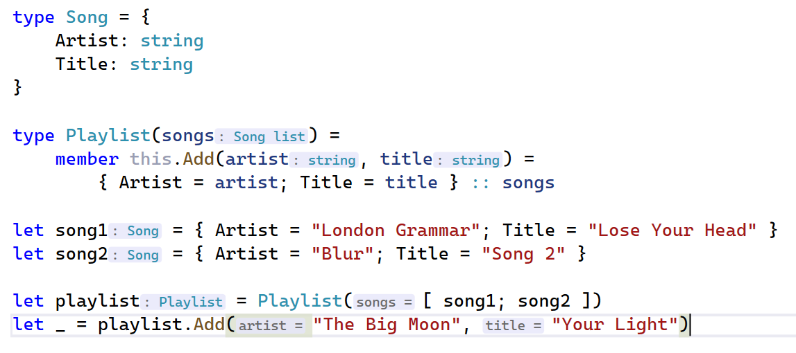
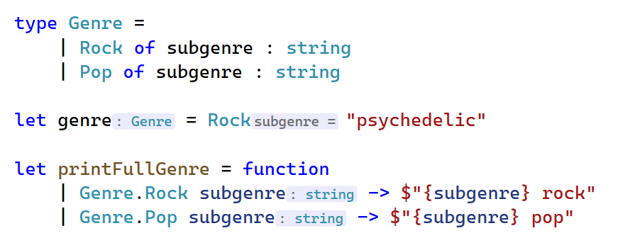
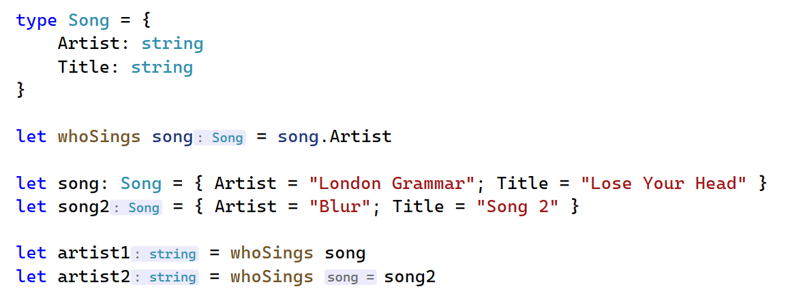
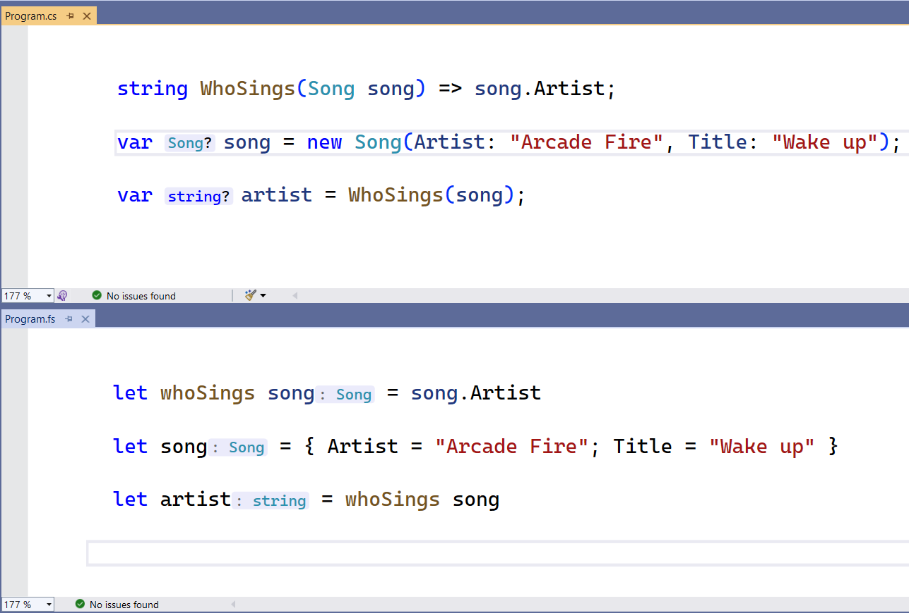
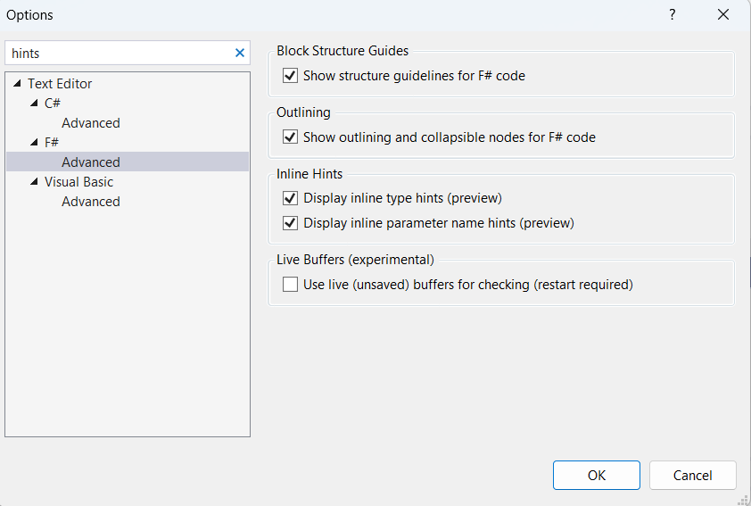

We are constantly working on improving the F# editor experience in the Visual Studio and now we are launching a highly requested features, Hinting. Hints for F# mean that you will no longer have to hover to get information when coding, check it out:


<details>
<summary>Code</summary>

```fsharp
type Song = {
    Artist: string
    Title: string
}

let whoSings song = song.Artist

let artist = whoSings { Artist = "Arcade Fire"; Title = "Wake up" }
```

</details>


## Overview

We currently support two kinds of hints: inline type hints and inline parameter name hints. Both are useful when the names of identifiers in code aren't intuitive. With hints, you won't need to hover over them and will see the necessary info right away.

Hints are available for the majority of the F# features, including tuples and type constructors:



<details>
<summary>Code</summary>

```fsharp
type Song = {
    Artist: string
    Title: string
}

type Playlist(songs) =
    member this.Add(artist, title) = 
        { Artist = artist; Title = title } :: songs

let song1 = { Artist = "London Grammar"; Title = "Lose Your Head" }
let song2 = { Artist = "Blur"; Title = "Song 2" }

let playlist = Playlist([ song1; song2 ])
let _ = playlist.Add("The Big Moon", "Your Light")
```

</details>

Here are the hints in action for discriminated unions:



<details>
<summary>Code</summary>

```fsharp
type Genre = 
    | Rock of subgenre : string
    | Pop of subgenre : string

let genre = Rock "psychedelic"

let printFullGenre = function
    | Genre.Rock subgenre -> $"{subgenre} rock"
    | Genre.Pop subgenre -> $"{subgenre} pop"
```

</details>

Note that to reduce information noise in the editor, we don't show type hints when types are explicitly specified and we don't show parameter name hints when argument names coincide with parameter names:


<details>
<summary>Code</summary>

```fsharp
type Song = {
    Artist: string
    Title: string
}

let whoSings song = song.Artist

let song: Song = { Artist = "London Grammar"; Title = "Lose Your Head" }
let song2 = { Artist = "Blur"; Title = "Song 2" }

let artist1 = whoSings song
let artist2 = whoSings song2
```

</details>


## Comparison to C# Inline Hints

C# has [Inline Hints](https://learn.microsoft.com/visualstudio/ide/reference/options-text-editor-csharp-advanced?view=vs-2022#inline-hints) for a while now. F# Hints share the same concept yet the implementation is a bit different. For example, C# type hints are displayed to the left of variables whereas F# type hints are displayed to the right of values, to follow the syntax rules in each language.



## Enable F# Hints

Sounds interesting? You can turn the hints on in the Advanced section of the F# options in Visual Studio Preview:



We are still doing some bughunting so the feature is off by default.

## Call for contributors

There is much more to be done in this area! You can find the roadmap for hints in this [issue](https://github.com/dotnet/fsharp/issues/14157) or see all open tickets using [this query](https://github.com/dotnet/fsharp/labels/Area-LangService-Hints). Among other things, we plan to bring signature hints, implement click-to-show behavior, and reduce the number of hints in obvious cases.

We would welcome your help, many of the open tickets are [good first issues](https://github.com/dotnet/fsharp/issues?q=is%3Aopen+is%3Aissue+label%3A%22good+first+issue%22) and we also have a testing framework for hints so that you can easily verify the behavior.

For the current implementation, big thanks go to our external contributors [@kerams](https://github.com/kerams) and [@rosskuehl](https://github.com/rosskuehl).