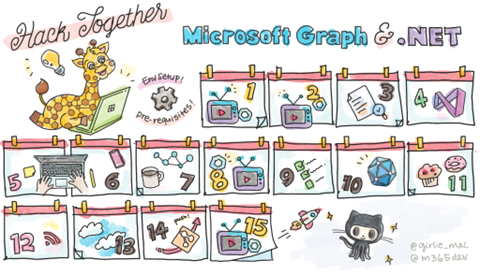

**Join us for Hack Together, our virtual hackathon to learn how to build powerful apps with Microsoft Graph and .NET and win exciting prizes**. If you're a beginning coder, a student, or an expert looking for an opportunity to learn a new skill, don't miss this opportunity!

**Hack Together is a virtual hackathon to get started building apps with Microsoft Graph and .NET**. In this hackathon, you will kick-start learning how to build apps with Microsoft Graph – the API to access data and insights from Microsoft 365, and develop apps based on some of the most popular Microsoft Graph scenarios. You'll also have a chance to win exciting prizes and meet Microsoft Graph and .NET Product Group Leaders, Cloud Advocates, MVPs and Student Ambassadors.

Hack Together will run online from March 1-15, 2023. Hear from our speakers – why you should join us. [Register today](https://aka.ms/hack-together/register)!

<iframe width="560" height="315" src="https://www.youtube.com/embed/2NcaPnob0eU" title="YouTube video player" frameborder="0" allow="accelerometer; autoplay; clipboard-write; encrypted-media; gyroscope; picture-in-picture; web-share" allowfullscreen></iframe>

## 🙋 Why join Hack Together and add Microsoft Graph to your skillset?

Millions of people across the globe use Microsoft apps in their personal lives, at school, and at work. Did you know that you can also access data behind the popular Microsoft apps such as Microsoft Teams, Calendar, Outlook, To-Do, Planner, and more?

Microsoft Graph is the gateway to access data and intelligence across Microsoft 365. It exposes hundreds of datasets to developers. Not only can you access the data, but also you can build your own apps on top of Microsoft 365 by accessing the available data with the power of Microsoft Graph. Here are a few examples of apps that you could build with Microsoft Graph:

- See what your colleagues are working on
- Organize your day with a quick overview of upcoming meetings
- Get your tasks every morning at 9 am
- Find meeting time and schedule a meeting for multiple attendees
- Stay up to date with what's going on around you through a personalized dashboard
- Get a summary of unread messages

Imagine all the other scenarios you can build on the Microsoft ecosystem to boost productivity, collaboration, education, people, workplace intelligence, and more!  

Learning how to build apps with Microsoft Graph is a critical skill to work across Microsoft technologies. Throughout Hack Together, we will help you upskill with Microsoft technologies and ecosystem by learning and building apps with Microsoft Graph.

## 🦒 Prerequisites to participate in Hack Together

During Hack Together, you'll learn hands-on how to build .NET apps connected to Microsoft Graph. Here's the list of [a few things you'll need to get started](https://github.com/microsoft/hack-together/tree/main#00---pre-requisites).

## ⚙️ How does Hack Together work?

Hack Together includes self-paced learning, connecting with experts and other participants on GitHub Discussions, and attending live sessions.

### Live sessions 📺

We'll open the virtual hackathon on March 1, 2023, with a keynote by **Yina Arenas**, Head of Product for Microsoft Graph and **Scott Hanselman**, Partner Program Manager in Developer Division. Join us live to learn why .NET and Microsoft Graph are a great combination for building apps for work and school.

Throughout Hack Together, we'll stream more sessions by Microsoft experts and MVPs to show you what you can achieve with Microsoft Graph and .NET. We'll close by announcing the winners of the hackathon.

For the schedule and more information about the sessions, check out our [GitHub repo](https://aka.ms/hack-together).

### Self-paced learning 📚

If you're just starting, Microsoft Graph and .NET might feel overwhelming. We hear you! Use our self-paced learning materials to learn about Microsoft Graph and .NET.

### Connect with experts on GitHub Discussions 💬

An answer is just one question away. When you need help, don't hesitate to ask questions in the GitHub Discussion for this hack. Our experts will always be there to help you and answer your questions. 

## 🦾 What's the hack?

During the hackathon you'll be working on your own .NET app connected to Microsoft Graph. Any type of app qualifies as long as it's built on .NET and connected to Microsoft Graph. If you need inspiration, check out the list of [top Microsoft Graph scenarios](https://github.com/microsoft/hack-together/blob/main/top-scenarios.md).

When you're ready, submit your app in the hackathon's repo before March 15, 2023, so we can check it out. All hackathon participants who submit an app will receive a digital badge. On addition, the winners selected will receive the following exciting prizes (up to 4 individuals if submitting as a team, prizes for each person on the team):

1. 🥇 First prize winner:
   - an Xbox,
   - $200 gift card
   - $100 Azure credit
   - a digital Credly badge
1. 🥈 Second prize winner:
   - $200 gift card
   - $100 Azure credit
   - a digital Credly badge
1. 🥉 Third prize winner:
   - $100 Azure credit
   - a digital Credly badge

You can participate by yourself or as a team with your colleagues!

We're so excited for you to Hack Together with us and build cool .NET apps with Microsoft Graph. Share your journey throughout the hack on social with the #HackTogether hashtag. Let us know if you have any questions. Our team is always here to help you! [Follow us on Twitter](https://twitter.com/Microsoft365Dev) to stay up to date on our latest news and announcements.

[Register today](https://aka.ms/hack-together/register) and we look forward to meeting you at #HackTogether!
