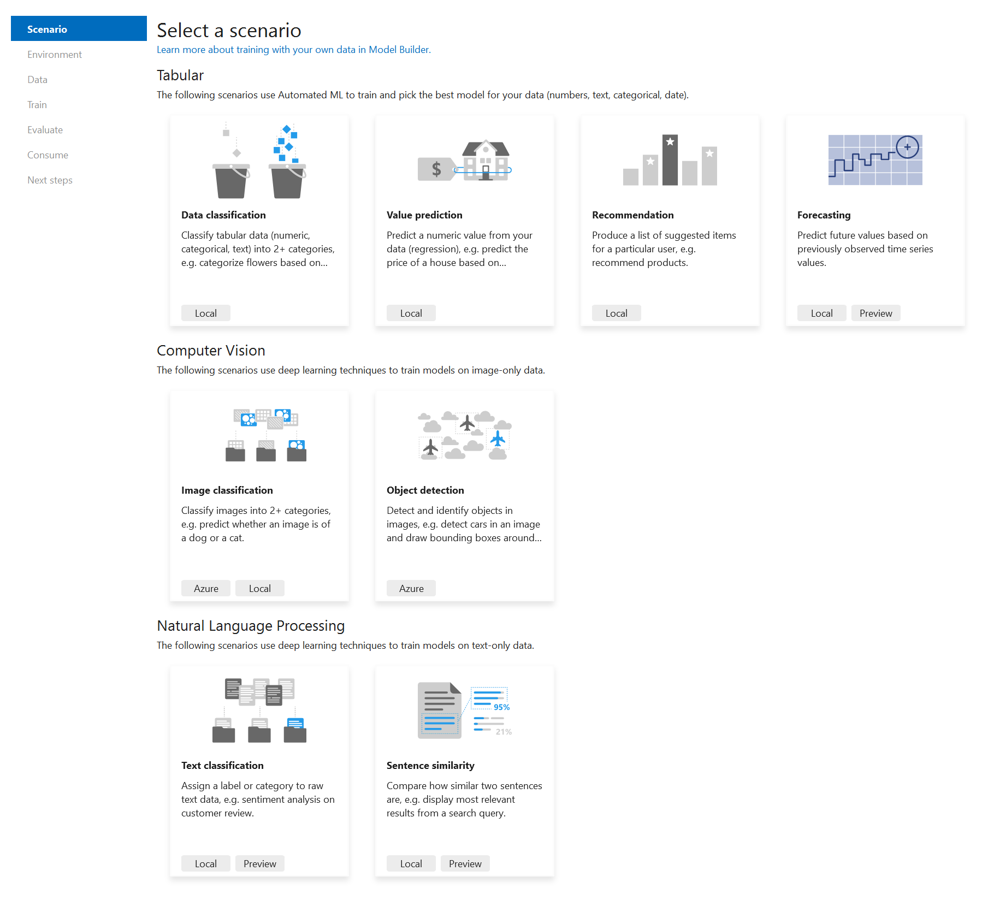

[ML.NET](https://dot.net/ml) is an open-source, cross-platform machine learning framework for .NET developers that enables integration of custom machine learning models into .NET apps.

A new version of [Model Builder](https://marketplace.visualstudio.com/items?itemName=MLNET.ModelBuilder2022) is now released!

## What's new?

The following are highlights from this release. You can find a list of all the changes in the [Model Builder release notes](https://github.com/dotnet/machinelearning-modelbuilder/blob/main/docs/release-notes/16.14.4.md).

To get started with these new features, [install or upgrade](https://learn.microsoft.com/dotnet/machine-learning/how-to-guides/install-model-builder?tabs=visual-studio-2022) to the latest versions Model Builder 16.14.4 or later.

### Sentence Similarity in Model Builder

Sentence similarity is a task that compares how similar two texts are to each other.

A common use case for sentence similarity is information retrieval. For example, give a search query, return the most similar (relevant) documents.

A few months ago we released a [preview of the Sentence Similarity API](https://devblogs.microsoft.com/dotnet/announcing-mlnet-2/) which enables you to train a custom sentence similarity machine learning model using your own data. It does so by integrating a [TorchSharp](https://github.com/dotnet/TorchSharp) implementation of [NAS-BERT](https://arxiv.org/abs/2105.14444) into ML.NET. This is the same underlying Transformer-based model used by the Text Classification API. Using a pre-trained version of this model, the Sentence Similarity API uses your data to fine-tune the model.

Today we're excited to announce the Sentence Similarity scenario in Model Builder powered by the ML.NET Sentence Similarity API.

With this new scenario, you can train custom sentence similarity models using the latest deep learning techniques from Microsoft Research inside of Model Builder.

This scenario supports local training on both CPU and GPU. For GPUs you need a CUDA-compatible GPU and we recommend at least 6 GB of dedicated memory. For more details on setting up your GPU, see the [ML.NET GPU guide](https://learn.microsoft.com/dotnet/machine-learning/how-to-guides/install-gpu-model-builder).

Get the latest version of Model Builder and start training your sentence similarity models today.

## Model Builder GPU extension no longer required

As we continue to introduce new deep learning scenarios in Model Builder, being able to train on a GPU is important.

When we first introduced GPU support in Model Builder, in addition to meeting the hardware requirements and installing the respective drivers, you had to install the [Model Builder GPU extension](https://marketplace.visualstudio.com/items?itemName=MLNET.ModelBuilderGPU2022).

We're happy to announce that starting with version 16.4.4 of Model Builder, you no longer need to install the GPU extension.

## What's next?

At a high-level the following items provide an overview of the areas we'll be focusing on over the next few months.

- **Deep Learning** - Continue to expand deep learning scenario coverage. This includes new scenario APIs like text classification and sentence similarity for object detection, question answering, and named entity recognition.
- **LightGBM** - Upgrade the LightGBM version supported in ML.NET and improve interoperability by enabling loading LightGBM models in their native format.
- **AutoML** - Over the next year, we plan to continue improving the AutoML API to enable new scenarios and customizations to simplify machine learning workflows for both beginners and experience users.
- **ML Tools** - As new scenarios and capabilities become available in the ML.NET set of APIs, we plan to bring them to Model Builder and the ML.NET CLI as well as improve the overall user experience in our tools.

For more details, see the [ML.NET](https://aka.ms/mlnet-roadmap) and [Model Builder](https://github.com/dotnet/machinelearning-modelbuilder/issues?q=is%3Aopen+is%3Aissue+label%3AEpic) roadmaps.

## Acknowledgements

We'd like to thank our Microsoft Research and TorchSharp partners for helping us deliver these new scenarios and capabilities in ML.NET.

## Get started and resources

Learn more about ML.NET, Model Builder, and the ML.NET CLI in [Microsoft Docs](https://learn.microsoft.com/dotnet/machine-learning/).

If you run into any issues, feature requests, or feedback, please file an issue in the [ML.NET](https://github.com/dotnet/machinelearning/issues) and [Model Builder](https://github.com/dotnet/machinelearning-modelbuilder/issues) repos.

Join the [ML.NET Community Discord](https://aka.ms/virtual-mlnet-community-discord) or #machine-learning channel on the [.NET Development Discord](https://aka.ms/dotnet-discord).

Tune in to the [Machine Learning .NET Community Standup](https://dotnet.microsoft.com/live/community-standup).
