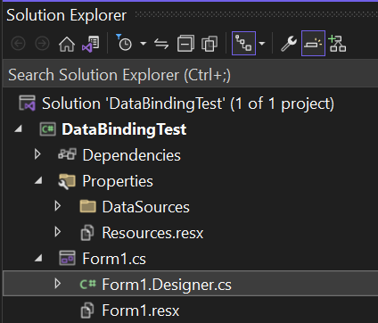
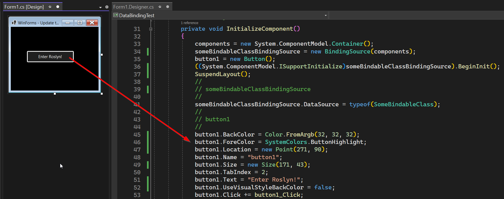
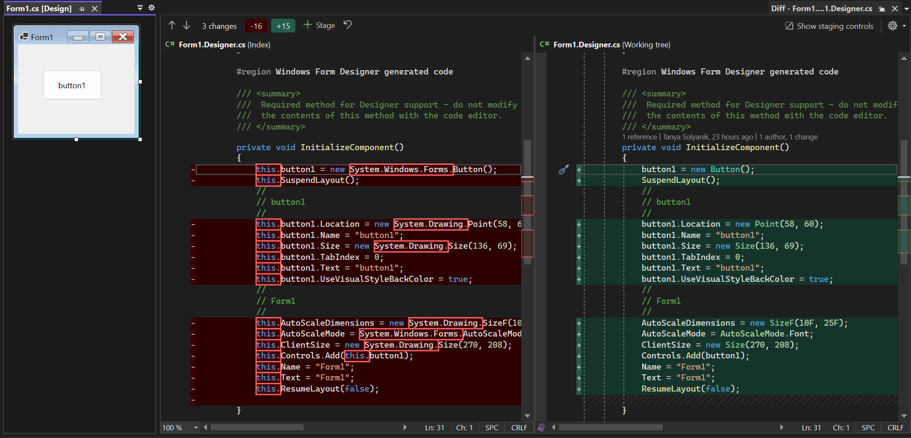

When you create a WinForms Form or User Control with the WinForms Designer in
Visual Studio, it does not have a special definition or file format like XML or
HTML to represent the user interface. From the beginning, the only format
WinForms has used is program code. A Form or User Control defined in a WinForms
Visual Basic project gets saved into VB Code. In a C# project, that is C# code.
That code will be placed in a dedicated Designer file, which sits behind the
actual Form code file and contains the code to control the UI.



When your Form or User Control needs to be opened again inside of the WinForms
Designer, that code is interpreted and - based on the resulting object graph -
the Form/User Control gets recreated in the Designer. That is the reason we call
the process of saving a Form _CodeDOM serialization_.
[CodeDOM](https://learn.microsoft.com/dotnet/framework/reflection-and-codedom/using-the-codedom)
here refers to an object model (the _Code **D**ocument **O**bject **M**odel_)
which allows the developer to define aspects of a program or part of a program
by objects of certain types.



While CodeDOM is pretty flexible, can be extended comparatively easily and
supports more languages than Visual Basic or C#, generating a CodeDOM graph from
an existing code file is a completely different beast. And although CodeDOM
_has_ the option to actually write a code file for particular languages through
its existing [Compiler
implementation](https://learn.microsoft.com/dotnet/framework/reflection-and-codedom/generating-and-compiling-source-code-from-a-codedom-graph),
the style of that resulting code is the same it has been from the beginning of
.NET Framework, which is in many cases no longer up to current coding standards.

In WinForms, when you design a Form, everything which is relevant is generated
in one method per Form or User Control. That method (amongst a bit of
infrastructure and initialization code in addition) is called
`InitializeComponent`.

This method is called by a Form's constructor unconditionally. In the C# case
that's pretty obvious, where a new Form which you add to your project, always
has that constructor and the required call:

```csharp
    public partial class Form1 : Form
    {
        public Form2()
        {
            InitializeComponent();
        }
    }
```

In Visual Basic, if you don't add a constructor `Sub New` explicitly, the Visual
Basic compiler inserts the call to `InitializeComponent` automatically in the
background. If you however add a constructor to the code file, the editor also
inserts the call to `InitializeComponent` in the VB code:

```vb
Public Class Form1

    Sub New()

        ' This call is required by the designer.
        InitializeComponent()

        ' Add any initialization after the InitializeComponent() call.

    End Sub
End Class
```

> [!NOTE]
> Note that in Visual Basic, the `Inherits` statement, which lets your new Form
class inherit from the `System.Windows.Forms.Form` base class, in contrast to C#
is only part of the Designer code behind file. In VB it's also sufficient for a
partial class only to state the [`Partial`
keyword](https://learn.microsoft.com/dotnet/visual-basic/language-reference/modifiers/partial)
in one of the partial class' code files. That is the reason why a Visual Basic
WinForms Form code file does not contain anything but the Form's class
definition by default.

Up to recently, the WinForms Designer used the [CodeModel
Interface](https://learn.microsoft.com/dotnet/api/envdte.codemodel?view=visualstudiosdk-2022)
to interpret source code of the different programming language to build the
required internal CodeDOM graph for the Designer to hold a Form's or a User
Control's definition. But we changed that.

## Enter Roslyn

WinForms introduced with Visual Studio 2022 version 17.5 a modernized way to
read and generate the code for `InitializeComponent` for the [WinForms
Out-of-Process
Designer](https://devblogs.microsoft.com/dotnet/state-of-the-windows-forms-designer-for-net-applications/).
It does so by using the APIs of the [.NET Compiler
Platform](https://learn.microsoft.com/dotnet/csharp/roslyn-sdk/) - better know
as the Roslyn SDK - for all related tasks. The Roslyn Compiler is a set of
open-source compilers and code analysis APIs for .NET languages. It allows
developers to write, analyze, and manipulate code in C# and Visual Basic .NET
using modern language features. It also provides a rich set of diagnostic and
code refactorings to improve code quality and developer productivity. It is the
gold standard and the current best practice for code generation in C# and VB.
And, since it's the same tooling that is used for compilation and build purposes
inside Visual Studio for any C# or Visual Basic project its code generation
result is completely in-line with current coding standards.

Also, since the Roslyn compiler provides certain APIs to not know only about the
correct [syntax of a particular statement, command or method](https://learn.microsoft.com/dotnet/csharp/roslyn-sdk/work-with-syntax?source=recommendations), but also about [the
semantics of a code block](https://learn.microsoft.com/dotnet/csharp/roslyn-sdk/work-with-semantics) already at WinForms design time, the WinForms designer
can point out potential problems with the code inside of `InitializeComponent`
far earlier and more precisely than before. So, it not only knows when you've
spelled 'Buttne' wrong - it would also know that a variable with a typo defined
inside of `InitializeComponent` would be an unknown symbol, and be able to point
that out.

But there is a series of additional benefits:

* Previously, the CodeModel based building up of the CodeDOM could only run on
  the UI Thread. That was not only a blocking operation, it couldn't utilize the
  full potential of a modern, multi-core processor.  Using the Roslyn compiler,
  we will be able to optimize the building process over time by using
  parallelization.
* The old system didn't have an easy way to interpret more recently introduced
  language features. Using Roslyn, we will have the option to introduce language
  features like `NameOf` to generate more robust code, especially for data
  binding purposes. In addition it opens up the path to more complex code
  generation inside of `InitializeComponent` in the future, which will help to
  optimize and equalize code generation for HighDPI scenarios generated on
  machines with different HighDPI settings.
* The Roslyn compiler honors many aspects of [.editorconfig
  configurations](https://learn.microsoft.com/visualstudio/ide/create-portable-custom-editor-options?view=vs-2022),
  so the code generated in `InitializeComponent` is close to what you and your
  team are enforcing as your coding standards by custom .editorconfig
  definitions.

That all said, there are a couple of coding elements which are fundamentally
different than before. The omission of `this` in C# or `Me` in Visual Basic is
one of such an example. The following screenshot shows the difference in the
code generation with Roslyn for a Button in `InitializeComponent`:



If you're interested in a more technical background about moving the code
generation in the WinForms designer to Roslyn or how to configure the
`InitializeComponent` code generation with .editorconfig, [take a look at this
technical article in the WinForms
repo](https://github.com/dotnet/winforms/blob/main/docs/designer/modernization-of-code-behind-in-OOP-designer/modernization-of-code-behind-in-oop-designer.md)
who points out all those things in greater detail.

Feedback about the subject matter is really important to us, so please let us
know your thoughts or ideas you might have around WinForms code generations in
the comments. If you have suggestions around the WinForms Designer or think you
found a bug, feel free to file new issues in the [WinForms Github
repo](https://github.com/dotnet/winforms).

Happy designing and coding!
