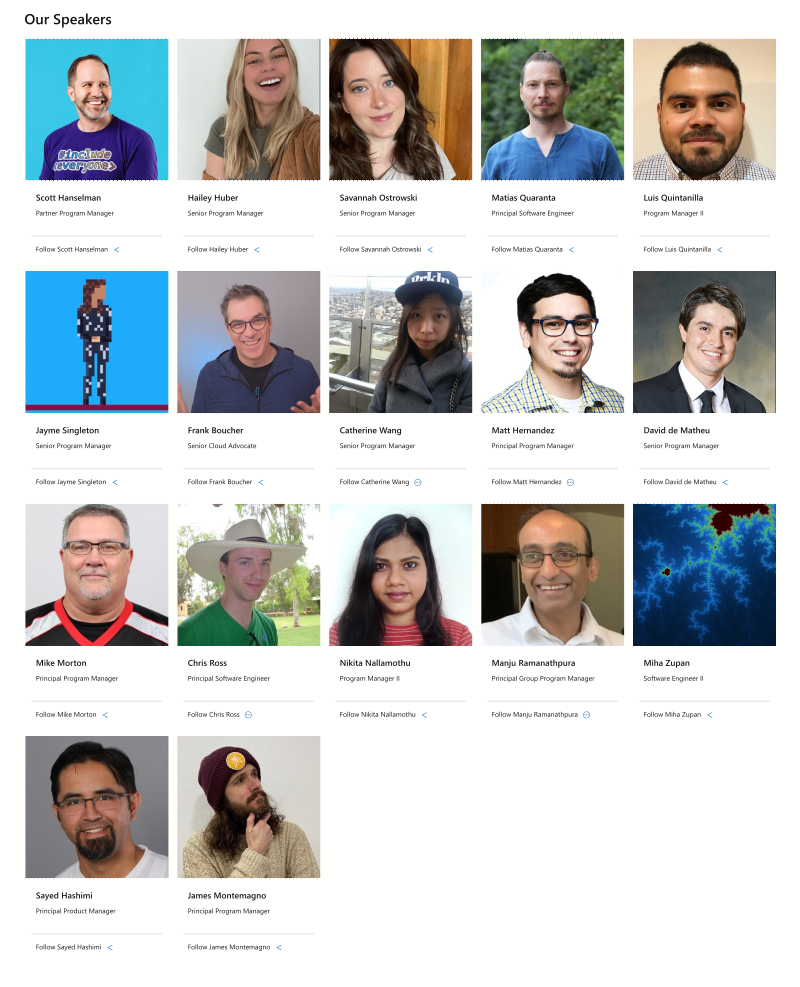

We're thrilled to announce [Azure Developers - .NET Day](https://learn.microsoft.com/events/learn-events/azuredeveloper-dotnetday/)! Join us on April 5th for a full day of online training and discover the latest services and features in Azure designed specifically for .NET developers. You'll learn cutting-edge cloud development techniques that can save you time and money, while providing your customers with the best experience possible.

April 5, 2023 from 9:00 am - 3:30 pm (Pacific Time) / 17:00 - 23:30 (UTC)

[cta-button align="center" text="Save the Date!" url="https://aka.ms/azuredeveloper_dotnetday_savethedate" color="#0078D4"]

During the event, you'll hear directly from the experts behind the most sought-after cloud services for developers, spanning app development/compute, data services, serverless computing, cloud-native computing, and developer productivity. Here's a quick glance at our speaker line up:

Whether you're a beginner or an experienced .NET developer, this event is for you. We'll cover four main topic areas: App Dev, Cloud Native, Data Services, Serverless, and Developer Productivity.

## Agenda

<table aria-label="Agenda" class="table">
<thead>
<tr>
<th><strong><strong>Session Title</strong></strong></th>
<th><strong><strong>Theme</strong></strong></th>
<th><strong><strong>Speaker</strong></strong></th>
<th><strong><strong>Time (PT / UTC)</strong></strong></th>
</tr>
</thead>
<tbody>
<tr>
<td>Welcome to Azure Developers - .NET Day</td>
<td aria-label="No value"></td>
<td>Hailey Huber &amp; James Montemagno</td>
<td>9:00 AM / 17:00</td>
</tr>
<tr>
<td>The real 10x developer is the Tools we used along the way</td>
<td>App Development</td>
<td>Scott Hanselman</td>
<td>9:00 AM / 17:00</td>
</tr>
<tr>
<td>Diagnosing Complex Code Issues in Azure App Services</td>
<td>App Development</td>
<td>Mark Downie</td>
<td>9:30 AM / 17:30</td>
</tr>
<tr>
<td>Get your .NET application on Azure in minutes with AZD</td>
<td>App Development</td>
<td>Savannah Ostrowski</td>
<td>10:00 AM / 18:00</td>
</tr>
<tr>
<td>Identifying Performance Bottlenecks with Azure Loading Testing</td>
<td>App Development</td>
<td>Nikita Nallamothu</td>
<td>10:30 AM / 18:30</td>
</tr>
<tr>
<td>Custom reverse proxies for .NET containers with YARP</td>
<td>Cloud Native</td>
<td>Miha Zupan &amp; Karel Zikmund</td>
<td>11:00 AM / 19:00</td>
</tr>
<tr>
<td>Train &amp; deploy machine learning models with ML.NET and Azure Container Apps</td>
<td>Cloud Native</td>
<td>Luis Quintanilla</td>
<td>11:30 AM / 19:30</td>
</tr>
<tr>
<td>Build dynamically scalable event-driven services using the Azure Cosmos DB extension for Azure Functions</td>
<td>Data Services</td>
<td>Matias Quaranta</td>
<td>12:00 PM / 20:00</td>
</tr>
<tr>
<td>Accelerate .NET web applications performance with Azure Redis Cache</td>
<td>Data Services</td>
<td>Catherine Wang, Manju Ramanathpura</td>
<td>12:30 PM / 20:30</td>
</tr>
<tr>
<td>Use Azure Container Apps to build, deploy, diagnose, and monitor your .NET apps</td>
<td>Serverless</td>
<td>Mike Morton</td>
<td>1:00 PM / 21:00</td>
</tr>
<tr>
<td>Building a SMS generator with short URLs leveraging Azure Functions, Storage, &amp; Communication Services</td>
<td>Serverless</td>
<td>Frank Boucher, David de Matheu</td>
<td>1:30 PM / 21:30</td>
</tr>
<tr>
<td>Modernizing .NET Apps with Key Vault, Azure Monitor, &amp; Beyond</td>
<td>Developer Productivity</td>
<td>Gaurav Seth</td>
<td>2:00 PM / 22:00</td>
</tr>
<tr>
<td>Rapid Blazor WASM deployment with Azure Static Web Apps, Visual Studio, and GitHub Actions</td>
<td>Developer Productivity</td>
<td>Sayed Hashimi &amp; Matt Hernandez</td>
<td>2:30 PM / 22:30</td>
</tr>
<tr>
<td>High Performance .NET with gRPC &amp; Linux App Service</td>
<td>App Development</td>
<td>Byron Tardif &amp; Jeff Martinez</td>
<td>3:00 PM / 23:00</td>
</tr>
</tbody>
</table>

Don't miss out on this opportunity to build the best applications with .NET. Join us on April 5th on the Azure Developers [YouTube](https://youtube.com/@AzureDevelopers) and [Twitch](https://twitch.tv/azuredevelopers) channels. See you there!
