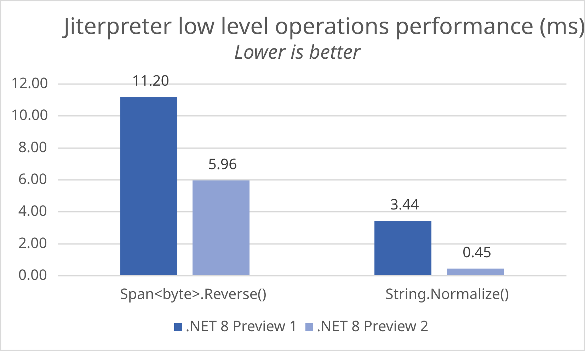
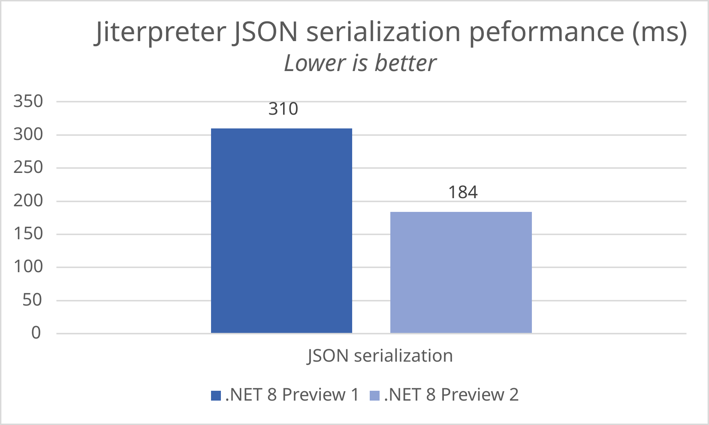

[.NET 8 Preview 2 is now available](https://devblogs.microsoft.com/dotnet/announcing-dotnet-8-preview-2) and includes many great new improvements to ASP.NET Core.

Here's a summary of what's new in this preview release:

- Blazor `QuickGrid` component
- Improved Blazor WebAssembly performance with the jiterpreter
- New web item templates
- New analyzer to detect multiple `FromBody` attributes
- New APIs in `ProblemDetails` to support more resilient integrations

For more details on the ASP.NET Core work planned for .NET 8 see the full [ASP.NET Core roadmap for .NET 8](https://aka.ms/aspnet/roadmap) on GitHub.

## Get started

To get started with ASP.NET Core in .NET 8 Preview 2, [install the .NET 8 SDK](https://dotnet.microsoft.com/next).

If you're on Windows using Visual Studio, we recommend installing the latest [Visual Studio 2022 preview](https://visualstudio.com/preview). Visual Studio for Mac support for .NET 8 previews isn’t available at this time.

## Upgrade an existing project

To upgrade an existing ASP.NET Core app from .NET 8 Preview 1 to .NET 8 Preview 2:

- Update the target framework of your app to `net8.0`.
- Update all Microsoft.AspNetCore.\* package references to `8.0.0-preview.2.*`.
- Update all Microsoft.Extensions.\* package references to `8.0.0-preview.2.*`.

See also the full list of [breaking changes](https://docs.microsoft.com/dotnet/core/compatibility/8.0#aspnet-core) in ASP.NET Core for .NET 8.

## Blazor `QuickGrid` component

The Blazor `QuickGrid` component is now part of .NET 8! `QuickGrid` is a high performance grid component for displaying data in tabular form. `QuickGrid` is built to be simple and convenient to display your data, while still providing powerful features like sorting, filtering, paging, and virtualization.

To get started with `QuickGrid`:

1. Add reference to the Microsoft.AspNetCore.Components.QuickGrid package.

    ```console
    dotnet add package Microsoft.AspNetCore.Components.QuickGrid --prerelease
    ```

2. Add the following Razor code to render a very simple grid.

    ```razor
    <QuickGrid Items="@people">
        <PropertyColumn Property="@(p => p.PersonId)" Sortable="true" />
        <PropertyColumn Property="@(p => p.Name)" Sortable="true" />
        <PropertyColumn Property="@(p => p.BirthDate)" Format="yyyy-MM-dd" Sortable="true" />
    </QuickGrid>

    @code {
        record Person(int PersonId, string Name, DateOnly BirthDate);

        IQueryable<Person> people = new[]
        {
            new Person(10895, "Jean Martin", new DateOnly(1985, 3, 16)),
            new Person(10944, "António Langa", new DateOnly(1991, 12, 1)),
            new Person(11203, "Julie Smith", new DateOnly(1958, 10, 10)),
            new Person(11205, "Nur Sari", new DateOnly(1922, 4, 27)),
            new Person(11898, "Jose Hernandez", new DateOnly(2011, 5, 3)),
            new Person(12130, "Kenji Sato", new DateOnly(2004, 1, 9)),
        }.AsQueryable();
    }
    ```

You can see various examples of `QuickGrid` in action on the [QuickGrid demo site](https://aka.ms/blazor/quickgrid).

`QuickGrid` was originally introduced as an experimental package based on .NET 7. As part of bringing `QuickGrid` into .NET 8 we've made some changes and improvements to the API. To update an existing Blazor app that uses `QuickGrid` to the .NET 8 version, you may need to make the following adjustments:

- Rename the `Value` attribute on the `Paginator` component to `State`
- Rename the `IsDefaultSort` attribute on columns to `InitialSortDirection` and add `IsDefaultSortColumn=true` to indicate the column should still be sorted by default.
- Remove the `ResizableColumns` attribute on `QuickGrid`. Built-in support for resizable columns was removed.

## Improved Blazor WebAssembly performance with the jiterpreter

Blazor WebAssembly apps are able to run .NET code in browser thanks to a small .NET runtime implemented in WebAssembly that gets downloaded with the app. This runtime is a .NET IL interpreter that is fully functional, reasonably small in size, and allows for fast developer iteration, but lacks the runtime performance benefits of native code execution through just-in-time (JIT) compilation. JITing to WebAssembly requires creating new WebAssembly modules on the fly and instantiating them, which poses unique challenges that would significantly complicate the runtime. Blazor WebAssembly apps can choose instead to compile ahead-of-time (AOT) to WebAssembly to improve runtime performance but at the expense of a much larger download size. Also, since some common .NET coding patterns are incompatible with AOT, the .NET IL interpreter is still needed as a fallback mechanism to maintain full functionality.

The jiterpreter is a new runtime feature in .NET 8 that enables partial JIT support in the .NET IL interpreter to achieve improved runtime performance. The jiterpreter works by providing optimized execution for interpreter bytecodes, replacing large groups of them with tiny blobs of WebAssembly code. By leveraging the interpreter as a baseline, we are able to optimize the most important parts of the app without having to handle more complex or obscure cases. While the jiterpreter isn't a full JIT implementation, it significantly improves runtime performance without the size and build time overhead of AOT. The jiterpreter helps when using AOT too by optimizing cases where the runtime has to fallback to the interpreter.

In .NET 8 Preview 2 The jiterpreter is automatically enabled for your Blazor WebAssembly Release builds. It is not yet supported in Debug builds or while debugging.

The jiterpreter can significantly speed up the performance of low level operations. For example, the following micro benchmark test for `Span<byte>.Reverse()` and `String.Normalize()` ran **46.7%** and **86.9%** faster respectively:



These improvements add up and translate into better performance for higher layer features. In our JSON serialization tests, the jiterpreter is **40.8%** faster:



We're still working to improve the jiterpreter with [additional optimizations](https://github.com/dotnet/runtime/issues/78428), so the performance of the jiterpreter when we ship .NET 8 may differ from what we're currently measuring, but so far the results are looking very promising!

## New analyzer to detect multiple `FromBody` attributes

In addition to the analyzers added in preview1, we're introducing a new analyzer in this release that provides a helpful warning if you are attempting to resolve more than one parameter from the body in a minimal API. For example, the new analyzer will warn on the following code.

```csharp
// ASP0024
app.MapPost("/todos", ([FromBody] Todo todo, [FromBody] User user) => ...);
```

To resolve the analyzer warning, limit each handler to have one parameter resolved from the body.

```csharp
app.MapPost("/todos", ([FromBody] Todo todo, ClaimsPrincipal user) => ...);
```

## New APIs in `ProblemDetails` to support more resilient integrations

In .NET 7, we introduced the `ProblemDetailsService` to improve the experience for generating responses that comply with the ProblemDetails specification. In this release, we've introduced a new API to make it easier for implementers to implement fallback behavior if the `ProlemDetailsService` was not able to generate a `ProblemDetail`. The new `TryWriteAsync` API can be used as follows in user middlewares:

```csharp
var problemDetailsService = httpContext.RequestServices.GetService<IProblemDetailsService>();
if (problemDetailsService == null ||
    !await problemDetailsService.TryWriteAsync(new() { HttpContext = httpContext }))
{
    // Your fallback behavior, since problem details was not able to be written.
}
```

## New `IResettable` interface in ObjectPool

[Microsoft.Extensions.ObjectPool](https://www.nuget.org/packages/Microsoft.Extensions.ObjectPool/) provides support for pooling object instances in memory. Apps can use an object pool if the values are expensive to allocate or initialize.

In preview 2 we're making the object pool easier to use by adding the `IResettable` interface. Reusable types often need to be reset back to a default state between uses. `IResettable` types are automatically reset when returned to an object pool.

```csharp
public class ReusableBuffer : IResettable
{
    public byte[] Data { get; } = new byte[1024 * 1024]; // 1 MB

    public bool TryReset()
    {
        Array.Clear(Data);
        return true;
    }
}

var bufferPool = ObjectPool.Create<ReusableBuffer>();

var buffer = bufferPool.Get();
try
{
    await ProcessDataAsync(buffer.Data);
}
finally
{
    bufferPool.Return(buffer); // Data is automatically reset
}
```

## Performance improvements to named pipes transport

In preview 1 we announced support for [using named pipes with Kestrel](https://devblogs.microsoft.com/dotnet/asp-net-core-updates-in-dotnet-8-preview-1/#support-for-named-pipes-in-kestrel).

In preview 2 we've improved named pipe connection performance. Kestrel's named pipe transport now accepts connections in parallel, and reuses `NamedPipeServerStream` instances.

Time to create 100,000 connections:

* **Before:** 5.916 seconds
* **After:** 2.374 seconds

These improvements were suggested by the community. Thanks to the folks at [Unity](https://unity.com/) for helping contribute to this area.

## Give feedback

We hope you enjoy this preview release of ASP.NET Core in .NET 8. Let us know what you think about these new improvements by filing issues on [GitHub](https://github.com/dotnet/aspnetcore/issues/new).

Thanks for trying out ASP.NET Core!
