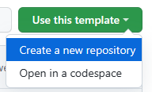

Create, customize, and deploy your own portfolio website in minutes without installing any tools. All you need is a GitHub account and a few minutes to get started. We will use GitHub Codespaces and Blazor to build the website and Azure Static Web Apps or GitHub Pages to deploy it.

<iframe width="560" height="315" src="https://www.youtube.com/embed/1Vg7bNjJY-0" title="Build your first website without installing anything!" frameborder="0" allow="accelerometer; autoplay; clipboard-write; encrypted-media; gyroscope; picture-in-picture; web-share" allowfullscreen></iframe>

## GitHub Codespaces

Now, with GitHub Codespaces you can create your own portfolio website in minutes without any extra tools or lengthy environment setup! All you need is a GitHub account.

Follow [these instructions](https://docs.github.com/en/get-started/signing-up-for-github/signing-up-for-a-new-github-account) to create your free GitHub account.

[GitHub Codespaces](https://docs.github.com/en/codespaces/overview) is a development environment that is hosted in the cloud. This means that you can get started coding right away in your browser – we set everything up for you ahead of time! You do not need to worry about setting up the right coding editor or tools.

## .NET Blazor Portfolio Site with GitHub Codespaces

With the .NET Blazor Portfolio Site project template, all you need to do is launch your Codespace then follow the README instructions to customize your website. The goal is to give you a template you can immediately utilize to create your own website through GitHub Codespaces.

This template shows you how to build your website using Blazor. [Blazor](https://dotnet.microsoft.com/apps/aspnet/web-apps/blazor) is a UI Framework that lets you build frontend web applications with C#. The template is in the [education/codespaces-project-template-dotnet](https://education.github.com/experiences/primer_codespaces) on GitHub!

- **Who is this for?** *Anyone* looking to create a portfolio site, learn web development, or test out Codespaces.
- **How much experience do you need?** *Zero*. You decide how much you want to customize based on your experience, and time available.
- **Tools needed**: *None*. No need to install anything! All you need is a GitHub account and web browser.
- **Prerequisites**: *None*. This template includes your development environment and deployable web app for you to create your own site.

## Get Started with the .NET Portfolio Website Template

1. Go to the [template](https://aka.ms/dotnet/codespaces-template)
2. Click **Use this template** then **Create a new repository**

  

3. Create a copy of the repository in your GitHub account. You can keep the repository name the same or change it if you would like.
4. At the top of the README, click on the Open in GitHub Codespaces button

  

5. The Codespace may take a few minutes to set up. Upon setup completion, you will be in a GitHub Codespace! Notice that it has the same layout as VS Code.

  

6. Follow the README instructions to run your website. Use the **swa start** command.
7. From here, you can continue to follow the instructions in the README to [customize your portfolio website](https://github.com/education/codespaces-project-template-dotnet#-customize-your-site-in-4-steps) and [deploy it](https://github.com/education/codespaces-project-template-dotnet#-deploy-your-web-application)!

When you're finished, your site will look something like this! 

## Continue Learning

Want to learn more about building with C# and .NET? Check out the following resources.

- [Learn C#](https://learn.microsoft.com/users/dotnet/collections/yz26f8y64n7k07) using VS Code in this learning path
- [Learn Blazor](https://learn.microsoft.com/training/paths/build-web-apps-with-blazor/) with this learning path