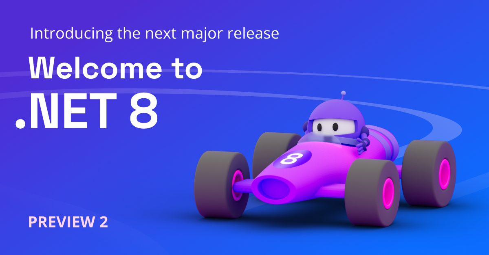

We're excited to share what's new in [.NET 8 Preview 2](https://dotnet.microsoft.com/next). This release is a quick follow-up to the larger [Preview 1 release](https://devblogs.microsoft.com/dotnet/announcing-dotnet-8-preview-1/). You'll continue to see many more features show up with these monthly releases. .NET 6 and 7 users will want to follow this release closely. We've focused on making it a straightforward upgrade path.

You can [download .NET 8 Preview 2](https://dotnet.microsoft.com/download/dotnet/8.0) for Linux, macOS, and Windows.

* [Installers and binaries](https://dotnet.microsoft.com/download/dotnet/8.0)
* [Container images](https://github.com/dotnet/dotnet-docker/blob/main/documentation/supported-tags.md)
* [Release notes](https://github.com/dotnet/core/tree/main/release-notes/8.0)
* [Known issues](https://github.com/dotnet/core/blob/main/release-notes/8.0/known-issues.md)
* [GitHub issue tracker](https://github.com/dotnet/core/issues)

Check out what's new in [ASP.NET Core](https://devblogs.microsoft.com/dotnet/asp-net-core-updates-in-dotnet-8-preview-2) and [EF Core](https://devblogs.microsoft.com/dotnet/announcing-ef8-preview-2) in the Preview 2 release. Stay current with what's new and coming in [What's New in .NET 8](https://learn.microsoft.com/dotnet/core/whats-new/dotnet-8). It will be kept updated throughout the release.

.NET 8 has been tested with 17.6 Preview 2. We recommend that you use the [preview channel builds](https://visualstudio.com/preview) if you want to try .NET 8 with the Visual Studio family of products. Visual Studio for Mac support for .NET 8 isn’t yet available.

Let's take a look at some new features.

[](https://dotnet.microsoft.com/next)

## Libraries

The new features in Preview 2 are in the libraries.

### System.ComponentModel.DataAnnotations Extensions

We've [introduced extensions](https://github.com/dotnet/runtime/pull/82311) to the built-in validation attributes in System.ComponentModel.DataAnnotations.

#### RequiredAttribute.DisallowAllDefaultValues

The `RequiredAttribute` now allows validating that structs do not equal their default values. For example:

```cs
[Required(DisallowAllDefaultValues = true)]
public Guid MyGuidValue { get; set; }
```

This example will fail validation if its value equals `Guid.Empty`.

#### RangeAttribute exclusive bounds

Users can now specify exclusive bounds in their range validation:

```cs
[Range(0d, 1d, MinimumIsExclusive = true, MaximumIsExclusive = true)]
public double Sample { get; set; }
```

This attribute accepts any values in the open interval but rejects the boundary values `0` and `1`.

#### LengthAttribute

The `LengthAttribute` can now be used to set both lower and upper bounds for strings or collections:

```cs
[Length(10, 20)] // Require at least 10 elements and at most 20 elements.
public ICollection<int> Values { get; set; }
```

#### AllowedValuesAttribute and DeniedValuesAttribute

These attributes can be used to specify allow lists and deny lists for validating a property:

```cs
[AllowedValues("apple", "banana", "mango")]
public string Fruit { get; set; }

[DeniedValues("pineapple", "anchovy", "broccoli")]
public string PizzaTopping { get; set; }
```

#### Base64StringAttribute

As the name suggests, this attribute validates that a given string is a valid Base64 representation.

### System.Reflection: introspection support for function pointers

[Function pointers](https://devblogs.microsoft.com/dotnet/improvements-in-native-code-interop-in-net-5-0/) were added as part of .NET 5 and C# 9, however, we didn't add a matching experience for the feature in Reflection. This new feature adds the [capability to obtain function pointer metadata via Reflection](https://github.com/dotnet/runtime/issues/69273), including parameter types, the return type and the calling conventions. Previously, the `IntPtr` type was used for a function pointer type such as with `typeof(delegate*<void>())` or when obtaining a function pointer type through reflection such as with `FieldInfo.FieldType`.

A function pointer instance, which is a physical address to a function, continues to be represented as an `IntPtr`; only the reflection type was changed with this feature.This new functionality is currently implemented in the CoreCLR runtime and in `MetadataLoadContext`. Support for the Mono and NativeAOT runtimes are expected later.

An example using reflection:

```cs
FieldInfo fieldInfo = typeof(MyClass).GetField(nameof(MyClass._fp));

// Obtain the function pointer type from a field. This used to be the 'IntPtr' type, now it's 'Type':
Type fpType = fieldInfo.FieldType;

// New methods to determine if a type is a function pointer:
Console.WriteLine(fpType.IsFunctionPointer); // True
Console.WriteLine(fpType.IsUnmanagedFunctionPointer); // True

// New methods to obtain the return and parameter types:
Console.WriteLine($"Return type: {fpType.GetFunctionPointerReturnType()}"); // System.Void

foreach (Type parameterType in fpType.GetFunctionPointerParameterTypes())
{
    Console.WriteLine($"Parameter type: {parameterType}"); // System.Int32&
}

// Access to custom modifiers and calling conventions requires a "modified type":
Type modifiedType = fieldInfo.GetModifiedFieldType();

// A modified type forwards most members to its underlying type which can be obtained with Type.UnderlyingSystemType:
Type normalType = modifiedType.UnderlyingSystemType;

// New methods to obtain the calling conventions:
foreach (Type callConv in modifiedType.GetFunctionPointerCallingConventions())
{
    Console.WriteLine($"Calling convention: {callConv}");
    // System.Runtime.CompilerServices.CallConvSuppressGCTransition
    // System.Runtime.CompilerServices.CallConvCdecl
}

// New methods to obtain the custom modifiers:
foreach (Type modreq in modifiedType.GetFunctionPointerParameterTypes()[0].GetRequiredCustomModifiers())
{
    Console.WriteLine($"Required modifier for first parameter: {modreq }");
    // System.Runtime.InteropServices.InAttribute
}

// Sample class that contains a function pointer field:
public unsafe class MyClass
{
    public delegate* unmanaged[Cdecl, SuppressGCTransition]<in int, void> _fp;
}
```

Parameterized types including generics, pointers, and arrays such as an array of function pointers (e.g. `delegate*<void>[]`) are supported. Thus, the `Type.ElementType` property and the `Type.GetGenericArguments()` method can be used to obtain further types which ultimately may be a function pointer. In addition, a function pointer parameter type is allowed to be another function pointer type.

## Closing

.NET 8 Preview 2 offers a short, but exciting array of theme updates, new features, and improvements.

We want to extend our [sincere thanks to everyone who has contributed to .NET 8 so far](https://dotnet.microsoft.com/thanks), whether it was through code contributions, bug reports, or providing feedback. Your contributions have been instrumental in the making .NET 8 Previews, and we look forward to continuing to work together to build a brighter future for .NET and the entire technology community.

What are you waiting for? [Go see for yourself what's next in .NET!](https://dotnet.microsoft.com/next)
