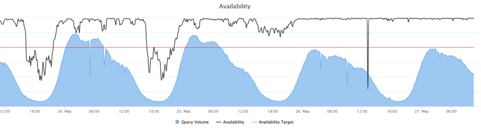
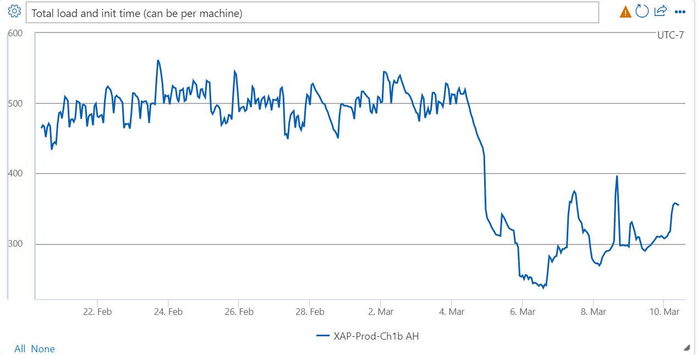
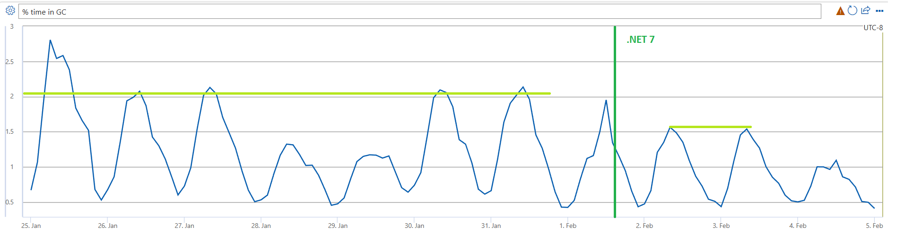
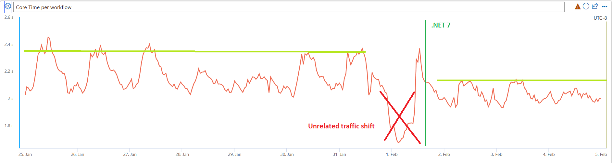

Nearly two years ago, I published [an article](https://devblogs.microsoft.com/dotnet/migration-of-bings-workflow-engine-to-net-5/) detailing the upgrade of Bing's central workflow engine (XAP) to .NET 5 from .NET Framework. You can see that post for a refresher on how XAP works and where it fits into the larger picture of Bing.

Since that time, XAP has remained a critical component underlying many search- and workflow-related technologies at Microsoft, and has played a central role for new integrations such as the new [AI-powered Bing](https://blogs.microsoft.com/blog/2023/02/07/reinventing-search-with-a-new-ai-powered-microsoft-bing-and-edge-your-copilot-for-the-web/).

The expectations in both functionality and performance have grown, which means our reliance on .NET as a critical piece of infrastructure has only deepened.

In the last two years we have been early adopters of .NET 6 and .NET 7, and are now turning our sights to .NET 8. We find that each version is easier to upgrade to than the last. As a core platform team, we are strongly motivated by the performance improvements and new features that come with each version of .NET. By aggressively testing and upgrading to the latest version, and providing feedback to the .NET team, we can also influence their plans. Everybody benefits.

This article will highlight some of the major updates we made, the challenges, and ultimately the wins we realized as we aggressively kept up with the latest .NET releases. 

## Hybrid No-More

As mentioned in the previous article, when we first  upgraded to .NET 5, we did so in a hybrid model, where we still built against .NET Framework 4.x, but loaded the assemblies and ran under .NET 5. This allowed us to bootstrap ourselves and our internal partners to maintain some critical backwards compatibility while keeping our build simple, yet still take advantage of the newer runtime.

Before we upgraded to .NET 6, we moved to a system of multi-targeting, building against both .NET Framework and .NET 5 directly. With some conditional compilation, this allowed us to start adopting new APIs to get some performance benefits.

As of now, we have deprecated our usage of .NET Framework completely and are focusing our efforts entirely on the new runtime.

## .NET 6

With the huge effort of upgrading away from .NET Framework completed, we expected the move to .NET 6 to be far easier, and it was. However, there were still some minor challenges and some unexpectedly large gains, which I will detail.

During testing, we noticed a problem with some of our backend HTTP calls. It turned out to be a change in SocketHttpHandler that was bringing the implementation more in line with the correct spec, but didn’t flexibly handle buggy servers that produced incorrect payloads. The .NET team [changed the code](https://github.com/dotnet/runtime/pull/57862) to be more forgiving.

Another interesting runtime issue we ran into was a rare [spin count bug](https://github.com/dotnet/runtime/pull/68879) (it was subtle enough that it went unnoticed in production for a few months). It manifested itself as occasional spikes in very high-percentile latency, and lower availability overall (since requests were timing out at the UX layer) in a single data center (likely because of the particular hardware and traffic configuration). The .NET team had actually already fixed it by the time we brought it up. After applying the fix, we saw an obvious and immediate improvement in availability:

Those two issues resolved, the release was largely straightforward, with minimal code changes required on our end. 
In the end, overall performance improved by about 5% across the board. However, one area improved much more dramatically than this: startup time.

When our process starts up, it loads a few thousand assemblies (plugin DLLs that are developed independently). All of this code needs to be jitted, ideally before a real user query hits it. We’ve iterated on many techniques to do this over the years, but our current method involves analyzing JIT event logs to see which methods most need it, and proactively jitting them upon subsequent startups. We do this on all processor cores, as fast as possible.

.NET 6’s JIT efficiency improved so much for this that it had an enormous impact on our startup time:

On some machine SKUs, startup time improved by nearly 40%! It was so impressive that we spent significantly time  investigating to see if something broke and we weren’t actually doing all the work we needed. But in the end, the result was real and impressive.

## .NET 7

No rest for the weary! As soon as our .NET 6 release was done, we focused our efforts on upgrading to .NET 7.

There were two major changes in .NET 7 that we needed to be particularly aware of:

1. Changes to how the [thread pool operates](https://devblogs.microsoft.com/dotnet/performance_improvements_in_net_7/).
2. A new [region-based GC](https://itnext.io/how-segments-and-regions-differ-in-decommitting-memory-in-the-net-7-gc-68c58465ab5a).

Careful testing showed that the new thread pool design yielded better performance for us, so no concerns here.

The new garbage collector design was, in fact, specifically and extensively tested by .NET developers on some of our test machines over the course of a few months to ensure it did not introduce any regressions. In a system that has been highly optimized to assumptions about how the runtime works, it’s always a concern when a fundamental piece of the runtime dramatically changes its implementation.

Thankfully, in testing we saw about a 24% average improvement in the amount of time the process spends in GC (which isn’t much to start with). In production, it was even better, closer to 30%.

With those two concerns out of the way, we generally saw efficiency improvements of about 10-17%, depending on the data center and type of workload.

A large portion of this improvement comes from general CPU-usage improvements in the runtime, which translates to lower overall CPU usage in queries in Bing:

(Note that the value in the graph above does not represent query latency—it is the aggregated CPU usage across all parallel paths.)

Between the GC improvements, the new thread pool, and the more efficient use of the processor, we realized a 3-7% improvement in P95 latency, and more at higher percentiles. This improvement in efficiency allows us to serve experiences faster to the user, or in some cases, decide to reduce our resource usage and realize the runtime gains in a different way. “Efficiency” feels like the 2023 word of the year for tech companies, and .NET 7 has played a major role in our efforts.

## .NET 8!

.NET 8 is already [out in preview](https://dotnet.microsoft.com/download/dotnet/8.0). Within the next few weeks, we’ll start testing our workflow engine under this new runtime. 
So far, upgrading to the latest version has proven to be the most cost-effective way to improve performance in a significant way, year after year. We never expect to get all of these performance benefits for “free” --parity is always our requirement--it is hard to imagine that these double-digit improvements in efficiency will continue forever  (although there’s no sign of stopping yet!). We’re here for it, and we’re excited to keep up on the cusp of .NET progress! 
