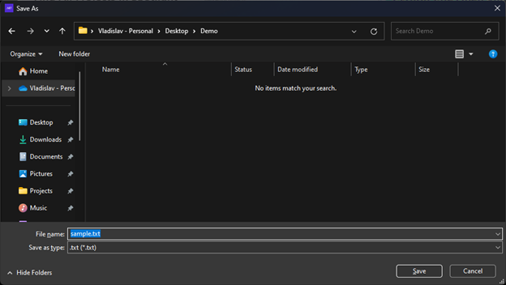
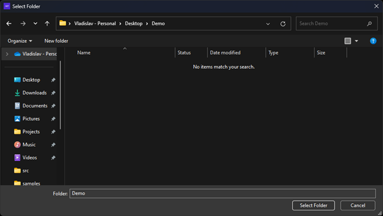

> Note: This is a guest blog post by Vladislav Antonyuk, who is a software engineer at DataArt and a contributor to the .NET MAUI Community Toolkit

Interacting with files and folders is a routine task for countless applications, yet it often involves writing tedious platform-specific code.

The good news is that we just released [version 5.0](https://github.com/CommunityToolkit/Maui/releases/tag/5.0.0) of the [CommunityToolkit.Maui](https://github.com/CommunityToolkit/Maui) now contains the `FolderPicker` and `FileSaver` classes which provide an easy way to select target folders and save files to the filesystem across all the .NET MAUI platforms.

## FileSaver

By using `FileSaver`, your application can offer users a convenient dialog that allows them to choose a destination folder. With only a few lines of code, you can then save any file type, including documents, images, videos, and more.

Here's an example of how you can use `FileSaver` in C#:

```csharp
using var stream = new MemoryStream(Encoding.Default.GetBytes("Hello from the Community Toolkit!"));
var fileSaveResult = await FileSaver.Default.SaveAsync("sample.txt", stream, cancellationToken);
if (fileSaveResult.IsSuccessful)
{
    await Toast.Make($"File is saved: {fileSaveResult.FilePath}").Show(cancellationToken);
}
else
{
    await Toast.Make($"File is not saved, {fileSaveResult.Exception.Message}").Show(cancellationToken);
}
```

This code opens a filesystem dialog, that allows the user to choose the target file location, creates a new file called "sample.txt" and writes a stream with the text "Hello from the Community Toolkit!" to it. Users can also change the file name to suit their needs.



`FileSaver` catches all exceptions and returns the operation result. However, if you would like to handle only specific exceptions like the user cancels the operation, you can wrap code in a try/catch and call the `EnsureSuccess` method:

```csharp
using var stream = new MemoryStream(Encoding.Default.GetBytes("Hello from the Community Toolkit!"));
try
{
    var fileSaverResult = await FileSaver.SaveAsync("initial-path", "sample.txt", stream, cancellationToken);
    fileSaverResult.EnsureSuccess();

    await Toast.Make($"File is saved: {fileSaverResult.FilePath}").Show(cancellationToken);
}
catch (Exception ex)
{
    await Toast.Make($"File is not saved, {ex.Message}").Show(cancellationToken);
}
```

A more complete example of using `FileSaver` is in my [MauiPaint](https://github.com/VladislavAntonyuk/MauiSamples/tree/main/MauiPaint) sample application. This is how it works on `macOS`:

<video controls>
  <source src="FileSaverMacCatalyst.mp4" type="video/mp4">
</video>

> Note: Android Developers should provide permission to work with file storage.
```xml
<uses-permission android:name="android.permission.READ_EXTERNAL_STORAGE" />
<uses-permission android:name="android.permission.WRITE_EXTERNAL_STORAGE" />
```

## FolderPicker

`FolderPicker` is another powerful capability that can be found as part of [CommunityToolkit.Maui](https://github.com/CommunityToolkit/Maui) which allows users to select folders in the filesystem using a UI dialog. With `FolderPicker` developers can easily get information about the selected folder such as its name and path.

Here's an example of how `FolderPicker` can be used in C#:

```csharp
var folderPickerResult = await folderPicker.PickAsync(cancellationToken);
if (folderPickerResult.IsSuccessful)
{
    await Toast.Make($"Folder picked: Name - {folderPickerResult.Folder.Name}, Path - {folderPickerResult.Folder.Path}", ToastDuration.Long).Show(cancellationToken);
}
else
{
    await Toast.Make($"Folder is not picked, {folderPickerResult.Exception.Message}").Show(cancellationToken);
}
```

This code prompts the user to select a folder, and the result of the operation will be stored in the "folderPickerResult" variable.



Again, it's a good idea to wrap in a try/catch in case you prefer to use the `EnsureSuccess` method:

```csharp
try
{
    var folderPickerResult = await FolderPicker.Default.PickAsync("initial-path", cancellationToken);
    folderPickerResult.EnsureSuccess();
    await Toast.Make($"Folder picked: Name - {folderPickerResult.Folder.Name}, Path - {folderPickerResult.Folder.Path}", ToastDuration.Long).Show(cancellationToken);
}
catch (Exception ex)
{
    await Toast.Make($"Folder is not picked, {ex.Message}").Show(cancellationToken);
}
```

> Note: Android Developers should provide permission to work with file storage.
```xml
<uses-permission android:name="android.permission.READ_EXTERNAL_STORAGE" />
```

## Summary

`FileSaver` and `FolderPicker` are two powerful new tools that can be found as part of the [CommunityToolkit.Maui](https://github.com/CommunityToolkit/Maui) library. They make it easy for developers to collaborate with the filesystem to manage the files and folders. As usual, further information about these two APIs can be found in the [documentation](https://learn.microsoft.com/dotnet/communitytoolkit/maui/essentials/).

If you're a developer working with C# and .NET MAUI, give them a try today and see how they can help get better integration with the OS filesystem.

Finally, be sure to checkout the full [release notes for version 5.0](https://github.com/CommunityToolkit/Maui/releases/tag/5.0.0) for even more great resources for .NET MAUI developers.
