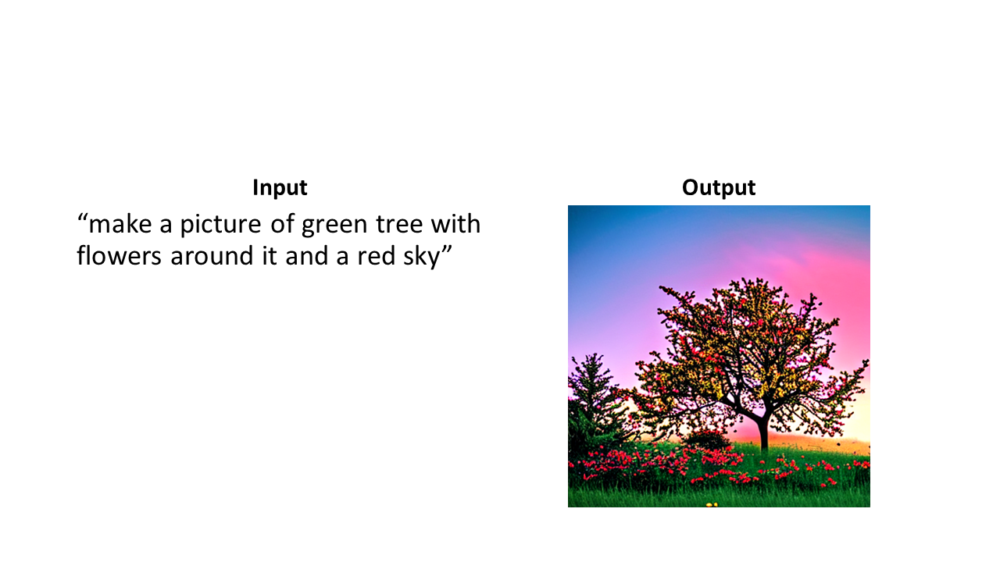
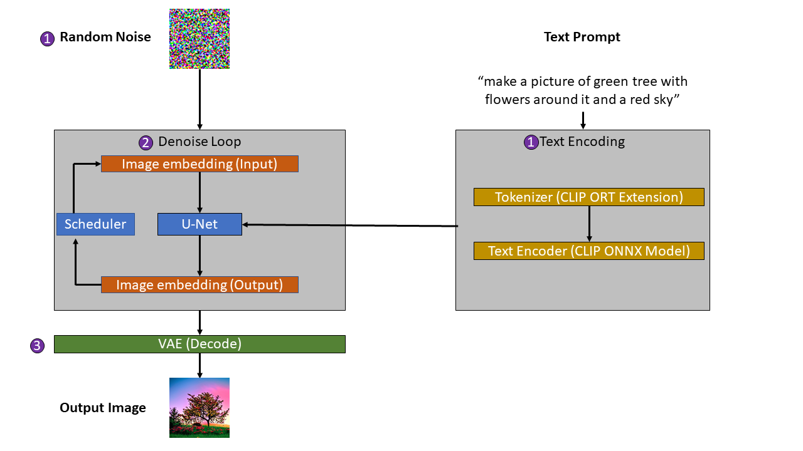

Stable Diffusion is an AI model used to generate images based on text prompts. Using ONNX Runtime you can quickly get started generating AI images locally using your preferred .NET technologies like C# and Visual Studio!

## What is ONNX Runtime?

The Open Neural Network Exchange (ONNX) is an open source format to represent AI models. The ONNX Runtime (ORT) is a runtime for ONNX models which provides an interface for accelerating the consumption / inferencing of machine learning models, integrating with hardware-specific libraries, and sharing models across programming languages and frameworks like PyTorch, Tensorflow / Keras, scikit-learn, ML.NET, and others.

That means you can:

1. Train a model in one of the many popular machine learning frameworks that support ONNX conversion.
1. Convert your model into ONNX format.
1. Load and consume the ONNX model in a different framework or language than the one the model was originally trained with like C#.

To learn more, visit the [ONNX](https://onnx.ai/) and [ONNX Runtime](https://onnxruntime.ai/) websites.

## What is Stable Diffusion?

Stable Diffusion is an AI model that can generate images based on a text prompt.



## How does Stable Diffusion work?

Although the theory and innovations behind Stable Diffusion can be complex, it's made up of relatively few components.

The main components in Stable Diffusion are:

- **Text encoder** - Encodes text to embeddings. The sample referenced in this post uses a combination of ONNX Runtime Extensions implementation of the [OpenAI's Contrastive Language-Image Pre-Training (CLIP)](https://github.com/openai/CLIP) and ONNX models.
- **Variable Autoencoder (VAE)** - Encodes and decodes images to embeddings.
- **U-Net** - Neural network architecture typically used for the task of image segmentation.
- **Scheduler** - Computes denoised image embeddings. The sample referenced in this post uses a C# implementation of the [Linear Multistep (LMS) Discrete Scheduler](https://arxiv.org/abs/2206.00364). 

For more details on Stable Diffusion, see the original paper [High-Resolution Image Synthesis with Latent Diffusion Models](https://arxiv.org/abs/2112.10752).



At a high level, the process for generating images using Stable Diffusion consists of 3 steps:

1. Encoding text prompt and random noise into text and image embeddings.
1. Use a U-Net neural network and scheduler to reduce noise (denoise) in the image.
1. Decoding the denoised image.

### Generate text and image embeddings

The first step in using Stable Diffusion to generate AI images is to:

1. Generate an image sample and embeddings with random noise.
1. Use the ONNX Runtime Extensions CLIP text tokenizer and CLIP embedding ONNX model to convert the user prompt into text embeddings.

Embeddings are a numerical representation of information such as text, images, audio, etc. This numerical representation contains semantic meaning. In the case of Stable Diffusion, the text and images are encoded into an embedding space that can be understood by the U-Net neural network as part of the denoising process.

OpenAI's CLIP text tokenizer is written in Python. Instead of reimplementing it in C#, ONNX Runtime has created a cross-platform implementation using ONNX Runtime Extensions. [ONNX Runtime Extensions](https://github.com/microsoft/onnxruntime-extensions) is a library that extends the capability of the ONNX models and inference with ONNX Runtime by providing common pre and post-processing operators for vision, text, and NLP models.

Note that for training, you'll also need to use the VAE to encode the images you use during training. The sample referenced in this post is inferencing only, so using the VAE is not required.

This code sample shows the general process of tokenizing and encoding the input text prompt. Some code has been ommitted for brevity.

```csharp
var prompt = "a fireplace in an old cabin in the woods";
//...
var textTokenized = TextProcessing.TokenizeText(prompt);
var textPromptEmbeddings = TextProcessing.TextEncoder(textTokenized).ToArray();
```

### Denoise image loop

The image and text embeddings are the initial input for the U-Net model. The U-Net model then reduces the noise (denoises) in the image using the text prompt as a conditional.

Using a scheduler algorithm, the output from the U-Net model is then used to compute new image embeddings. These new image embeddings are then used as the new input for the U-Net model.

This denoising process is repeated for N number of steps.

This code sample shows the general process that takes place when the text and image embeddings are run through the U-Net and denoised by the scheduler. Some code has been ommitted for brevity.

```csharp
//...
var scheduler = new LMSDiscreteScheduler();
//...
var timesteps = scheduler.SetTimesteps(numInferenceSteps);
//...
var seed = new Random().Next();
var latents = GenerateLatentSample(batchSize, height, width, seed, scheduler.InitNoiseSigma);
//...
var unetSession = new InferenceSession(modelPath, options);
var input = new List<NamedOnnxValue>();
//...
for (int t = 0; t < timesteps.Length; t++)
{
    //...
    var latentModelInput = TensorHelper.Duplicate(latents.ToArray(), new[] { 2, 4, height / 8, width / 8 });
    //...
    latentModelInput = scheduler.ScaleInput(latentModelInput, timesteps[t]);
    //...
    input = CreateUnetModelInput(textEmbeddings, latentModelInput, timesteps[t]);
    var output = unetSession.Run(input);
    //...
    noisePred = performGuidance(noisePred, noisePredText, guidanceScale);
    //...
    latents = scheduler.Step(noisePred, timesteps[t], latents);
}
```

### Decode denoised image

After the loop to denoise the image completes, the VAE is used to decode the final image embeddings back into an image.

This code sample shows the general process of using the VAE to decode the final denoised output into an image. Some code has been ommitted for brevity.

```csharp
var decoderInput = new List<NamedOnnxValue> { NamedOnnxValue.CreateFromTensor("latent_sample", latents) };
var imageResultTensor = VaeDecoder.Decoder(decoderInput);
var image = VaeDecoder.ConvertToImage(imageResultTensor);
```

## Get started generating images using AI

Now that you have a general idea of how Stable Diffusion works, it's time to unleash your creativity!

To get started using AI to generate your own images inside your .NET applications, check out the [Inference Stable Diffusion with C# and ONNX Runtime tutorial](https://onnxruntime.ai/docs/tutorials/csharp/stable-diffusion-csharp.html) and corresponding [GitHub repository](https://github.com/cassiebreviu/StableDiffusion).
