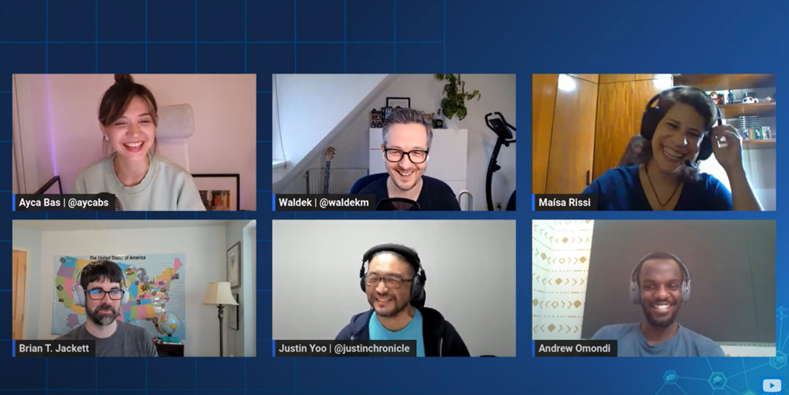
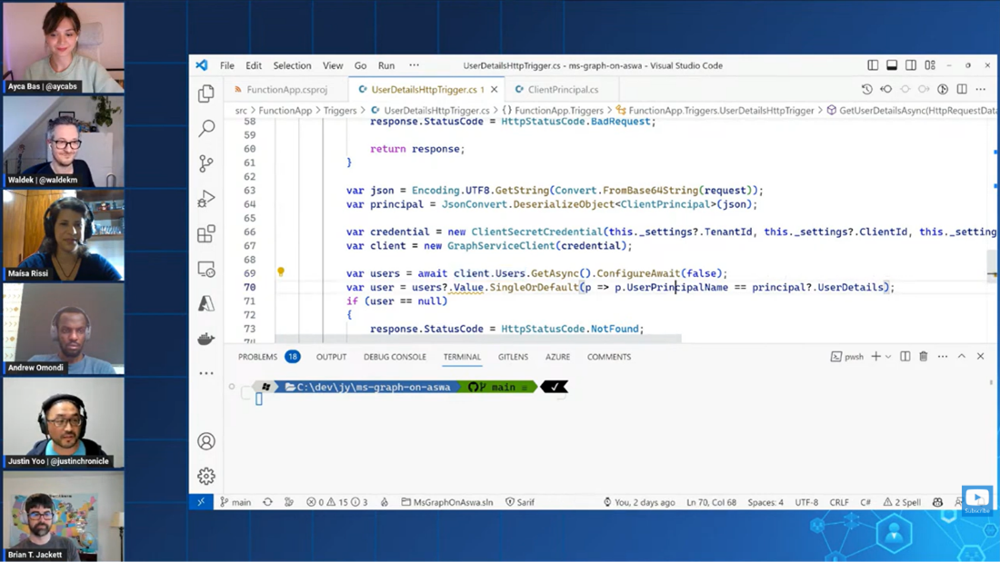
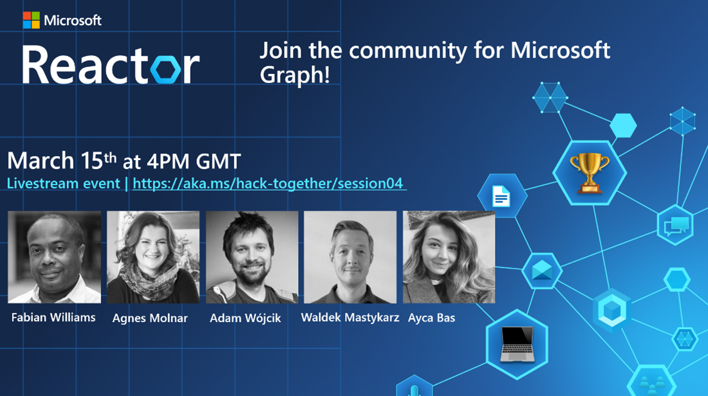

On March 1st, we launched **Hack Together: Microsoft Graph and .NET** to hack and learn about Microsoft Graph and .NET. Time passes so quickly; we reached the last week of our hack! 

## What happened in week #2 of Hack Together? 

Last week, we continued to hack together and helped each other on GitHub Discussions of our repository. We also hosted "Ask the experts/Get to know Microsoft Graph team!" session on Reactors to address commonly asked questions and answer the questions from the live audience. 

Maisa Rissi, Brian Jackett, Andrew Omondi from Microsoft Graph product team and Justin Yoo from .NET Advocacy joined us to answer all the questions about Microsoft Graph and .NET live!  

 

Justin Yoo also shared a great example of using Microsoft Graph on Azure Static Web Apps with Blazor WebAssembly! If you are interested in this project, you may find more information about the project repository. 

 

If you missed **Ask the experts/Get to know Microsoft Graph team!** Session last week, you can [📺 watch the hackathon Q&A panel on demand!](https://aka.ms/hack-together/session03)

## What’s coming in the last week of Hack Together? 

In the final week of Hack Together, we’ll host a live [What’s next: join the community for Microsoft Graph!](https://aka.ms/hack-together/session04) session. Microsoft Graph product team members and MVPs will join us in this session to talk about introducing you to the Microsoft Graph community. This will be the session for you to learn what you can achieve more by joining the community for Microsoft Graph! 

### March 15, 2023, 4:00PM GMT | Join live | What’s next: join the community for Microsoft Graph! 

  [)](https://aka.ms/hack-together/session04)

**Join live: https://aka.ms/hack-together/session04** 

#### What’s this session about? 

We're at the end of Hack Together: Microsoft Graph and .NET, but the journey doesn't end here. Join us to see the cool projects you’ve built during the hacking. 

Also, join us, Fabian Williams - Senior Product Manager in the Microsoft Graph Customer and Partner Experience organization and Microsoft MVPs Agnes Molnar & Adam Wójcik to talk about how you can join our community, keep learning, and help others as well! 

#### Speakers 

- **Fabian Williams** – Microsoft Graph Customer and Partner Experience Senior Product Manager 
- **Ayca Bas** – Senior Cloud Developer Advocate 
- **Waldek Mastykarz** – Senior Cloud Developer Advocate 
- **Agnes Molnar** – Microsoft RD & MVP, CEO at SearchExplained 
- **Adam Wójcik** - Microsoft MVP, .NET Developer working at Hitachi Energy 

## Don’t forget to submit your project by March 15! 🚀 

Although it’s the last week of the Hack Together, **it’s still not too late to join us.** Head to https://aka.ms/hack-together to register, build your hack and make sure to submit your project by March 15 to earn exciting prizes! We’re looking forward to seeing what you’ll build! 