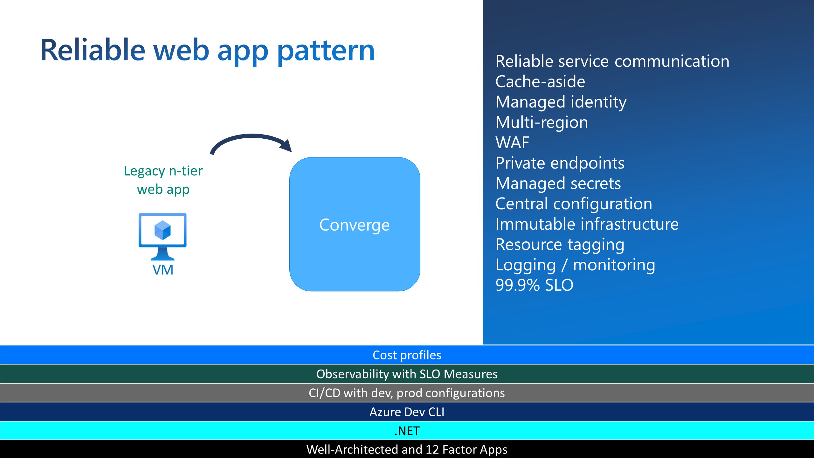

The first step of your application's cloud journey often times is the most difficult. It's not uncommon to find you need to scale a legacy application to meet increased business demand, but do so with minimal investments in code changes and infrastructure.

Moving the application to the cloud is a great way to achieve scale and resiliency to support increased business demand, but how do you take that first step with your existing application to get it ready? How can you feel more confident about the cloud journey _before_ you get started?

The [**reliable web app pattern** (RWA)](https://learn.microsoft.com/azure/architecture/reference-architectures/reliable-web-app/dotnet/pattern-overview?WT.mc_id=dotnet-90136-dotnet) is here to help you on your cloud journey.

## The Reliable Web App Pattern

The RWA is a set of best practices built on the [Azure Well-Architected Framework](https://learn.microsoft.com/azure/architecture/framework/?WT.mc_id=dotnet-90136-dotnet) that helps developers successfully migrate to the cloud and set a foundation for future modernization in Azure.

The reliable web app pattern provides guidance on several business and technical objectives with focus on low-cost, high-value wins. It provides guidance on security, reliability design patterns, operational excellence, cost-optimized environments, and more.



In other words, the RWA gives you prescriptive guidance to get your app ready to successfully run in Azure with as little code changes to your existing app as possible.

To help you understand and use the RWA pattern, we've created a comprehensive collection of materials that describe it in full. You can review the [documentation](https://aka.ms/eap/rwa/dotnet/doc). A production-quality, and ready-to-deploy web application's [source code](https://aka.ms/eap/rwa/dotnet). And [videos](https://aka.ms/eap/rwa/dotnet/videos) that help explain everything.

But what we'd like to cover in this article are some low-cost code changes you can make to your app today that will prepare your application for its cloud journey.

## Building for resiliency

Ensuring your application can recover from errors is critical when working in a distributed system like the cloud. You need to anticipate transient faults that can occur when your application tries to connect to a service or network resource.

Faults can include the momentary loss of network connectivity, the temporary unavailability of a network service, or timeouts that occur when a service is busy.

Anticipating and properly handling these transient faults can improve the stablilty and the resiliency of your application.

Two relatively easy to implement patterns that do just that are the Retry and Circuit-breaker patterns.

### Retry pattern

The retry pattern is a technique for handling temporary interruptions in the service your code is trying to call. You expect these interuptions, or transient faults, to resolve themselves in a few seconds.

The retry pattern handles transient faults by resending failed requests to the service. You can configure the amount of time between retries and how many times to attempt before throwing an exception.

#### The Azure SDKs

Most Azure services and their client SDKs have a built-in retry mechanism. You should use this mechanism to expedite the retry pattern implementation. (For more info, see the [Azure service retry guidance](https://learn.microsoft.com/azure/architecture/best-practices/retry-service-specific?WT.mc_id=dotnet-90136-dotnet)).

Here's an example of the built-in mechanism in Entity Framework Core to apply the Retry patten in requests to Azure SQL Database.

```csharp
services.AddDbContextPool<ConcertDataContext>(options => options.UseSqlServer(sqlDatabaseConnectionString,
    sqlServerOptionsAction: sqlOptions =>
    {
        sqlOptions.EnableRetryOnFailure(
          maxRetryCount: 5,
          maxRetryDelay: TimeSpan.FromSeconds(3),
          errorNumbersToAdd: null);
    }));
```

You may write code like this when adding a class that inherits from the Entity Framework Core's `DbContext` (in this case `ConcertDataContext`) to the ASP.NET Core's dependency injection container. In the initialization options there is a built-in mechanism to specify that should any transient database errors occur, to retry a maximum of 5 times (`maxRetryCount`), waiting 3 seconds between each try (`maxRetryDelay`).

#### Custom code

You should use the [Polly library](https://github.com/App-vNext/Polly) when the service your app is calling does not supply a built-in mechanism to support retries natively. Polly is a .NET resilience and transient-fault-handling library. With it you can use fluent APIs to describe retry behavior in a central location of the application.

The following example uses Polly during the ASP.NET Core dependency injection configuration. Polly enforces the Retry pattern every time the code constructs an object that calls the `IConcertSearchService` object. The code that implements the retry pattern is found in the `GetRetryPolicy` function. It is applied any time the `RelecloudApiConcertSearchService` encounters an HTTP error when making a request to a web API. It uses `HandleTransientHttpError` to detect only transient faults that it can safely retry. And it retries up until a specified number of times.

```csharp
private void AddConcertSearchService(IServiceCollection services)
{
    // read the web API's url from the app settings
    var baseUri = Configuration["App:RelecloudApi:BaseUri"];

    if (string.IsNullOrWhiteSpace(baseUri))
    {
        services.AddScoped<IConcertSearchService, DummyConcertSearchService>();
    }
    else
    {        
        services.AddHttpClient<IConcertSearchService, RelecloudApiConcertSearchService>(httpClient =>
        {
            httpClient.BaseAddress = new Uri(baseUri);
            httpClient.DefaultRequestHeaders.Add(HeaderNames.Accept, "application/json");
            httpClient.DefaultRequestHeaders.Add(HeaderNames.UserAgent, "Relecloud.Web");
        })
        .AddPolicyHandler(GetRetryPolicy()) // Add the Polly retry policy for transienct HTTP errors
        .AddPolicyHandler(GetCircuitBreakerPolicy());
    }
}

private static IAsyncPolicy<HttpResponseMessage> GetRetryPolicy()
{
    var delay = Backoff.DecorrelatedJitterBackoffV2(TimeSpan.FromMilliseconds(500), retryCount: 3);
    return HttpPolicyExtensions
      .HandleTransientHttpError()
      .OrResult(msg => msg.StatusCode == System.Net.HttpStatusCode.NotFound)
      .WaitAndRetryAsync(delay);
}
```

You can find more info on the [retry pattern here](https://learn.microsoft.com/azure/architecture/patterns/retry?WT.mc_id=dotnet-90136-dotnet).

### Circuit breaker pattern

You should use the circuit breaker pattern with the retry pattern. The circuit breaker pattern handles faults that are not transient. The goal is to prevent an application from repeatedly invoking a service that is down.

You can implement the circuit breaker pattern with Polly. In the previous example a `GetCircuitBreakerPolicy` was added to the configuration. Here is the implementation of that function:

```csharp
private static IAsyncPolicy<HttpResponseMessage> GetCircuitBreakerPolicy()
{
    return HttpPolicyExtensions
        .HandleTransientHttpError()
        .CircuitBreakerAsync(5, TimeSpan.FromSeconds(30));
}
```

Again, this code is applied any time `RelecloudApiConcertSearchService` encounters an HTTP error when invoking a web API. It uses the `HandleTransientHttpError` logic to detect which HTTP requests it can safely retry but limits the number of aggregate faults over a specified period of time. In this case, 5 faults in a 30 second period.

For more information, see the [Circuit Breaker Pattern](https://learn.microsoft.com/azure/architecture/patterns/circuit-breaker?WT.mc_id=dotnet-90136-dotnet).

## Improve performance

Applications use a cache to improve repeated access to information held in a data store. Loading data on-demand into a cache from a data store can improve performance and help maintain consistency between data held in the cache and data in the underlying data store.

However, it's impractical to expect that cached data will always be completely consistent with the data in the data store. You need implement a strategy that helps to ensure that the data in the cache is as up-to-date as possible, but can also detect and handle situations that arise when the data in the cache has become stale.

### Cache-aside pattern

The cache-aside pattern is used to manage in-memory data caching. The pattern makes the application responsible for managing data requests and data consistency between the cache and persistent data store. When a data request reaches the application, it first checks the cache to see if the cache has the data in memory, if it doesn't the application queries the database.

Most applications have pages that get more views than other pages. You should cache data that supports the most-viewed pages of your application to improve responsiveness for the end user and reduce demand on the database.

The code below caches the data that supports an Upcoming Concerts page. The cache-aside pattern caches the data after the first request for this page to reduce the load on the database.

```csharp
public async Task<ICollection<Concert>> GetUpcomingConcertsAsync(int count)
{
    IList<Concert>? concerts;

    // Try to read data from the cache first
    var concertsJson = await this.cache.GetStringAsync(CacheKeys.UpcomingConcerts);

    if (concertsJson != null)
    {
        // There is cached data. Deserialize the JSON data.
        concerts = JsonSerializer.Deserialize<IList<Concert>>(concertsJson);
    }
    else
    {
        // There's nothing in the cache. Retrieve data from the repository and cache it for one hour.
        concerts = await this.database.Concerts.AsNoTracking()
            .Where(c => c.StartTime > DateTimeOffset.UtcNow && c.IsVisible)
            .OrderBy(c => c.StartTime)
            .Take(count)
            .ToListAsync();

        concertsJson = JsonSerializer.Serialize(concerts);

        var cacheOptions = new DistributedCacheEntryOptions {
            AbsoluteExpirationRelativeToNow = TimeSpan.FromHours(1)
        };

        await this.cache.SetStringAsync(CacheKeys.UpcomingConcerts, concertsJson, cacheOptions);
    }

    return concerts ?? new List<Concert>();
}
```

You should periodically refresh the data in the cache to keep it fresh and relevant. The involves getting the latest version of the data from the database to ensure the cache has the most requested data and the most current information. The frequency of the refreshes depends on the application.

You also need to change cached data whenever a user creates or updates a record. The following shows an implementation of a create and update method:

```csharp

public async Task<CreateResult> CreateConcertAsync(Concert newConcert)
{
    database.Add(newConcert);
    await this.database.SaveChangesAsync();

    // Remove data from the cache
    this.cache.Remove(CacheKeys.UpcomingConcerts);

    return CreateResult.SuccessResult(newConcert.Id);
}

public async Task<UpdateResult> UpdateConcertAsync(Concert existingConcert), 
{
   database.Update(existingConcert);
   await database.SaveChangesAsync();

   // Remove data from the cache
   this.cache.Remove(CacheKeys.UpcomingConcerts);

   return UpdateResult.SuccessResult();
}

```

For more info, see the [Cache-aside pattern overview](https://learn.microsoft.com/azure/architecture/patterns/cache-aside?WT.mc_id=dotnet-90136-dotnet).

## Summary

The [Reliable Web App Pattern (RWA)](https://learn.microsoft.com/azure/architecture/reference-architectures/reliable-web-app/dotnet/pattern-overview?WT.mc_id=dotnet-90136-dotnet) is a pattern to help your application take its first step on the cloud journey. It's a set of best practicess built on the Azure Well-Architected Framework that will help you migrate your application to the cloud with minimal code changes necessary. In this article we took a look at some of the code changes that you might want to consider to make your application more resilient and performant.

The retry pattern handles transient faults in services that your application calls. These are faults that you expect the other services to recover from quickly so your application can succesfully call them on subsequent attempts.

If the service does not come recover, the circuit breaker pattern stops your application from calling the service over and over again.

And the cache-aside pattern improves performance of your application by checking to see if high demand data is already included in an in-memory cache before querying a persistent data storage for it.

Be sure to check out the [documentation that explains RWA in-depth](https://learn.microsoft.com/azure/architecture/reference-architectures/reliable-web-app/dotnet/pattern-overview?WT.mc_id=dotnet-90136-dotnet), deploy the [source code](https://aka.ms/eap/rwa/dotnet), and watch the [videos](https://aka.ms/eap/rwa/dotnet/videos) to get you up and running quick!
